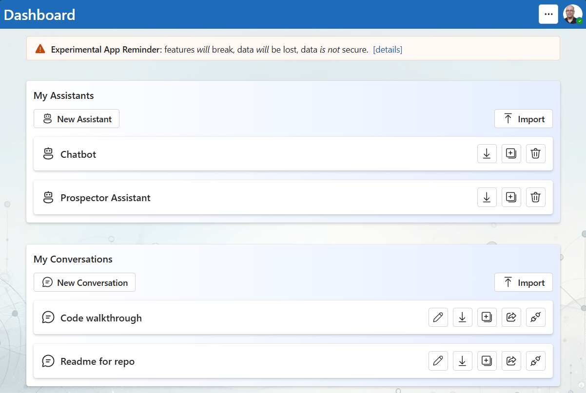
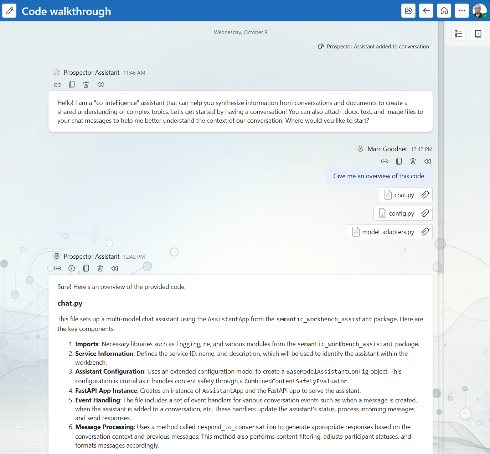
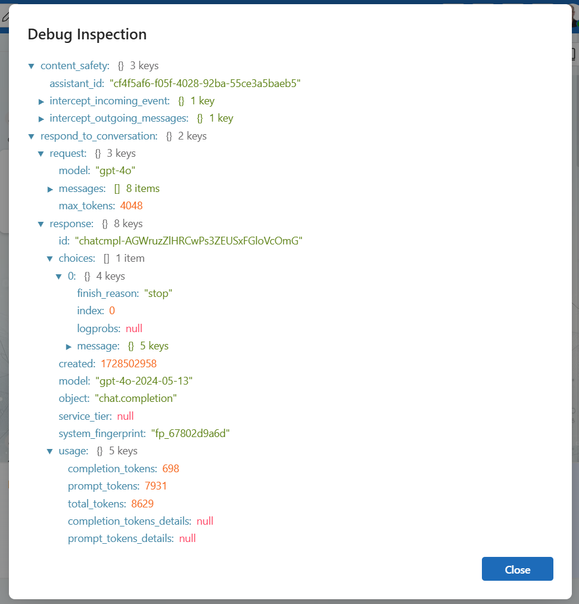
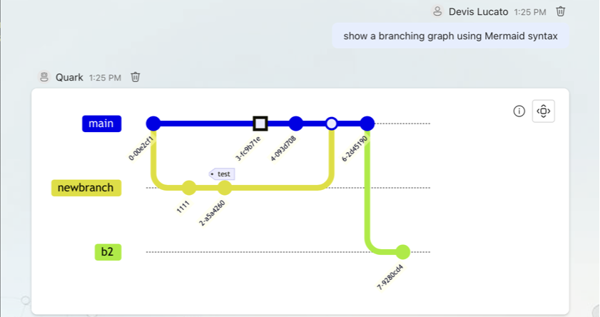
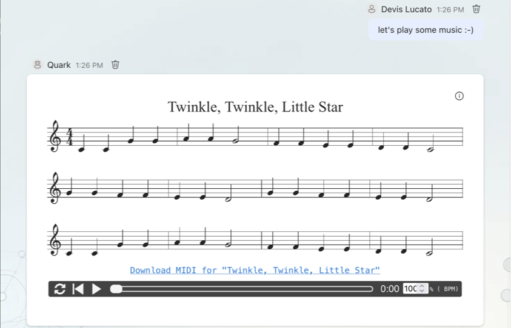
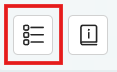
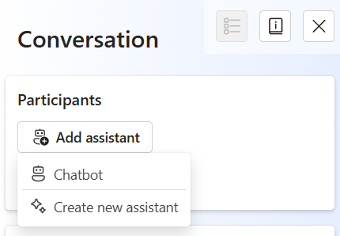

# Semantic Workbench

Semantic Workbench is a versatile tool designed to help prototype intelligent assistants quickly.
It supports the creation of new assistants or the integration of existing ones, all within a
cohesive interface. The workbench provides a user-friendly UI for creating conversations with one
or more assistants, configuring settings, and exposing various behaviors.

The Semantic Workbench is composed of three main components:

- [Workbench Service](workbench-service/README.md) (Python): The backend service that
  handles core functionalities.
- [Workbench App](workbench-app/README.md) (React/Typescript): The frontend web user
  interface for interacting with workbench and assistants.
- [Assistant Services](examples) (Python, C#, etc.): any number of assistant services that implement the service protocols/APIs,
  developed using any framework and programming language of your choice.

Designed to be agnostic of any agent framework, language, or platform, the Semantic Workbench
facilitates experimentation, development, testing, and measurement of agent behaviors and workflows.
Assistants integrate with the workbench via a RESTful API, allowing for flexibility and broad applicability in various development environments.

# Workbench interface examples

# Quick start (Recommended) - GitHub Codespaces for turn-key development environment

GitHub Codespaces provides a cloud-based development environment for your repository. It allows you to develop, build, and test your code
in a consistent environment, without needing to install dependencies or configure your local machine. It works with any system with a web
browser and internet connection, including Windows, MacOS, Linux, Chromebooks, tablets, and mobile devices.

See the [GitHub Codespaces / devcontainer README](.devcontainer/README.md) for more information on how to set up and use GitHub Codespaces
with Semantic Workbench.

## Local development environment

See the [setup guide](docs/SETUP_DEV_ENVIRONMENT.md) on how to configure your dev environment. Or if you have Docker installed you can use dev containers with VS Code which will function similarly to Codespaces.

## Using VS Code

Codespaces will is configured to use `semantic-workbench.code-workspace`, if you are working locally that is recommended over opening the repo root. This ensures that all project configurations, such as tools, formatters, and linters, are correctly applied in VS Code. This avoids issues like incorrect error reporting and non-functional tools.

Workspace files allow us to manage multiple projects within a monorepo more effectively. Each project can use its own virtual environment (venv), maintaining isolation and avoiding dependency conflicts. Multi-root workspaces (\*.code-workspace files) can point to multiple projects, each configured with its own Python interpreter, ensuring seamless functionality of Python tools and extensions.

### Start the app and service

- Use VS Code > `Run and Debug` (Ctrl/Cmd+Shift+D) > `semantic-workbench` to start the project
- Open your browser and navigate to `https://127.0.0.1:4000`
  - You may receive a warning about the app not being secure; click `Advanced` and `Proceed to localhost` to continue
- You can now interact with the app and service in the browser

### Start an assistant service:

- Launch an example an [example](examples/) assistant service:
  - No llm api keys needed
    - Use VS Code > `Run and Debug` (Ctrl/Cmd+Shift+D) > `examples: python-01-echo-bot` to start the example assistant that echos your messages. This is a good base to understand the basics of building your own assistant.
  - Bring your own llm api keys
    - Use VS Code > `Run and Debug` (Ctrl/Cmd+Shift+D) > `examples: python-02-simple-chatbot` to start the example chatbot assistant. Either set your keys in your .env file or after creating the assistant as described below, select it and provide the keys in the configuration page.

## Open the Workbench and create an Assistant instance

Open the app in your browser at [`https://localhost:4000`](https://localhost:4000). When you first log into the Semantic Workbench, follow these steps to get started:

1. **Create an Assistant**: On the dashboard, click the `New Assistant` button. Select your assistant service, provide a name, and click `Save`.

2. **Start a Conversation**: On the dashboard, click the `New Conversation` button. Provide a title for the conversation and click `Save`.

3. **Add the Assistant**: In the conversation window, click the conversation canvas icon and add your assistant to the conversation from the conversation canvas. Now you can converse with your assistant using the message box at the bottom of the conversation window.

   

   

Expected: You get a response from your assistant!

Note that the workbench provides capabilities that not all examples use, for example providing attachments. See the [Semantic Workbench](docs/WORKBENCH_APP.md) for more details.

# Developing your own assistants

To develop new assistants and connect existing ones, see the [Assistant Development Guide](docs/ASSISTANT_DEVELOPMENT_GUIDE.md) or any check out one of the [examples](examples).

- [Python example 1](examples/python/python-01-echo-bot/README.md): a simple assistant echoing text back.
- [Python example 2](examples/python/python-02-simple-chatbot/README.md): a simple chatbot implementing metaprompt guardrails and content moderation.
- [Python example 3](examples/python/python-03-multimodel-chatbot/README.md): an extension of the simple chatbot that supports configuration against additional llms.
- [.NET example 1](examples/dotnet/dotnet-01-echo-bot/README.md): a simple agent with echo and support for a basic `/say` command.
- [.NET example 2](examples/dotnet/dotnet-02-message-types-demo/README.md): a simple assistants showcasing Azure AI Content Safety integration and some workbench features like Mermaid graphs.
- [.NET example 3](examples/dotnet/dotnet-03-simple-chatbot/README.md): a functional chatbot implementing metaprompt guardrails and content moderation.

## Starting the workbench from the command line

- Run the script `tools\run-workbench-chatbot.sh` or `tools\run-workbench-chatbot.ps` which does the following:
  - Starts the backend service, see [here for instructions](workbench-service/README.md).
  - Starts the frontend app, see [here for instructions](workbench-app/README.md).
  - Starts the [Python chatbot example](examples/python/python-02-simple-chatbot/README.md)

## Refreshing Dev Environment

- Use the `tools\reset-service-data.sh` or `tools\reset-service-data.sh` script to reset all service data. You can also delete `~/workbench-service/.data` or specific files if you know which one(s).
- From repo root, run `make clean install`.
  - This will perform a `git clean` and run installs in all sub-directories
- Or a faster option if you just want to install semantic workbench related stuff:
  - From repo root, run `make clean`
  - From `~/workbench-app`, run `make install`
  - From `~/workbench-service`, run `make install`

# Contributing

This project welcomes contributions and suggestions. Most contributions require you to agree to a
Contributor License Agreement (CLA) declaring that you have the right to, and actually do, grant us
the rights to use your contribution. For details, visit <https://cla.opensource.microsoft.com>.

When you submit a pull request, a CLA bot will automatically determine whether you need to provide
a CLA and decorate the PR appropriately (e.g., status check, comment). Simply follow the instructions
provided by the bot. You will only need to do this once across all repos using our CLA.

Please see the detailed [contributing guide](CONTRIBUTING.md) for more information on how you can get involved.

This project has adopted the [Microsoft Open Source Code of Conduct](https://opensource.microsoft.com/codeofconduct/).
For more information see the [Code of Conduct FAQ](https://opensource.microsoft.com/codeofconduct/faq/) or
contact [opencode@microsoft.com](mailto:opencode@microsoft.com) with any additional questions or comments.

# Trademarks

This project may contain trademarks or logos for projects, products, or services. Authorized use of Microsoft
trademarks or logos is subject to and must follow
[Microsoft's Trademark & Brand Guidelines](https://www.microsoft.com/en-us/legal/intellectualproperty/trademarks/usage/general).
Use of Microsoft trademarks or logos in modified versions of this project must not cause confusion or imply Microsoft sponsorship.
Any use of third-party trademarks or logos are subject to those third-party's policies.
