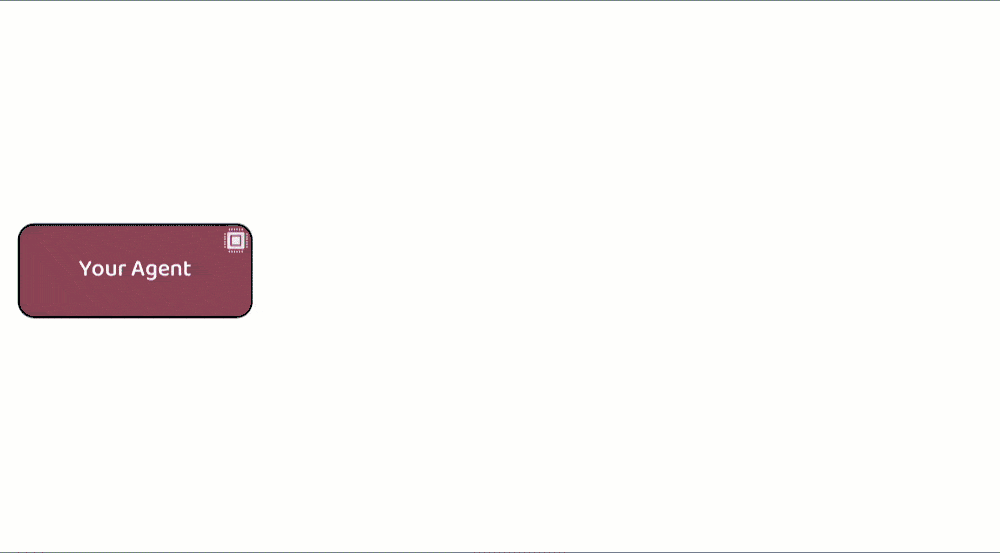
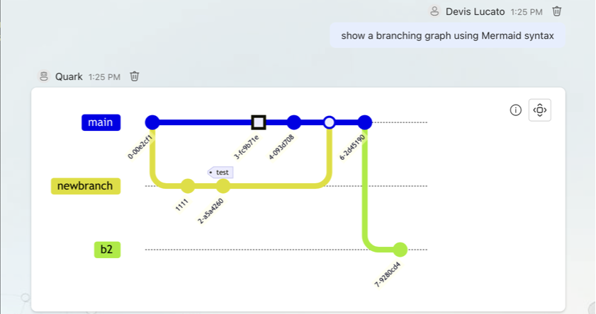
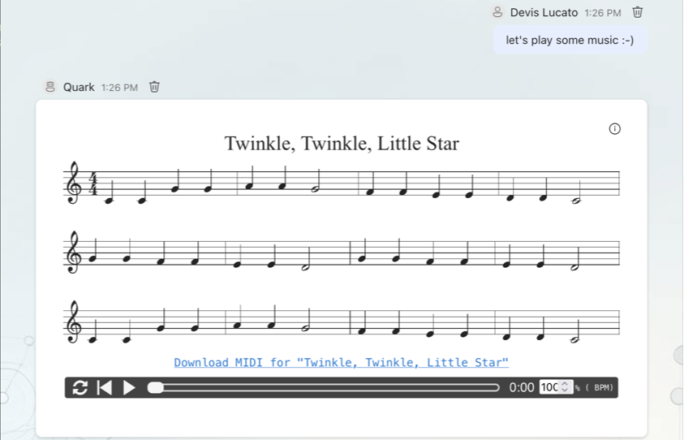

# Semantic Workbench

Semantic Workbench is a versatile tool designed to help prototype intelligent assistants quickly.
It supports the creation of new assistants or the integration of existing ones, all within a
cohesive interface. The workbench provides a user-friendly UI for creating conversations with one
or more assistants, configuring settings, and exposing various behaviors.

The Semantic Workbench is composed of three main components:

1. [Workbench Service](semantic-workbench/v1/service/README.md) (Python): The backend service that
   handles core functionalities.
2. [Workbench App](semantic-workbench/v1/app/README.md) (React/Typescript): The frontend web user
   interface for interacting with workbench and assistants.
3. Assistant Services: any number of assistant services that implement the service protocols/APIs,
   developed using any framework and programming language of your choice.

Designed to be agnostic of any agent framework, language, or platform, the Semantic Workbench
facilitates experimentation, development, testing, and measurement of agent behaviors and workflows.
Agents integrate with the workbench via a RESTful API, allowing for flexibility and broad applicability
in various development environments.

# Quick start (Recommended) - GitHub Codespaces for turn-key development environment

GitHub Codespaces provides a cloud-based development environment for your repository. It allows you to develop, build, and test your code in a consistent environment, without needing to install dependencies or configure your local machine. It works with any system with a web browser and internet connection, including Windows, MacOS, Linux, Chromebooks, tablets, and mobile devices.

See the [GitHub Codespaces / devcontainer README](.devcontainer/README.md) for more information on how to set up and use GitHub Codespaces with Semantic Workbench.

# Quick start - Local development environment

- Start the backend service, see [here for instructions](semantic-workbench/v1/service/README.md).
- Start the frontend app, see [here for instructions](semantic-workbench/v1/app/README.md).
- Start the canonical assistant (see [here for instructions](semantic-workbench/v1/service/semantic-workbench-assistant/README.md))
  or one of the [examples](examples).

# Connecting your agents

To develop new agents and connect existing ones, see the [Assistant Development Guide](docs/ASSISTANT_DEVELOPMENT_GUIDE.md)

The repository contains a few examples that can be used to create custom agents:

- [Python Canonical Assistant](semantic-workbench/v1/service/semantic-workbench-assistant/semantic_workbench_assistant/canonical.py)
- [Python example 1](examples/python-example01/README.md): a simple assistant echoing text back.
- [.NET example 1](examples/dotnet-example01/README.md): a simple agent with echo and support for a basic `/say` command.
- [.NET example 2](examples/dotnet-example02/README.md): a simple agents showcasing Azure AI Content Safety integration and some workbench features like Mermaid graphs.

# Workbench setup

1. Follow the [Service Setup Guide](semantic-workbench/v1/service/README.md)
2. Follow the [App Setup Guide](semantic-workbench/v1/app/README.md)

## Windows setup

Enable long file paths on Windows.

1.  Run `regedit`.
2.  Navigate to `HKEY_LOCAL_MACHINE\SYSTEM\CurrentControlSet\Control\FileSystem`.
3.  Find the `LongPathsEnabled` key. If it doesn’t exist, right-click on the `FileSystem` key, select `New > DWORD (32-bit) Value`, and name it `LongPathsEnabled`.
4.  Double-click on `LongPathsEnabled`, set its value to `1`, and click OK.

## Open the Workbench and create an assistant instance

Open the app in your browser at [`https://localhost:4000`](https://localhost:4000):

1. Click `Sign in`
1. Add and Assistant:
   1. Click +Add Assistant Button
   1. Click Instance of Assistant
1. Give it a name.
1. Enter the assistant service URL in the combobox, e.g. `http://127.0.0.1:3010`.
1. Click Chat box icon.
1. Type a message and hit send.
1. If you see "Please set the OpenAI API key in the config."
   1. Click Edit icon in upper right.
   1. Paste in your OpenAI Key.
   1. Paste in your OrgID.
   1. Click Save.
   1. Hit Back button in UI.
1. Type another message and hit send.

Expected: You get a response from your assistant!

## Refreshing Dev Environment

- [v1\service\.data](service.data) delete this directory or specific files if you know which one.
- From repo root, run `make clean install`.
  - This will perform a `git clean` and run installs in all sub-directories
- Or a faster option if you just want to install semantic workbench related stuff:
  - From repo root, run `make clean`
  - From `~/semantic-workbench/v1/app`, run `make install`
  - From `~/semantic-workbench/v1/service`, run `make install`

# Contributing

This project welcomes contributions and suggestions. Most contributions require you to agree to a
Contributor License Agreement (CLA) declaring that you have the right to, and actually do, grant us
the rights to use your contribution. For details, visit <https://cla.opensource.microsoft.com>.

When you submit a pull request, a CLA bot will automatically determine whether you need to provide
a CLA and decorate the PR appropriately (e.g., status check, comment). Simply follow the instructions
provided by the bot. You will only need to do this once across all repos using our CLA.

This project has adopted the [Microsoft Open Source Code of Conduct](https://opensource.microsoft.com/codeofconduct/).
For more information see the [Code of Conduct FAQ](https://opensource.microsoft.com/codeofconduct/faq/) or
contact [opencode@microsoft.com](mailto:opencode@microsoft.com) with any additional questions or comments.

# Trademarks

This project may contain trademarks or logos for projects, products, or services. Authorized use of Microsoft
trademarks or logos is subject to and must follow
[Microsoft's Trademark & Brand Guidelines](https://www.microsoft.com/en-us/legal/intellectualproperty/trademarks/usage/general).
Use of Microsoft trademarks or logos in modified versions of this project must not cause confusion or imply Microsoft sponsorship.
Any use of third-party trademarks or logos are subject to those third-party's policies.
