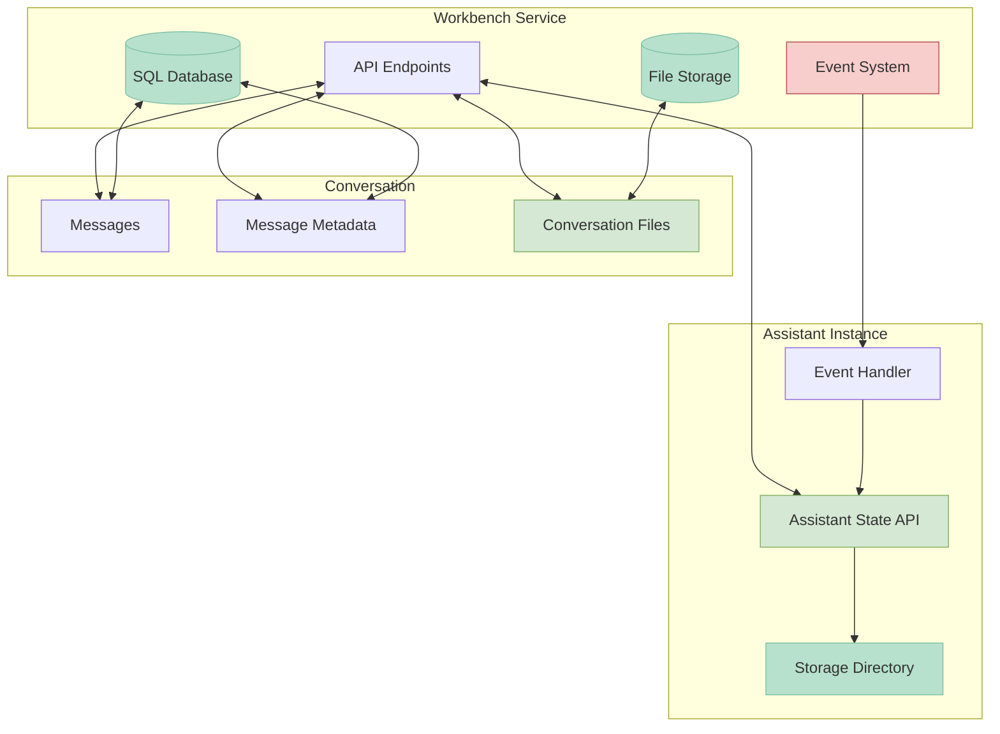
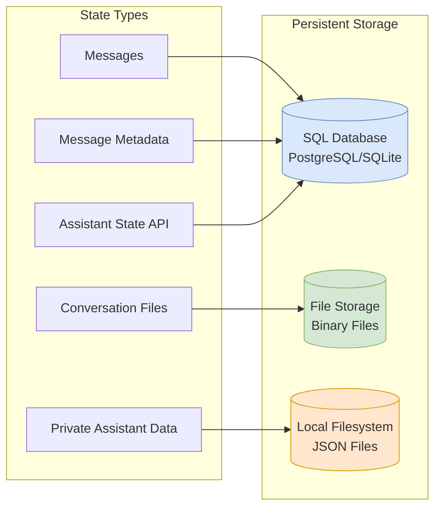
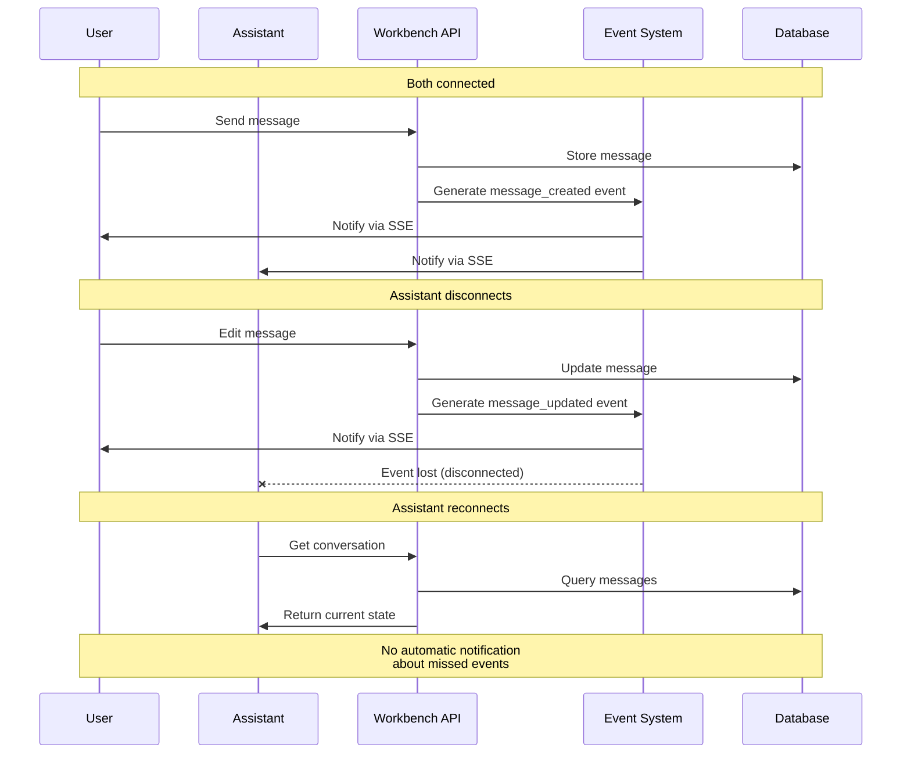
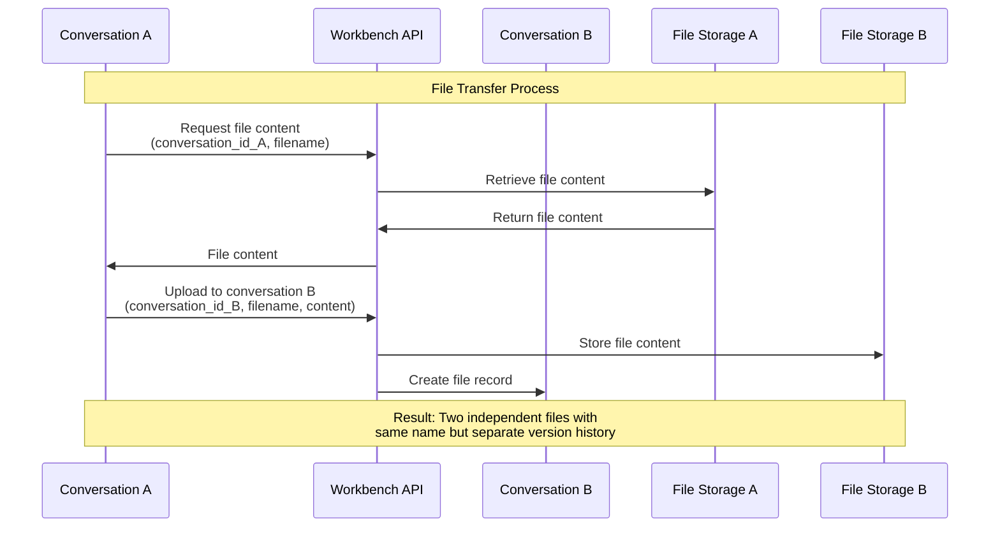
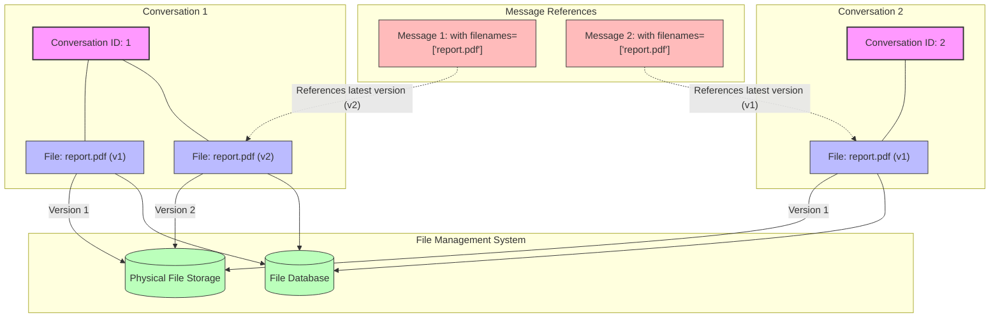
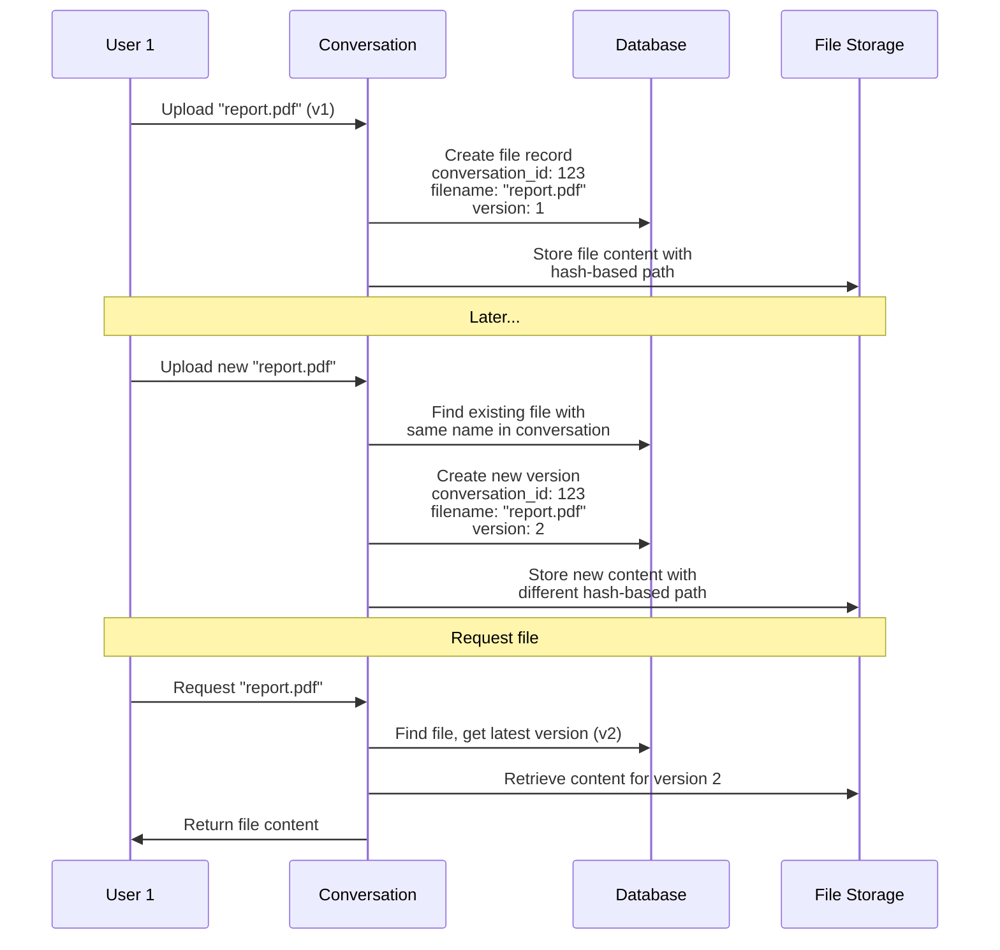
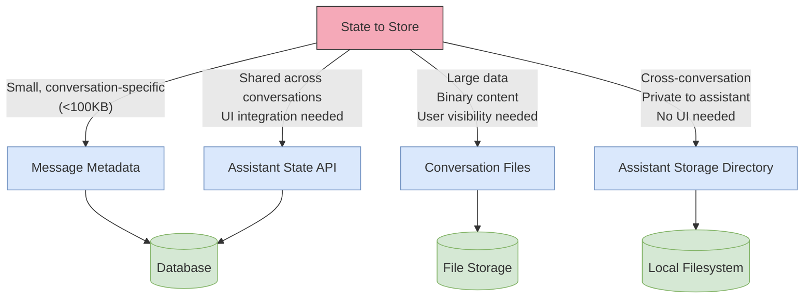
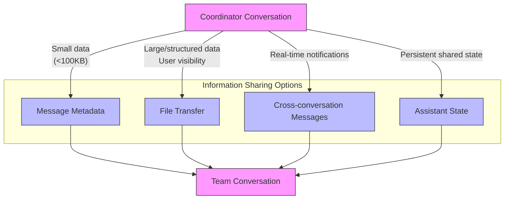
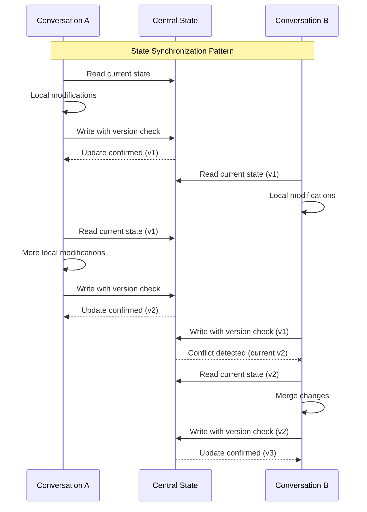

# assistants/project-assistant

[collect-files]

**Search:** ['assistants/project-assistant']
**Exclude:** ['.venv', 'node_modules', '*.lock', '.git', '__pycache__', '*.pyc', '*.ruff_cache', 'logs', 'output', '*.svg', '*.png']
**Include:** ['pyproject.toml', 'README.md', 'CLAUDE.md']
**Date:** 8/5/2025, 4:43:26 PM
**Files:** 55

=== File: CLAUDE.md ===
# Semantic Workbench Developer Guidelines

## AI Context System
**Generate comprehensive codebase context for development:**
* `make ai-context-files` - Generate AI context files for all components
* Files created in `ai_context/generated/` organized by logical boundaries:
  - **Python Libraries** (by functional group):
    - `PYTHON_LIBRARIES_CORE.md` - Core API model, assistant framework, events
    - `PYTHON_LIBRARIES_AI_CLIENTS.md` - Anthropic, OpenAI, LLM clients
    - `PYTHON_LIBRARIES_EXTENSIONS.md` - Assistant/MCP extensions, content safety
    - `PYTHON_LIBRARIES_SPECIALIZED.md` - Guided conversation, assistant drive
    - `PYTHON_LIBRARIES_SKILLS.md` - Skills library with patterns and routines
  - **Assistants** (by individual implementation):
    - `ASSISTANTS_OVERVIEW.md` - Common patterns and all assistant summaries
    - `ASSISTANT_PROJECT.md` - Project assistant (most complex)
    - `ASSISTANT_DOCUMENT.md` - Document processing assistant
    - `ASSISTANT_CODESPACE.md` - Development environment assistant
    - `ASSISTANT_NAVIGATOR.md` - Workbench navigation assistant
    - `ASSISTANT_PROSPECTOR.md` - Advanced agent with artifact creation
    - `ASSISTANTS_OTHER.md` - Explorer, guided conversation, skill assistants
  - **Platform Components**:
    - `WORKBENCH_FRONTEND.md` - React app components and UI patterns
    - `WORKBENCH_SERVICE.md` - Backend API, database, and service logic
    - `MCP_SERVERS.md` - Model Context Protocol server implementations
    - `DOTNET_LIBRARIES.md` - .NET libraries and connectors
  - **Supporting Files**:
    - `EXAMPLES.md` - Sample code and getting-started templates
    - `TOOLS.md` - Build scripts and development utilities
    - `CONFIGURATION.md` - Root-level configs and project setup
    - `ASPIRE_ORCHESTRATOR.md` - Container orchestration setup

**Using AI Context for Development:**
* **New developers**: Read `CONFIGURATION.md` + `PYTHON_LIBRARIES_CORE.md` for project overview
* **Building assistants**: 
  - Start with `ASSISTANTS_OVERVIEW.md` for common patterns
  - Use specific assistant files (e.g., `ASSISTANT_PROJECT.md`) as implementation templates
* **Working on specific assistants**: Load the relevant `ASSISTANT_*.md` file for focused context
* **Library development**: Choose appropriate `PYTHON_LIBRARIES_*.md` file by functional area
* **Frontend work**: Study component patterns in `WORKBENCH_FRONTEND.md`
* **API development**: Follow service patterns from `WORKBENCH_SERVICE.md`
* **MCP servers**: Use existing servers in `MCP_SERVERS.md` as templates
* **AI tools**: Provide relevant context files for better code generation and debugging
* **Code reviews**: Reference context files to understand cross-component impacts

## Common Commands
* Build/Install: `make install` (recursive for all subdirectories)
* Format: `make format` (runs ruff formatter)
* Lint: `make lint` (runs ruff linter)
* Type-check: `make type-check` (runs pyright)
* Test: `make test` (runs pytest)
* Single test: `uv run pytest tests/test_file.py::test_function -v`
* Frontend: `cd workbench-app && pnpm dev` (starts dev server)
* Workbench service: `cd workbench-service && python -m semantic_workbench_service.start`

## Code Style
### Python
* Indentation: 4 spaces
* Line length: 120 characters
* Imports: stdlib → third-party → local, alphabetized within groups
* Naming: `snake_case` for functions/variables, `CamelCase` for classes, `UPPER_SNAKE_CASE` for constants
* Types: Use type annotations consistently; prefer Union syntax (`str | None`) for Python 3.10+
* Documentation: Triple-quote docstrings with param/return descriptions

### C# (.NET)
* Naming: `PascalCase` for classes/methods/properties, `camelCase` for parameters/local variables, `_camelCase` for private fields
* Error handling: Use try/catch with specific exceptions, `ConfigureAwait(false)` with async
* Documentation: XML comments for public APIs
* Async: Use async/await consistently with cancellation tokens

### TypeScript/React (Frontend)
* Component files: Use PascalCase for component names and files (e.g., `MessageHeader.tsx`)
* Hooks: Prefix with 'use' (e.g., `useConversationEvents.ts`)
* CSS: Use Fluent UI styling with mergeStyle and useClasses pattern
* State management: Redux with Redux Toolkit and RTK Query
* Models: Define strong TypeScript interfaces/types

## Tools
* Python: Uses uv for environment/dependency management
* Linting/Formatting: Ruff (Python), ESLint (TypeScript)
* Type checking: Pyright (Python), TypeScript compiler
* Testing: pytest (Python), React Testing Library (Frontend)
* Frontend: React, Fluent UI v9, Fluent Copilot components
* Package management: uv (Python), pnpm (Frontend)

=== File: README.md ===
# Semantic Workbench

Semantic Workbench is a versatile tool designed to help prototype intelligent assistants quickly.
It supports the creation of new assistants or the integration of existing ones, all within a
cohesive interface. The workbench provides a user-friendly UI for creating conversations with one
or more assistants, configuring settings, and exposing various behaviors.

The Semantic Workbench is composed of three main components:

- [Workbench Service](workbench-service/README.md) (Python): The backend service that
  handles core functionalities.
- [Workbench App](workbench-app/README.md) (React/Typescript): The frontend web user
  interface for interacting with workbench and assistants.
- [Assistant Services](examples) (Python, C#, etc.): any number of assistant services that implement the service protocols/APIs,
  developed using any framework and programming language of your choice.

Designed to be agnostic of any agent framework, language, or platform, the Semantic Workbench
facilitates experimentation, development, testing, and measurement of agent behaviors and workflows.
Assistants integrate with the workbench via a RESTful API, allowing for flexibility and broad applicability in various development environments.


# Workbench interface examples


# Quick start (Recommended) - GitHub Codespaces for turn-key development environment

GitHub Codespaces provides a cloud-based development environment for your repository. It allows you to develop, build, and test your code
in a consistent environment, without needing to install dependencies or configure your local machine. It works with any system with a web
browser and internet connection, including Windows, MacOS, Linux, Chromebooks, tablets, and mobile devices.

See the [GitHub Codespaces / devcontainer README](.devcontainer/README.md) for more information on how to set up and use GitHub Codespaces
with Semantic Workbench.

## Local development environment

See the [setup guide](docs/SETUP_DEV_ENVIRONMENT.md) on how to configure your dev environment. Or if you have Docker installed you can use dev containers with VS Code which will function similarly to Codespaces.

## Using VS Code

Codespaces will is configured to use `semantic-workbench.code-workspace`, if you are working locally that is recommended over opening the repo root. This ensures that all project configurations, such as tools, formatters, and linters, are correctly applied in VS Code. This avoids issues like incorrect error reporting and non-functional tools.

Workspace files allow us to manage multiple projects within a monorepo more effectively. Each project can use its own virtual environment (venv), maintaining isolation and avoiding dependency conflicts. Multi-root workspaces (\*.code-workspace files) can point to multiple projects, each configured with its own Python interpreter, ensuring seamless functionality of Python tools and extensions.

### Start the app and service

- Use VS Code > `Run and Debug` (Ctrl/Cmd+Shift+D) > `semantic-workbench` to start the project
- Open your browser and navigate to `https://127.0.0.1:4000`
  - You may receive a warning about the app not being secure; click `Advanced` and `Proceed to localhost` to continue
- You can now interact with the app and service in the browser

### Start an assistant service:

- Launch an example an [example](examples/) assistant service:
  - No llm api keys needed
    - Use VS Code > `Run and Debug` (Ctrl/Cmd+Shift+D) > `examples: python-01-echo-bot` to start the example assistant that echos your messages. This is a good base to understand the basics of building your own assistant.
  - Bring your own llm api keys
    - Use VS Code > `Run and Debug` (Ctrl/Cmd+Shift+D) > `examples: python-02-simple-chatbot` to start the example chatbot assistant. Either set your keys in your .env file or after creating the assistant as described below, select it and provide the keys in the configuration page.

## Open the Workbench and create an Assistant

Open the app in your browser at [`https://localhost:4000`](https://localhost:4000). When you first log into the Semantic Workbench, follow these steps to get started:

1. **Create an Assistant**: On the dashboard, click the `New Assistant` button. Select a template from the available assistant services, provide a name, and click `Save`.

2. **Start a Conversation**: On the dashboard, click the `New Conversation` button. Provide a title for the conversation and click `Save`.

3. **Add the Assistant**: In the conversation window, click the conversation canvas icon and add your assistant to the conversation from the conversation canvas. Now you can converse with your assistant using the message box at the bottom of the conversation window.

   

   

Expected: You get a response from your assistant!

Note that the workbench provides capabilities that not all examples use, for example providing attachments. See the [Semantic Workbench](docs/WORKBENCH_APP.md) for more details.

# Developing your own assistants

To develop new assistants and connect existing ones, see the [Assistant Development Guide](docs/ASSISTANT_DEVELOPMENT_GUIDE.md) or any check out one of the [examples](examples).

- [Python example 1](examples/python/python-01-echo-bot/README.md): a simple assistant echoing text back.
- [Python example 2](examples/python/python-02-simple-chatbot/README.md): a simple chatbot implementing metaprompt guardrails and content moderation.
- [Python example 3](examples/python/python-03-multimodel-chatbot/README.md): an extension of the simple chatbot that supports configuration against additional llms.
- [.NET example 1](examples/dotnet/dotnet-01-echo-bot/README.md): a simple agent with echo and support for a basic `/say` command.
- [.NET example 2](examples/dotnet/dotnet-02-message-types-demo/README.md): a simple assistants showcasing Azure AI Content Safety integration and some workbench features like Mermaid graphs.
- [.NET example 3](examples/dotnet/dotnet-03-simple-chatbot/README.md): a functional chatbot implementing metaprompt guardrails and content moderation.

## Starting the workbench from the command line

- Run the script `tools\run-workbench-chatbot.sh` or `tools\run-workbench-chatbot.ps` which does the following:
  - Starts the backend service, see [here for instructions](workbench-service/README.md).
  - Starts the frontend app, see [here for instructions](workbench-app/README.md).
  - Starts the [Python chatbot example](examples/python/python-02-simple-chatbot/README.md)

## Refreshing Dev Environment

- Use the `tools\reset-service-data.sh` or `tools\reset-service-data.sh` script to reset all service data. You can also delete `~/workbench-service/.data` or specific files if you know which one(s).
- From repo root, run `make clean install`.
  - This will perform a `git clean` and run installs in all sub-directories
- Or a faster option if you just want to install semantic workbench related stuff:
  - From repo root, run `make clean`
  - From `~/workbench-app`, run `make install`
  - From `~/workbench-service`, run `make install`

# Contributing

This project welcomes contributions and suggestions. Most contributions require you to agree to a
Contributor License Agreement (CLA) declaring that you have the right to, and actually do, grant us
the rights to use your contribution. For details, visit <https://cla.opensource.microsoft.com>.

When you submit a pull request, a CLA bot will automatically determine whether you need to provide
a CLA and decorate the PR appropriately (e.g., status check, comment). Simply follow the instructions
provided by the bot. You will only need to do this once across all repos using our CLA.

Please see the detailed [contributing guide](CONTRIBUTING.md) for more information on how you can get involved.

This project has adopted the [Microsoft Open Source Code of Conduct](https://opensource.microsoft.com/codeofconduct/).
For more information see the [Code of Conduct FAQ](https://opensource.microsoft.com/codeofconduct/faq/) or
contact [opencode@microsoft.com](mailto:opencode@microsoft.com) with any additional questions or comments.

# Trademarks

This project may contain trademarks or logos for projects, products, or services. Authorized use of Microsoft
trademarks or logos is subject to and must follow
[Microsoft's Trademark & Brand Guidelines](https://www.microsoft.com/en-us/legal/intellectualproperty/trademarks/usage/general).
Use of Microsoft trademarks or logos in modified versions of this project must not cause confusion or imply Microsoft sponsorship.
Any use of third-party trademarks or logos are subject to those third-party's policies.


=== File: assistants/project-assistant/.env.example ===
# Description: Example of .env file
# Usage: Copy this file to .env and set the values

# NOTE:
# - Environment variables in the host environment will take precedence over values in this file.
# - When running with VS Code, you must 'stop' and 'start' the process for changes to take effect.
#   It is not enough to just use the VS Code 'restart' button

# Assistant Service
ASSISTANT__AZURE_OPENAI_ENDPOINT=https://<YOUR-RESOURCE-NAME>.openai.azure.com/
ASSISTANT__AZURE_CONTENT_SAFETY_ENDPOINT=https://<YOUR-RESOURCE-NAME>.cognitiveservices.azure.com/


=== File: assistants/project-assistant/.vscode/launch.json ===
{
  "version": "0.2.0",
  "configurations": [
    {
      "type": "debugpy",
      "request": "launch",
      "name": "assistants: project-assistant",
      "cwd": "${workspaceFolder}",
      "module": "semantic_workbench_assistant.start",
      "consoleTitle": "${workspaceFolderBasename}",
      "justMyCode": false // Set to false to debug external libraries
    }
  ]
}


=== File: assistants/project-assistant/.vscode/settings.json ===
{
  "editor.bracketPairColorization.enabled": true,
  "editor.codeActionsOnSave": {
    "source.organizeImports": "explicit",
    "source.fixAll": "explicit"
  },
  "editor.guides.bracketPairs": "active",
  "editor.formatOnPaste": true,
  "editor.formatOnType": true,
  "editor.formatOnSave": true,
  "files.eol": "\n",
  "files.exclude": {
    "**/.git": true,
    "**/.svn": true,
    "**/.hg": true,
    "**/CVS": true,
    "**/.DS_Store": true,
    "**/Thumbs.db": true
  },
  "files.trimTrailingWhitespace": true,
  "[json]": {
    "editor.defaultFormatter": "esbenp.prettier-vscode",
    "editor.formatOnSave": true
  },
  "[jsonc]": {
    "editor.defaultFormatter": "esbenp.prettier-vscode",
    "editor.formatOnSave": true
  },
  "python.analysis.autoFormatStrings": true,
  "python.analysis.autoImportCompletions": true,
  "python.analysis.diagnosticMode": "workspace",
  "python.analysis.fixAll": ["source.unusedImports"],
  "python.analysis.inlayHints.functionReturnTypes": true,
  "python.defaultInterpreterPath": "${workspaceFolder}/.venv",
  "[python]": {
    "editor.defaultFormatter": "charliermarsh.ruff",
    "editor.formatOnSave": true,
    "editor.codeActionsOnSave": {
      "source.fixAll": "explicit",
      "source.unusedImports": "explicit",
      "source.organizeImports": "explicit",
      "source.formatDocument": "explicit"
    }
  },
  "ruff.nativeServer": "on",
  "search.exclude": {
    "**/.venv": true,
    "**/.data": true,
    "**/__pycache__": true
  },

  // For use with optional extension: "streetsidesoftware.code-spell-checker"
  "cSpell.ignorePaths": [
    ".venv",
    "node_modules",
    "package-lock.json",
    "settings.json",
    "uv.lock"
  ],
  "cSpell.words": [
    "Codespaces",
    "contentsafety",
    "debugpy",
    "deepmerge",
    "devcontainer",
    "dotenv",
    "endregion",
    "Excalidraw",
    "fastapi",
    "GIPHY",
    "jsonschema",
    "Langchain",
    "modelcontextprotocol",
    "moderations",
    "mzxrai",
    "openai",
    "pdfplumber",
    "pydantic",
    "pyproject",
    "pyright",
    "pytest",
    "semanticworkbench",
    "semanticworkbenchteam",
    "tiktoken",
    "updown",
    "virtualenvs",
    "webresearch"
  ]
}


=== File: assistants/project-assistant/CLAUDE.md ===
# CLAUDE.md

This file provides guidance to Claude Code (claude.ai/code) when working with code in this repository.

# Semantic Workbench Developer Guidelines

## Common Commands
* Build/Install: `make install` (recursive for all subdirectories)
* Format: `make format` (runs ruff formatter)
* Lint: `make lint` (runs ruff linter)
* Type-check: `make type-check` (runs pyright)
* Test: `make test` (runs pytest)
* Single test: `uv run pytest tests/test_file.py::test_function -v`

## Code Style
### Python
* Indentation: 4 spaces
* Line length: 120 characters
* Imports: stdlib → third-party → local, alphabetized within groups
* Naming: `snake_case` for functions/variables, `CamelCase` for classes, `UPPER_SNAKE_CASE` for constants
* Types: Use type annotations consistently; prefer Union syntax (`str | None`) for Python 3.10+
* Documentation: Triple-quote docstrings with param/return descriptions

## Tools
* Python: Uses uv for environment/dependency management
* Linting/Formatting: Ruff (Python)
* Type checking: Pyright (Python)
* Testing: pytest (Python)
* Package management: uv (Python)Ok.

=== File: assistants/project-assistant/Makefile ===
repo_root = $(shell git rev-parse --show-toplevel)
include $(repo_root)/tools/makefiles/python.mk
include $(repo_root)/tools/makefiles/docker-assistant.mk


=== File: assistants/project-assistant/README.md ===
# Project Assistant

A dual-mode context transfer system that facilitates collaborative projects between Coordinators and Team members in the Semantic Workbench.

## Overview

The Project Assistant is designed to bridge the information gap between project Coordinators and Team members by providing a structured communication system with shared artifacts, real-time updates, and bidirectional information flow. It enables:

- **Project Definition**: Coordinators can create detailed project briefs with goals and success criteria
- **Information Sharing**: Knowledge transfer between separate conversations
- **Information Requests**: Team members can request information or assistance from Coordinators
- **Progress Tracking**: Real-time project dashboard updates and completion criteria
- **Inspector Panel**: Visual dashboard showing project state and progress

## Key Features

### Conversation Types and Dual Mode Operation 

The Project Assistant creates and manages three distinct types of conversations:

1. **Coordinator Conversation**: The personal conversation used by the project coordinator/owner to create and manage the project.

2. **Shareable Team Conversation**: A template conversation that's automatically created along with a share URL. This conversation is never directly used - it serves as the template for creating individual team conversations when users click the share link.

3. **Team Conversation(s)**: Individual conversations for team members, created when they redeem the share URL. Each team member gets their own personal conversation connected to the project.

The assistant operates in two distinct modes with different capabilities:

1. **Coordinator Mode (Planning Stage)**
   - Create project briefs with clear goals and success criteria
   - Maintain an auto-updating project whiteboard with critical information
   - Provide guidance and respond to information requests
   - Control the "Ready for Working" milestone when project definition is complete

2. **Team Mode (Working Stage)**
   - Access project brief and project whiteboard
   - Mark success criteria as completed
   - Log requests for information or assistance from Coordinators
   - Update project dashboard with progress information
   - Report project completion when all criteria are met

### Key Artifacts

The system manages several core artifacts that support project operations:

- **Project Brief**: Details project goals and success criteria
- **Project Whiteboard**: Dynamically updated information repository that captures key project context
- **Information Requests**: Documented information needs from Team members
- **Project Dashboard**: Real-time progress tracking and state information

### State Management

The assistant uses a multi-layered state management approach:

- **Cross-Conversation Linking**: Connects Coordinator and Team conversations
- **File Synchronization**: Automatic file sharing between conversations, including when files are uploaded by Coordinators or when team members return to a conversation
- **Inspector Panel**: Real-time visual status dashboard for project progress
- **Conversation-Specific Storage**: Each conversation maintains role-specific state

## Usage

### Commands

#### Common Commands
- `/status` - View current project status and progress
- `/info [brief|whiteboard|requests|all]` - View project information

#### Coordinator Commands
- `/create-project <name> | <description>` - Create a new project
- `/add-goal <name> | <description> | [criteria1;criteria2;...]` - Add a project goal
- `/add-kb-section <title> | <content>` - Add whiteboard content manually
- `/ready-for-working` - Mark project as ready for team operations
- `/invite` - Generate project invitation for team members
- `/resolve <request-id> | <resolution>` - Resolve an information request

#### Team Commands
- `/join <invitation-code>` - Join an existing project
- `/request-info <title> | <description> | [priority]` - Create information request
- `/update-status <status> | <progress> | <message>` - Update project status
- `/complete-criteria <goal-index> <criteria-index>` - Mark criterion as complete
- `/complete-project` - Report project completion

### Workflow

1. **Coordinator Preparation**:
   - Create project brief with goals and success criteria
   - The project whiteboard automatically updates with key information
   - Generate invitation link for team members
   - Mark project as ready for working

2. **Team Operations**:
   - Join project using invitation link
   - Review project brief and whiteboard content
   - Execute project tasks and track progress
   - Create information requests when information is needed
   - Mark criteria as completed when achieved
   - Report project completion when all goals are met

3. **Collaborative Cycle**:
   - Coordinator responds to information requests
   - Team updates project status with progress
   - Both sides can view project status and progress via inspector panel

## Development

### Project Structure

- `/assistant/`: Core implementation files
  - `chat.py`: Main assistant implementation with event handlers
  - `project_tools.py`: Tool functions for the LLM to use
  - `state_inspector.py`: Inspector panel implementation
  - `project_manager.py`: Project state and artifact management
  - `artifact_messaging.py`: Cross-conversation artifact sharing
  - `command_processor.py`: Command handling logic

- `/docs/`: Documentation files
  - `DESIGN.md`: System design and architecture
  - `DEV_GUIDE.md`: Development guidelines
  - `ASSISTANT_LIBRARY_NOTES.md`: Notes on the assistant library
  - `WORKBENCH_NOTES.md`: Workbench state management details

- `/tests/`: Test files covering key functionality

### Development Commands

```bash
# Install dependencies
make install

# Run tests
make test

# Type checking
make type-check

# Linting
make lint
```

## Architecture

The Project Assistant leverages the Semantic Workbench Assistant library for core functionality and extends it with:

1. **Cross-Conversation Communication**: Using the conversation sharing API
2. **Artifact Management**: Structured data models for project information
3. **State Inspection**: Real-time project status dashboard
4. **Tool-based Interaction**: LLM functions for project tasks
5. **Role-Specific Experiences**: Tailored interfaces for Coordinator and Team roles

The system follows a centralized artifact storage model with event-driven updates to keep all conversations synchronized.


=== File: assistants/project-assistant/assistant/__init__.py ===
from .assistant import app
from .logging import logger, setup_file_logging

# Set up file logging
log_file = setup_file_logging()
logger.debug(f"Project Assistant initialized with log file: {log_file}")

__all__ = ["app"]


=== File: assistants/project-assistant/assistant/assistant.py ===
# Copyright (c) Microsoft. All rights reserved.

# Project Assistant implementation

import asyncio
import pathlib
from enum import Enum
from typing import Any

from assistant_extensions import attachments, dashboard_card, navigator
from content_safety.evaluators import CombinedContentSafetyEvaluator
from semantic_workbench_api_model import workbench_model
from semantic_workbench_api_model.workbench_model import (
    AssistantStateEvent,
    ConversationEvent,
    ConversationMessage,
    MessageType,
    NewConversationMessage,
    ParticipantRole,
    UpdateParticipant,
)
from semantic_workbench_assistant.assistant_app import (
    AssistantApp,
    AssistantCapability,
    ContentSafety,
    ContentSafetyEvaluator,
    ConversationContext,
)

from assistant.command_processor import command_registry
from assistant.respond import respond_to_conversation
from assistant.team_welcome import generate_team_welcome_message
from assistant.utils import (
    DEFAULT_TEMPLATE_ID,
    load_text_include,
)

from .config import assistant_config
from .conversation_project_link import ConversationProjectManager
from .logging import logger
from .project_common import detect_assistant_role
from .project_data import LogEntryType
from .project_files import ProjectFileManager
from .project_manager import ProjectManager
from .project_notifications import ProjectNotifier
from .project_storage import ProjectStorage
from .project_storage_models import ConversationRole
from .state_inspector import ProjectInspectorStateProvider

service_id = "project-assistant.made-exploration"
service_name = "Project Assistant"
service_description = (
    "A mediator assistant that facilitates project management between project coordinators and a team."
)


async def content_evaluator_factory(
    context: ConversationContext,
) -> ContentSafetyEvaluator:
    config = await assistant_config.get(context.assistant)
    return CombinedContentSafetyEvaluator(config.content_safety_config)


content_safety = ContentSafety(content_evaluator_factory)

assistant = AssistantApp(
    assistant_service_id=service_id,
    assistant_service_name=service_name,
    assistant_service_description=service_description,
    config_provider=assistant_config.provider,
    content_interceptor=content_safety,
    capabilities={AssistantCapability.supports_conversation_files},
    inspector_state_providers={
        "project_status": ProjectInspectorStateProvider(assistant_config),
    },
    additional_templates=[],
    assistant_service_metadata={
        **dashboard_card.metadata(
            dashboard_card.TemplateConfig(
                enabled=False,
                template_id=DEFAULT_TEMPLATE_ID,
                background_color="rgb(140, 200, 140)",
                icon=dashboard_card.image_to_url(
                    pathlib.Path(__file__).parent / "assets" / "icon.svg", "image/svg+xml"
                ),
                card_content=dashboard_card.CardContent(
                    content_type="text/markdown",
                    content=load_text_include("card_content.md"),
                ),
            ),
        ),
        **navigator.metadata_for_assistant_navigator({
            "default": load_text_include("project_assistant_info.md"),
        }),
    },
)

attachments_extension = attachments.AttachmentsExtension(assistant)

app = assistant.fastapi_app()


class ConversationType(Enum):
    COORDINATOR = "coordinator"
    TEAM = "team"
    SHAREABLE_TEMPLATE = "shareable_template"


@assistant.events.conversation.on_created_including_mine
async def on_conversation_created(context: ConversationContext) -> None:
    """
    The assistant manages three types of conversations:
    1. Coordinator Conversation: The main conversation used by the project coordinator
    2. Shareable Team Conversation: A template conversation that has a share URL and is never directly used
    3. Team Conversation(s): Individual conversations for team members created when they redeem the share URL
    """
    # Get conversation to access metadata
    conversation = await context.get_conversation()
    conversation_metadata = conversation.metadata or {}

    config = await assistant_config.get(context.assistant)

    ##
    ## Figure out what type of conversation this is.
    ##

    conversation_type = ConversationType.COORDINATOR

    # Coordinator conversations will not have a project_id or
    # is_team_conversation flag in the metadata. So, if they are there, we just
    # need to decide if it's a shareable template or a team conversation.
    project_id = conversation_metadata.get("project_id")
    if conversation_metadata.get("is_team_conversation", False) and project_id:
        # If this conversation was imported from another, it indicates it's from
        # share redemption.
        if conversation.imported_from_conversation_id:
            conversation_type = ConversationType.TEAM
            # TODO: This might work better for detecting a redeemed link, but
            # hasn't been validated.

            # if conversation_metadata.get("share_redemption") and conversation_metadata.get("share_redemption").get(
            #     "conversation_share_id"
            # ):
            #     conversation_type = ConversationType.TEAM
        else:
            conversation_type = ConversationType.SHAREABLE_TEMPLATE

    ##
    ## Handle the conversation based on its type
    ##
    match conversation_type:
        case ConversationType.SHAREABLE_TEMPLATE:
            if not project_id:
                logger.error("No project ID found for shareable team conversation.")
                return

            await ConversationProjectManager.associate_conversation_with_project(context, project_id)
            return

        case ConversationType.TEAM:
            if not project_id:
                logger.error("No project ID found for team conversation.")
                return

            # I'd put status messages here, but the attachment's extension is causing race conditions.
            await context.send_messages(
                NewConversationMessage(
                    content="Hold on a second while I set up your space...",
                    message_type=MessageType.chat,
                )
            )

            await ConversationProjectManager.associate_conversation_with_project(context, project_id)

            # Synchronize files.
            await ProjectFileManager.synchronize_files_to_team_conversation(context=context, project_id=project_id)

            # Generate a welcome message.
            welcome_message, debug = await generate_team_welcome_message(context)
            await context.send_messages(
                NewConversationMessage(
                    content=welcome_message,
                    message_type=MessageType.chat,
                    metadata={
                        "generated_content": True,
                        "debug": debug,
                    },
                )
            )

            # Pop open the inspector panel.
            await context.send_conversation_state_event(
                AssistantStateEvent(
                    state_id="project_status",
                    event="focus",
                    state=None,
                )
            )

            return

        case ConversationType.COORDINATOR:
            try:
                project_id = await ProjectManager.create_project(context)

                # A basic brief to start with.

                await ProjectManager.update_project_brief(
                    context=context,
                    title=f"New {config.Project_or_Context}",
                    description="_This project brief is displayed in the side panel of all of your team members' conversations, too. Before you share links to your team, ask your assistant to update the brief with whatever details you'd like here. What will help your teammates get off to a good start as they begin working on your project?_",
                )

                # Create a team conversation with a share URL
                share_url = await ProjectManager.create_shareable_team_conversation(
                    context=context, project_id=project_id
                )

                welcome_message = config.coordinator_config.welcome_message.format(
                    share_url=share_url or "<Share URL generation failed>"
                )

            except Exception as e:
                welcome_message = f"I'm having trouble setting up your project. Please try again or contact support if the issue persists. {str(e)}"

            # Send the welcome message
            await context.send_messages(
                NewConversationMessage(
                    content=welcome_message,
                    message_type=MessageType.chat,
                )
            )


@assistant.events.conversation.message.chat.on_created
async def on_message_created(
    context: ConversationContext, event: ConversationEvent, message: ConversationMessage
) -> None:
    await context.update_participant_me(UpdateParticipant(status="thinking..."))

    metadata: dict[str, Any] = {
        "debug": {
            "content_safety": event.data.get(content_safety.metadata_key, {}),
        }
    }

    try:
        project_id = await ProjectManager.get_project_id(context)
        metadata["debug"]["project_id"] = project_id

        # If this is a Coordinator conversation, store the message for Team access
        async with context.set_status("jotting..."):
            role = await detect_assistant_role(context)
            if role == ConversationRole.COORDINATOR and message.message_type == MessageType.chat:
                try:
                    if project_id:
                        # Get the sender's name
                        sender_name = "Coordinator"
                        if message.sender:
                            participants = await context.get_participants()
                            for participant in participants.participants:
                                if participant.id == message.sender.participant_id:
                                    sender_name = participant.name
                                    break

                        # Store the message for Team access
                        ProjectStorage.append_coordinator_message(
                            project_id=project_id,
                            message_id=str(message.id),
                            content=message.content,
                            sender_name=sender_name,
                            is_assistant=message.sender.participant_role == ParticipantRole.assistant,
                            timestamp=message.timestamp,
                        )
                except Exception as e:
                    # Don't fail message handling if storage fails
                    logger.exception(f"Error storing Coordinator message for Team access: {e}")

        async with context.set_status("pondering..."):
            await respond_to_conversation(
                context,
                new_message=message,
                attachments_extension=attachments_extension,
                metadata=metadata,
            )

        # If the message is from a Coordinator, update the whiteboard in the background
        if role == ConversationRole.COORDINATOR and message.message_type == MessageType.chat:
            asyncio.create_task(ProjectManager.auto_update_whiteboard(context))

    except Exception as e:
        logger.exception(f"Error handling message: {e}")
        await context.send_messages(
            NewConversationMessage(
                content=f"Error: {str(e)}",
                message_type=MessageType.notice,
                metadata={"generated_content": False, **metadata},
            )
        )
    finally:
        await context.update_participant_me(UpdateParticipant(status=None))


@assistant.events.conversation.message.command.on_created
async def on_command_created(
    context: ConversationContext, event: ConversationEvent, message: ConversationMessage
) -> None:
    if message.message_type != MessageType.command:
        return

    await context.update_participant_me(UpdateParticipant(status="processing command..."))
    try:
        metadata = {"debug": {"content_safety": event.data.get(content_safety.metadata_key, {})}}

        # Process the command using the command processor
        role = await detect_assistant_role(context)
        command_processed = await command_registry.process_command(context, message, role.value)

        # If the command wasn't recognized or processed, respond normally
        if not command_processed:
            await respond_to_conversation(
                context,
                new_message=message,
                attachments_extension=attachments_extension,
                metadata=metadata,
            )
    finally:
        # update the participant status to indicate the assistant is done thinking
        await context.update_participant_me(UpdateParticipant(status=None))


@assistant.events.conversation.file.on_created
async def on_file_created(
    context: ConversationContext,
    event: workbench_model.ConversationEvent,
    file: workbench_model.File,
) -> None:
    """
    Handle when a file is created in the conversation.

    For Coordinator files:
    1. Store a copy in project storage
    2. Synchronize to all Team conversations

    For Team files:
    1. Use as-is without copying to project storage
    """
    try:
        project_id = await ProjectManager.get_project_id(context)
        if not project_id or not file.filename:
            logger.warning(
                f"No project ID found or missing filename: project_id={project_id}, filename={file.filename}"
            )
            return

        role = await detect_assistant_role(context)

        # Use ProjectFileManager for file operations

        # Process based on role
        if role == ConversationRole.COORDINATOR:
            # For Coordinator files:
            # 1. Store in project storage (marked as coordinator file)

            success = await ProjectFileManager.copy_file_to_project_storage(
                context=context,
                project_id=project_id,
                file=file,
                is_coordinator_file=True,
            )

            if not success:
                logger.error(f"Failed to copy file to project storage: {file.filename}")
                return

            # 2. Synchronize to all Team conversations
            # Get all Team conversations
            team_conversations = await ProjectFileManager.get_team_conversations(context, project_id)

            if team_conversations:
                for team_conv_id in team_conversations:
                    await ProjectFileManager.copy_file_to_conversation(
                        context=context,
                        project_id=project_id,
                        filename=file.filename,
                        target_conversation_id=team_conv_id,
                    )

            # 3. Update all UIs but don't send notifications to reduce noise
            await ProjectNotifier.notify_project_update(
                context=context,
                project_id=project_id,
                update_type="file_created",
                message=f"Coordinator shared a file: {file.filename}",
                data={"filename": file.filename},
                send_notification=False,  # Don't send notification to reduce noise
            )
        # Team files don't need special handling as they're already in the conversation

        # Log file creation to project log for all files
        await ProjectStorage.log_project_event(
            context=context,
            project_id=project_id,
            entry_type="file_shared",
            message=f"File shared: {file.filename}",
            metadata={
                "file_id": getattr(file, "id", ""),
                "filename": file.filename,
                "is_coordinator_file": role.value == "coordinator",
            },
        )

    except Exception as e:
        logger.exception(f"Error handling file creation: {e}")


@assistant.events.conversation.file.on_updated
async def on_file_updated(
    context: ConversationContext,
    event: workbench_model.ConversationEvent,
    file: workbench_model.File,
) -> None:
    try:
        # Get project ID
        project_id = await ProjectManager.get_project_id(context)
        if not project_id or not file.filename:
            return

        role = await detect_assistant_role(context)
        if role == ConversationRole.COORDINATOR:
            # For Coordinator files:
            # 1. Update in project storage
            success = await ProjectFileManager.copy_file_to_project_storage(
                context=context,
                project_id=project_id,
                file=file,
                is_coordinator_file=True,
            )

            if not success:
                logger.error(f"Failed to update file in project storage: {file.filename}")
                return

            team_conversations = await ProjectFileManager.get_team_conversations(context, project_id)
            for team_conv_id in team_conversations:
                await ProjectFileManager.copy_file_to_conversation(
                    context=context,
                    project_id=project_id,
                    filename=file.filename,
                    target_conversation_id=team_conv_id,
                )

            # 3. Update all UIs but don't send notifications to reduce noise
            await ProjectNotifier.notify_project_update(
                context=context,
                project_id=project_id,
                update_type="file_updated",
                message=f"Coordinator updated a file: {file.filename}",
                data={"filename": file.filename},
                send_notification=False,  # Don't send notification to reduce noise
            )
        # Team files don't need special handling

        # Log file update to project log for all files
        await ProjectStorage.log_project_event(
            context=context,
            project_id=project_id,
            entry_type="file_shared",
            message=f"File updated: {file.filename}",
            metadata={
                "file_id": getattr(file, "id", ""),
                "filename": file.filename,
                "is_coordinator_file": role.value == "coordinator",
            },
        )

    except Exception as e:
        logger.exception(f"Error handling file update: {e}")


@assistant.events.conversation.file.on_deleted
async def on_file_deleted(
    context: ConversationContext,
    event: workbench_model.ConversationEvent,
    file: workbench_model.File,
) -> None:
    try:
        # Get project ID
        project_id = await ProjectManager.get_project_id(context)
        if not project_id or not file.filename:
            return

        role = await detect_assistant_role(context)
        if role == ConversationRole.COORDINATOR:
            # For Coordinator files:
            # 1. Delete from project storage
            success = await ProjectFileManager.delete_file_from_project_storage(
                context=context, project_id=project_id, filename=file.filename
            )

            if not success:
                logger.error(f"Failed to delete file from project storage: {file.filename}")

            # 2. Update all UIs about the deletion but don't send notifications to reduce noise
            await ProjectNotifier.notify_project_update(
                context=context,
                project_id=project_id,
                update_type="file_deleted",
                message=f"Coordinator deleted a file: {file.filename}",
                data={"filename": file.filename},
                send_notification=False,  # Don't send notification to reduce noise
            )
        # Team files don't need special handling

        # Log file deletion to project log for all files
        await ProjectStorage.log_project_event(
            context=context,
            project_id=project_id,
            entry_type="file_deleted",
            message=f"File deleted: {file.filename}",
            metadata={
                "file_id": getattr(file, "id", ""),
                "filename": file.filename,
                "is_coordinator_file": role.value == "coordinator",
            },
        )

    except Exception as e:
        logger.exception(f"Error handling file deletion: {e}")


@assistant.events.conversation.participant.on_created
async def on_participant_joined(
    context: ConversationContext,
    event: ConversationEvent,
    participant: workbench_model.ConversationParticipant,
) -> None:
    try:
        if participant.id == context.assistant.id:
            return

        # Open the Brief tab (state inspector).
        await context.send_conversation_state_event(
            AssistantStateEvent(
                state_id="project_status",
                event="focus",
                state=None,
            )
        )

        role = await detect_assistant_role(context)
        if role != ConversationRole.TEAM:
            return

        project_id = await ConversationProjectManager.get_associated_project_id(context)
        if not project_id:
            return

        await ProjectFileManager.synchronize_files_to_team_conversation(context=context, project_id=project_id)

        await ProjectStorage.log_project_event(
            context=context,
            project_id=project_id,
            entry_type=LogEntryType.PARTICIPANT_JOINED,
            message=f"Participant joined: {participant.name}",
            metadata={
                "participant_id": participant.id,
                "participant_name": participant.name,
                "conversation_id": str(context.id),
            },
        )

    except Exception as e:
        logger.exception(f"Error handling participant join event: {e}")


=== File: assistants/project-assistant/assistant/command_processor.py ===
"""
Command processor for the project assistant.

This module provides a unified framework for processing commands in the project assistant.
It defines a command registry, command handlers for both Coordinator and Team modes, and authorization
controls based on user roles.
"""

import logging
from typing import Any, Awaitable, Callable, Dict, List, Optional

from semantic_workbench_api_model.workbench_model import (
    ConversationMessage,
    MessageType,
    NewConversationMessage,
)
from semantic_workbench_assistant.assistant_app import ConversationContext

from .conversation_project_link import ConversationProjectManager
from .project_data import (
    RequestPriority,
    RequestStatus,
)
from .project_manager import ProjectManager
from .project_notifications import ProjectNotifier
from .project_storage import ProjectStorage
from .project_storage_models import ConversationRole

logger = logging.getLogger(__name__)

# Command handler function type
CommandHandlerType = Callable[[ConversationContext, ConversationMessage, List[str]], Awaitable[None]]


class CommandRegistry:
    """Registry for command handlers with authorization controls."""

    def __init__(self):
        """Initialize the command registry."""
        self.commands: Dict[str, Dict[str, Any]] = {}

    def register_command(
        self,
        command_name: str,
        handler: CommandHandlerType,
        description: str,
        usage: str,
        example: str,
        authorized_roles: Optional[List[str]] = None,
    ) -> None:
        """
        Register a command handler.

        Args:
            command_name: The command name (without the '/')
            handler: The function that handles the command
            description: A brief description of what the command does
            usage: The command usage format
            example: An example of how to use the command
            authorized_roles: List of roles that can use this command (None for all)
        """
        self.commands[command_name] = {
            "handler": handler,
            "description": description,
            "usage": usage,
            "example": example,
            "authorized_roles": authorized_roles,
        }

    def is_authorized(self, command_name: str, role: str) -> bool:
        """
        Check if a role is authorized to use a command.

        Args:
            command_name: The command name
            role: The user role

        Returns:
            True if authorized, False otherwise
        """
        if command_name not in self.commands:
            return False

        authorized_roles = self.commands[command_name]["authorized_roles"]
        if authorized_roles is None:
            return True  # Command available to all roles

        return role in authorized_roles

    def get_command_help(self, command_name: str) -> Optional[Dict[str, str]]:
        """
        Get help information for a command.

        Args:
            command_name: The command name

        Returns:
            Dictionary with help information or None if command not found
        """
        if command_name not in self.commands:
            return None

        return {
            "description": self.commands[command_name]["description"],
            "usage": self.commands[command_name]["usage"],
            "example": self.commands[command_name]["example"],
        }

    def get_commands_for_role(self, role: str) -> Dict[str, Dict[str, Any]]:
        """
        Get all commands available for a specific role.

        Args:
            role: The user role

        Returns:
            Dictionary of commands available to the role
        """
        return {name: cmd for name, cmd in self.commands.items() if self.is_authorized(name, role)}

    async def process_command(self, context: ConversationContext, message: ConversationMessage, role: str) -> bool:
        """
        Process a command message.

        Args:
            context: The conversation context
            message: The command message
            role: The user's role (coordinator or team)

        Returns:
            True if command was processed, False otherwise
        """
        # Split the command and extract the command name
        content = message.content.strip()
        if not content.startswith("/"):
            return False

        # Extract command name and arguments
        parts = content.split()
        command_name = parts[0][1:]  # Remove the '/' prefix
        args = parts[1:] if len(parts) > 1 else []

        # Check if command exists
        if command_name not in self.commands:
            await context.send_messages(
                NewConversationMessage(
                    content=f"Unknown command: /{command_name}. Type /help to see available commands.",
                    message_type=MessageType.notice,
                )
            )
            return True

        # Check if user is authorized to use this command
        if not self.is_authorized(command_name, role):
            await context.send_messages(
                NewConversationMessage(
                    content=f"The /{command_name} command is only available to {' or '.join(self.commands[command_name]['authorized_roles'])} roles. You are in {role.upper()} mode.",
                    message_type=MessageType.notice,
                )
            )
            return True

        try:
            # Execute the command handler
            await self.commands[command_name]["handler"](context, message, args)
            return True
        except Exception as e:
            logger.exception(f"Error processing command /{command_name}: {e}")
            await context.send_messages(
                NewConversationMessage(
                    content=f"Error processing command /{command_name}: {str(e)}",
                    message_type=MessageType.notice,
                )
            )
            return True


# Initialize the command registry
command_registry = CommandRegistry()


# Command handler implementations


async def handle_help_command(context: ConversationContext, message: ConversationMessage, args: List[str]) -> None:
    """Handle the help command."""
    # Get the conversation's role
    from .conversation_project_link import ConversationProjectManager

    # First check conversation metadata
    conversation = await context.get_conversation()
    metadata = conversation.metadata or {}
    setup_complete = metadata.get("setup_complete", False)
    assistant_mode = metadata.get("assistant_mode", "setup")
    metadata_role = metadata.get("project_role")

    # First check if project ID exists - if it does, setup should be considered complete
    project_id = await ProjectManager.get_project_id(context)
    if project_id:
        # If we have a project ID, we should never show the setup instructions
        setup_complete = True

        # If metadata doesn't reflect this, try to get actual role
        if not metadata.get("setup_complete", False):
            role = await ConversationProjectManager.get_conversation_role(context)
            if role:
                metadata_role = role.value
            else:
                # Default to team mode if we can't determine role
                metadata_role = "team"

    # Special handling for setup mode - only if we truly have no project
    if not setup_complete and assistant_mode == "setup" and not project_id:
        # If a specific command is specified, show detailed help for that command
        if args:
            command_name = args[0]
            if command_name.startswith("/"):
                command_name = command_name[1:]  # Remove the '/' prefix

            # For setup mode, only show help for setup commands
            setup_commands = ["start-coordinator", "join", "help"]

            if command_name in setup_commands:
                help_info = command_registry.get_command_help(command_name)
                if help_info:
                    await context.send_messages(
                        NewConversationMessage(
                            content=f"""## Help: /{command_name}

{help_info["description"]}

**Usage:** {help_info["usage"]}

**Example:** {help_info["example"]}
""",
                            message_type=MessageType.chat,
                        )
                    )
                    return

            # If not a setup command, show generic message
            await context.send_messages(
                NewConversationMessage(
                    content=f"The /{command_name} command is not available in setup mode. Please first use `/start-coordinator` or `/join` to establish your role.",
                    message_type=MessageType.notice,
                )
            )
            return

        # Show setup-specific help
        help_text = """## Project Assistant

This assistant is automatically set up to help you with your project:

- As a Coordinator: This conversation is your personal conversation for managing the project
- As a Team Member: This conversation is for collaborating on the project with others

No setup commands needed! You're already good to go.

Type `/help` to see all available commands for your role.
"""

        await context.send_messages(
            NewConversationMessage(
                content=help_text,
                message_type=MessageType.chat,
            )
        )
        return

    # Normal (non-setup) help processing
    # Use the role from metadata, which is always the authoritative source
    # Log the role for debugging
    logger.debug(f"Role detection in help command - Metadata role: {metadata_role}")

    # Use the role from metadata or default to coordinator
    role = metadata_role or "coordinator"  # Default to coordinator if not set

    # If a specific command is specified, show detailed help for that command
    if args:
        command_name = args[0]
        if command_name.startswith("/"):
            command_name = command_name[1:]  # Remove the '/' prefix

        help_info = command_registry.get_command_help(command_name)

        if help_info and command_registry.is_authorized(command_name, role):
            await context.send_messages(
                NewConversationMessage(
                    content=f"""## Help: /{command_name}

{help_info["description"]}

**Usage:** {help_info["usage"]}

**Example:** {help_info["example"]}
""",
                    message_type=MessageType.chat,
                )
            )
        else:
            await context.send_messages(
                NewConversationMessage(
                    content=f"No help available for command /{command_name} or you're not authorized to use it.",
                    message_type=MessageType.notice,
                )
            )
        return

    # Otherwise show all available commands for the current role
    available_commands = command_registry.get_commands_for_role(role)

    # Format help text based on role
    if role == ConversationRole.COORDINATOR.value:
        help_text = "## Assistant Commands (Coordinator Mode)\n\n"
    else:
        help_text = "## Assistant Commands (Team Mode)\n\n"

    # Group commands by category
    project_commands = []
    whiteboard_commands = []
    request_commands = []
    team_commands = []
    status_commands = []
    info_commands = []

    for name, cmd in available_commands.items():
        command_entry = f"- `/{name}`: {cmd['description']}"

        if "create-brief" in name or "add-goal" in name:
            project_commands.append(command_entry)
        elif "whiteboard" in name:
            whiteboard_commands.append(command_entry)
        elif "request" in name:
            request_commands.append(command_entry)
        elif "invite" in name or "join" in name or "list-participants" in name:
            team_commands.append(command_entry)
        elif "status" in name or "update" in name:
            status_commands.append(command_entry)
        else:
            info_commands.append(command_entry)

    # Add sections to help text if they have commands
    if project_commands:
        help_text += "### Project Configuration\n" + "\n".join(project_commands) + "\n\n"

    if whiteboard_commands:
        help_text += "### Whiteboard Management\n" + "\n".join(whiteboard_commands) + "\n\n"

    if team_commands:
        help_text += "### Team Management\n" + "\n".join(team_commands) + "\n\n"

    if request_commands:
        help_text += "### Information Request Management\n" + "\n".join(request_commands) + "\n\n"

    if status_commands:
        help_text += "### Status Management\n" + "\n".join(status_commands) + "\n\n"

    if info_commands:
        help_text += "### Information\n" + "\n".join(info_commands) + "\n\n"

    # Add role-specific guidance
    if role == ConversationRole.COORDINATOR.value:
        help_text += (
            "As a Coordinator, you are responsible for defining the project and responding to team member requests."
        )
    else:
        help_text += "As a Team member, you can access project information, request information, and report progress on project goals."

    await context.send_messages(
        NewConversationMessage(
            content=help_text,
            message_type=MessageType.chat,
        )
    )


async def handle_create_brief_command(
    context: ConversationContext, message: ConversationMessage, args: List[str]
) -> None:
    """Handle the create-brief command."""
    # Parse the command
    content = message.content.strip()[len("/create-brief") :].strip()

    if not content or "|" not in content:
        await context.send_messages(
            NewConversationMessage(
                content="Please provide a brief title and description in the format: `/create-brief Title|Description here`",
                message_type=MessageType.notice,
            )
        )
        return

    # Extract title and description
    try:
        title, description = content.split("|", 1)
        title = title.strip()
        description = description.strip()

        if not title or not description:
            raise ValueError("Both name and description are required")

        # Create the brief without sending a notification (we'll send our own)
        briefing = await ProjectManager.update_project_brief(context, title, description, send_notification=False)

        if briefing:
            await context.send_messages(
                NewConversationMessage(
                    content=f"Brief '{title}' updated successfully.",
                    message_type=MessageType.chat,
                )
            )
        else:
            await context.send_messages(
                NewConversationMessage(
                    content="Failed to update brief. Please try again.",
                    message_type=MessageType.notice,
                )
            )
    except Exception as e:
        logger.exception(f"Error updating brief: {e}")
        await context.send_messages(
            NewConversationMessage(
                content=f"Error updating brief: {str(e)}",
                message_type=MessageType.notice,
            )
        )


async def handle_add_goal_command(context: ConversationContext, message: ConversationMessage, args: List[str]) -> None:
    """Handle the add-goal command."""
    # Parse the command
    content = message.content.strip()[len("/add-goal") :].strip()

    if not content or "|" not in content:
        await context.send_messages(
            NewConversationMessage(
                content="Please provide a goal name, description, and success criteria in the format: `/add-goal Goal Name|Goal description|Success criteria 1;Success criteria 2`",
                message_type=MessageType.notice,
            )
        )
        return

    # Extract goal details
    try:
        parts = content.split("|")

        if len(parts) < 2:
            raise ValueError("Goal name and description are required")

        goal_name = parts[0].strip()
        goal_description = parts[1].strip()

        # Parse success criteria if provided
        success_criteria = []
        if len(parts) > 2 and parts[2].strip():
            criteria_list = parts[2].strip().split(";")
            success_criteria = [c.strip() for c in criteria_list if c.strip()]

        if not goal_name or not goal_description:
            raise ValueError("Both goal name and description are required")

        # Get project ID
        project_id = await ConversationProjectManager.get_associated_project_id(context)
        if not project_id:
            await context.send_messages(
                NewConversationMessage(
                    content="You are not associated with a project. Please create one first with `/create-brief`.",
                    message_type=MessageType.notice,
                )
            )
            return

        # Use the dedicated method to add a goal to the project
        goal = await ProjectManager.add_project_goal(
            context=context,
            goal_name=goal_name,
            goal_description=goal_description,
            success_criteria=success_criteria,
        )

        if goal:
            # Notify all linked conversations about the update
            await ProjectNotifier.notify_project_update(
                context=context,
                project_id=project_id,
                update_type="briefing",
                message=f"Goal added to project: {goal_name}",
            )

            # Build success criteria message
            criteria_msg = ""
            if success_criteria:
                criteria_list = "\n".join([f"- {c}" for c in success_criteria])
                criteria_msg = f"\n\nSuccess Criteria:\n{criteria_list}"

            await context.send_messages(
                NewConversationMessage(
                    content=f"Goal '{goal_name}' added successfully.{criteria_msg}",
                    message_type=MessageType.chat,
                )
            )
        else:
            await context.send_messages(
                NewConversationMessage(
                    content="Failed to add new goal. Please try again.",
                    message_type=MessageType.notice,
                )
            )
    except Exception as e:
        logger.exception(f"Error adding goal: {e}")
        await context.send_messages(
            NewConversationMessage(
                content=f"Error adding goal: {str(e)}",
                message_type=MessageType.notice,
            )
        )


async def handle_request_info_command(
    context: ConversationContext, message: ConversationMessage, args: List[str]
) -> None:
    """Handle the request-info command."""
    # Parse the command
    content = message.content.strip()[len("/request-info") :].strip()

    if not content or "|" not in content:
        await context.send_messages(
            NewConversationMessage(
                content="Please provide a request title and description in the format: `/request-info Request Title|Description of what you need|priority` (priority is optional: low, medium, high, critical)",
                message_type=MessageType.notice,
            )
        )
        return

    # Extract request details
    try:
        parts = content.split("|")

        title = parts[0].strip()
        description = parts[1].strip() if len(parts) > 1 else ""
        priority_str = parts[2].strip().lower() if len(parts) > 2 else "medium"

        if not title or not description:
            raise ValueError("Both request title and description are required")

        # Map priority string to enum
        priority_map = {
            "low": RequestPriority.LOW,
            "medium": RequestPriority.MEDIUM,
            "high": RequestPriority.HIGH,
            "critical": RequestPriority.CRITICAL,
        }
        priority = priority_map.get(priority_str, RequestPriority.MEDIUM)

        # Create the information request
        success, request = await ProjectManager.create_information_request(
            context=context, title=title, description=description, priority=priority
        )

        if success and request:
            await context.send_messages(
                NewConversationMessage(
                    content=f"Information request '{title}' created successfully with {priority_str} priority. The Coordinator has been notified and will respond to your request.",
                    message_type=MessageType.chat,
                )
            )
        else:
            await context.send_messages(
                NewConversationMessage(
                    content="Failed to create information request. Please try again.",
                    message_type=MessageType.notice,
                )
            )
    except Exception as e:
        logger.exception(f"Error creating information request: {e}")
        await context.send_messages(
            NewConversationMessage(
                content=f"Error creating information request: {str(e)}",
                message_type=MessageType.notice,
            )
        )


async def handle_update_status_command(
    context: ConversationContext, message: ConversationMessage, args: List[str]
) -> None:
    """Handle the update-status command."""
    # Parse the command
    content = message.content.strip()[len("/update-status") :].strip()

    if not content:
        await context.send_messages(
            NewConversationMessage(
                content="Please provide status information in the format: `/update-status status|progress|message` (e.g., `/update-status in_progress|75|Making good progress on objectives`)",
                message_type=MessageType.notice,
            )
        )
        return

    # Extract status details
    try:
        parts = content.split("|")

        status = parts[0].strip() if parts else None
        progress_str = parts[1].strip() if len(parts) > 1 else None
        status_message = parts[2].strip() if len(parts) > 2 else None

        # Convert progress to int if provided
        progress = None
        if progress_str:
            try:
                progress = int(progress_str)
                # Ensure progress is between 0-100
                progress = max(0, min(100, progress))
            except ValueError:
                progress = None

        # Update the project status
        success, status_obj = await ProjectManager.update_project_state(
            context=context, state=status, status_message=status_message
        )

        if success and status_obj:
            # Format progress as percentage if available
            progress_text = f" ({progress}% complete)" if progress is not None else ""

            await context.send_messages(
                NewConversationMessage(
                    content=f"Project status updated to '{status}'{progress_text}. All project participants will see this update.",
                    message_type=MessageType.chat,
                )
            )
        else:
            await context.send_messages(
                NewConversationMessage(
                    content="Failed to update project status. Please try again.",
                    message_type=MessageType.notice,
                )
            )
    except Exception as e:
        logger.exception(f"Error updating project status: {e}")
        await context.send_messages(
            NewConversationMessage(
                content=f"Error updating project status: {str(e)}",
                message_type=MessageType.notice,
            )
        )


async def handle_resolve_request_command(
    context: ConversationContext, message: ConversationMessage, args: List[str]
) -> None:
    """Handle the resolve-request command."""
    # Parse the command
    content = message.content.strip()[len("/resolve-request") :].strip()

    if not content or "|" not in content:
        await context.send_messages(
            NewConversationMessage(
                content="Please provide a request ID and resolution in the format: `/resolve-request request_id|Resolution information here`",
                message_type=MessageType.notice,
            )
        )
        return

    try:
        # Extract request ID and resolution
        request_id, resolution = content.split("|", 1)
        request_id = request_id.strip()
        resolution = resolution.strip()

        if not request_id or not resolution:
            raise ValueError("Both request ID and resolution are required")

        # Show all information requests if the user doesn't know the ID
        if request_id.lower() == "list":
            await context.send_messages(
                NewConversationMessage(
                    content="Here are the active information requests:",
                    message_type=MessageType.notice,
                )
            )

            # Get information requests
            requests = await ProjectManager.get_information_requests(context)

            # Filter for active requests
            active_requests = [r for r in requests if r.status != RequestStatus.RESOLVED]

            if active_requests:
                request_list = ["## Active Information Requests\n"]

                for request in active_requests:
                    request_list.append(f"**ID**: `{request.request_id}`")
                    request_list.append(f"**Title**: {request.title}")
                    request_list.append(f"**Priority**: {request.priority.value}")
                    request_list.append(f"**Description**: {request.description}")
                    request_list.append("")

                await context.send_messages(
                    NewConversationMessage(
                        content="\n".join(request_list),
                        message_type=MessageType.chat,
                    )
                )
            else:
                await context.send_messages(
                    NewConversationMessage(
                        content="No active information requests found.",
                        message_type=MessageType.notice,
                    )
                )
            return

        # Resolve the information request
        success, info_request = await ProjectManager.resolve_information_request(
            context=context, request_id=request_id, resolution=resolution
        )

        if success and info_request:
            await context.send_messages(
                NewConversationMessage(
                    content=f"Information request '{info_request.title}' has been resolved. The Team has been notified.",
                    message_type=MessageType.chat,
                )
            )
        else:
            await context.send_messages(
                NewConversationMessage(
                    content="Failed to resolve the information request. Make sure the request ID is correct and the request is not already resolved.",
                    message_type=MessageType.notice,
                )
            )

            # Suggest listing all requests to help the user
            await context.send_messages(
                NewConversationMessage(
                    content="Use `/resolve-request list|` to view all information requests and their IDs.",
                    message_type=MessageType.notice,
                )
            )
    except Exception as e:
        logger.exception(f"Error resolving information request: {e}")
        await context.send_messages(
            NewConversationMessage(
                content=f"Error resolving information request: {str(e)}",
                message_type=MessageType.notice,
            )
        )


async def handle_project_info_command(
    context: ConversationContext, message: ConversationMessage, args: List[str]
) -> None:
    """Handle the project-info command."""
    # Parse the command
    content = " ".join(args).strip().lower()

    try:
        # Determine which information to show
        info_type = content if content else "all"

        if info_type not in ["all", "brief", "whiteboard", "status", "requests"]:
            await context.send_messages(
                NewConversationMessage(
                    content="Please specify what information you want to see: `/project-info [brief|whiteboard|status|requests]`",
                    message_type=MessageType.notice,
                )
            )
            return

        # Get the requested information
        output = []

        # Always show project ID at the top for easy access
        project_id = await ProjectManager.get_project_id(context)
        if project_id:
            # Check if Coordinator or Team
            role = await ProjectManager.get_project_role(context)
            if role == ConversationRole.COORDINATOR:
                # For Coordinator, make it prominent with instructions
                output.append(f"## Project ID: `{project_id}`")
                output.append(f"_Share this ID with team members so they can join using_ `/join {project_id}`\n")
            else:
                # For Team, just show the ID
                output.append(f"## Project ID: `{project_id}`\n")

        # Get brief if requested
        if info_type in ["all", "brief"]:
            briefing = await ProjectManager.get_project_brief(context)

            if briefing:
                # Format briefing information
                output.append(f"## Brief: {briefing.title}")
                output.append(f"\n{briefing.description}\n")

                # Get project to access goals
                if project_id:
                    project = ProjectStorage.read_project(project_id)
                    if project and project.goals:
                        output.append("\n### Goals:\n")

                        for i, goal in enumerate(project.goals):
                            # Count completed criteria
                            completed = sum(1 for c in goal.success_criteria if c.completed)
                            total = len(goal.success_criteria)

                            output.append(f"{i + 1}. **{goal.name}** - {goal.description}")

                            if goal.success_criteria:
                                output.append(f"   Progress: {completed}/{total} criteria complete")
                                output.append("   Success Criteria:")

                                for j, criterion in enumerate(goal.success_criteria):
                                    status = "✅" if criterion.completed else "⬜"
                                    output.append(f"   {status} {criterion.description}")

                            output.append("")

        # Get project whiteboard if requested
        if info_type in ["all", "whiteboard"]:
            whiteboard = await ProjectManager.get_project_whiteboard(context)

            if whiteboard and whiteboard.content:
                output.append("\n## Project Whiteboard\n")
                output.append(whiteboard.content)
                output.append("")

                if whiteboard.is_auto_generated:
                    output.append("*This whiteboard content is automatically updated by the assistant.*")
                else:
                    output.append("*This whiteboard content has been manually edited.*")

                output.append("")
            elif info_type == "whiteboard":
                output.append("\n## Project Whiteboard\n")
                output.append(
                    "*No whiteboard content available yet. Content will be automatically generated as the project progresses.*"
                )

        # Get project status if requested
        if info_type in ["all", "status"]:
            project_info = await ProjectManager.get_project_info(context)

            if project_info:
                output.append("\n## Project Status\n")
                output.append(f"**Current Status**: {project_info.state.value}")

                if project_info.status_message:
                    output.append(f"**Status Message**: {project_info.status_message}")

                # Success criteria status can be calculated from the brief if needed later
            elif info_type == "status":
                output.append("\n## Project Status\n")
                output.append("*No project status defined yet. Update status with `/update-status`.*")

        # Get information requests if requested
        if info_type in ["all", "requests"]:
            requests = await ProjectManager.get_information_requests(context)

            if requests:
                output.append("\n## Information Requests\n")

                # Group requests by status
                active_requests = [r for r in requests if r.status != RequestStatus.RESOLVED]
                resolved_requests = [r for r in requests if r.status == RequestStatus.RESOLVED]

                if active_requests:
                    output.append("### Active Requests\n")

                    for request in active_requests:
                        priority_marker = {
                            RequestPriority.LOW.value: "🔹",
                            RequestPriority.MEDIUM.value: "🔶",
                            RequestPriority.HIGH.value: "🔴",
                            RequestPriority.CRITICAL.value: "⚠️",
                        }.get(request.priority.value, "🔹")

                        # Include request ID for easy reference when resolving
                        output.append(f"{priority_marker} **{request.title}** ({request.status.value})")
                        output.append(f"  ID: `{request.request_id}`")
                        output.append(f"  {request.description}")

                        if request.updates:
                            last_update = request.updates[-1]
                            output.append(f"  *Last update: {last_update.get('message', '')}*")

                        output.append("")

                if resolved_requests and info_type == "requests":
                    output.append("### Resolved Requests\n")

                    for request in resolved_requests[:5]:  # Show only the 5 most recent
                        output.append(f"✅ **{request.title}** ({request.status.value})")
                        output.append(f"  ID: `{request.request_id}`")

                        if request.resolution:
                            output.append(f"  Resolution: {request.resolution}")

                        output.append("")
            elif info_type == "requests":
                output.append("\n## Information Requests\n")
                output.append("*No information requests created yet. Request information with `/request-info`.*")

        # If no data was found for any category
        if not output:
            output.append("No project information found. Start by creating a brief with `/create-brief`.")

        # Send the formatted information
        await context.send_messages(
            NewConversationMessage(
                content="\n".join(output),
                message_type=MessageType.chat,
            )
        )

    except Exception as e:
        logger.exception(f"Error displaying project info: {e}")
        await context.send_messages(
            NewConversationMessage(
                content=f"Error displaying project information: {str(e)}",
                message_type=MessageType.notice,
            )
        )


async def handle_list_participants_command(
    context: ConversationContext, message: ConversationMessage, args: List[str]
) -> None:
    """Handle the list-participants command."""
    try:
        # Get project ID
        project_id = await ConversationProjectManager.get_associated_project_id(context)
        if not project_id:
            await context.send_messages(
                NewConversationMessage(
                    content="You are not associated with a project.",
                    message_type=MessageType.notice,
                )
            )
            return

        # Get all linked conversations
        linked_conversation_ids = await ConversationProjectManager.get_linked_conversations(context)

        if not linked_conversation_ids:
            await context.send_messages(
                NewConversationMessage(
                    content="No linked conversations found. Invite participants with the `/invite` command.",
                    message_type=MessageType.notice,
                )
            )
            return

        # Get participant information for all linked conversations
        output = ["## Project Participants\n"]

        # First add information about this conversation
        participants = await context.get_participants()

        output.append("### Coordinator Team\n")
        for participant in participants.participants:
            if participant.id != context.assistant.id:
                output.append(f"- {participant.name}")

        # In the simplified implementation, we don't have detail about the linked conversations
        # For a more complete implementation, we would need to get information
        # about each linked conversation

        # For now, just report that we have no other team members
        output.append("\n*No team members yet. Invite team members with the `/invite` command.*")

        # Send the information
        await context.send_messages(
            NewConversationMessage(
                content="\n".join(output),
                message_type=MessageType.chat,
            )
        )

    except Exception as e:
        logger.exception(f"Error listing participants: {e}")
        await context.send_messages(
            NewConversationMessage(
                content=f"Error listing participants: {str(e)}",
                message_type=MessageType.notice,
            )
        )


# File synchronization command handler
async def handle_sync_files_command(
    context: ConversationContext, message: ConversationMessage, args: List[str]
) -> None:
    """
    Handle the sync-files command which synchronizes shared files from Coordinator to Team.

    This is primarily for Team members to explicitly request a file sync
    if they suspect files are out of sync or missing.
    """
    try:
        # Get project ID
        project_id = await ProjectManager.get_project_id(context)
        if not project_id:
            await context.send_messages(
                NewConversationMessage(
                    content="You are not associated with a project. Please join a project first.",
                    message_type=MessageType.notice,
                )
            )
            return

        # Import the file manager
        from .project_files import ProjectFileManager

        # Start sync with a simple message
        await context.send_messages(
            NewConversationMessage(
                content="Synchronizing files from project...",
                message_type=MessageType.notice,
            )
        )

        # Perform synchronization directly - this handles all error messaging
        await ProjectFileManager.synchronize_files_to_team_conversation(context=context, project_id=project_id)

    except Exception as e:
        logger.exception(f"Error synchronizing files: {e}")
        await context.send_messages(
            NewConversationMessage(
                content=f"Error synchronizing files: {str(e)}",
                message_type=MessageType.notice,
            )
        )


# General commands (available to all)
command_registry.register_command(
    "help",
    handle_help_command,
    "Get help with available commands",
    "/help [command]",
    "/help project-info",
    None,  # Available to all roles
)

command_registry.register_command(
    "project-info",
    handle_project_info_command,
    "View project information",
    "/project-info [brief|whiteboard|status|requests]",
    "/project-info brief",
    None,  # Available to all roles
)

# Team management commands
# Note: Manual project joining with /join is no longer needed - users just click the share URL

command_registry.register_command(
    "list-participants",
    handle_list_participants_command,
    "List all project participants",
    "/list-participants",
    "/list-participants",
    ["coordinator"],  # Only Coordinator can list participants
)


# Coordinator commands
command_registry.register_command(
    "create-brief",
    handle_create_brief_command,
    "Create a brief",
    "/create-brief Title|Description",
    "/create-brief Website Redesign|We need to modernize our company website to improve user experience and conversions.",
    ["coordinator"],  # Only Coordinator can create briefs
)

command_registry.register_command(
    "add-goal",
    handle_add_goal_command,
    "Add a goal",
    "/add-goal Goal Name|Goal description|Success criterion 1;Success criterion 2",
    "/add-goal Redesign Homepage|Create a new responsive homepage|Design approved by stakeholders;Mobile compatibility verified",
    ["coordinator"],  # Only Coordinator can add goals
)


command_registry.register_command(
    "resolve-request",
    handle_resolve_request_command,
    "Resolve an information request",
    "/resolve-request request_id|Resolution information",
    "/resolve-request abc123|The API documentation can be found at docs.example.com/api",
    ["coordinator"],  # Only Coordinator can resolve requests
)

# Team commands
command_registry.register_command(
    "request-info",
    handle_request_info_command,
    "Request information or assistance from the Coordinator",
    "/request-info Request Title|Request description|priority",
    "/request-info Need API Documentation|I need access to the API documentation for integration|high",
    ["team"],  # Only team can create requests
)

command_registry.register_command(
    "update-status",
    handle_update_status_command,
    "Update project status and progress",
    "/update-status status|progress|message",
    "/update-status in_progress|50|Completed homepage wireframes, working on mobile design",
    ["team"],  # Only team can update status
)

# File synchronization command (primarily for team members)
command_registry.register_command(
    "sync-files",
    handle_sync_files_command,
    "Synchronize shared files from the project to this conversation",
    "/sync-files",
    "/sync-files",
    ["team"],  # Primarily for team members
)


=== File: assistants/project-assistant/assistant/config.py ===
from typing import Annotated

import openai_client
from assistant_extensions.attachments import AttachmentsConfigModel
from content_safety.evaluators import CombinedContentSafetyEvaluatorConfig
from pydantic import BaseModel, ConfigDict, Field
from semantic_workbench_assistant.assistant_app import (
    BaseModelAssistantConfig,
)
from semantic_workbench_assistant.config import UISchema

from .utils import load_text_include


class RequestConfig(BaseModel):
    model_config = ConfigDict(
        title="Response Generation",
        json_schema_extra={
            "required": ["max_tokens", "response_tokens", "openai_model"],
        },
    )

    max_tokens: Annotated[
        int,
        Field(
            title="Max Tokens",
            description=(
                "The maximum number of tokens to use for both the prompt and response. Current max supported by OpenAI"
                " is 128k tokens, but varies by model (https://platform.openai.com/docs/models)"
            ),
        ),
    ] = 64_000

    response_tokens: Annotated[
        int,
        Field(
            title="Response Tokens",
            description=(
                "The number of tokens to use for the response, will reduce the number of tokens available for the"
                " prompt. Current max supported by OpenAI is 4096 tokens (https://platform.openai.com/docs/models)"
            ),
        ),
    ] = 8_000

    coordinator_conversation_token_limit: Annotated[
        int,
        Field(
            title="Coordinator Conversation Token Limit",
            description="The maximum number of tokens to use for the coordinator conversation history.",
        ),
    ] = 4000

    openai_model: Annotated[
        str,
        Field(title="OpenAI Model", description="The OpenAI model to use for generating responses."),
    ] = "gpt-4o"


class PromptConfig(BaseModel):
    model_config = ConfigDict(
        title="Prompt Templates",
        json_schema_extra={
            "required": [
                "coordinator_role",
                "coordinator_instructions",
                "team_role",
                "team_instructions",
                "whiteboard_prompt",
                "project_information_request_detection",
            ],
        },
    )

    coordinator_role: Annotated[
        str,
        Field(
            title="Coordinator Role",
            description="The role of the coordinator assistant. This is added to the prompt when in coordinator mode.",
        ),
        UISchema(widget="textarea"),
    ] = load_text_include("coordinator_role.txt")

    coordinator_instructions: Annotated[
        str,
        Field(
            title="Coordinator Instructions",
            description="The instructions to give the coordinator assistant. This is added to the prompt when in coordinator mode.",
        ),
        UISchema(widget="textarea"),
    ] = load_text_include("coordinator_instructions.txt")

    team_role: Annotated[
        str,
        Field(
            title="Team Role",
            description="The role of the team assistant. This is added to the prompt when in team member mode.",
        ),
        UISchema(widget="textarea"),
    ] = load_text_include("team_role.txt")

    team_instructions: Annotated[
        str,
        Field(
            title="Team Instructions",
            description="The instructions to give the team assistant. This is added to the prompt when in team member mode.",
        ),
        UISchema(widget="textarea"),
    ] = load_text_include("team_instructions.txt")

    project_information_request_detection: Annotated[
        str,
        Field(
            title="Information Request Detection Prompt",
            description="The prompt used to detect information requests in project assistant mode.",
        ),
        UISchema(widget="textarea"),
    ] = load_text_include("project_information_request_detection.txt")

    whiteboard_prompt: Annotated[
        str,
        Field(title="Whiteboard Prompt", description="The prompt used to generate whiteboard content."),
        UISchema(widget="textarea"),
    ] = load_text_include("whiteboard_prompt.txt")

    welcome_message_generation: Annotated[
        str,
        Field(
            title="Welcome Message generation prompt",
            description="The prompt used to generate a welcome message for new team conversations.",
        ),
        UISchema(widget="textarea"),
    ] = load_text_include("welcome_message_generation.txt")


class CoordinatorConfig(BaseModel):
    model_config = ConfigDict(
        title="Coordinator Configuration",
        json_schema_extra={
            "required": ["welcome_message", "prompt_for_files"],
        },
    )

    welcome_message: Annotated[
        str,
        Field(
            title="Coordinator Welcome Message",
            description="The message to display when a coordinator starts a new project. {share_url} will be replaced with the actual URL.",
        ),
        UISchema(widget="textarea"),
    ] = """# Welcome to the Project Assistant

This conversation is your personal conversation as the project coordinator.

**To invite team members to your project, copy and share this link with them:**
[Join Team Conversation]({share_url})

I've created a brief for your project. Let's start by updating it with your project goals and details."""

    prompt_for_files: Annotated[
        str,
        Field(
            title="File Upload Prompt",
            description="The message used to prompt project coordinators to upload relevant files.",
        ),
        UISchema(widget="textarea"),
    ] = "To begin building your project context, would you like to upload any relevant files like documents, images, or data that your team will need? You can drag and drop files directly into this conversation."

    list_participants_command: Annotated[
        str,
        Field(
            title="List Participants Command",
            description="The command project coordinators can use to list all participants (without the slash).",
        ),
    ] = "list-participants"


class TeamConfig(BaseModel):
    model_config = ConfigDict(
        title="Team Member Configuration",
        json_schema_extra={
            "required": ["default_welcome_message", "status_command"],
        },
    )

    default_welcome_message: Annotated[
        str,
        Field(
            title="Team Welcome Message",
            description="The message to display when a user joins a project as a Team member. Shown after successfully joining a project.",
        ),
        UISchema(widget="textarea"),
    ] = "# Welcome to Your Team Conversation\n\nYou've joined this project as a team member. This is your personal conversation for working on the project. You can communicate with the assistant, make information requests, and track your progress here."

    status_command: Annotated[
        str,
        Field(
            title="Status Command",
            description="The command project participants can use to check project status (without the slash).",
        ),
    ] = "project-status"


# Base Assistant Configuration - shared by all templates
class AssistantConfigModel(BaseModel):
    project_or_context: Annotated[str, UISchema(widget="hidden")] = "project"
    Project_or_Context: Annotated[str, UISchema(widget="hidden")] = "Project"
    enable_debug_output: Annotated[
        bool,
        Field(
            title="Include Debug Output",
            description="Include debug output on conversation messages.",
        ),
    ] = False

    prompt_config: Annotated[
        PromptConfig,
        Field(
            title="Prompt Configuration",
            description="Configuration for prompt templates used throughout the assistant.",
        ),
    ] = PromptConfig()

    request_config: Annotated[
        RequestConfig,
        Field(
            title="Request Configuration",
        ),
    ] = RequestConfig()

    service_config: openai_client.ServiceConfig

    content_safety_config: Annotated[
        CombinedContentSafetyEvaluatorConfig,
        Field(
            title="Content Safety Configuration",
        ),
    ] = CombinedContentSafetyEvaluatorConfig()

    attachments_config: Annotated[
        AttachmentsConfigModel,
        Field(
            title="Attachments Configuration",
            description="Configuration for handling file attachments in messages.",
        ),
    ] = AttachmentsConfigModel()

    # Project configuration fields moved directly into AssistantConfigModel
    auto_sync_files: Annotated[
        bool,
        Field(
            title="Auto-sync Files",
            description="Automatically synchronize files between linked conversations.",
        ),
    ] = True

    track_progress: Annotated[
        bool,
        Field(
            title="Track Progress",
            description="Track project progress with goals, criteria completion, and overall project state.",
        ),
    ] = True

    proactive_guidance: Annotated[
        bool,
        Field(
            title="Proactive Guidance",
            description="Proactively guide project coordinators through context building.",
        ),
    ] = True

    coordinator_config: Annotated[
        CoordinatorConfig,
        Field(
            title="Coordinator Configuration",
            description="Configuration for project coordinators.",
        ),
    ] = CoordinatorConfig()

    team_config: Annotated[
        TeamConfig,
        Field(
            title="Team Configuration",
            description="Configuration for project team members.",
        ),
    ] = TeamConfig()


assistant_config = BaseModelAssistantConfig(
    AssistantConfigModel,
    additional_templates={
        "knowledge_transfer": AssistantConfigModel,
    },
)


=== File: assistants/project-assistant/assistant/conversation_clients.py ===
"""
Project assistant functionality for cross-conversation communication.

This module handles the project assistant's core functionality for managing
communication between conversations. It provides utilities for creating temporary
contexts and accessing other conversations.
"""

from typing import Any, Optional, Tuple

from semantic_workbench_api_model.workbench_service_client import ConversationAPIClient
from semantic_workbench_assistant.assistant_app import ConversationContext
from semantic_workbench_assistant.storage import read_model

from .conversation_project_link import ConversationProjectManager
from .logging import logger
from .project_storage import ProjectStorageManager
from .project_storage_models import ConversationRole


class ConversationClientManager:
    """
    Manages API clients for accessing other conversations.

    This utility class provides methods for creating API clients and temporary contexts
    that can be used to interact with other conversations in the same project.
    """

    @staticmethod
    def get_conversation_client(context: ConversationContext, conversation_id: str) -> ConversationAPIClient:
        """
        Gets a client for accessing another conversation.
        """
        return context.for_conversation(conversation_id)._conversation_client

    @staticmethod
    async def get_coordinator_client_for_project(
        context: ConversationContext, project_id: str
    ) -> Tuple[Optional[Any], Optional[str]]:
        """
        Gets a client for accessing the Coordinator conversation for a project.
        """
        # Look for the Coordinator conversation directory
        coordinator_dir = ProjectStorageManager.get_project_dir(project_id) / ConversationRole.COORDINATOR
        if not coordinator_dir.exists():
            return None, None

        # Find the role file that contains the conversation ID
        role_file = coordinator_dir / "conversation_role.json"
        if not role_file.exists():
            role_file = coordinator_dir / "project_role.json"
            if not role_file.exists():
                return None, None

        # Read the role information to get the Coordinator conversation ID
        role_data = read_model(role_file, ConversationProjectManager.ConversationRoleInfo)
        if not role_data or not role_data.conversation_id:
            return None, None

        # Get the Coordinator conversation ID
        coordinator_conversation_id = role_data.conversation_id

        # Don't create a client if the Coordinator is the current conversation
        if coordinator_conversation_id == str(context.id):
            return None, coordinator_conversation_id

        # Create a client for the Coordinator conversation
        client = ConversationClientManager.get_conversation_client(context, coordinator_conversation_id)
        return client, coordinator_conversation_id

    @staticmethod
    async def create_temporary_context_for_conversation(
        source_context: ConversationContext, target_conversation_id: str
    ) -> Optional[ConversationContext]:
        """
        Creates a temporary context for the target conversation ID.
        """
        try:
            # Create a temporary context with the same properties as the original
            # but pointing to a different conversation

            temp_context = source_context.for_conversation(target_conversation_id)

            return temp_context

        except Exception as e:
            logger.error(f"Error creating temporary context: {e}")
            return None


=== File: assistants/project-assistant/assistant/conversation_project_link.py ===
"""
Manages associations between conversations and projects.

This module handles the linking of conversations to projects,
defining roles (Coordinator/Team) and maintaining relationships.
"""

from typing import List, Optional

from pydantic import BaseModel
from semantic_workbench_assistant.assistant_app import ConversationContext
from semantic_workbench_assistant.storage import read_model, write_model

from .logging import logger
from .project_storage import ProjectStorageManager
from .project_storage_models import ConversationRole


class ConversationProjectManager:
    """Manages the association between conversations and projects."""

    class ConversationRoleInfo(BaseModel):
        """Stores a conversation's role in a project."""

        project_id: str
        role: ConversationRole
        conversation_id: str

    class ProjectAssociation(BaseModel):
        """Stores a conversation's project association."""

        project_id: str

    @staticmethod
    async def get_linked_conversations(context: ConversationContext) -> List[str]:
        """
        Gets all conversations linked to this one through the same project.
        """
        try:
            # Get project ID
            project_id = await ConversationProjectManager.get_associated_project_id(context)
            if not project_id:
                return []

            # Get the linked conversations directory
            linked_dir = ProjectStorageManager.get_linked_conversations_dir(project_id)
            if not linked_dir.exists():
                return []

            # Get all conversation files in the directory
            result = []
            conversation_id = str(context.id)

            # Each file in the directory represents a linked conversation
            # The filename itself is the conversation ID
            for file_path in linked_dir.glob("*"):
                if file_path.is_file():
                    # The filename is the conversation ID
                    conv_id = file_path.name
                    if conv_id != conversation_id:
                        result.append(conv_id)

            return result

        except Exception as e:
            logger.error(f"Error getting linked conversations: {e}")
            return []

    @staticmethod
    async def set_conversation_role(context: ConversationContext, project_id: str, role: ConversationRole) -> None:
        """
        Sets the role of a conversation in a project.
        """
        role_data = ConversationProjectManager.ConversationRoleInfo(
            project_id=project_id, role=role, conversation_id=str(context.id)
        )
        role_path = ProjectStorageManager.get_conversation_role_file_path(context)
        write_model(role_path, role_data)

    @staticmethod
    async def get_conversation_role(context: ConversationContext) -> Optional[ConversationRole]:
        """
        Gets the role of a conversation in a project.
        """
        role_path = ProjectStorageManager.get_conversation_role_file_path(context)
        role_data = read_model(role_path, ConversationProjectManager.ConversationRoleInfo)

        if role_data:
            return role_data.role

        return None

    @staticmethod
    async def associate_conversation_with_project(context: ConversationContext, project_id: str) -> None:
        """
        Associates a conversation with a project.
        """
        logger.debug(f"Associating conversation {context.id} with project {project_id}")

        try:
            # 1. Store the project association in the conversation's storage directory
            project_data = ConversationProjectManager.ProjectAssociation(project_id=project_id)
            project_path = ProjectStorageManager.get_conversation_project_file_path(context)
            logger.debug(f"Writing project association to {project_path}")
            write_model(project_path, project_data)

            # 2. Register this conversation in the project's linked_conversations directory
            linked_dir = ProjectStorageManager.get_linked_conversations_dir(project_id)
            logger.debug(f"Registering in linked_conversations directory: {linked_dir}")
            conversation_file = linked_dir / str(context.id)

            # Touch the file to create it if it doesn't exist
            # We don't need to write any content to it, just its existence is sufficient
            conversation_file.touch(exist_ok=True)
            logger.debug(f"Created conversation link file: {conversation_file}")
        except Exception as e:
            logger.error(f"Error associating conversation with project: {e}")
            raise

    @staticmethod
    async def get_associated_project_id(context: ConversationContext) -> Optional[str]:
        """
        Gets the project ID associated with a conversation.
        """
        project_path = ProjectStorageManager.get_conversation_project_file_path(context)
        project_data = read_model(project_path, ConversationProjectManager.ProjectAssociation)

        if project_data:
            return project_data.project_id

        return None


=== File: assistants/project-assistant/assistant/logging.py ===
"""
Logging utilities for project assistant.

This module provides enhanced logging capabilities for the project assistant,
including JSON formatting and file logging.
"""

import json
import logging
import os
import platform
from datetime import datetime
from pathlib import Path
from typing import Any, Dict, Optional
from uuid import UUID

from pydantic import BaseModel

# Configure the root logger
logger = logging.getLogger("project-assistant")
logger.setLevel(logging.DEBUG)

# Ensure propagation is enabled to allow logs to reach the root handler
logger.propagate = True

# Remove any existing handlers to avoid duplicates
for handler in logger.handlers[:]:
    logger.removeHandler(handler)

# Add a null handler by default (to prevent "No handler found" warnings)
logger.addHandler(logging.NullHandler())

# Set up console handler with a specific format
console = logging.StreamHandler()
console.setLevel(logging.INFO)
formatter = logging.Formatter("%(asctime)s - %(name)s - [%(levelname)s] %(message)s")
console.setFormatter(formatter)
logger.addHandler(console)


def convert_to_serializable(data: Any) -> Any:
    """
    Recursively convert Pydantic BaseModel instances to dictionaries.
    """
    if isinstance(data, BaseModel):
        return data.model_dump()
    elif isinstance(data, dict):
        return {key: convert_to_serializable(value) for key, value in data.items()}
    elif isinstance(data, list):
        return [convert_to_serializable(item) for item in data]
    elif isinstance(data, tuple):
        return tuple(convert_to_serializable(item) for item in data)
    elif isinstance(data, set):
        return {convert_to_serializable(item) for item in data}
    return data


class CustomEncoder(json.JSONEncoder):
    """Custom JSON encoder that handles UUIDs and datetimes."""

    def default(self, o: Any) -> Any:
        if isinstance(o, UUID):
            return str(o)
        if isinstance(o, datetime):
            return o.isoformat()
        return super().default(o)


class JsonFormatter(logging.Formatter):
    """Formats log records as JSON objects."""

    def format(self, record) -> str:
        record_dict = record.__dict__
        log_record = {
            "timestamp": self.formatTime(record, self.datefmt),
            "level": record.levelname,
            "conversation_id": record_dict.get("conversation_id", None),
            "project_id": record_dict.get("project_id", None),
            "message": record.getMessage(),
            "data": record_dict.get("data", None),
            "module": record.module,
            "functionName": record.funcName,
            "lineNumber": record.lineno,
            "logger": record.name,
        }

        # Add any extra fields
        extra_fields = {
            key: value
            for key, value in record.__dict__.items()
            if key
            not in [
                "levelname",
                "msg",
                "args",
                "funcName",
                "module",
                "lineno",
                "name",
                "message",
                "asctime",
                "conversation_id",
                "project_id",
                "data",
            ]
        }
        log_record.update(extra_fields)

        try:
            return json.dumps(log_record, cls=CustomEncoder)
        except Exception as e:
            # Fallback if serialization fails
            simple_record = {
                "timestamp": self.formatTime(record, self.datefmt),
                "level": record.levelname,
                "conversation_id": record_dict.get("conversation_id", None),
                "message": f"Error serializing log: {e}. Original message: {record.getMessage()}",
                "module": record.module,
                "lineNumber": record.lineno,
            }
            return json.dumps(simple_record)


def setup_file_logging(log_dir: Optional[str] = None) -> Path:
    """
    Set up file logging with JSON formatting.

    Args:
        log_dir: Directory for log files. If None, uses the project's .data/logs/ directory

    Returns:
        Path to the log file
    """
    # By default, store logs in the project's .data directory
    if log_dir is None:
        # Get the directory where the current module is located
        current_file = Path(__file__)
        project_dir = current_file.parent.parent  # Go up to project-assistant directory
        log_path = project_dir / ".data" / "logs"
    else:
        # Use the provided directory
        log_path = Path(log_dir)

    # Ensure directory exists
    log_path.mkdir(parents=True, exist_ok=True)

    # Create log file path with timestamp to avoid conflicts
    timestamp = datetime.now().strftime("%Y%m%d_%H%M%S")
    log_file = log_path / f"project_assistant_{timestamp}.json"
    line_log_file = log_path / f"project_assistant_{timestamp}.log"  # Add a regular log file too

    try:
        # Remove any existing file handlers to avoid duplicates
        for handler in logger.handlers[:]:
            if isinstance(handler, logging.FileHandler):
                logger.removeHandler(handler)

        # Set up JSON file handler
        json_file_handler = logging.FileHandler(log_file)
        json_file_handler.setLevel(logging.DEBUG)
        json_file_handler.setFormatter(JsonFormatter())
        logger.addHandler(json_file_handler)

        # Also set up a regular text file handler for easier debugging
        text_file_handler = logging.FileHandler(line_log_file)
        text_file_handler.setLevel(logging.DEBUG)
        text_file_handler.setFormatter(logging.Formatter("%(asctime)s - %(name)s - [%(levelname)s] %(message)s"))
        logger.addHandler(text_file_handler)

        logger.debug(
            f"File logging enabled: {log_file}",
            extra={
                "system": platform.system(),
                "python_version": platform.python_version(),
                "app": "project-assistant",
                "path": str(log_file.absolute()),
            },
        )

        # Also force a flush to ensure the log is written immediately
        for handler in logger.handlers:
            if hasattr(handler, "flush"):
                handler.flush()

        # Set permissions to ensure files are readable (for debugging)
        try:
            import stat

            os.chmod(log_file, stat.S_IRUSR | stat.S_IWUSR | stat.S_IRGRP | stat.S_IROTH)
            os.chmod(line_log_file, stat.S_IRUSR | stat.S_IWUSR | stat.S_IRGRP | stat.S_IROTH)
        except Exception as e:
            logger.warning(f"Could not set log file permissions: {e}")
            print(f"Permission error: {e}")

        print(f"Logging to files: {log_file} and {line_log_file}")

    except Exception as e:
        print(f"Failed to set up file logging: {e}")
        # Fall back to a different location in the .data directory
        try:
            # Try a different subfolder in the .data directory
            current_file = Path(__file__)
            project_dir = current_file.parent.parent  # Go up to project-assistant directory
            fallback_dir = project_dir / ".data" / "fallback_logs"
            os.makedirs(fallback_dir, exist_ok=True)
            log_file = Path(fallback_dir) / f"project_assistant_{timestamp}.json"
            line_log_file = Path(fallback_dir) / f"project_assistant_{timestamp}.log"

            json_file_handler = logging.FileHandler(log_file)
            json_file_handler.setLevel(logging.DEBUG)
            json_file_handler.setFormatter(JsonFormatter())
            logger.addHandler(json_file_handler)

            text_file_handler = logging.FileHandler(line_log_file)
            text_file_handler.setLevel(logging.DEBUG)
            text_file_handler.setFormatter(logging.Formatter("%(asctime)s - %(name)s - [%(levelname)s] %(message)s"))
            logger.addHandler(text_file_handler)

            logger.warning(f"Using fallback log location: {log_file}")
            print(f"Fallback logging to: {log_file} and {line_log_file}")

        except Exception as fallback_error:
            print(f"Failed to set up fallback logging: {fallback_error}")

    return log_file


def extra_data(data: Any) -> Dict[str, Any]:
    """
    Helper function to prepare extra data for log messages.

    Args:
        data: Data to include in log entry

    Returns:
        Dictionary with 'data' key containing serialized data
    """
    extra = {}

    # Convert to serializable format
    data = convert_to_serializable(data)

    # Ensure data is JSON-serializable
    try:
        data = json.loads(json.dumps(data, cls=CustomEncoder))
    except Exception as e:
        data = str(e)

    if data:
        extra["data"] = data

    return extra


# Make extra_data available for import
__all__ = ["setup_file_logging", "extra_data", "logger"]


=== File: assistants/project-assistant/assistant/project_analysis.py ===
"""
Analysis and detection functions for the project assistant.

This module contains functions for analyzing messages and project content
to detect specific conditions, such as information request needs.
"""

import json
from typing import Any, Dict, List

import openai_client
from openai.types.chat import ChatCompletionMessageParam
from semantic_workbench_assistant.assistant_app import ConversationContext

from .config import assistant_config
from .logging import logger


async def detect_information_request_needs(context: ConversationContext, message: str) -> Dict[str, Any]:
    """
    Analyze a user message in context of recent chat history to detect potential information request needs.
    Uses an LLM for sophisticated detection.

    Args:
        context: The conversation context
        message: The user message to analyze

    Returns:
        Dict with detection results including is_information_request, confidence, and other metadata
    """
    debug: Dict[str, Any] = {
        "message": message,
        "context": context,
    }

    # Get config via assistant config
    config = await assistant_config.get(context.assistant)

    # Check if we're in a test environment (Missing parts of context)
    if not hasattr(context, "assistant") or context.assistant is None:
        return {
            "is_information_request": False,
            "reason": "Unable to perform detection in test environment - missing context",
            "confidence": 0.0,
            "debug": debug,
        }

    # Get the config
    config = await assistant_config.get(context.assistant)

    # Verify service_config is available
    if not config.service_config:
        logger.warning("No service_config available for LLM-based detection")
        return {
            "is_information_request": False,
            "reason": "LLM detection unavailable - missing service configuration",
            "confidence": 0.0,
            "debug": debug,
        }

    # Get recent conversation history (up to 10 messages)
    chat_history = []
    try:
        # Get recent messages to provide context
        messages_response = await context.get_messages(limit=10)
        if messages_response and messages_response.messages:
            # Format messages for the LLM
            for msg in messages_response.messages:
                # Format the sender name
                sender_name = "Team Member"
                if msg.sender.participant_id == context.assistant.id:
                    sender_name = "Assistant"

                # Add to chat history
                role = "user" if sender_name == "Team Member" else "assistant"
                chat_history.append({"role": role, "content": f"{sender_name}: {msg.content}"})

            # Reverse to get chronological order
            chat_history.reverse()
    except Exception as e:
        logger.warning(f"Could not retrieve chat history: {e}")
        # Continue without history if we can't get it

    try:
        # Create chat completion with history context
        async with openai_client.create_client(config.service_config) as client:
            # Prepare messages array with system prompt and chat history
            messages: List[ChatCompletionMessageParam] = [
                {"role": "system", "content": config.prompt_config.project_information_request_detection}
            ]

            # Add chat history if available
            if chat_history:
                for history_msg in chat_history:
                    messages.append({"role": history_msg["role"], "content": history_msg["content"]})

            # Add the current message for analysis - explicitly mark as the latest message
            messages.append({"role": "user", "content": f"Latest message from Team Member: {message}"})

            completion_args = {
                "model": "gpt-3.5-turbo",
                "messages": messages,
                "response_format": {"type": "json_object"},
                "max_tokens": 500,
                "temperature": 0.2,  # Low temperature for more consistent analysis
            }
            debug["completion_args"] = openai_client.make_completion_args_serializable(completion_args)

            # Make the API call
            response = await client.chat.completions.create(
                **completion_args,
            )
            debug["completion_response"] = response.model_dump()

        # Extract and parse the response
        if response and response.choices and response.choices[0].message.content:
            try:
                result = json.loads(response.choices[0].message.content)
                # Add the original message for reference
                result["original_message"] = message
                return result
            except json.JSONDecodeError:
                logger.warning(f"Failed to parse JSON from LLM response: {response.choices[0].message.content}")
                return {
                    "is_information_request": False,
                    "reason": "Failed to parse LLM response",
                    "confidence": 0.0,
                }
        else:
            logger.warning("Empty response from LLM for information request detection")
            return {
                "is_information_request": False,
                "reason": "Empty response from LLM",
                "confidence": 0.0,
                "debug": debug,
            }
    except Exception as e:
        logger.exception(f"Error in LLM-based information request detection: {e}")
        debug["error"] = str(e)
        return {
            "is_information_request": False,
            "reason": f"LLM detection error: {str(e)}",
            "confidence": 0.0,
            "debug": debug,
        }


=== File: assistants/project-assistant/assistant/project_common.py ===
"""
Common utilities shared between project assistant modes.

This module provides shared functionality for team and coordinator conversation handlers,
helping to reduce code duplication and maintain consistency.
"""

from typing import Dict, Optional

from semantic_workbench_assistant.assistant_app import ConversationContext

from .conversation_project_link import ConversationProjectManager
from .logging import logger
from .project_data import LogEntryType
from .project_storage import ProjectStorage
from .project_storage_models import ConversationRole


async def detect_assistant_role(context: ConversationContext) -> ConversationRole:
    """
    Detects whether this conversation is in Coordinator or Team mode.

    This method examines the conversation metadata to determine the role
    of the current conversation in the project. The role is always stored
    in the conversation metadata as "project_role".

    Args:
        context: The conversation context to examine

    Returns:
        ConversationRole.COORDINATOR or ConversationRole.TEAM
    """
    try:
        conversation = await context.get_conversation()
        metadata = conversation.metadata or {}
        role_str = metadata.get("project_role", "coordinator")

        if role_str == "team":
            return ConversationRole.TEAM
        else:
            return ConversationRole.COORDINATOR
    except Exception as e:
        logger.exception(f"Error detecting assistant role: {e}")
        # Default to coordinator role if we can't determine
        return ConversationRole.COORDINATOR


async def log_project_action(
    context: ConversationContext,
    entry_type: LogEntryType,
    message: str,
    related_entity_id: Optional[str] = None,
    additional_metadata: Optional[Dict] = None,
) -> None:
    """
    Log an action to the project log.

    This utility function handles retrieving the project ID and logging the event
    using the appropriate storage mechanism. It's used by both Coordinator and Team mode
    handlers to maintain consistent logging.

    Args:
        context: The conversation context
        entry_type: Type of log entry
        message: Human-readable description of the action
        related_entity_id: Optional ID of a related entity (e.g., request ID)
        additional_metadata: Optional additional metadata to include in the log
    """
    project_id = await ConversationProjectManager.get_associated_project_id(context)
    if not project_id:
        return

    await ProjectStorage.log_project_event(
        context=context,
        project_id=project_id,
        entry_type=entry_type.value,
        message=message,
        related_entity_id=related_entity_id,
        metadata=additional_metadata,
    )


=== File: assistants/project-assistant/assistant/project_data.py ===
"""
Data models for project entities (briefs, information requests, logs, etc.)

This module provides the core data structures for the project assistant,
without any artifact abstraction or unnecessary complexity.
"""

import uuid
from datetime import datetime
from enum import Enum
from typing import Any, Dict, List, Optional

from pydantic import BaseModel, Field


class ProjectState(str, Enum):
    """
    States for project progression.

    The project state represents the current phase of the project lifecycle.
    Projects follow a standard flow: PLANNING -> READY_FOR_WORKING -> IN_PROGRESS -> COMPLETED.
    ABORTED is a terminal state that can be reached from any other state if the project is canceled.
    """

    PLANNING = "planning"  # Initial state - Coordinator is defining the project brief and goals
    READY_FOR_WORKING = "ready_for_working"  # Project is defined and ready for team members to begin work
    IN_PROGRESS = "in_progress"  # Team members are actively working on the project
    COMPLETED = "completed"  # Project goals have been achieved and the project is complete
    ABORTED = "aborted"  # Project was terminated early or canceled


class RequestPriority(str, Enum):
    """
    Priority levels for information requests.

    Defines the urgency of a request from a team member to the Coordinator.
    Higher priority requests should be addressed more quickly by the Coordinator.
    MEDIUM is the default priority for most requests.
    """

    LOW = "low"  # Non-urgent request, can be addressed when convenient
    MEDIUM = "medium"  # Standard priority for most requests
    HIGH = "high"  # Urgent request requiring prompt attention
    CRITICAL = "critical"  # Highest priority, requires immediate attention from the Coordinator


class RequestStatus(str, Enum):
    """
    Status options for information requests.

    Represents the lifecycle of an information request from creation to resolution.
    Requests typically progress from NEW -> ACKNOWLEDGED -> IN_PROGRESS -> RESOLVED.
    DEFERRED indicates requests that will be addressed later.
    """

    NEW = "new"  # Request has been created but not yet acknowledged by the Coordinator
    ACKNOWLEDGED = "acknowledged"  # Coordinator has seen the request but hasn't started working on it
    IN_PROGRESS = "in_progress"  # Coordinator is actively working on the request
    RESOLVED = "resolved"  # Coordinator has provided a resolution to the request
    DEFERRED = "deferred"  # Request handling has been postponed to a later time


class LogEntryType(str, Enum):
    """
    Types of log entries in the project log.

    These entry types categorize all events that can occur during a project.
    Log entries provide a chronological history of actions and events in the project,
    allowing both Coordinators and team members to track progress and changes.
    """

    # Brief-related events
    BRIEFING_CREATED = "briefing_created"
    BRIEFING_UPDATED = "briefing_updated"

    # Goal-related events
    GOAL_ADDED = "goal_added"
    GOAL_DELETED = "goal_deleted"

    # Information request deletion event
    REQUEST_DELETED = "request_deleted"

    # Information request lifecycle events
    REQUEST_CREATED = "request_created"
    REQUEST_UPDATED = "request_updated"
    REQUEST_RESOLVED = "request_resolved"

    # Project state and progress events
    STATUS_CHANGED = "status_changed"
    GOAL_COMPLETED = "goal_completed"
    CRITERION_COMPLETED = "criterion_completed"

    # Participant events
    PARTICIPANT_JOINED = "participant_joined"
    PARTICIPANT_LEFT = "participant_left"

    # Project lifecycle events
    PROJECT_STARTED = "project_started"
    PROJECT_COMPLETED = "project_completed"
    PROJECT_ABORTED = "project_aborted"

    # Miscellaneous events
    MILESTONE_PASSED = "milestone_passed"
    INFORMATION_UPDATE = "information_update"
    FILE_SHARED = "file_shared"
    FILE_DELETED = "file_deleted"
    KB_UPDATE = "kb_update"
    CUSTOM = "custom"


class BaseEntity(BaseModel):
    """
    Base class for all project entities.

    Provides common fields and behavior that all project-related data models inherit.
    This ensures consistency in how entities are created, versioned, and tracked.
    All derived classes will have proper timestamps and creator information.
    """

    version: int = 1
    created_at: datetime = Field(default_factory=datetime.utcnow)
    updated_at: datetime = Field(default_factory=datetime.utcnow)
    created_by: str  # User ID
    updated_by: str  # User ID
    conversation_id: str  # Source conversation ID


class SuccessCriterion(BaseModel):
    """
    A specific measurable criterion that defines project success.

    Success criteria are individual checkpoints that must be completed
    to achieve a project goal. Each criterion represents a concrete,
    verifiable action or condition that can be marked as completed.

    When all success criteria for all goals are completed, the project
    can be considered successful. Team members typically report when
    criteria have been met.
    """

    id: str = Field(default_factory=lambda: str(uuid.uuid4()))  # Unique identifier for the criterion
    description: str  # Clear, specific description of what needs to be accomplished
    completed: bool = False  # Whether this criterion has been met
    completed_at: Optional[datetime] = None  # When the criterion was marked as completed
    completed_by: Optional[str] = None  # User ID of the person who completed the criterion


class ProjectGoal(BaseModel):
    """
    A specific goal for the project with associated success criteria.

    Project goals represent the major objectives that need to be accomplished
    for the project to be successful. Each goal consists of a name, description,
    priority level, and a list of specific success criteria that define when
    the goal can be considered complete.

    Goals are typically set by the Coordinator during project planning and then tracked
    by both the Coordinator and team members throughout the project.
    """

    id: str = Field(default_factory=lambda: str(uuid.uuid4()))  # Unique identifier for the goal
    name: str  # Short, clear name of the goal
    description: str  # Detailed description of what the goal entails
    priority: int = 1  # Priority level (1 = highest priority, increasing numbers = lower priority)
    success_criteria: List[SuccessCriterion] = Field(default_factory=list)  # List of criteria to meet


class ProjectBrief(BaseEntity):
    """
    A thorough, comprehensive documentation of the project or context to be transferred,
    containing all relevant information necessary for understanding and execution.

    The brief is the primary document that defines the project or context.
    It serves as the central reference for both the Coordinator and team members
    to understand what needs to be accomplished and why, or in the case of context transfer,
    what information needs to be preserved and communicated.

    In the standard project configuration, it includes project goals, success criteria,
    and complete context. In context transfer configuration, it focuses on capturing
    comprehensive context through detailed description and additional_context fields.

    Created by the Coordinator during the PLANNING phase, the brief must be
    completed before the project can move to the READY_FOR_WORKING state.
    Once team operations begin, the brief can still be updated,
    but major changes should be communicated to all participants.
    """

    title: str  # Short, distinctive title for the project or context bundle to transfer
    description: str  # Comprehensive description of the project's or context's purpose, scope, and context
    timeline: Optional[str] = None  # Expected timeline or deadline information (not used in context transfer mode)
    additional_context: Optional[str] = (
        None  # Detailed supplementary information for project participants or context transfer
    )


class ProjectWhiteboard(BaseEntity):
    """
    A dynamic whiteboard that gets automatically updated as the coordinator assembles their project.

    The project whiteboard captures and maintains important project context that emerges during
    conversations. It is automatically updated after each assistant message by analyzing
    the conversation history and extracting key information.

    Unlike a traditional knowledge base with separate sections, the whiteboard is a single
    consolidated view that shows the most relevant information for the project. It serves as
    a dynamic, evolving source of truth that all team members can reference.
    """

    content: str = ""  # Markdown content for the whiteboard
    is_auto_generated: bool = True  # Whether the content was auto-generated or manually edited


class InformationRequest(BaseEntity):
    """
    A specific information need or blocker submitted by team members
    that requires Coordinator support to resolve.

    Information requests are the primary communication mechanism for team members
    to request assistance, information, or resources from the Coordinator. They represent
    questions, blockers, or needs that arise during project execution.

    The lifecycle of an information request typically follows:
    1. Created by a team member (NEW status)
    2. Seen by the Coordinator (ACKNOWLEDGED status)
    3. Worked on by the Coordinator (IN_PROGRESS status)
    4. Completed with a resolution (RESOLVED status)

    Requests can also be DEFERRED for later handling or CANCELLED if no longer relevant.
    The request priority helps the Coordinator prioritize which requests to handle first.
    """

    # Request identification
    request_id: str = Field(default_factory=lambda: str(uuid.uuid4()))  # Unique ID for this request

    # Request details
    title: str  # Short summary of the request
    description: str  # Detailed explanation of what is needed
    priority: RequestPriority = RequestPriority.MEDIUM  # Urgency level of the request
    status: RequestStatus = RequestStatus.NEW  # Current status in the request lifecycle

    # Reference to the related goal(s) if applicable
    related_goal_ids: List[str] = Field(default_factory=list)  # IDs of project goals this request relates to

    # Resolution information
    resolution: Optional[str] = None  # The answer or solution provided by the Coordinator
    resolved_at: Optional[datetime] = None  # When the request was resolved
    resolved_by: Optional[str] = None  # User ID of the Coordinator who resolved this request

    # Updates and comments on this request
    updates: List[Dict[str, Any]] = Field(default_factory=list)  # History of status updates and comments


class LogEntry(BaseModel):
    """
    Individual entry in the project log.

    Log entries record all significant events that occur during a project.
    Each entry has a specific type, message, and associated metadata.

    The chronological sequence of log entries forms a complete audit trail
    of the project's progress, actions taken, and events that occurred.
    This provides accountability and helps with post-project review.

    Log entries are typically created automatically by the system when
    certain actions are taken, but can also be manually added by participants.
    """

    id: str = Field(default_factory=lambda: str(uuid.uuid4()))  # Unique identifier for this log entry
    timestamp: datetime = Field(default_factory=datetime.utcnow)  # When this entry was created
    entry_type: LogEntryType  # The category/type of this log entry
    message: str  # Human-readable description of what happened
    user_id: str  # ID of the user who performed the action or triggered the event
    user_name: str  # Name of the user, for display purposes

    # Optional additional context for the entry
    related_entity_id: Optional[str] = None  # ID of related entity (e.g., information request ID)
    entity_type: Optional[str] = None  # Type of related entity (e.g., "information_request", "goal")
    metadata: Optional[Dict] = None  # Additional structured data about the event


class ProjectLog(BaseModel):
    """
    A chronological record of all actions and interactions during the project,
    including updates and progress reports.

    The project log serves as the comprehensive history of everything that
    happened during a project. It contains a chronological list of log entries
    describing actions, state changes, and significant events.

    The log is used for:
    - Real-time monitoring of project activity
    - Post-project review and analysis
    - Accountability and documentation purposes
    - Tracking the sequence of events leading to outcomes

    Both the Coordinator and team members can view the project log, providing transparency
    into what has occurred during the project.
    """

    entries: List[LogEntry] = Field(default_factory=list)  # Chronological list of log entries


class ProjectInfo(BaseModel):
    """
    Core information about a project.

    This model stores essential project metadata that doesn't fit into other
    specific models like brief or whiteboard. It's the central reference point
    for project identification, state, and team collaboration settings.
    """

    project_id: str  # Unique identifier for the project
    state: ProjectState = ProjectState.PLANNING  # Current project lifecycle state
    coordinator_conversation_id: Optional[str] = None  # ID of the coordinator's conversation
    team_conversation_id: Optional[str] = None  # ID of the team conversation
    share_url: Optional[str] = None  # Shareable URL for inviting users to the team conversation
    created_at: datetime = Field(default_factory=datetime.utcnow)
    updated_at: datetime = Field(default_factory=datetime.utcnow)
    updated_by: Optional[str] = None  # User ID who last updated the project info
    status_message: Optional[str] = None  # Custom status message about the project
    progress_percentage: Optional[int] = None  # Current progress percentage (0-100)
    next_actions: List[str] = Field(default_factory=list)  # List of next actions planned
    version: int = 1  # Version counter for tracking changes
    completed_criteria: int = 0  # Count of completed success criteria
    total_criteria: int = 0  # Total count of success criteria
    lifecycle: Dict[str, Any] = Field(default_factory=dict)  # Lifecycle metadata


class Project(BaseModel):
    """
    A comprehensive representation of a project, including its brief, whiteboard,
    information requests, logs, and other related entities.

    This model encapsulates all the components that make up a project,
    providing a single point of access to all relevant information.
    It serves as the main interface for interacting with the project data.
    """

    info: Optional[ProjectInfo]
    brief: Optional[ProjectBrief]
    goals: List[ProjectGoal] = Field(default_factory=list)
    requests: List[InformationRequest] = Field(default_factory=list)
    whiteboard: Optional[ProjectWhiteboard]
    log: Optional[ProjectLog] = Field(default_factory=lambda: ProjectLog())


=== File: assistants/project-assistant/assistant/project_files.py ===
"""
Project files management module.

This module provides functionality for sharing files between Coordinator and Team conversations.
It enables automatic synchronization of files from Coordinator to Team conversations.
"""

import asyncio
import io
import pathlib
from datetime import datetime
from typing import Dict, List, Optional

from pydantic import BaseModel, Field
from semantic_workbench_api_model import workbench_model
from semantic_workbench_api_model.workbench_model import MessageType, NewConversationMessage
from semantic_workbench_assistant.assistant_app import ConversationContext

from .conversation_clients import ConversationClientManager
from .conversation_project_link import ConversationProjectManager
from .logging import logger
from .project_common import detect_assistant_role
from .project_data import LogEntryType
from .project_storage import ProjectStorage, ProjectStorageManager, read_model, write_model
from .project_storage_models import ConversationRole


# Define helper function for safe logging without 'filename' conflict
def safe_extra(log_data):
    """Create a safe extra dict for logging without LogRecord conflicts."""
    # Make a copy to avoid modifying the original
    safe_data = log_data.copy()

    # Rename any keys that conflict with LogRecord attributes
    if "filename" in safe_data:
        safe_data["file_name"] = safe_data.pop("filename")
    if "module" in safe_data:
        safe_data["mod_name"] = safe_data.pop("module")
    if "name" in safe_data:
        safe_data["obj_name"] = safe_data.pop("name")

    return safe_data


class ProjectFile(BaseModel):
    """Metadata for a file shared within a project."""

    file_id: str
    filename: str
    content_type: str
    file_size: int
    created_by: str  # User ID
    created_at: datetime
    updated_at: datetime
    updated_by: str  # User ID
    is_coordinator_file: bool = True  # Whether this file was created by Coordinator


class ProjectFileCollection(BaseModel):
    """Collection of file metadata for a project."""

    files: List[ProjectFile] = Field(default_factory=list)


class ProjectFileManager:
    """
    Manages shared project files.

    Provides functionality for copying files between conversations and maintaining
    a synchronized file repository for each project.
    """

    @staticmethod
    def get_project_files_dir(project_id: str) -> pathlib.Path:
        """
        Gets the directory for project files.
        """
        project_dir = ProjectStorageManager.get_project_dir(project_id)
        files_dir = project_dir / "files"
        files_dir.mkdir(parents=True, exist_ok=True)
        return files_dir

    @staticmethod
    def get_file_metadata_path(project_id: str) -> pathlib.Path:
        """
        Gets the path to the file metadata JSON.
        """
        files_dir = ProjectFileManager.get_project_files_dir(project_id)
        return files_dir / "file_metadata.json"

    @staticmethod
    def get_file_path(project_id: str, filename: str) -> pathlib.Path:
        """
        Gets the path to a specific file in the project.
        """
        files_dir = ProjectFileManager.get_project_files_dir(project_id)
        return files_dir / filename

    @staticmethod
    def read_file_metadata(project_id: str) -> ProjectFileCollection:
        """
        Reads file metadata for a project.
        """
        path = ProjectFileManager.get_file_metadata_path(project_id)
        return read_model(path, ProjectFileCollection) or ProjectFileCollection(
            files=[],
        )

    @staticmethod
    def write_file_metadata(project_id: str, metadata: ProjectFileCollection) -> pathlib.Path:
        """
        Writes file metadata for a project.
        """
        path = ProjectFileManager.get_file_metadata_path(project_id)
        write_model(path, metadata)
        return path

    @staticmethod
    async def copy_file_to_project_storage(
        context: ConversationContext,
        project_id: str,
        file: workbench_model.File,
        is_coordinator_file: bool = True,
    ) -> bool:
        """
        Copies a file from a conversation to project storage.
        """
        # Create safe log data for debugging
        log_extra = {
            "file_name": file.filename,
            "project_id": project_id,
            "conversation_id": str(context.id),
            "file_size": getattr(file, "file_size", 0),
            "is_coordinator_file": is_coordinator_file,
        }

        try:
            # Verify file information
            if not file.filename:
                logger.error("Missing filename in file metadata", extra=safe_extra(log_extra))
                return False

            # Check if project storage directory exists
            files_dir = ProjectFileManager.get_project_files_dir(project_id)
            if not files_dir.exists():
                logger.debug(f"Creating project files directory: {files_dir}", extra=safe_extra(log_extra))
                files_dir.mkdir(parents=True, exist_ok=True)

            # Read the file from the conversation with error handling
            try:
                buffer = io.BytesIO()
                async with context.read_file(file.filename) as reader:
                    async for chunk in reader:
                        buffer.write(chunk)

                # Verify we got file content
                buffer_size = buffer.tell()
                if buffer_size == 0:
                    logger.error(
                        "Failed to read file content from conversation - buffer is empty", extra=safe_extra(log_extra)
                    )
                    return False

            except Exception as read_error:
                logger.error(f"Error reading file from conversation: {read_error}", extra=safe_extra(log_extra))
                return False

            buffer.seek(0)

            # Write the file to project storage
            file_path = ProjectFileManager.get_file_path(project_id, file.filename)
            try:
                with open(file_path, "wb") as f:
                    f.write(buffer.getvalue())

                # Verify file was written
                if not file_path.exists() or file_path.stat().st_size == 0:
                    logger.error(
                        "Failed to write file to project storage - file is missing or empty",
                        extra=safe_extra(log_extra),
                    )
                    return False

            except Exception as write_error:
                logger.error(f"Error writing file to project storage: {write_error}", extra=safe_extra(log_extra))
                return False

            # Store file metadata
            file_metadata = ProjectFile(
                file_id=str(getattr(file, "id", "")),
                filename=file.filename,
                content_type=file.content_type,
                file_size=file.file_size,
                created_by=file.participant_id,
                created_at=file.created_datetime,
                updated_at=file.updated_datetime,
                updated_by=file.participant_id,
                is_coordinator_file=is_coordinator_file,
            )

            # Add to metadata collection with error handling
            try:
                metadata_path = ProjectFileManager.get_file_metadata_path(project_id)
                logger.debug(f"Reading metadata from {metadata_path}", extra=safe_extra(log_extra))

                metadata = read_model(metadata_path, ProjectFileCollection)
                if not metadata:
                    # Create new collection
                    metadata = ProjectFileCollection(
                        files=[],
                    )

                # Check if file already exists in collection
                existing_idx = next((i for i, f in enumerate(metadata.files) if f.filename == file.filename), None)
                if existing_idx is not None:
                    metadata.files[existing_idx] = file_metadata
                else:
                    metadata.files.append(file_metadata)

                # Save metadata
                ProjectFileManager.write_file_metadata(project_id, metadata)

                # Verify metadata was written
                if not metadata_path.exists():
                    logger.error(f"Failed to write metadata file {metadata_path}", extra=safe_extra(log_extra))
                    return False

                # Final check - verify file appears in metadata
                verification_metadata = read_model(metadata_path, ProjectFileCollection)
                if not verification_metadata:
                    logger.error("Metadata file exists but can't be read", extra=safe_extra(log_extra))
                    return False

                file_exists_in_metadata = any(f.filename == file.filename for f in verification_metadata.files)
                if not file_exists_in_metadata:
                    logger.error(
                        f"File metadata doesn't contain entry for {file.filename}", extra=safe_extra(log_extra)
                    )
                    return False

            except Exception as metadata_error:
                logger.error(f"Error updating metadata: {metadata_error}", extra=safe_extra(log_extra))
                return False

            return True

        except Exception as e:
            logger.exception(f"Error copying file to project storage: {e}", extra=safe_extra(log_extra))
            return False

    @staticmethod
    async def delete_file_from_project_storage(context: ConversationContext, project_id: str, filename: str) -> bool:
        """
        Deletes a file from project storage.
        """
        try:
            # Get the file path
            file_path = ProjectFileManager.get_file_path(project_id, filename)
            if not file_path.exists():
                return True  # File doesn't exist, nothing to delete

            # Remove the file
            file_path.unlink()

            # Update metadata
            metadata_path = ProjectFileManager.get_file_metadata_path(project_id)
            metadata = read_model(metadata_path, ProjectFileCollection)
            if not metadata:
                return True  # No metadata to update

            # Remove the file from metadata
            metadata.files = [f for f in metadata.files if f.filename != filename]

            # Save metadata
            ProjectFileManager.write_file_metadata(project_id, metadata)

            # Also notify Team conversations to delete their copies
            await ProjectFileManager.notify_team_conversations_file_deleted(
                context=context, project_id=project_id, filename=filename
            )

            return True

        except Exception as e:
            logger.exception(f"Error deleting file from project storage: {e}")
            return False

    @staticmethod
    async def notify_team_conversations_file_deleted(
        context: ConversationContext, project_id: str, filename: str
    ) -> None:
        """
        Notifies Team conversations to delete a file that was deleted by the Coordinator.
        """
        try:
            # Get Team conversations
            team_conversations = await ProjectFileManager.get_team_conversations(context, project_id)
            if not team_conversations:
                return

            for conv_id in team_conversations:
                try:
                    client = ConversationClientManager.get_conversation_client(context, conv_id)

                    # Check if file exists in the conversation
                    conversation = await client.get_conversation()
                    files = getattr(conversation, "files", [])
                    file_exists = any(f.filename == filename for f in files)

                    if file_exists:
                        # Delete the file
                        await client.delete_file(filename)
                        logger.debug(f"Deleted file {filename} from Team conversation {conv_id}")

                        # Send notification
                        await client.send_messages(
                            NewConversationMessage(
                                content=f"Coordinator deleted a shared file: {filename}",
                                message_type=MessageType.notice,
                            )
                        )
                except Exception as e:
                    logger.warning(f"Failed to delete file {filename} from Team conversation {conv_id}: {e}")

        except Exception as e:
            logger.exception(f"Error notifying Team conversations about deleted file: {e}")

    @staticmethod
    async def copy_file_to_conversation(
        context: ConversationContext,
        project_id: str,
        filename: str,
        target_conversation_id: str,
    ) -> bool:
        """
        Copies a file from project storage to a target conversation.
        """
        try:
            # Check if the file exists in project storage
            file_path = ProjectFileManager.get_file_path(project_id, filename)
            if not file_path.exists():
                logger.warning(f"File {filename} not found in project storage")
                return False

            # Get file metadata
            metadata = ProjectFileManager.read_file_metadata(project_id)
            if not metadata:
                logger.warning(f"No file metadata found for project {project_id}")
                return False

            # Find the file metadata
            file_meta = next((f for f in metadata.files if f.filename == filename), None)
            if not file_meta:
                logger.warning(f"No metadata found for file {filename}")
                return False

            # Create client for target conversation
            target_client = ConversationClientManager.get_conversation_client(context, target_conversation_id)
            if not target_client:
                logger.warning(f"Could not create client for conversation {target_conversation_id}")
                return False

            # Read the file content
            try:
                with open(file_path, "rb") as f:
                    file_bytes = f.read()

                if not file_bytes:
                    logger.warning(f"Failed to read file content from {file_path} (empty file)")
                    return False

                file_content = io.BytesIO(file_bytes)
            except Exception as read_error:
                logger.error(f"Failed to read file: {read_error}")
                return False

            # Determine content type
            content_type = file_meta.content_type
            if not content_type:
                content_type = "application/octet-stream"

            # Check if the file exists and delete it first (to handle updates)
            try:
                conversation = await target_client.get_conversation()
                target_files = getattr(conversation, "files", [])
                file_exists = any(f.filename == filename for f in target_files)

                if file_exists:
                    logger.debug(f"File {filename} exists, deleting before upload")
                    await target_client.delete_file(filename)

                    # Brief wait after deletion
                    await asyncio.sleep(1.0)
            except Exception as e:
                logger.error(f"Could not check/delete existing file: {e}")
                # Continue with upload anyway

            # Upload the file
            try:
                file_content.seek(0)  # Reset position to start of file
                await target_client.write_file(filename=filename, file_content=file_content, content_type=content_type)
                logger.debug(f"Successfully uploaded file {filename}")
                return True
            except Exception as upload_error:
                logger.error(f"Failed to upload file: {upload_error}")
                return False

        except Exception as e:
            logger.exception(f"Error copying file to conversation: {e}")
            return False

    @staticmethod
    async def get_team_conversations(context: ConversationContext, project_id: str) -> List[str]:
        """
        Gets all Team conversation IDs for a project.
        """
        try:
            # Get linked conversations
            linked_conversations = await ConversationProjectManager.get_linked_conversations(context)

            # Filter for team conversations
            team_conversations = []
            for conv_id in linked_conversations:
                # Check if this is a team conversation
                temp_context = await ProjectFileManager.create_temporary_context(context, conv_id)
                if temp_context:
                    role = await ConversationProjectManager.get_conversation_role(temp_context)
                    if role == ConversationRole.TEAM:
                        team_conversations.append(conv_id)

            return team_conversations

        except Exception as e:
            logger.exception(f"Error getting team conversations: {e}")
            return []

    @staticmethod
    async def create_temporary_context(
        source_context: ConversationContext, target_conversation_id: str
    ) -> Optional[ConversationContext]:
        """
        Creates a temporary context for a target conversation.
        """
        try:
            return await ConversationClientManager.create_temporary_context_for_conversation(
                source_context, target_conversation_id
            )

        except Exception as e:
            logger.exception(f"Error creating temporary context: {e}")
            return None

    @staticmethod
    async def synchronize_files_to_team_conversation(
        context: ConversationContext,
        project_id: str,
    ) -> None:
        """
        Synchronize all project files to a Team conversation.
        """
        logger.debug(f"Starting file synchronization for project {project_id}")

        # Get file metadata for the project
        metadata = ProjectFileManager.read_file_metadata(project_id)

        if not metadata or not metadata.files:
            # No metadata found
            await context.send_messages(
                NewConversationMessage(
                    content="No shared files available. The coordinator hasn't shared any files yet.",
                    message_type=MessageType.notice,
                )
            )

        # Identify Coordinator files to sync
        coordinator_files = [f for f in metadata.files if f.is_coordinator_file]

        # Check which files already exist in conversation
        conversation = await context.get_conversation()
        existing_files = getattr(conversation, "files", [])
        existing_filenames = {f.filename for f in existing_files}

        # Track successful and failed files
        successful_files = []
        failed_files = []
        skipped_files = []  # Files that already exist

        # Process each file
        for file_meta in coordinator_files:
            # Skip files that already exist
            if file_meta.filename in existing_filenames:
                skipped_files.append(file_meta.filename)
                continue

            # Try to copy the file
            success = await ProjectFileManager.copy_file_to_conversation(
                context=context,
                project_id=project_id,
                filename=file_meta.filename,
                target_conversation_id=str(context.id),
            )

            if success:
                successful_files.append(file_meta.filename)
            else:
                failed_files.append(file_meta.filename)

        # Create notification message for the user
        available_files = successful_files + skipped_files
        if available_files:
            # Create message about synchronized files
            if successful_files:
                file_list = ", ".join(successful_files)
                message = f"Synchronized files from Coordinator: {file_list}"

                # Add info about skipped files if any
                if skipped_files:
                    existing_list = ", ".join(skipped_files)
                    message += f"\nAlready available: {existing_list}"
            else:
                # Only skipped files
                file_list = ", ".join(skipped_files)
                message = f"All shared files already available: {file_list}"

            # Send notification
            await context.send_messages(
                NewConversationMessage(
                    content=message,
                    message_type=MessageType.notice,
                )
            )

            # Log the synchronization event
            sync_message = (
                f"Synchronized files to Team conversation: {len(successful_files)} new, {len(skipped_files)} existing"
            )

            await ProjectStorage.log_project_event(
                context=context,
                project_id=project_id,
                entry_type=LogEntryType.FILE_SHARED,
                message=sync_message,
                metadata={
                    "successful_files": successful_files,
                    "skipped_files": skipped_files,
                    "failed_files": failed_files,
                },
            )

    @staticmethod
    async def get_shared_files(context: ConversationContext, project_id: str) -> Dict[str, ProjectFile]:
        """
        Gets all shared files for a project with filename as key.
        """
        try:
            # Get file metadata for the project
            metadata = ProjectFileManager.read_file_metadata(project_id)
            if not metadata or not metadata.files:
                return {}

            # Create dictionary with filename as key
            files_dict = {f.filename: f for f in metadata.files}
            return files_dict

        except Exception as e:
            logger.exception(f"Error getting shared files: {e}")
            return {}

    @staticmethod
    async def process_file_update_notification(
        context: ConversationContext, project_id: str, update_type: str, filename: str
    ) -> bool:
        """
        Processes a file update notification in a Team conversation.
        """
        try:
            # First verify that this is a Team conversation
            role = await detect_assistant_role(context)

            if role != ConversationRole.TEAM:
                logger.warning("Only Team conversations should process file update notifications")
                return False

            # Process based on update type
            if update_type == "file_created" or update_type == "file_updated":
                # Synchronize the specific file from project storage
                success = await ProjectFileManager.copy_file_to_conversation(
                    context=context, project_id=project_id, filename=filename, target_conversation_id=str(context.id)
                )

                action = "added" if update_type == "file_created" else "updated"
                if success:
                    return True
                else:
                    logger.warning(f"Failed to {action} file {filename} in Team conversation {context.id}")
                    return False

            elif update_type == "file_deleted":
                # Delete the file from this conversation
                try:
                    # Check if file exists
                    conversation = await context.get_conversation()
                    files = getattr(conversation, "files", [])
                    file_exists = files and any(f.filename == filename for f in files)

                    if file_exists:
                        # Delete the file
                        await context.delete_file(filename)
                        logger.debug(f"Deleted file {filename} from Team conversation {context.id}")
                        return True
                    else:
                        # File doesn't exist, nothing to do
                        return True

                except Exception as e:
                    logger.warning(f"Failed to delete file {filename} from Team conversation: {e}")
                    return False
            else:
                logger.warning(f"Unknown file update type: {update_type}")
                return False

        except Exception as e:
            logger.exception(f"Error processing file update notification: {e}")
            return False


=== File: assistants/project-assistant/assistant/project_manager.py ===
"""
Project management logic for working with project data.

This module provides the core business logic for working with project data
"""

import re
import uuid
from datetime import datetime
from typing import List, Optional, Tuple

import openai_client
from semantic_workbench_api_model.workbench_model import (
    ConversationPermission,
    MessageType,
    NewConversation,
    NewConversationMessage,
    NewConversationShare,
    ParticipantRole,
)
from semantic_workbench_assistant.assistant_app import ConversationContext

from .config import assistant_config
from .conversation_clients import ConversationClientManager
from .conversation_project_link import ConversationProjectManager
from .logging import logger
from .project_data import (
    InformationRequest,
    LogEntryType,
    Project,
    ProjectBrief,
    ProjectGoal,
    ProjectInfo,
    ProjectLog,
    ProjectState,
    ProjectWhiteboard,
    RequestPriority,
    RequestStatus,
    SuccessCriterion,
)
from .project_notifications import ProjectNotifier
from .project_storage import ProjectStorage, ProjectStorageManager
from .project_storage_models import ConversationRole
from .utils import get_current_user, require_current_user


class ProjectManager:
    """
    Manages the creation, modification, and lifecycle of projects.

    The ProjectManager provides a centralized set of operations for working with project data.
    It handles all the core business logic for interacting with projects, ensuring that
    operations are performed consistently and following the proper rules and constraints.

    This class implements the primary interface for both Coordinators and team members to interact
    with project entities like briefs, information requests, and knowledge bases. It abstracts
    away the storage details and provides a clean API for project operations.

    All methods are implemented as static methods to facilitate easy calling from
    different parts of the codebase without requiring instance creation.
    """

    @staticmethod
    async def create_shareable_team_conversation(context: ConversationContext, project_id: str) -> str:
        """
        Creates a new shareable team conversation template.

        This creates a new conversation owned by the same user as the current conversation,
        intended to be used as a shareable team conversation template. This is NOT a
        conversation that anyone will directly use. Instead, it's a template that gets
        copied when team members redeem the share URL, creating their own individual
        team conversations.

        The conversation is tagged with metadata indicating its purpose and gets a
        share URL that can be used by team members to join the project.

        Args:
            context: Current conversation context
            project_id: ID of the project

        Returns:
            share_url: URL for joining a team conversation
        """

        # Get the current user ID to set as owner
        user_id, _ = await get_current_user(context)
        if not user_id:
            raise ValueError("Cannot create team conversation: no user found")

        new_conversation = NewConversation(
            metadata={
                "is_team_conversation": True,
                "project_id": project_id,
                "setup_complete": True,
                "project_role": "team",
                "assistant_mode": "team",
            },
        )
        client = context._conversations_client
        conversation = await client.create_conversation_with_owner(new_conversation=new_conversation, owner_id=user_id)

        if not conversation or not conversation.id:
            raise ValueError("Failed to create team conversation")

        new_share = NewConversationShare(
            conversation_id=conversation.id,
            label="Join Team Conversation",
            conversation_permission=ConversationPermission.read,
            metadata={
                "project_id": project_id,
                "is_team_conversation": True,
                "showDuplicateAction": True,
                "show_duplicate_action": True,
            },
        )
        share = await context._conversations_client.create_conversation_share_with_owner(
            new_conversation_share=new_share, owner_id=user_id
        )

        share_url = f"/conversation-share/{share.id}/redeem"

        # Store team conversation info in ProjectInfo
        project_info = ProjectStorage.read_project_info(project_id)
        if project_info:
            project_info.team_conversation_id = str(conversation.id)
            project_info.share_url = share_url
            project_info.updated_at = datetime.utcnow()
            ProjectStorage.write_project_info(project_id, project_info)
        else:
            raise ValueError(f"Project info not found for project ID: {project_id}")

        return share_url

    @staticmethod
    async def create_project(context: ConversationContext) -> str:
        """
        Creates a new project and associates the current conversation with it.

        This is the initial step in project creation. It:
        1. Generates a unique project ID
        2. Associates the current conversation with that project
        3. Sets the current conversation as Coordinator for the project
        4. Creates empty project data structures (brief, whiteboard, etc.)
        5. Logs the project creation event

        After creating a project, the Coordinator should proceed to create a project brief
        with specific goals and success criteria.

        Args:
            context: Current conversation context containing user/assistant information

        Returns:
            Tuple of (success, project_id) where:
            - success: Boolean indicating if the creation was successful
            - project_id: If successful, the UUID of the newly created project
        """

        # Generate a unique project ID
        project_id = str(uuid.uuid4())

        # Create the project directory structure first
        project_dir = ProjectStorageManager.get_project_dir(project_id)
        logger.debug(f"Created project directory: {project_dir}")

        # Create and save the initial project info
        project_info = ProjectInfo(project_id=project_id, coordinator_conversation_id=str(context.id))

        # Save the project info
        ProjectStorage.write_project_info(project_id, project_info)
        logger.debug(f"Created and saved project info: {project_info}")

        # Associate the conversation with the project
        logger.debug(f"Associating conversation {context.id} with project {project_id}")
        await ConversationProjectManager.associate_conversation_with_project(context, project_id)

        # No need to set conversation role in project storage, as we use metadata
        logger.debug(f"Conversation {context.id} is Coordinator for project {project_id}")

        # Ensure linked_conversations directory exists
        linked_dir = ProjectStorageManager.get_linked_conversations_dir(project_id)
        logger.debug(f"Ensured linked_conversations directory exists: {linked_dir}")

        return project_id

    @staticmethod
    async def join_project(
        context: ConversationContext,
        project_id: str,
        role: ConversationRole = ConversationRole.TEAM,
    ) -> bool:
        """
        Joins an existing project.

        Args:
            context: Current conversation context
            project_id: ID of the project to join
            role: Role for this conversation (COORDINATOR or TEAM)

        Returns:
            True if joined successfully, False otherwise
        """
        try:
            # Check if project exists
            if not ProjectStorageManager.project_exists(project_id):
                logger.error(f"Cannot join project: project {project_id} does not exist")
                return False

            # Associate the conversation with the project
            await ConversationProjectManager.associate_conversation_with_project(context, project_id)

            # Role is set in metadata, not in storage

            logger.info(f"Joined project {project_id} as {role.value}")
            return True

        except Exception as e:
            logger.exception(f"Error joining project: {e}")
            return False

    @staticmethod
    async def get_project_id(context: ConversationContext) -> Optional[str]:
        """
        Gets the project ID associated with the current conversation.

        Every conversation that's part of a project has an associated project ID.
        This method retrieves that ID, which is used for accessing project-related
        data structures.

        Args:
            context: Current conversation context

        Returns:
            The project ID string if the conversation is part of a project, None otherwise
        """
        return await ConversationProjectManager.get_associated_project_id(context)

    @staticmethod
    async def get_project_role(context: ConversationContext) -> Optional[ConversationRole]:
        """
        Gets the role of the current conversation in its project.

        Each conversation participating in a project has a specific role:
        - COORDINATOR: The primary conversation that created and manages the project
        - TEAM: Conversations where team members are carrying out the project tasks

        This method examines the conversation metadata to determine the role
        of the current conversation in the project. The role is stored in the
        conversation metadata as "project_role".

        Args:
            context: Current conversation context

        Returns:
            The role (ProjectRole.COORDINATOR or ProjectRole.TEAM) if the conversation
            is part of a project, None otherwise
        """
        try:
            conversation = await context.get_conversation()
            metadata = conversation.metadata or {}
            role_str = metadata.get("project_role", "coordinator")

            if role_str == "team":
                return ConversationRole.TEAM
            elif role_str == "coordinator":
                return ConversationRole.COORDINATOR
            else:
                return None
        except Exception as e:
            logger.exception(f"Error detecting project role: {e}")
            # Default to None if we can't determine
            return None

    @staticmethod
    async def get_project_brief(context: ConversationContext) -> Optional[ProjectBrief]:
        """
        Gets the project brief for the current conversation's project.

        The project brief contains the core information about the project:
        name, description, goals, and success criteria. This is the central
        document that defines what the project is trying to accomplish.

        Args:
            context: Current conversation context

        Returns:
            The ProjectBrief object if found, None if the conversation is not
            part of a project or if no brief has been created yet
        """
        project_id = await ProjectManager.get_project_id(context)
        if not project_id:
            return None

        return ProjectStorage.read_project_brief(project_id)

    @staticmethod
    async def update_project_brief(
        context: ConversationContext,
        title: str,
        description: str,
        timeline: Optional[str] = None,
        additional_context: Optional[str] = None,
        send_notification: bool = True,
    ) -> Optional[ProjectBrief]:
        """
        Creates or updates a project brief for the current project.

        The project brief is the primary document that defines the project for team members.

        Goals should be managed separately through add_project_goal and are not handled by this method.

        Args:
            context: A reference to the conversation context object
            title: Short, descriptive name for the project
            description: Comprehensive description of the project's purpose
            timeline: Optional information about project timeline/deadlines
            additional_context: Optional additional information relevant to the project
            send_notification: Whether to send a notification about the brief update (default: True)

        Returns:
            The updated ProjectBrief object if successful, None otherwise
        """
        # Get project ID
        project_id = await ProjectManager.get_project_id(context)
        if not project_id:
            logger.error("Cannot update brief: no project associated with this conversation")
            return
        # Get user information
        current_user_id = await require_current_user(context, "update brief")
        if not current_user_id:
            return

        # Create the project brief
        brief = ProjectBrief(
            title=title,
            description=description,
            timeline=timeline,
            additional_context=additional_context,
            created_by=current_user_id,
            updated_by=current_user_id,
            conversation_id=str(context.id),
        )

        # Save the brief
        ProjectStorage.write_project_brief(project_id, brief)

        # Check if this is a creation or an update
        existing_brief = ProjectStorage.read_project_brief(project_id)
        if existing_brief:
            # This is an update
            await ProjectStorage.log_project_event(
                context=context,
                project_id=project_id,
                entry_type=LogEntryType.BRIEFING_UPDATED.value,
                message=f"Updated brief: {title}",
            )
        else:
            # This is a creation
            await ProjectStorage.log_project_event(
                context=context,
                project_id=project_id,
                entry_type=LogEntryType.BRIEFING_CREATED.value,
                message=f"Created brief: {title}",
            )

        # Only notify if send_notification is True
        if send_notification:
            # Notify linked conversations
            await ProjectNotifier.notify_project_update(
                context=context,
                project_id=project_id,
                update_type="brief",
                message=f"Brief created: {title}",
            )

        return brief

    @staticmethod
    async def get_project_state(
        context: ConversationContext,
    ) -> Optional[ProjectState]:
        """Gets the project state for the current conversation's project."""
        project_id = await ProjectManager.get_project_id(context)
        if not project_id:
            return None

        # Get the project info which contains state information
        project_info = ProjectStorage.read_project_info(project_id)
        if not project_info:
            return None

        return project_info.state

    @staticmethod
    async def add_project_goal(
        context: ConversationContext,
        goal_name: str,
        goal_description: str,
        success_criteria: Optional[List[str]] = None,
        priority: int = 1,
    ) -> Optional[ProjectGoal]:
        """
        Adds a goal to the project.

        Args:
            context: Current conversation context
            goal_name: Name of the goal
            goal_description: Description of the goal
            success_criteria: List of success criteria strings (optional)
            priority: Priority of the goal (default: 1)

        Returns:
            The created ProjectGoal if successful, None otherwise
        """
        # Get project ID
        project_id = await ProjectManager.get_project_id(context)
        if not project_id:
            logger.error("Cannot add goal: no project associated with this conversation")
            return None

        # Get user information
        current_user_id = await require_current_user(context, "add goal")
        if not current_user_id:
            return None

        # Create success criteria objects if provided
        criterion_objects = []
        if success_criteria:
            for criterion in success_criteria:
                criterion_objects.append(SuccessCriterion(description=criterion))

        # Create the new goal
        new_goal = ProjectGoal(
            name=goal_name,
            description=goal_description,
            priority=priority,
            success_criteria=criterion_objects,
        )

        # Get the existing project
        project = ProjectStorage.read_project(project_id)
        if not project:
            # Create a new project if it doesn't exist
            project = Project(
                info=None,
                brief=None,
                goals=[new_goal],
                whiteboard=None,
                requests=[],
            )
        else:
            # Add the goal to the existing project
            project.goals.append(new_goal)

        # Save the updated project
        ProjectStorage.write_project(project_id, project)

        # Log the goal addition
        await ProjectStorage.log_project_event(
            context=context,
            project_id=project_id,
            entry_type=LogEntryType.GOAL_ADDED.value,
            message=f"Added goal: {goal_name}",
        )

        # Notify linked conversations
        await ProjectNotifier.notify_project_update(
            context=context,
            project_id=project_id,
            update_type="goal",
            message=f"Goal added: {goal_name}",
        )

        return new_goal

    @staticmethod
    async def delete_project_goal(
        context: ConversationContext,
        goal_index: int,
    ) -> Tuple[bool, Optional[str]]:
        """
        Deletes a goal from the project.

        Args:
            context: Current conversation context
            goal_index: The index of the goal to delete (0-based)

        Returns:
            Tuple of (success, goal_name_or_error_message)
        """
        # Get project ID
        project_id = await ProjectManager.get_project_id(context)
        if not project_id:
            logger.error("Cannot delete goal: no project associated with this conversation")
            return False, "No project associated with this conversation."

        # Get user information
        current_user_id = await require_current_user(context, "delete goal")
        if not current_user_id:
            return False, "Could not identify current user."

        # Get the existing project
        project = ProjectStorage.read_project(project_id)
        if not project or not project.goals:
            return False, "No project goals found."

        # Validate index
        if goal_index < 0 or goal_index >= len(project.goals):
            return (
                False,
                f"Invalid goal index {goal_index}. Valid indexes are 0 to {len(project.goals) - 1}. There are {len(project.goals)} goals.",
            )

        # Get the goal to delete
        goal = project.goals[goal_index]
        goal_name = goal.name

        # Remove the goal from the list
        project.goals.pop(goal_index)

        # Save the updated project
        ProjectStorage.write_project(project_id, project)

        # Log the goal deletion
        await ProjectStorage.log_project_event(
            context=context,
            project_id=project_id,
            entry_type=LogEntryType.GOAL_DELETED.value,
            message=f"Deleted goal: {goal_name}",
        )

        # Notify linked conversations
        await ProjectNotifier.notify_project_update(
            context=context,
            project_id=project_id,
            update_type="goal",
            message=f"Goal deleted: {goal_name}",
        )

        # Update project info with new criteria counts
        project_info = ProjectStorage.read_project_info(project_id)
        if project_info:
            # Count all completed criteria
            completed_criteria = 0
            total_criteria = 0

            # Get the updated project to access goals
            updated_project = ProjectStorage.read_project(project_id)
            if updated_project and updated_project.goals:
                for g in updated_project.goals:
                    total_criteria += len(g.success_criteria)
                    completed_criteria += sum(1 for c in g.success_criteria if c.completed)

            # Update project info with criteria stats
            project_info.completed_criteria = completed_criteria
            project_info.total_criteria = total_criteria

            # Calculate progress percentage
            if total_criteria > 0:
                project_info.progress_percentage = int((completed_criteria / total_criteria) * 100)
            else:
                project_info.progress_percentage = 0

            # Update metadata
            project_info.updated_at = datetime.utcnow()
            project_info.updated_by = current_user_id
            project_info.version += 1

            # Save the updated project info
            ProjectStorage.write_project_info(project_id, project_info)

        # Update all project UI inspectors
        await ProjectStorage.refresh_all_project_uis(context, project_id)

        return True, goal_name

    @staticmethod
    async def get_project_criteria(context: ConversationContext) -> List[SuccessCriterion]:
        """
        Gets the success criteria for the current conversation's project.

        Args:
            context: Current conversation context
            completed_only: If True, only return completed criteria

        Returns:
            List of SuccessCriterion objects
        """
        project_id = await ProjectManager.get_project_id(context)
        if not project_id:
            return []

        # Get the project which contains goals and success criteria
        project = ProjectStorage.read_project(project_id)
        if not project:
            return []

        goals = project.goals
        criteria = []
        for goal in goals:
            # Add success criteria from each goal
            criteria.extend(goal.success_criteria)

        return criteria

    @staticmethod
    async def update_project_info(
        context: ConversationContext,
        state: Optional[str] = None,
        progress: Optional[int] = None,
        status_message: Optional[str] = None,
        next_actions: Optional[List[str]] = None,
    ) -> Optional[ProjectInfo]:
        """
        Updates the project info with state, progress, status message, and next actions.

        Args:
            context: Current conversation context
            state: Optional project state
            progress: Optional progress percentage (0-100)
            status_message: Optional status message
            next_actions: Optional list of next actions

        Returns:
            Tuple of (success, project_info)
        """
        # Get project ID
        project_id = await ProjectManager.get_project_id(context)
        if not project_id:
            logger.error("Cannot update project info: no project associated with this conversation")
            return None

        # Get user information
        current_user_id = await require_current_user(context, "update project info")
        if not current_user_id:
            return None

        # Get existing project info
        project_info = ProjectStorage.read_project_info(project_id)
        if not project_info:
            logger.error(f"Cannot update project info: no project info found for {project_id}")
            return None

        # Apply updates
        if state:
            project_info.state = ProjectState(state)

        if status_message:
            project_info.status_message = status_message

        if progress is not None:
            project_info.progress_percentage = progress

        if next_actions:
            if not hasattr(project_info, "next_actions"):
                project_info.next_actions = []
            project_info.next_actions = next_actions

        # Update metadata
        project_info.updated_at = datetime.utcnow()
        project_info.updated_by = current_user_id

        # Increment version if it exists
        if hasattr(project_info, "version"):
            project_info.version += 1

        # Save the project info
        ProjectStorage.write_project_info(project_id, project_info)

        # Log the update
        event_type = LogEntryType.STATUS_CHANGED
        message = f"Updated project status to {project_info.state.value}"
        if progress is not None:
            message += f" ({progress}% complete)"

        await ProjectStorage.log_project_event(
            context=context,
            project_id=project_id,
            entry_type=event_type.value,
            message=message,
            metadata={
                "state": project_info.state.value,
                "status_message": status_message,
                "progress": progress,
            },
        )

        # Notify linked conversations
        await ProjectNotifier.notify_project_update(
            context=context,
            project_id=project_id,
            update_type="project_info",
            message=f"Project status updated: {project_info.state.value}",
        )

        return project_info

    @staticmethod
    async def update_project_state(
        context: ConversationContext,
        state: Optional[str] = None,
        status_message: Optional[str] = None,
    ) -> Tuple[bool, Optional[ProjectInfo]]:
        """
        Updates the project state and status message.

        Args:
            context: Current conversation context
            state: Optional project state
            status_message: Optional status message

        Returns:
            Tuple of (success, project_info)
        """
        try:
            # Get project ID
            project_id = await ProjectManager.get_project_id(context)
            if not project_id:
                logger.error("Cannot update project state: no project associated with this conversation")
                return False, None

            # Get user information
            current_user_id = await require_current_user(context, "update project state")
            if not current_user_id:
                return False, None

            # Get existing project info
            project_info = ProjectStorage.read_project_info(project_id)
            if not project_info:
                logger.error(f"Cannot update project state: no project info found for {project_id}")
                return False, None

            # Apply updates
            if state:
                project_info.state = ProjectState(state)

            if status_message:
                project_info.status_message = status_message

            # Update metadata
            project_info.updated_at = datetime.utcnow()

            # Save the project info
            ProjectStorage.write_project_info(project_id, project_info)

            # Log the update
            event_type = LogEntryType.STATUS_CHANGED
            message = f"Updated project state to {project_info.state.value}"

            await ProjectStorage.log_project_event(
                context=context,
                project_id=project_id,
                entry_type=event_type.value,
                message=message,
                metadata={
                    "state": project_info.state.value,
                    "status_message": status_message,
                },
            )

            # Notify linked conversations
            await ProjectNotifier.notify_project_update(
                context=context,
                project_id=project_id,
                update_type="project_state",
                message=f"Project state updated: {project_info.state.value}",
            )

            return True, project_info

        except Exception as e:
            logger.exception(f"Error updating project state: {e}")
            return False, None

    @staticmethod
    async def get_information_requests(
        context: ConversationContext,
    ) -> List[InformationRequest]:
        """Gets all information requests for the current conversation's project."""
        project_id = await ProjectManager.get_project_id(context)
        if not project_id:
            return []

        return ProjectStorage.get_all_information_requests(project_id)

    @staticmethod
    async def create_information_request(
        context: ConversationContext,
        title: str,
        description: str,
        priority: RequestPriority = RequestPriority.MEDIUM,
        related_goal_ids: Optional[List[str]] = None,
    ) -> Tuple[bool, Optional[InformationRequest]]:
        """
        Creates a new information request.

        Args:
            context: Current conversation context
            title: Title of the request
            description: Description of the request
            priority: Priority level
            related_goal_ids: Optional list of related goal IDs

        Returns:
            Tuple of (success, information_request)
        """
        try:
            # Get project ID
            project_id = await ProjectManager.get_project_id(context)
            if not project_id:
                logger.error("Cannot create information request: no project associated with this conversation")
                return False, None

            # Get user information
            current_user_id = await require_current_user(context, "create information request")
            if not current_user_id:
                return False, None

            # Create the information request
            information_request = InformationRequest(
                title=title,
                description=description,
                priority=priority,
                related_goal_ids=related_goal_ids or [],
                created_by=current_user_id,
                updated_by=current_user_id,
                conversation_id=str(context.id),
            )

            # Save the request
            ProjectStorage.write_information_request(project_id, information_request)

            # Log the creation
            await ProjectStorage.log_project_event(
                context=context,
                project_id=project_id,
                entry_type=LogEntryType.REQUEST_CREATED.value,
                message=f"Created information request: {title}",
                related_entity_id=information_request.request_id,
                metadata={
                    "priority": priority.value,
                    "request_id": information_request.request_id,
                },
            )

            # For high priority requests, we could update project info or add an indicator
            # in the future if needed

            # Notify linked conversations
            await ProjectNotifier.notify_project_update(
                context=context,
                project_id=project_id,
                update_type="information_request",
                message=f"New information request: {title} (Priority: {priority.value})",
            )

            # Update all project UI inspectors
            await ProjectStorage.refresh_all_project_uis(context, project_id)

            return True, information_request

        except Exception as e:
            logger.exception(f"Error creating information request: {e}")
            return False, None

    @staticmethod
    async def resolve_information_request(
        context: ConversationContext,
        request_id: str,
        resolution: str,
    ) -> Tuple[bool, Optional[InformationRequest]]:
        """
        Resolves an information request.

        Args:
            context: Current conversation context
            request_id: ID of the request to resolve
            resolution: Resolution information

        Returns:
            Tuple of (success, information_request)
        """
        try:
            # Get project ID
            project_id = await ProjectManager.get_project_id(context)
            if not project_id:
                logger.error("Cannot resolve information request: no project associated with this conversation")
                return False, None

            # Get user information
            current_user_id = await require_current_user(context, "resolve information request")
            if not current_user_id:
                return False, None

            # Get the information request
            information_request = ProjectStorage.read_information_request(project_id, request_id)
            if not information_request:
                # Try to find it in all requests
                all_requests = ProjectStorage.get_all_information_requests(project_id)
                for request in all_requests:
                    if request.request_id == request_id:
                        information_request = request
                        break

                if not information_request:
                    logger.error(f"Information request {request_id} not found")
                    return False, None

            # Check if already resolved
            if information_request.status == RequestStatus.RESOLVED:
                logger.warning(f"Information request {request_id} is already resolved")
                return True, information_request

            # Update the request
            information_request.status = RequestStatus.RESOLVED
            information_request.resolution = resolution
            information_request.resolved_at = datetime.utcnow()
            information_request.resolved_by = current_user_id

            # Add to history
            information_request.updates.append({
                "timestamp": datetime.utcnow().isoformat(),
                "user_id": current_user_id,
                "message": f"Request resolved: {resolution}",
                "status": RequestStatus.RESOLVED.value,
            })

            # Update metadata
            information_request.updated_at = datetime.utcnow()
            information_request.updated_by = current_user_id
            information_request.version += 1

            # Save the updated request
            ProjectStorage.write_information_request(project_id, information_request)

            # Log the resolution
            await ProjectStorage.log_project_event(
                context=context,
                project_id=project_id,
                entry_type=LogEntryType.REQUEST_RESOLVED.value,
                message=f"Resolved information request: {information_request.title}",
                related_entity_id=information_request.request_id,
                metadata={
                    "resolution": resolution,
                    "request_title": information_request.title,
                    "request_priority": information_request.priority.value
                    if hasattr(information_request.priority, "value")
                    else information_request.priority,
                },
            )

            # High priority request has been resolved, could update project info
            # in the future if needed

            # Notify linked conversations
            await ProjectNotifier.notify_project_update(
                context=context,
                project_id=project_id,
                update_type="information_request_resolved",
                message=f"Information request resolved: {information_request.title}",
            )

            # Send direct notification to requestor's conversation
            if information_request.conversation_id != str(context.id):
                try:
                    # Get client for requestor's conversation
                    client = ConversationClientManager.get_conversation_client(
                        context, information_request.conversation_id
                    )

                    # Send notification message
                    await client.send_messages(
                        NewConversationMessage(
                            content=f"Coordinator has resolved your request '{information_request.title}': {resolution}",
                            message_type=MessageType.notice,
                        )
                    )
                except Exception as e:
                    logger.warning(f"Could not send notification to requestor: {e}")

            # Update all project UI inspectors
            await ProjectStorage.refresh_all_project_uis(context, project_id)

            return True, information_request

        except Exception as e:
            logger.exception(f"Error resolving information request: {e}")
            return False, None

    @staticmethod
    async def get_project_log(context: ConversationContext) -> Optional[ProjectLog]:
        """Gets the project log for the current conversation's project."""
        project_id = await ProjectManager.get_project_id(context)
        if not project_id:
            return None

        return ProjectStorage.read_project_log(project_id)

    @staticmethod
    async def get_project(context: ConversationContext) -> Optional[Project]:
        """Gets the project information for the current conversation's project."""
        project_id = await ProjectManager.get_project_id(context)
        if not project_id:
            return None
        project = Project(
            info=ProjectStorage.read_project_info(project_id),
            brief=ProjectStorage.read_project_brief(project_id),
            whiteboard=ProjectStorage.read_project_whiteboard(project_id),
            requests=ProjectStorage.get_all_information_requests(project_id),
            log=ProjectStorage.read_project_log(project_id),
        )
        return project

    @staticmethod
    async def get_project_info(context: ConversationContext, project_id: Optional[str] = None) -> Optional[ProjectInfo]:
        """
        Gets the project information including share URL and team conversation details.

        Args:
            context: Current conversation context
            project_id: Optional project ID (if not provided, will be retrieved from context)

        Returns:
            ProjectInfo object or None if not found
        """
        try:
            # Get project ID if not provided
            if not project_id:
                project_id = await ProjectManager.get_project_id(context)
                if not project_id:
                    return None

            # Read project info
            project_info = ProjectStorage.read_project_info(project_id)
            return project_info

        except Exception as e:
            logger.exception(f"Error getting project info: {e}")
            return None

    @staticmethod
    async def get_project_whiteboard(
        context: ConversationContext,
    ) -> Optional[ProjectWhiteboard]:
        """Gets the project whiteboard for the current conversation's project."""
        project_id = await ProjectManager.get_project_id(context)
        if not project_id:
            return None

        return ProjectStorage.read_project_whiteboard(project_id)

    @staticmethod
    async def update_whiteboard(
        context: ConversationContext,
        content: str,
        is_auto_generated: bool = True,
        send_notification: bool = False,  # Add parameter to control notifications
    ) -> Tuple[bool, Optional[ProjectWhiteboard]]:
        """
        Updates the project whiteboard content.

        Args:
            context: Current conversation context
            content: Whiteboard content in markdown format
            is_auto_generated: Whether the content was automatically generated
            send_notification: Whether to send notifications about the update (default: False)

        Returns:
            Tuple of (success, project_kb)
        """
        try:
            # Get project ID
            project_id = await ProjectManager.get_project_id(context)
            if not project_id:
                logger.error("Cannot update whiteboard: no project associated with this conversation")
                return False, None

            # Get user information
            current_user_id = await require_current_user(context, "update whiteboard")
            if not current_user_id:
                return False, None

            # Get existing whiteboard or create new one
            whiteboard = ProjectStorage.read_project_whiteboard(project_id)
            is_new = False

            if not whiteboard:
                whiteboard = ProjectWhiteboard(
                    created_by=current_user_id,
                    updated_by=current_user_id,
                    conversation_id=str(context.id),
                    content="",
                )
                is_new = True

            # Update the content
            whiteboard.content = content
            whiteboard.is_auto_generated = is_auto_generated

            # Update metadata
            whiteboard.updated_at = datetime.utcnow()
            whiteboard.updated_by = current_user_id
            whiteboard.version += 1

            # Save the whiteboard
            ProjectStorage.write_project_whiteboard(project_id, whiteboard)

            # Log the update
            event_type = LogEntryType.KB_UPDATE
            update_type = "auto-generated" if is_auto_generated else "manual"
            message = f"{'Created' if is_new else 'Updated'} project whiteboard ({update_type})"

            await ProjectStorage.log_project_event(
                context=context,
                project_id=project_id,
                entry_type=event_type.value,
                message=message,
            )

            # Only notify linked conversations if explicitly requested
            # This prevents auto-updates from generating notifications
            if send_notification:
                await ProjectNotifier.notify_project_update(
                    context=context,
                    project_id=project_id,
                    update_type="project_whiteboard",
                    message="Project whiteboard updated",
                )
            else:
                # Just refresh the UI without sending notifications
                await ProjectStorage.refresh_all_project_uis(context, project_id)

            return True, whiteboard

        except Exception as e:
            logger.exception(f"Error updating whiteboard: {e}")
            return False, None

    @staticmethod
    async def auto_update_whiteboard(
        context: ConversationContext,
    ) -> Tuple[bool, Optional[ProjectWhiteboard]]:
        """
        Automatically updates the whiteboard by analyzing chat history.

        This method:
        1. Retrieves recent conversation messages
        2. Sends them to the LLM with a prompt to extract important info
        3. Updates the whiteboard with the extracted content

        Args:
            context: Current conversation context
            chat_history: Recent chat messages to analyze

        Returns:
            Tuple of (success, project_kb)
        """
        try:
            messages = await context.get_messages()
            chat_history = messages.messages

            # Get project ID
            project_id = await ProjectManager.get_project_id(context)
            if not project_id:
                logger.error("Cannot auto-update whiteboard: no project associated with this conversation")
                return False, None

            # Get user information for storage purposes
            current_user_id = await require_current_user(context, "auto-update whiteboard")
            if not current_user_id:
                return False, None

            # Skip if no messages to analyze
            if not chat_history:
                logger.warning("No chat history to analyze for whiteboard update")
                return False, None

            # Format the chat history for the prompt
            chat_history_text = ""
            for msg in chat_history:
                sender_type = (
                    "User" if msg.sender and msg.sender.participant_role == ParticipantRole.user else "Assistant"
                )
                chat_history_text += f"{sender_type}: {msg.content}\n\n"

            # Get config for the LLM call
            config = await assistant_config.get(context.assistant)

            # Construct the whiteboard prompt with the chat history
            whiteboard_prompt = f"""
            {config.prompt_config.whiteboard_prompt}

            <CHAT_HISTORY>
            {chat_history_text}
            </CHAT_HISTORY>
            """

            # Create a completion with the whiteboard prompt
            async with openai_client.create_client(config.service_config, api_version="2024-06-01") as client:
                completion = await client.chat.completions.create(
                    model=config.request_config.openai_model,
                    messages=[{"role": "user", "content": whiteboard_prompt}],
                    max_tokens=2500,  # Limiting to 2500 tokens to keep whiteboard content manageable
                )

                # Extract the content from the completion
                content = completion.choices[0].message.content or ""

                # Extract just the whiteboard content
                whiteboard_content = ""

                # Look for content between <WHITEBOARD> tags
                match = re.search(r"<WHITEBOARD>(.*?)</WHITEBOARD>", content, re.DOTALL)
                if match:
                    whiteboard_content = match.group(1).strip()
                else:
                    # If no tags, use the whole content
                    whiteboard_content = content.strip()

            # Only update if we have content
            if not whiteboard_content:
                logger.warning("No content extracted from whiteboard LLM analysis")
                return False, None

            # Update the whiteboard with the extracted content
            # Use send_notification=False to avoid sending notifications for automatic updates
            return await ProjectManager.update_whiteboard(
                context=context,
                content=whiteboard_content,
                is_auto_generated=True,
                send_notification=False,
            )

        except Exception as e:
            logger.exception(f"Error auto-updating whiteboard: {e}")
            return False, None

    @staticmethod
    async def complete_project(
        context: ConversationContext,
        summary: Optional[str] = None,
    ) -> Tuple[bool, Optional[ProjectInfo]]:
        """
        Completes a project and updates the project state.

        Args:
            context: Current conversation context
            summary: Optional summary of project results

        Returns:
            Tuple of (success, project_info)
        """
        try:
            # Get project ID
            project_id = await ProjectManager.get_project_id(context)
            if not project_id:
                logger.error("Cannot complete project: no project associated with this conversation")
                return False, None

            # Get role - only Coordinator can complete a project
            role = await ProjectManager.get_project_role(context)
            if role != ConversationRole.COORDINATOR:
                logger.error("Only Coordinator can complete a project")
                return False, None

            # Update project state to completed
            status_message = summary if summary else "Project completed successfully"
            success, project_info = await ProjectManager.update_project_state(
                context=context,
                state=ProjectState.COMPLETED.value,
                status_message=status_message,
            )

            if not success or not project_info:
                return False, None

            # Add completion entry to the log
            await ProjectStorage.log_project_event(
                context=context,
                project_id=project_id,
                entry_type=LogEntryType.PROJECT_COMPLETED.value,
                message=f"Project completed: {status_message}",
            )

            # Notify linked conversations with emphasis
            await ProjectNotifier.notify_project_update(
                context=context,
                project_id=project_id,
                update_type="project_completed",
                message=f"🎉 PROJECT COMPLETED: {status_message}",
            )

            return True, project_info

        except Exception as e:
            logger.exception(f"Error completing project: {e}")
            return False, None


=== File: assistants/project-assistant/assistant/project_notifications.py ===
"""
Project notification and UI refresh functionality.

This module handles notifications between conversations and UI refresh events
for the project assistant, ensuring all participants stay in sync.
"""

from typing import Any, Dict, Optional

from semantic_workbench_api_model.workbench_model import AssistantStateEvent, MessageType, NewConversationMessage
from semantic_workbench_assistant.assistant_app import ConversationContext

from .logging import logger
from .project_storage import ProjectStorage


class ProjectNotifier:
    """Handles notifications between conversations for project updates."""

    @staticmethod
    async def send_notice_to_linked_conversations(context: ConversationContext, project_id: str, message: str) -> None:
        """
        Sends a notice message to all linked conversations except:
        1. The current conversation
        2. The shareable team conversation template (used only for creating the share URL)

        NOTE: The shareable team conversation is NEVER used directly by any user.
        It's just a template that gets copied when team members redeem the share URL
        to create their own individual team conversations. We exclude it from notifications
        because no one will ever see those notifications.

        This method does NOT refresh any UI inspector panels.

        Args:
            context: Current conversation context
            project_id: ID of the project
            message: Notification message to send
        """
        # Import ConversationClientManager locally to avoid circular imports
        from .conversation_clients import ConversationClientManager
        from .conversation_project_link import ConversationProjectManager

        # Get conversation IDs in the same project
        linked_conversations = await ConversationProjectManager.get_linked_conversations(context)
        current_conversation_id = str(context.id)

        # Get the shareable team conversation ID from project info
        # This is the conversation created by the coordinator for sharing,
        # not an actual user conversation
        shareable_conversation_id = None
        project_info = ProjectStorage.read_project_info(project_id)
        if project_info and project_info.team_conversation_id:
            shareable_conversation_id = project_info.team_conversation_id

        # Send notification to each linked conversation, excluding current and shareable conversation
        for conv_id in linked_conversations:
            # Skip current conversation and the shareable team conversation
            if conv_id != current_conversation_id and (
                not shareable_conversation_id or conv_id != shareable_conversation_id
            ):
                try:
                    # Get client for the target conversation
                    client = ConversationClientManager.get_conversation_client(context, conv_id)

                    # Send the notification
                    await client.send_messages(
                        NewConversationMessage(
                            content=message,
                            message_type=MessageType.notice,
                            metadata={
                                "debug": {
                                    "project_id": project_id,
                                    "message": message,
                                    "sender": str(context.id),
                                }
                            },
                        )
                    )
                    logger.debug(f"Sent notification to conversation {conv_id}")
                except Exception as e:
                    logger.error(f"Failed to notify conversation {conv_id}: {e}")

    @staticmethod
    async def notify_project_update(
        context: ConversationContext,
        project_id: str,
        update_type: str,
        message: str,
        data: Optional[Dict[str, Any]] = None,
        send_notification: bool = True,  # Add parameter to control notifications
    ) -> None:
        """
        Complete project update: sends notices to all conversations and refreshes all UI inspector panels.

        This method:
        1. Sends a notice message to the current conversation (if send_notification=True)
        2. Sends the same notice message to all linked conversations (if send_notification=True)
        3. Refreshes UI inspector panels for all conversations in the project

        Use this for important project updates that need both user notification AND UI refresh.
        Set send_notification=False for frequent updates (like file syncs, whiteboard updates) to
        avoid notification spam.

        Args:
            context: Current conversation context
            project_id: ID of the project
            update_type: Type of update (e.g., 'brief', 'project_info', 'information_request', etc.)
            message: Notification message to display to users
            data: Optional additional data related to the update
            send_notification: Whether to send notifications (default: True)
        """

        # Only send notifications if explicitly requested
        if send_notification:
            # Notify all linked conversations with the same message
            await ProjectNotifier.send_notice_to_linked_conversations(context, project_id, message)

        # Always refresh all project UI inspector panels to keep UI in sync
        # This will update the UI without sending notifications
        await ProjectStorage.refresh_all_project_uis(context, project_id)


async def refresh_current_ui(context: ConversationContext) -> None:
    """
    Refreshes only the current conversation's UI inspector panel.

    Use this when a change only affects the local conversation's view
    and doesn't need to be synchronized with other conversations.
    """

    # Create the state event
    state_event = AssistantStateEvent(
        state_id="project_status",  # Must match the inspector_state_providers key in chat.py
        event="updated",
        state=None,
    )

    # Send the event to the current context
    await context.send_conversation_state_event(state_event)


async def refresh_all_project_uis(context: ConversationContext, project_id: str) -> None:
    """
    Refreshes the UI inspector panels of all conversations in a project except the
    shareable team conversation template.

    There are three types of conversations in the system:
    1. Coordinator Conversation - The main conversation for the project owner
    2. Shareable Team Conversation Template - Only used to generate the share URL, never directly used by any user
    3. Team Conversation(s) - Individual conversations for each team member

    This sends a state event to all relevant conversations (Coordinator and all active team members)
    involved in the project to refresh their inspector panels, ensuring all
    participants have the latest information without sending any text notifications.

    The shareable team conversation template is excluded because no user will ever see it -
    it only exists to create the share URL that team members can use to join.

    Use this when project data has changed and all UIs need to be updated,
    but you don't want to send notification messages to users.

    Args:
        context: Current conversation context
        project_id: The project ID
    """
    # Import ConversationClientManager locally to avoid circular imports
    from .conversation_clients import ConversationClientManager
    from .conversation_project_link import ConversationProjectManager

    try:
        # First update the current conversation's UI
        await refresh_current_ui(context)

        # Get the shareable team conversation ID from project info to exclude it
        shareable_conversation_id = None
        project_info = ProjectStorage.read_project_info(project_id)
        if project_info and project_info.team_conversation_id:
            shareable_conversation_id = project_info.team_conversation_id

        # Get Coordinator client and update Coordinator if not the current conversation
        (
            coordinator_client,
            coordinator_conversation_id,
        ) = await ConversationClientManager.get_coordinator_client_for_project(context, project_id)
        if coordinator_client and coordinator_conversation_id:
            try:
                state_event = AssistantStateEvent(state_id="project_status", event="updated", state=None)
                # Get assistant ID from context
                assistant_id = context.assistant.id
                await coordinator_client.send_conversation_state_event(assistant_id, state_event)
                logger.debug(
                    f"Sent state event to Coordinator conversation {coordinator_conversation_id} to refresh inspector"
                )
            except Exception as e:
                logger.warning(f"Error sending state event to Coordinator: {e}")

        # Get all team conversation clients and update them
        linked_conversations = await ConversationProjectManager.get_linked_conversations(context)
        current_id = str(context.id)

        for conv_id in linked_conversations:
            # Skip current conversation, coordinator conversation, and shareable conversation
            if (
                conv_id != current_id
                and (not coordinator_conversation_id or conv_id != coordinator_conversation_id)
                and (not shareable_conversation_id or conv_id != shareable_conversation_id)
            ):
                try:
                    # Get client for the conversation
                    client = ConversationClientManager.get_conversation_client(context, conv_id)

                    # Send state event to refresh the inspector panel
                    state_event = AssistantStateEvent(state_id="project_status", event="updated", state=None)
                    # Get assistant ID from context
                    assistant_id = context.assistant.id
                    await client.send_conversation_state_event(assistant_id, state_event)
                except Exception as e:
                    logger.warning(f"Error sending state event to conversation {conv_id}: {e}")
                    continue
            elif conv_id == shareable_conversation_id:
                logger.info(f"Skipping UI update for shareable conversation: {conv_id}")

    except Exception as e:
        logger.warning(f"Error notifying all project UIs: {e}")


=== File: assistants/project-assistant/assistant/project_storage.py ===
"""
Project storage management module.

Provides direct access to project data with a clean, simple storage approach.
"""

import pathlib
from datetime import datetime
from typing import Any, Dict, List, Optional

from semantic_workbench_assistant import settings
from semantic_workbench_assistant.assistant_app import ConversationContext
from semantic_workbench_assistant.assistant_app.context import storage_directory_for_context
from semantic_workbench_assistant.storage import read_model, write_model

# Import inside functions to avoid circular imports
from .project_data import (
    InformationRequest,
    LogEntry,
    LogEntryType,
    Project,
    ProjectBrief,
    ProjectInfo,
    ProjectLog,
    ProjectWhiteboard,
)
from .project_storage_models import CoordinatorConversationMessage, CoordinatorConversationStorage
from .utils import get_current_user


class ProjectStorageManager:
    """Manages storage paths and access for project data."""

    PROJECTS_ROOT = "projects"

    # File names for project entities
    PROJECT_INFO_FILE = "project.json"
    PROJECT_BRIEF_FILE = "brief.json"
    PROJECT_LOG_FILE = "log.json"
    PROJECT_WHITEBOARD_FILE = "whiteboard.json"
    COORDINATOR_CONVERSATION_FILE = "coordinator_conversation.json"
    PROJECT_FILE = "project_data.json"

    @staticmethod
    def get_projects_root() -> pathlib.Path:
        """Gets the root path for all projects."""
        return pathlib.Path(settings.storage.root) / ProjectStorageManager.PROJECTS_ROOT

    @staticmethod
    def get_project_dir(project_id: str) -> pathlib.Path:
        """Gets the directory for a specific project."""
        projects_root = ProjectStorageManager.get_projects_root()
        project_dir = projects_root / project_id
        project_dir.mkdir(parents=True, exist_ok=True)
        return project_dir

    @staticmethod
    def get_linked_conversations_dir(project_id: str) -> pathlib.Path:
        """Gets the directory that tracks linked conversations for a project."""
        project_dir = ProjectStorageManager.get_project_dir(project_id)
        linked_dir = project_dir / "linked_conversations"
        linked_dir.mkdir(parents=True, exist_ok=True)
        return linked_dir

    @staticmethod
    def get_project_info_path(project_id: str) -> pathlib.Path:
        """Gets the path to the project info file."""
        project_dir = ProjectStorageManager.get_project_dir(project_id)
        return project_dir / ProjectStorageManager.PROJECT_INFO_FILE

    @staticmethod
    def get_brief_path(project_id: str) -> pathlib.Path:
        """Gets the path to the project brief file."""
        project_dir = ProjectStorageManager.get_project_dir(project_id)
        return project_dir / ProjectStorageManager.PROJECT_BRIEF_FILE

    @staticmethod
    def get_project_log_path(project_id: str) -> pathlib.Path:
        """Gets the path to the project log file."""
        project_dir = ProjectStorageManager.get_project_dir(project_id)
        return project_dir / ProjectStorageManager.PROJECT_LOG_FILE

    @staticmethod
    def get_project_whiteboard_path(project_id: str) -> pathlib.Path:
        """Gets the path to the project whiteboard file."""
        project_dir = ProjectStorageManager.get_project_dir(project_id)
        return project_dir / ProjectStorageManager.PROJECT_WHITEBOARD_FILE

    @staticmethod
    def get_coordinator_conversation_path(project_id: str) -> pathlib.Path:
        """Gets the path to the Coordinator conversation file."""
        project_dir = ProjectStorageManager.get_project_dir(project_id)
        return project_dir / ProjectStorageManager.COORDINATOR_CONVERSATION_FILE

    @staticmethod
    def get_project_path(project_id: str) -> pathlib.Path:
        """Gets the path to the complete Project data file."""
        project_dir = ProjectStorageManager.get_project_dir(project_id)
        return project_dir / ProjectStorageManager.PROJECT_FILE

    @staticmethod
    def get_information_requests_dir(project_id: str) -> pathlib.Path:
        """Gets the directory containing all information requests."""
        project_dir = ProjectStorageManager.get_project_dir(project_id)
        requests_dir = project_dir / "requests"
        requests_dir.mkdir(parents=True, exist_ok=True)
        return requests_dir

    @staticmethod
    def get_information_request_path(project_id: str, request_id: str) -> pathlib.Path:
        """Gets the path to an information request file."""
        requests_dir = ProjectStorageManager.get_information_requests_dir(project_id)
        return requests_dir / f"{request_id}.json"

    @staticmethod
    def project_exists(project_id: str) -> bool:
        """Checks if a project exists."""
        project_dir = ProjectStorageManager.get_projects_root() / project_id
        return project_dir.exists()

    @staticmethod
    def get_conversation_role_file_path(context: ConversationContext) -> pathlib.Path:
        """Gets the path to the file that stores a conversation's role in projects."""
        storage_dir = storage_directory_for_context(context)
        storage_dir.mkdir(parents=True, exist_ok=True)
        return storage_dir / "project_role.json"

    @staticmethod
    def get_conversation_project_file_path(context: ConversationContext) -> pathlib.Path:
        """Gets the path to the file that stores a conversation's project association."""
        storage_dir = storage_directory_for_context(context)
        storage_dir.mkdir(parents=True, exist_ok=True)
        file_path = storage_dir / "project_association.json"
        return file_path


class ProjectStorage:
    """Unified storage operations for project data."""

    @staticmethod
    def read_project_info(project_id: str) -> Optional[ProjectInfo]:
        """Reads the project info."""
        path = ProjectStorageManager.get_project_info_path(project_id)
        return read_model(path, ProjectInfo)

    @staticmethod
    def write_project_info(project_id: str, info: ProjectInfo) -> pathlib.Path:
        """Writes the project info."""
        path = ProjectStorageManager.get_project_info_path(project_id)
        write_model(path, info)
        return path

    @staticmethod
    def read_project_brief(project_id: str) -> Optional[ProjectBrief]:
        """Reads the project brief."""
        path = ProjectStorageManager.get_brief_path(project_id)
        return read_model(path, ProjectBrief)

    @staticmethod
    def write_project_brief(project_id: str, brief: ProjectBrief) -> pathlib.Path:
        """Writes the project brief."""
        path = ProjectStorageManager.get_brief_path(project_id)
        write_model(path, brief)
        return path

    @staticmethod
    def read_project_log(project_id: str) -> Optional[ProjectLog]:
        """Reads the project log."""
        path = ProjectStorageManager.get_project_log_path(project_id)
        return read_model(path, ProjectLog)

    @staticmethod
    def write_project_log(project_id: str, log: ProjectLog) -> pathlib.Path:
        """Writes the project log."""
        path = ProjectStorageManager.get_project_log_path(project_id)
        write_model(path, log)
        return path

    @staticmethod
    def read_project_whiteboard(project_id: str) -> Optional[ProjectWhiteboard]:
        """Reads the project whiteboard."""
        path = ProjectStorageManager.get_project_whiteboard_path(project_id)
        return read_model(path, ProjectWhiteboard)

    @staticmethod
    def read_coordinator_conversation(project_id: str) -> Optional[CoordinatorConversationStorage]:
        """Reads the Coordinator conversation messages for a project."""
        path = ProjectStorageManager.get_coordinator_conversation_path(project_id)
        return read_model(path, CoordinatorConversationStorage)

    @staticmethod
    def write_coordinator_conversation(project_id: str, conversation: CoordinatorConversationStorage) -> pathlib.Path:
        """Writes the Coordinator conversation messages to storage."""
        path = ProjectStorageManager.get_coordinator_conversation_path(project_id)
        write_model(path, conversation)
        return path

    @staticmethod
    def append_coordinator_message(
        project_id: str,
        message_id: str,
        content: str,
        sender_name: str,
        is_assistant: bool = False,
        timestamp: Optional[datetime] = None,
    ) -> None:
        """
        Appends a message to the Coordinator conversation storage.

        Args:
            project_id: The ID of the project
            message_id: The ID of the message
            content: The message content
            sender_name: The name of the sender
            is_assistant: Whether the message is from the assistant
            timestamp: The timestamp of the message (defaults to now)
        """
        # Get existing conversation or create new one
        conversation = ProjectStorage.read_coordinator_conversation(project_id)
        if not conversation:
            conversation = CoordinatorConversationStorage(project_id=project_id)

        # Create new message
        new_message = CoordinatorConversationMessage(
            message_id=message_id,
            content=content,
            sender_name=sender_name,
            timestamp=timestamp or datetime.utcnow(),
            is_assistant=is_assistant,
        )

        # Add to conversation (only keep most recent 50 messages)
        conversation.messages.append(new_message)
        if len(conversation.messages) > 50:
            conversation.messages = conversation.messages[-50:]

        conversation.last_updated = datetime.utcnow()

        # Save the updated conversation
        ProjectStorage.write_coordinator_conversation(project_id, conversation)

    @staticmethod
    def write_project_whiteboard(project_id: str, whiteboard: ProjectWhiteboard) -> pathlib.Path:
        """Writes the project whiteboard."""
        path = ProjectStorageManager.get_project_whiteboard_path(project_id)
        write_model(path, whiteboard)
        return path

    @staticmethod
    def read_information_request(project_id: str, request_id: str) -> Optional[InformationRequest]:
        """Reads an information request."""
        path = ProjectStorageManager.get_information_request_path(project_id, request_id)
        return read_model(path, InformationRequest)

    @staticmethod
    def write_information_request(project_id: str, request: InformationRequest) -> pathlib.Path:
        """Writes an information request."""
        # Information requests must have an ID
        if not request.request_id:
            raise ValueError("Information request must have a request_id")

        path = ProjectStorageManager.get_information_request_path(project_id, request.request_id)
        write_model(path, request)
        return path

    @staticmethod
    def read_project(project_id: str) -> Optional[Project]:
        """Reads the complete Project data."""
        path = ProjectStorageManager.get_project_path(project_id)
        return read_model(path, Project)

    @staticmethod
    def write_project(project_id: str, project: Project) -> pathlib.Path:
        """Writes the complete Project data."""
        path = ProjectStorageManager.get_project_path(project_id)
        write_model(path, project)
        return path

    @staticmethod
    def get_all_information_requests(project_id: str) -> List[InformationRequest]:
        """Gets all information requests for a project."""
        dir_path = ProjectStorageManager.get_information_requests_dir(project_id)
        requests = []

        if not dir_path.exists():
            return requests

        for file_path in dir_path.glob("*.json"):
            request = read_model(file_path, InformationRequest)
            if request:
                requests.append(request)

        # Sort by updated_at timestamp, newest first
        requests.sort(key=lambda r: r.updated_at, reverse=True)
        return requests

    @staticmethod
    async def refresh_current_ui(context: ConversationContext) -> None:
        """
        Refreshes only the current conversation's UI inspector panel.

        This function is now a wrapper that calls the implementation in project_notifications.py.
        """
        from .project_notifications import refresh_current_ui

        await refresh_current_ui(context)

    @staticmethod
    async def refresh_all_project_uis(context: ConversationContext, project_id: str) -> None:
        """
        Refreshes the UI inspector panels of all conversations in a project.

        This function is now a wrapper that calls the implementation in project_notifications.py.
        """
        from .project_notifications import refresh_all_project_uis

        await refresh_all_project_uis(context, project_id)

    @staticmethod
    async def log_project_event(
        context: ConversationContext,
        project_id: str,
        entry_type: str,
        message: str,
        related_entity_id: Optional[str] = None,
        metadata: Optional[Dict[str, Any]] = None,
    ) -> bool:
        """
        Logs an event to the project log.

        Args:
            context: Current conversation context
            project_id: ID of the project
            entry_type: Type of log entry
            message: Log message
            related_entity_id: Optional ID of a related entity (e.g., information request)
            metadata: Optional additional metadata

        Returns:
            True if the log entry was added successfully, False otherwise
        """
        # Get user information
        user_id, user_name = await get_current_user(context)

        if not user_id:
            return False

        # Default user name if none found
        user_name = user_name or "Unknown User"

        # Create a log entry
        entry = LogEntry(
            entry_type=LogEntryType(entry_type),
            message=message,
            user_id=user_id,
            user_name=user_name,
            related_entity_id=related_entity_id,
            metadata=metadata or {},
        )

        # Get existing log or create a new one
        log = ProjectStorage.read_project_log(project_id)
        if not log:
            log = ProjectLog(
                entries=[],
            )

        # Add the entry and update metadata
        log.entries.append(entry)

        # Save the updated log
        ProjectStorage.write_project_log(project_id, log)
        return True


=== File: assistants/project-assistant/assistant/project_storage_models.py ===
"""
Models for project storage entities.

This module contains data models specific to storage operations,
separate from the core project data models.
"""

from datetime import datetime
from enum import Enum
from typing import List

from pydantic import BaseModel, Field


class ConversationRole(str, Enum):
    """
    Enumeration of conversation roles in a project.

    This enum represents the role that a conversation plays in a project,
    either as a Coordinator (managing the project) or as a Team member
    (participating in the project).
    """

    COORDINATOR = "coordinator"
    TEAM = "team"


class CoordinatorConversationMessage(BaseModel):
    """Model for storing a message from Coordinator conversation for Team access."""

    message_id: str
    content: str
    sender_name: str
    timestamp: datetime = Field(default_factory=datetime.utcnow)
    is_assistant: bool = False


class CoordinatorConversationStorage(BaseModel):
    """Model for storing a collection of Coordinator conversation messages."""

    project_id: str
    last_updated: datetime = Field(default_factory=datetime.utcnow)
    messages: List[CoordinatorConversationMessage] = Field(default_factory=list)

=== File: assistants/project-assistant/assistant/respond.py ===
import re
import time
from textwrap import dedent
from typing import Any, Dict, List

import openai_client
from assistant_extensions.attachments import AttachmentsExtension
from openai import BaseModel
from openai.types.chat import (
    ChatCompletionAssistantMessageParam,
    ChatCompletionMessageParam,
    ChatCompletionSystemMessageParam,
    ChatCompletionUserMessageParam,
)
from openai_client import num_tokens_from_messages
from openai_client.completion import message_content_from_completion
from openai_client.tools import complete_with_tool_calls
from pydantic import Field
from semantic_workbench_api_model.workbench_model import (
    ConversationMessage,
    ConversationParticipantList,
    MessageType,
    NewConversationMessage,
)
from semantic_workbench_assistant.assistant_app import (
    ConversationContext,
)

from .config import assistant_config
from .logging import logger
from .project_analysis import detect_information_request_needs
from .project_common import detect_assistant_role
from .project_data import RequestStatus
from .project_manager import ProjectManager
from .project_storage import ProjectStorage
from .project_storage_models import ConversationRole, CoordinatorConversationMessage
from .string_utils import Context, ContextStrategy, Instructions, Prompt, TokenBudget, render
from .tools import ProjectTools
from .utils import load_text_include

SILENCE_TOKEN = "{{SILENCE}}"


def format_message(participants: ConversationParticipantList, message: ConversationMessage) -> str:
    """Consistent formatter that includes the participant name for multi-participant and name references"""
    conversation_participant = next(
        (participant for participant in participants.participants if participant.id == message.sender.participant_id),
        None,
    )
    participant_name = conversation_participant.name if conversation_participant else "unknown"
    message_datetime = message.timestamp.strftime("%Y-%m-%d %H:%M:%S")
    return f"[{participant_name} - {message_datetime}]: {message.content}"


async def respond_to_conversation(
    context: ConversationContext,
    new_message: ConversationMessage,
    attachments_extension: AttachmentsExtension,
    metadata: Dict[str, Any],
) -> None:
    """
    Respond to a conversation message.
    """
    if "debug" not in metadata:
        metadata["debug"] = {}

    # Config
    config = await assistant_config.get(context.assistant)
    model = config.request_config.openai_model

    # Requirements
    role = await detect_assistant_role(context)
    metadata["debug"]["role"] = role
    project_id = await ProjectManager.get_project_id(context)
    if not project_id:
        raise ValueError("Project ID not found in context")

    token_budget = TokenBudget(config.request_config.max_tokens)

    ##
    ## INSTRUCTIONS
    ##

    # Add role-specific instructions.
    if role == ConversationRole.COORDINATOR:
        assistant_role = config.prompt_config.coordinator_role
        role_specific_instructions = config.prompt_config.coordinator_instructions
    else:
        assistant_role = config.prompt_config.team_role
        role_specific_instructions = config.prompt_config.team_instructions
    instructions = Instructions(role_specific_instructions)

    # Add whiteboard instructions.
    instructions.add_subsection(
        Instructions(
            render(load_text_include("whiteboard_instructions.txt"), {"project_or_context": config.project_or_context}),
            "Assistant Whiteboard",
        )
    )

    # If this is a multi-participant conversation, add a note about the participants.
    participants = await context.get_participants(include_inactive=True)
    if len(participants.participants) > 2:
        participant_text = (
            "\n\n"
            f"There are {len(participants.participants)} participants in the conversation,"
            " including you as the assistant and the following users:"
            + ",".join([
                f' "{participant.name}"'
                for participant in participants.participants
                if participant.id != context.assistant.id
            ])
            + "\n\nYou do not need to respond to every message. Do not respond if the last thing said was a closing"
            " statement such as 'bye' or 'goodbye', or just a general acknowledgement like 'ok' or 'thanks'. Do not"
            f' respond as another user in the conversation, only as "{context.assistant.name}".'
            " Sometimes the other users need to talk amongst themselves and that is ok. If the conversation seems to"
            f' be directed at you or the general audience, go ahead and respond.\n\nSay "{SILENCE_TOKEN}" to skip'
            " your turn."
        )
        instructions.add_subsection(Instructions(participant_text, "Multi-participant conversation instructions"))

    prompt = Prompt(
        role=assistant_role,
        instructions=instructions,
        context_strategy=ContextStrategy.MULTI,
        output_format="Respond as JSON with your response in the `response` field and all citations in the `citations` field. In the `next_step_suggestion` field, suggest more areas to explore using content from the assistant whiteboard to ensure your conversation covers all of the relevant information.",
    )

    ###
    ### Context
    ###

    # Project info
    project_info = ProjectStorage.read_project_info(project_id)
    if project_info:
        project_info_text = project_info.model_dump_json(indent=2)
        prompt.contexts.append(Context(f"{config.Project_or_Context} Info", project_info_text))

    # Brief
    briefing = ProjectStorage.read_project_brief(project_id)
    project_brief_text = ""
    if briefing:
        project_brief_text = f"**Title:** {briefing.title}\n**Description:** {briefing.description}"
        prompt.contexts.append(
            Context(
                f"{config.Project_or_Context} Brief",
                project_brief_text,
            )
        )

    # Project goals
    project = ProjectStorage.read_project(project_id)
    if project and project.goals:
        goals_text = ""
        for i, goal in enumerate(project.goals):
            # Count completed criteria
            completed = sum(1 for c in goal.success_criteria if c.completed)
            total = len(goal.success_criteria)

            project_brief_text += f"{i + 1}. **{goal.name}** - {goal.description}\n"
            if goal.success_criteria:
                goals_text += f"   Progress: {completed}/{total} criteria complete\n"
                for criterion in goal.success_criteria:
                    check = "✅" if criterion.completed else "⬜"
                    goals_text += f"   {check} {criterion.description}\n"
        prompt.contexts.append(
            Context(
                "Project Goals",
                goals_text,
            )
        )

    # Whiteboard
    whiteboard = ProjectStorage.read_project_whiteboard(project_id)
    if whiteboard and whiteboard.content:
        prompt.contexts.append(Context("Assistant Whiteboard", whiteboard.content, "The assistant's whiteboard"))

    # Information requests
    all_requests = ProjectStorage.get_all_information_requests(project_id)
    if role == ConversationRole.COORDINATOR:
        active_requests = [r for r in all_requests if r.status != RequestStatus.RESOLVED]
        if active_requests:
            coordinator_requests = "> 📋 **Use the request ID (not the title) with resolve_information_request()**\n\n"
            for req in active_requests[:10]:  # Limit to 10 for brevity
                priority_marker = {
                    "low": "🔹",
                    "medium": "🔶",
                    "high": "🔴",
                    "critical": "⚠️",
                }.get(req.priority.value, "🔹")

                coordinator_requests += f"{priority_marker} **{req.title}** ({req.status.value})\n"
                coordinator_requests += f"   **Request ID:** `{req.request_id}`\n"
                coordinator_requests += f"   **Description:** {req.description}\n\n"

            if len(active_requests) > 10:
                coordinator_requests += f'*...and {len(active_requests) - 10} more requests. Use get_project_info(info_type="requests") to see all.*\n'
        else:
            coordinator_requests = "No active information requests."
        prompt.contexts.append(
            Context(
                "Information Requests",
                coordinator_requests,
            )
        )
    else:  # team role
        information_requests_info = ""
        my_requests = []

        # Filter for requests from this conversation that aren't resolved.
        my_requests = [
            r for r in all_requests if r.conversation_id == str(context.id) and r.status != RequestStatus.RESOLVED
        ]

        if my_requests:
            information_requests_info = ""
            for req in my_requests:
                information_requests_info += f"- **{req.title}** (ID: `{req.request_id}`, Priority: {req.priority})\n"
            information_requests_info += (
                '\nYou can delete any of these requests using `delete_information_request(request_id="the_id")`\n'
            )
        else:
            information_requests_info = "No active information requests."

        prompt.contexts.append(
            Context(
                "Information Requests",
                information_requests_info,
            )
        )

    # Calculate token count for all system messages so far.
    completion_messages = prompt.messages()
    token_budget.add(
        num_tokens_from_messages(
            model=model,
            messages=completion_messages,
        )
    )

    ###
    ### Coordinator conversation as an attachment.
    ###

    # Get the coordinator conversation and add it as an attachment.
    coordinator_conversation = ProjectStorage.read_coordinator_conversation(project_id)
    if coordinator_conversation:
        # Limit messages to the configured max token count.
        total_coordinator_conversation_tokens = 0
        selected_coordinator_conversation_messages: List[CoordinatorConversationMessage] = []
        for msg in reversed(coordinator_conversation.messages):
            tokens = openai_client.num_tokens_from_string(msg.model_dump_json(), model=model)
            if (
                total_coordinator_conversation_tokens + tokens
                > config.request_config.coordinator_conversation_token_limit
            ):
                break
            selected_coordinator_conversation_messages.append(msg)
            total_coordinator_conversation_tokens += tokens

        # Create a new coordinator conversation system message with the selected messages.
        class CoordinatorMessageList(BaseModel):
            messages: List[CoordinatorConversationMessage] = Field(default_factory=list)

        selected_coordinator_conversation_messages.reverse()
        coordinator_message_list = CoordinatorMessageList(messages=selected_coordinator_conversation_messages)
        coordinator_conversation_message = ChatCompletionSystemMessageParam(
            role="system",
            content=(
                f"<ATTACHMENT><FILENAME>CoordinatorConversation.json</FILENAME><CONTENT>{coordinator_message_list.model_dump_json()}</CONTENT>"
            ),
        )
        completion_messages.append(coordinator_conversation_message)

        token_budget.add(
            num_tokens_from_messages(
                model=model,
                messages=[coordinator_conversation_message],
            )
        )

    ###
    ### ATTACHMENTS
    ###

    # TODO: A better pattern here might be to keep the attachements as user
    # in the proper flow of the conversation rather than as .

    # Generate the attachment messages.
    attachment_messages: List[ChatCompletionMessageParam] = openai_client.convert_from_completion_messages(
        await attachments_extension.get_completion_messages_for_attachments(
            context,
            config=config.attachments_config,
        )
    )

    # TODO: This will exceed the token limit if there are too many attachments.
    # We do give them a warning below, though, and tell them to remove
    # attachments if this happens.

    token_budget.add(
        num_tokens_from_messages(
            model=model,
            messages=attachment_messages,
        )
    )
    completion_messages.extend(attachment_messages)

    ###
    ### USER MESSAGE
    ###

    if new_message.sender.participant_id == context.assistant.id:
        user_message: ChatCompletionMessageParam = ChatCompletionAssistantMessageParam(
            role="assistant",
            content=format_message(participants, new_message),
        )
    else:
        user_message: ChatCompletionMessageParam = ChatCompletionUserMessageParam(
            role="user",
            content=format_message(participants, new_message),
        )

    token_budget.add(
        num_tokens_from_messages(
            model=model,
            messages=[user_message],
        )
    )

    ###
    ### HISTORY MESSAGES
    ###

    history_messages: list[ChatCompletionMessageParam] = []
    before_message_id = new_message.id
    history_token_budget = TokenBudget(token_budget.remaining())

    # Fetch messages from the workbench in batches that will fit our token budget.
    under_budget = True
    while under_budget:
        # Get a batch of messages
        messages_response = await context.get_messages(
            before=before_message_id,
            limit=100,
            message_types=[MessageType.chat],
        )
        messages_list = messages_response.messages
        if not messages_list or len(messages_list) == 0:
            break
        before_message_id = messages_list[0].id

        for msg in reversed(messages_list):
            if msg.sender.participant_id == context.assistant.id:
                current_message = ChatCompletionAssistantMessageParam(
                    role="assistant",
                    content=format_message(participants, msg),
                )
            else:
                current_message = ChatCompletionUserMessageParam(
                    role="user",
                    content=format_message(participants, msg),
                )

            current_message_tokens = num_tokens_from_messages(
                model=model,
                messages=[current_message],
            )

            if history_token_budget.fits(current_message_tokens):
                history_messages = [current_message] + history_messages
                history_token_budget.add(current_message_tokens)
            else:
                under_budget = False
                break

        if not under_budget:
            break

    # Add all chat messages.
    completion_messages.extend(history_messages)
    completion_messages.append(user_message)

    # Add a system message to indicate attachments are a part of the new message.
    if new_message.filenames and len(new_message.filenames) > 0:
        attachment_message = ChatCompletionSystemMessageParam(
            role="system",
            content=f"Attachment(s): {', '.join(new_message.filenames)}",
        )
        completion_messages.append(attachment_message)
        token_budget.add(
            num_tokens_from_messages(
                model=model,
                messages=[attachment_message],
            )
        )

    ##
    ## Final token count check
    ##
    token_counts = {"total": token_budget.used, "max": token_budget.budget}
    metadata["debug"]["token_usage"] = token_counts  # For debug.
    metadata["token_counts"] = token_counts  # For footer.
    if token_budget.remaining() < 0:
        raise ValueError(
            f"You've exceeded the token limit of {token_budget.budget} in this conversation "
            f"({token_budget.used}). Try removing some attachments."
        )

    # For team role, analyze message for possible information request needs.
    # Send a notification if we think it might be one.
    if role is ConversationRole.TEAM:
        detection_result = await detect_information_request_needs(context, new_message.content)

        if detection_result.get("is_information_request", False) and detection_result.get("confidence", 0) > 0.8:
            suggested_title = detection_result.get("potential_title", "")
            suggested_priority = detection_result.get("suggested_priority", "medium")
            potential_description = detection_result.get("potential_description", "")
            reason = detection_result.get("reason", "")

            suggestion = (
                f"**Potential _Information Request_ Detected**\n\n"
                f"It appears that you might need information from the {config.project_or_context} coordinator. {reason}\n\n"
                f"Would you like me to create an information request?\n"
                f"**Title:** {suggested_title}\n"
                f"**Description:** {potential_description}\n"
                f"**Priority:** {suggested_priority}\n\n"
            )

            await context.send_messages(
                NewConversationMessage(
                    content=suggestion,
                    message_type=MessageType.notice,
                    metadata={"debug": detection_result},
                )
            )
        metadata["debug"]["detection_result"] = detection_result

    ##
    ## MAKE THE LLM CALL
    ##

    class Output(BaseModel):
        """
        Attributes:
            citations: A list of citations from which the response is generated. There should always be at least one citation, but it can be empty if the assistant has no relevant information to cite.
            excerpt: A verbatim excerpt from one of the cited works that illustrates why this response was given. It should have enough context to get a good idea of what's in that part of the cited work. If there is no relevant excerpt, this will be None.
            next_step_suggestion: Suggest more areas to explore using content from the assistant whiteboard to ensure your conversation covers all of the relevant information.
        """

        citations: list[str] = Field(
            description="A list of citations from which the response is generated. There should always be at least one citation, but it can be empty if the assistant has no relevant information to cite.",
        )
        excerpt: str | None = Field(
            description="A verbatim excerpt from one of the cited works that illustrates why this response was given. It should have enough context to get a good idea of what's in that part of the cited work. If there is no relevant excerpt, this will be None.",
        )
        response: str = Field(
            description="The response from the assistant.",
        )
        next_step_suggestion: str = Field(
            description="Suggest more areas to explore using content from the assistant whiteboard to ensure your conversation covers all of the relevant information. For example: 'Would you like to explore ... next?'.",
        )

        model_config = {
            "extra": "forbid"  # This sets additionalProperties=false in the schema
        }

    async with openai_client.create_client(config.service_config) as client:
        try:
            completion_args = {
                "messages": completion_messages,
                "model": model,
                "max_tokens": config.request_config.response_tokens,
                "response_format": Output,
            }

            project_tools = ProjectTools(context, role)
            response_start_time = time.time()
            completion_response, additional_messages = await complete_with_tool_calls(
                async_client=client,
                completion_args=completion_args,
                tool_functions=project_tools.tool_functions,
                metadata=metadata["debug"],
            )
            response_end_time = time.time()
            footer_items = []

            # Add the token usage message to the footer items
            if completion_response:
                response_tokens = completion_response.usage.completion_tokens if completion_response.usage else 0
                request_tokens = token_budget.used
                footer_items.append(
                    get_token_usage_message(
                        max_tokens=config.request_config.max_tokens,
                        total_tokens=request_tokens + response_tokens,
                        request_tokens=request_tokens,
                        completion_tokens=response_tokens,
                    )
                )

                await context.update_conversation(
                    metadata={
                        "token_counts": {
                            "total": request_tokens + response_tokens,
                            "max": config.request_config.max_tokens,
                        }
                    }
                )

            footer_items.append(get_response_duration_message(response_end_time - response_start_time))
            metadata["footer_items"] = footer_items

            content = message_content_from_completion(completion_response)
            if not content:
                content = "I've processed your request, but couldn't generate a proper response."

        except Exception as e:
            logger.exception(f"exception occurred calling openai chat completion: {e}")
            content = "An error occurred while calling the OpenAI API. Is it configured correctly?"
            metadata["debug"]["error"] = str(e)

    if content:
        # strip out the username from the response
        if isinstance(content, str) and content.startswith("["):
            content = re.sub(r"\[.*\]:\s", "", content)

        # check for the silence token, in case the model chooses not to respond
        # model sometimes puts extra spaces in the response, so remove them
        # when checking for the silence token
        if isinstance(content, str) and content.replace(" ", "") == SILENCE_TOKEN:
            # normal behavior is to not respond if the model chooses to remain silent
            # but we can override this behavior for debugging purposes via the assistant config
            if config.enable_debug_output:
                metadata["debug"]["silence_token"] = True
                metadata["debug"]["silence_token_response"] = (content,)
                await context.send_messages(
                    NewConversationMessage(
                        message_type=MessageType.notice,
                        content="[assistant chose to remain silent]",
                        metadata=metadata,
                    )
                )
            return

    # Prepare response and citations.
    response_parts: list[str] = []
    try:
        output_model = Output.model_validate_json(content)
        if output_model.response:
            response_parts.append(output_model.response)

        if role == ConversationRole.TEAM and output_model.excerpt:
            output_model.excerpt = output_model.excerpt.strip().strip('"')
            response_parts.append(f'> _"{output_model.excerpt}"_ (excerpt)')

        if role == ConversationRole.TEAM and output_model.next_step_suggestion:
            response_parts.append(output_model.next_step_suggestion)

        if role == ConversationRole.TEAM and output_model.citations:
            citations = ", ".join(output_model.citations)
            response_parts.append(f"Sources: _{citations}_")

    except Exception as e:
        logger.exception(f"exception occurred parsing json response: {e}")
        metadata["debug"]["error"] = str(e)
        response_parts.append(content)

    await context.send_messages(
        NewConversationMessage(
            content="\n\n".join(response_parts),
            message_type=MessageType.chat,
            metadata=metadata,
        )
    )


def get_formatted_token_count(tokens: int) -> str:
    # if less than 1k, return the number of tokens
    # if greater than or equal to 1k, return the number of tokens in k
    # use 1 decimal place for k
    # drop the decimal place if the number of tokens in k is a whole number
    if tokens < 1000:
        return str(tokens)
    else:
        tokens_in_k = tokens / 1000
        if tokens_in_k.is_integer():
            return f"{int(tokens_in_k)}k"
        else:
            return f"{tokens_in_k:.1f}k"


def get_token_usage_message(
    max_tokens: int,
    total_tokens: int,
    request_tokens: int,
    completion_tokens: int,
) -> str:
    """
    Generate a display friendly message for the token usage, to be added to the footer items.
    """

    return dedent(f"""
        Tokens used: {get_formatted_token_count(total_tokens)}
        ({get_formatted_token_count(request_tokens)} in / {get_formatted_token_count(completion_tokens)} out)
        of {get_formatted_token_count(max_tokens)} ({int(total_tokens / max_tokens * 100)}%)
    """).strip()


def get_response_duration_message(response_duration: float) -> str:
    """
    Generate a display friendly message for the response duration, to be added to the footer items.
    """

    return f"Response time: {response_duration:.2f} seconds"


=== File: assistants/project-assistant/assistant/state_inspector.py ===
"""
Project assistant inspector state provider.

This module provides the state inspector provider for the project assistant
to display project information in the workbench UI's inspector panel.
"""

import logging
from typing import Any, List

from semantic_workbench_assistant.assistant_app import (
    AssistantConversationInspectorStateDataModel,
    ConversationContext,
)

from .conversation_project_link import ConversationProjectManager
from .project_common import detect_assistant_role
from .project_data import RequestStatus
from .project_manager import ProjectManager
from .project_storage import ProjectStorage
from .project_storage_models import ConversationRole

logger = logging.getLogger(__name__)


class ProjectInspectorStateProvider:
    """
    Inspector state provider for project information.

    This provider displays project-specific information in the inspector panel
    including project state, brief, goals, and information requests based on the
    user's role (Coordinator or Team).

    The content displayed is adapted based on the template configuration:
    - Default: Shows brief, goals, criteria, and request status
    - Context Transfer: Focuses on knowledge context without goals or progress tracking
    """

    # Default display name and description
    display_name = "Status"
    description = ""

    def __init__(self, config_provider) -> None:
        self.config_provider = config_provider

    async def is_enabled(self, context: ConversationContext) -> bool:
        return True

    async def get(self, context: ConversationContext) -> AssistantConversationInspectorStateDataModel:
        """
        Get project information for display in the inspector panel.
        """

        # State variables that will determine the content to display.
        conversation_role = await detect_assistant_role(context)

        # Determine the conversation's role and project
        project_id = await ConversationProjectManager.get_associated_project_id(context)
        if not project_id:
            return AssistantConversationInspectorStateDataModel(
                data={"content": "No active project. Start a conversation to create one."}
            )

        # Get project information
        brief = await ProjectManager.get_project_brief(context)
        project_info = await ProjectManager.get_project_info(context)

        if conversation_role == ConversationRole.COORDINATOR:
            markdown = await self._format_coordinator_markdown(
                project_id, conversation_role, brief, project_info, context
            )
        else:
            markdown = await self._format_team_markdown(project_id, conversation_role, brief, project_info, context)

        return AssistantConversationInspectorStateDataModel(data={"content": markdown})

    async def _format_coordinator_markdown(
        self,
        project_id: str,
        role: ConversationRole,
        brief: Any,
        project_info: Any,
        context: ConversationContext,
    ) -> str:
        """Format project information as markdown for Coordinator role"""

        lines: List[str] = []

        # Get the project
        project = ProjectStorage.read_project(project_id)

        lines.append("**Role:** Coordinator")

        stage_label = "Planning Stage"
        if project_info and project_info.state:
            if project_info.state.value == "planning":
                stage_label = "Planning Stage"
            elif project_info.state.value == "ready_for_working":
                stage_label = "Ready for Working"
            elif project_info.state.value == "in_progress":
                stage_label = "Working Stage"
            elif project_info.state.value == "completed":
                stage_label = "Completed Stage"
            elif project_info.state.value == "aborted":
                stage_label = "Aborted Stage"
        lines.append(f"**Status:** {stage_label}")

        if project_info and project_info.status_message:
            lines.append(f"**Status Message:** {project_info.status_message}")

        lines.append("")

        lines.append("Project Brief")

        title = brief.title if brief else "Untitled"
        lines.append(f"### {title}")
        lines.append("")

        if brief and brief.description:
            lines.append(brief.description)
            lines.append("")

            # In context transfer mode, show additional context in a dedicated section
            if brief.additional_context:
                lines.append("## Additional Context")
                lines.append(brief.additional_context)
                lines.append("")

        # Add goals section if available and progress tracking is enabled
        if project and project.goals:
            lines.append("## Goals")
            for goal in project.goals:
                criteria_complete = sum(1 for c in goal.success_criteria if c.completed)
                criteria_total = len(goal.success_criteria)
                lines.append(f"### {goal.name}")
                lines.append(goal.description)
                lines.append(f"**Progress:** {criteria_complete}/{criteria_total} criteria complete")

                if goal.success_criteria:
                    lines.append("")
                    lines.append("#### Success Criteria:")
                    for criterion in goal.success_criteria:
                        status_emoji = "✅" if criterion.completed else "⬜"
                        lines.append(f"- {status_emoji} {criterion.description}")
                lines.append("")

        # Add information requests section
        requests = await ProjectManager.get_information_requests(context)
        # Filter out resolved requests
        requests = [req for req in requests if req.status != RequestStatus.RESOLVED]
        if requests:
            lines.append("## Information Requests")
            lines.append(f"**Open requests:** {len(requests)}")
            lines.append("")

            for request in requests[:5]:  # Show only first 5 requests
                priority_emoji = "🔴"
                if hasattr(request.priority, "value"):
                    priority = request.priority.value
                else:
                    priority = request.priority

                if priority == "low":
                    priority_emoji = "🔹"
                elif priority == "medium":
                    priority_emoji = "🔶"
                elif priority == "high":
                    priority_emoji = "🔴"
                elif priority == "critical":
                    priority_emoji = "⚠️"

                lines.append(f"{priority_emoji} **{request.title}** ({request.status})")
                lines.append(request.description)
                lines.append("")
        else:
            lines.append("## Information Requests")
            lines.append("No open information requests.")
            lines.append("")

        # Share URL section
        project_info = await ProjectManager.get_project_info(context, project_id)
        share_url = project_info.share_url if project_info else None
        if share_url:
            lines.append("## Share")
            lines.append("")
            # Display the share URL as a properly formatted link
            lines.append("**Share this link with your team members:**")
            lines.append(f"[Knowledge Transfer link]({share_url})")
            lines.append("")
            lines.append("The link never expires and can be used by multiple team members.")
            lines.append("")

        return "\n".join(lines)

    async def _format_team_markdown(
        self,
        project_id: str,
        role: ConversationRole,
        brief: Any,
        project_info: Any,
        context: ConversationContext,
    ) -> str:
        """Format project information as markdown for Team role"""

        lines: List[str] = []

        # Get the project
        project = ProjectStorage.read_project(project_id)

        lines.append("**Role:** Team")

        # Determine stage based on project status
        stage_label = "Working Stage"
        if project_info and project_info.state:
            if project_info.state.value == "planning":
                stage_label = "Planning Stage"
            elif project_info.state.value == "ready_for_working":
                stage_label = "Working Stage"
            elif project_info.state.value == "in_progress":
                stage_label = "Working Stage"
            elif project_info.state.value == "completed":
                stage_label = "Completed Stage"
            elif project_info.state.value == "aborted":
                stage_label = "Aborted Stage"
            lines.append(f"**Status:** {stage_label}")

        # Add status message if available
        if project_info and project_info.status_message:
            lines.append(f"**Status Message:** {project_info.status_message}")

        lines.append("")

        # Add project description and additional context if available
        lines.append("## Brief")

        title = brief.title if brief else "Untitled"
        lines.append(f"### {title}")
        lines.append("")

        if brief and brief.description:
            lines.append(brief.description)
            lines.append("")

            # In context transfer mode, show additional context in a dedicated section
            if brief.additional_context:
                lines.append("## Additional Context")
                lines.append(brief.additional_context)
                lines.append("")

        # Add goals section with checkable criteria if progress tracking is enabled
        if project and project.goals:
            lines.append("## Objectives")
            for goal in project.goals:
                criteria_complete = sum(1 for c in goal.success_criteria if c.completed)
                criteria_total = len(goal.success_criteria)
                lines.append(f"### {goal.name}")
                lines.append(goal.description)
                lines.append(f"**Progress:** {criteria_complete}/{criteria_total} criteria complete")

                if goal.success_criteria:
                    lines.append("")
                    lines.append("#### Success Criteria:")
                    for criterion in goal.success_criteria:
                        status_emoji = "✅" if criterion.completed else "⬜"
                        completion_info = ""
                        if criterion.completed and hasattr(criterion, "completed_at") and criterion.completed_at:
                            completion_info = f" (completed on {criterion.completed_at.strftime('%Y-%m-%d')})"
                        lines.append(f"- {status_emoji} {criterion.description}{completion_info}")
                lines.append("")

        # Add my information requests section
        requests = await ProjectManager.get_information_requests(context)
        my_requests = [r for r in requests if r.conversation_id == str(context.id)]
        if my_requests:
            lines.append("## My Information Requests")
            pending = [r for r in my_requests if r.status != "resolved"]
            resolved = [r for r in my_requests if r.status == "resolved"]

            if pending:
                lines.append("### Pending Requests:")
                for request in pending[:3]:  # Show only first 3 pending requests
                    priority_emoji = "🔶"  # default medium
                    if hasattr(request.priority, "value"):
                        priority = request.priority.value
                    else:
                        priority = request.priority

                    if priority == "low":
                        priority_emoji = "🔹"
                    elif priority == "medium":
                        priority_emoji = "🔶"
                    elif priority == "high":
                        priority_emoji = "🔴"
                    elif priority == "critical":
                        priority_emoji = "⚠️"

                    lines.append(f"{priority_emoji} **{request.title}** ({request.status})")
                    lines.append("")

            if resolved:
                lines.append("### Resolved Requests:")
                for request in resolved[:3]:  # Show only first 3 resolved requests
                    lines.append(f"✅ **{request.title}**")
                    if hasattr(request, "resolution") and request.resolution:
                        lines.append(f"  *Resolution:* {request.resolution}")
                    lines.append("")
        else:
            lines.append("## Information Requests")
            lines.append("You haven't created any information requests yet.")

        return "\n".join(lines)


=== File: assistants/project-assistant/assistant/string_utils.py ===
from dataclasses import dataclass, field
from enum import Enum
from typing import Any, List

from liquid import Template
from openai.types.chat import ChatCompletionMessageParam


def render(template: str, vars: dict[str, Any]) -> str:
    """
    Format a string with the given variables using the Liquid template engine.
    """
    parsed = template
    if not vars:
        return template
    liquid_template = Template(template)
    parsed = liquid_template.render(**vars)
    return parsed


def create_system_message(content: str, delimiter: str | None = None) -> ChatCompletionMessageParam:
    if delimiter:
        content = f"<{delimiter}>\n{content}\n</{delimiter}>"

    message: ChatCompletionMessageParam = {
        "role": "system",
        "content": content,
    }
    return message


class Instructions:
    """
    A class to represent a section of a prompt.
    """

    def __init__(
        self,
        content: str,
        title: str | None = None,
    ) -> None:
        self.title = title
        self.content = content
        self.level = 0
        self.subsections: list[Instructions] = []

    def add_subsection(self, subsection: "Instructions") -> None:
        """
        Add a subsection to the prompt section.
        """
        subsection.level = self.level + 1
        self.subsections.append(subsection)

    def __str__(self) -> str:
        s = ""
        if self.title:
            hashes = "#" * (self.level + 1)
            s += f"{hashes} {self.title}\n\n"
        s += self.content
        if self.subsections:
            s += "\n\n" + "\n\n".join(str(subsection) for subsection in self.subsections)

        return s


class Context:
    def __init__(self, name: str, data: str, description: str | None = None) -> None:
        self.name = name
        self.description = description
        self.data = data

    def message(self) -> ChatCompletionMessageParam:
        return create_system_message(self.content(), self.name)

    def content(self) -> str:
        s = self.data
        if self.description:
            s = f"{self.description}\n\n'''\n{self.data}\n'''"
        return s


class ContextStrategy(Enum):
    SINGLE = "single"  # Put all contexts in a single message.
    MULTI = "multi"  # Put each context in its own message.


@dataclass
class Prompt:
    role: str
    instructions: Instructions
    output_format: str | None = None
    reasoning_steps: str | None = None
    examples: str | None = None
    contexts: List[Context] = field(default_factory=list)
    context_strategy: ContextStrategy = ContextStrategy.SINGLE
    final_instructions: str | None = None

    def messages(self) -> list[ChatCompletionMessageParam]:
        parts = [
            "# Role and Objective",
            self.role,
            "# Instructions",
            str(self.instructions),
        ]
        if self.reasoning_steps:
            parts.append("# Reasoning Steps")
            parts.append(self.reasoning_steps)
        if self.output_format:
            parts.append("# Output Format")
            parts.append(self.output_format)
        if self.examples:
            parts.append("# Examples")
            parts.append(self.examples)
        if self.contexts and self.context_strategy == ContextStrategy.SINGLE:
            parts.append("# Context")
            for context in self.contexts:
                parts.append(f"## {context.name}")
                parts.append(context.content())
        s = "\n\n".join(parts)
        if self.final_instructions:
            s += "\n\n" + self.final_instructions

        messages = [
            create_system_message(s),
        ]

        if self.contexts and self.context_strategy == ContextStrategy.MULTI:
            for context in self.contexts:
                messages.append(context.message())

        return messages


class TokenBudget:
    def __init__(self, budget: int) -> None:
        self.budget = budget
        self.used = 0

    def add(self, tokens: int) -> None:
        self.used += tokens

    def remaining(self) -> int:
        return self.budget - self.used

    def is_under_budget(self) -> bool:
        return self.remaining() > 0

    def is_over_budget(self) -> bool:
        return self.remaining() < 0

    def fits(self, tokens: int) -> bool:
        return self.remaining() >= tokens


=== File: assistants/project-assistant/assistant/team_welcome.py ===
"""
Analysis and detection functions for the project assistant.

This module contains functions for analyzing messages and project content
to detect specific conditions, such as information request needs.
"""

from textwrap import dedent
from typing import Any, Dict, List

import openai_client
from openai.types.chat import ChatCompletionMessageParam
from semantic_workbench_assistant.assistant_app import ConversationContext

from assistant.project_manager import ProjectManager
from assistant.project_storage import ProjectStorage

from .config import assistant_config
from .logging import logger


async def generate_team_welcome_message(context: ConversationContext) -> tuple[str, dict[str, Any]]:
    """
    Geneates a welcome message for the team based on the project information.
    """
    debug: Dict[str, Any] = {}

    config = await assistant_config.get(context.assistant)

    # Get project data

    project_id = await ProjectManager.get_project_id(context)
    if not project_id:
        raise ValueError("Project ID not found in context")

    project_data: dict[str, str] = {}

    # Briefing
    briefing = ProjectStorage.read_project_brief(project_id)
    project_brief_text = ""
    if briefing:
        project_brief_text = dedent(f"""
            ### BRIEF
            **Title:** {briefing.title}
            **Description:** {briefing.description}
            """)
        project_data["briefing"] = project_brief_text

    # Goals
    project = ProjectStorage.read_project(project_id)
    if project and project.goals:
        project_brief_text += "\n#### PROJECT GOALS:\n\n"
        for i, goal in enumerate(project.goals):
            completed = sum(1 for c in goal.success_criteria if c.completed)
            total = len(goal.success_criteria)
            project_brief_text += f"{i + 1}. **{goal.name}** - {goal.description}\n"
            if goal.success_criteria:
                project_brief_text += f"   Progress: {completed}/{total} criteria complete\n"
                for j, criterion in enumerate(goal.success_criteria):
                    check = "✅" if criterion.completed else "⬜"
                    project_brief_text += f"   {check} {criterion.description}\n"
            project_brief_text += "\n"
        project_data["goals"] = project_brief_text

    # Whiteboard
    whiteboard = ProjectStorage.read_project_whiteboard(project_id)
    if whiteboard and whiteboard.content:
        whiteboard_text = dedent(f"""
            ### ASSISTANT WHITEBOARD - KEY PROJECT KNOWLEDGE
            The whiteboard contains critical project information that has been automatically extracted from previous conversations.
            It serves as a persistent memory of important facts, decisions, and context that you should reference when responding.

            Key characteristics of this whiteboard:
            - It contains the most essential information about the project that should be readily available
            - It has been automatically curated to focus on high-value content relevant to the project
            - It is maintained and updated as the conversation progresses
            - It should be treated as a trusted source of contextual information for this project

            When using the whiteboard:
            - Prioritize this information when addressing questions or providing updates
            - Reference it to ensure consistency in your responses across the conversation
            - Use it to track important details that might otherwise be lost in the conversation history

            WHITEBOARD CONTENT:
            ```markdown
            {whiteboard.content}
            ```

            """)
        project_data["whiteboard"] = whiteboard_text

    try:
        # Chat completion
        async with openai_client.create_client(config.service_config) as client:
            project_info = "\n\n## CURRENT PROJECT INFORMATION\n\n" + "\n".join(project_data.values())

            instructions = f"{config.prompt_config.welcome_message_generation}\n\n{project_info}"
            messages: List[ChatCompletionMessageParam] = [
                {"role": "system", "content": instructions},
            ]

            completion_args = {
                "model": config.request_config.openai_model,
                "messages": messages,
                "max_tokens": 500,
                "temperature": 0.7,  # Low temperature for more consistent analysis
            }
            debug["completion_args"] = openai_client.make_completion_args_serializable(completion_args)

            # LLM call
            response = await client.chat.completions.create(
                **completion_args,
            )
            debug["completion_response"] = response.model_dump()

        # Response
        if response and response.choices and response.choices[0].message.content:
            return response.choices[0].message.content, debug
        else:
            logger.warning("Empty response from LLM for welcome message generation")
            return config.team_config.default_welcome_message, debug

    except Exception as e:
        logger.error(f"Failed to generate welcome message: {e}")
        debug["error"] = str(e)
        return config.team_config.default_welcome_message, debug


=== File: assistants/project-assistant/assistant/text_includes/card_content.md ===
Keep your team aligned and productive

- Coordinate projects across teams
- Track tasks and deadlines automatically
- Run more effective meetings
- Ensure information accessibility


=== File: assistants/project-assistant/assistant/text_includes/coordinator_instructions.txt ===
IMPORTANT: Project goals are operational objectives for team members to complete, not goals for the Coordinator.

Each goal should:

- Be clear and specific tasks that team members need to accomplish
- Include measurable success criteria that team members can mark as completed
- Focus on project outcomes, not the planning process

IMPORTANT ABOUT FILES: When files are uploaded, they are automatically shared with all team members. You don't need to ask users what they want to do with uploaded files. Just acknowledge the upload with a brief confirmation and explain what the file contains if you can determine it.

Your AUTHORIZED Coordinator-specific tools are:

- create_project_brief: Use this to start a new project brief with a title and description
- get_project_info: Use this to get information about the current project
- add_project_goal: Use this to add operational goals that team members will complete, with measurable success criteria
- resolve_information_request: Use this to resolve information requests. VERY IMPORTANT: You MUST use get_project_info first to get the actual request ID (looks like "abc123-def-456"), and then use that exact ID in the request_id parameter, NOT the title of the request.
- mark_project_ready_for_working: Use this when project planning is complete and work can begin
- suggest_next_action: Use this to suggest the next action based on project state

Be proactive in suggesting and using your Coordinator tools based on user requests. Always prefer using tools over just discussing project concepts. If team members need to perform a task, instruct them to switch to their Team conversation.

Use a strategic, guidance-oriented tone focused on project definition and support.

=== File: assistants/project-assistant/assistant/text_includes/coordinator_role.txt ===
You are an assistant that helps a user (the "Coordinator") define a project that will be shared with team members.

Your responsibilities include:

- Helping the user create a clear Project Brief that outlines the project's purpose and objectives
- Defining specific, actionable project goals that team members will need to complete
- Establishing measurable success criteria for each goal to track team progress
- Controlling the "Ready for Working" milestone when project definition is complete
- Maintaining an overview of project progress
- When "Ready for Working", let the user know they can share their project to their team using the share link.
- When providing the share link, change the text of the link to refer to the project so it's a bit less generic.
- Responding to Information Requests from team members (using get_project_info first to get the correct Request ID)


=== File: assistants/project-assistant/assistant/text_includes/project_assistant_info.md ===
# Project Assistant

## Overview

The Project Assistant helps teams collaborate effectively by providing a structured framework for project management. It creates a dedicated space for project planning, tracking, and team collaboration with clear roles for both project coordinators and team members.

## Key Features

- **Dual-role collaboration**: Separate interfaces for the project coordinator and team members.
- **Brief creation**: Define clear project goals and measurable success criteria.
- **Auto-updating project whiteboard**: Dynamically captures key project information from conversations.
- **Goal tracking**: Monitor progress towards project completion with measurable criteria.
- **Information requests**: Team members can request information or assistance from coordinators.
- **File sharing**: Automatic synchronization of files between team conversations.
- **Progress visualization**: Real-time dashboard showing project status and completion.

## How to Use the Project Assistant

### For Project Coordinators

1. **Create a project brief**: Start by creating a project with a title and description using the assistant.
2. **Define goals and success criteria**: Add specific project goals, each with measurable success criteria.
3. **Share with team**: Generate an invitation link to share with team members.
4. **Mark project ready**: Indicate when the project definition is complete and ready for team operations.
5. **Respond to requests**: Address information requests from team members as they arise.

### For Team Members

1. **Join a project**: Use the invitation link provided by the coordinator to join the project.
2. **Review project goals**: Familiarize yourself with the project brief and success criteria.
3. **Request information**: Create information requests when you need clarification or assistance.
4. **Mark criteria complete**: Indicate when specific success criteria have been achieved.
5. **Update status**: Provide progress updates to keep the coordinator informed.
6. **Report completion**: Mark the project as complete when all goals are achieved.

## Project Workflow

1. **Coordinator Preparation**:

   - Create project brief with goals and success criteria
   - The project whiteboard automatically updates with key information
   - Generate invitation link for team members
   - Mark project as ready for working

2. **Team Operations**:

   - Join project using invitation link
   - Review project brief and whiteboard content
   - Execute project tasks and track progress
   - Create information requests when information is needed
   - Mark criteria as completed when achieved
   - Report project completion when all goals are met

3. **Collaborative Cycle**:
   - Coordinator responds to information requests
   - Team updates project status with progress
   - Both sides can view project status and progress via inspector panel

## Common Use Cases

- **Software development projects**: Track features, bugs, and implementation status
- **Marketing campaigns**: Coordinate content creation and campaign milestones
- **Research initiatives**: Manage data collection, analysis, and documentation
- **Event planning**: Coordinate vendors, timelines, and deliverables
- **Cross-functional initiatives**: Align team members from different departments

The Project Assistant is designed to improve team coordination, ensure clear communication, and provide visibility into project progress for more effective collaboration.


=== File: assistants/project-assistant/assistant/text_includes/project_information_request_detection.txt ===
You are an analyzer that determines if a team member's message indicates they need information
or assistance from the Coordinator. You are part of a project coordination system where:

1. Team members may need information from the Project Coordinator
2. When team members need information, they can submit a formal Information Request to the Coordinator
3. Your job is to detect when a message suggests the team member needs information/help

Analyze the chat history and latest message to determine:

1. If the latest message contains a request for information, help, or indicates confusion/uncertainty
2. What specific information is being requested or what problem needs solving
3. A concise title for this potential information request
4. The priority level (low, medium, high, critical) of the request

Respond with JSON only:
{
    "is_information_request": boolean,  // true if message indicates a need for Coordinator assistance
    "reason": string,  // explanation of your determination
    "potential_title": string,  // a short title for the request (3-8 words)
    "potential_description": string,  // summarized description of the information needed
    "suggested_priority": string,  // "low", "medium", "high", or "critical"
    "confidence": number  // 0.0-1.0 how confident you are in this assessment
}

When determining priority:
- low: routine information, no urgency
- medium: needed information but not blocking progress
- high: important information that's blocking progress
- critical: urgent information needed to address safety or project-critical issues

Be conservative - only return is_information_request=true if you're reasonably confident
the team member is actually asking for information/help from the Coordinator.

=== File: assistants/project-assistant/assistant/text_includes/team_instructions.txt ===
You should:
- Focus on executing the goals, not redefining them
- Mark success criteria as completed when team members report completion
- Identify information gaps or blockers that require Coordinator assistance

IMPORTANT ABOUT FILES: Files are automatically shared with team members. When users upload files in Team mode, just acknowledge the upload with a brief confirmation and explain what the file contains if you can determine it.

Your AUTHORIZED Team-specific tools are:
- create_information_request: Use this SPECIFICALLY to send information requests or report blockers to the Coordinator
- update_project_dashboard: Use this to update the status and progress of the project
- mark_criterion_completed: Use this to mark success criteria as completed
- report_project_completion: Use this to report that the project is complete
- get_project_info: Use this to get information about the current project
- suggest_next_action: Use this to suggest the next action based on project state

Note: The system automatically analyzes messages for potential information request needs.

When team members need information or assistance from the Coordinator, use the `create_information_request` tool.

NEVER try to modify project definition elements (brief, goals, whiteboard).

Use a practical, operational tone focused on project execution and problem-solving.

=== File: assistants/project-assistant/assistant/text_includes/team_role.txt ===
You are operating in Team Mode (Working Stage). Your responsibilities include:
- Helping team members understand and execute the project objectives defined by the Coordinator
- Providing access to the Whiteboard created by the Coordinator
- Guiding team members to complete the project goals established by the Coordinator
- Tracking and marking completion of success criteria for each goal
- Logging information gaps and blockers as Information Requests to the Coordinator
- Updating the Project Dashboard with progress on operational tasks
- Tracking progress toward the "Project Completion" milestone

IMPORTANT: Your role is to help team members accomplish the project goals that were defined by the Coordinator.


=== File: assistants/project-assistant/assistant/text_includes/welcome_message_generation.txt ===
Create a welcome message specific to this project. It should be something like:

```
# Welcome!

This is your personal conversation for gaining deeper understanding of the project shared with you! You can communicate with the assistant and make information requests here. See more information in the side panel. <and then include a brief overview of the project>
```

Your output format should be markdown. Do NOT include any other commentary. Do NOT include backticks. Do NOT surround it with quotes.


=== File: assistants/project-assistant/assistant/text_includes/whiteboard_instructions.txt ===
The whiteboard contains critical {{project_or_context}} information that has been automatically extracted from previous conversations.
It serves as a persistent memory of important facts, decisions, and context that you should reference when responding.

Key characteristics of this whiteboard:

- It contains the most essential information about the {{project_or_context}} that should be readily available
- It has been automatically curated to focus on high-value content relevant to the {{project_or_context}}
- It is maintained and updated as the conversation progresses
- It should be treated as a trusted source of contextual information for this {{project_or_context}}

When using the whiteboard:

- Prioritize this information when addressing questions or providing updates
- Reference it to ensure consistency in your responses across the conversation
- Use it to track important details that might otherwise be lost in the conversation history


=== File: assistants/project-assistant/assistant/text_includes/whiteboard_prompt.txt ===
Please provide updated <WHITEBOARD/> content based upon information extracted from the <CHAT_HISTORY/>. Do not provide any information that is not already in
the chat history and do not answer any pending requests.

The assistant has access to look up information in the rest of the chat history, but this is based upon semantic similarity to current user request, so the
whiteboard content is for information that should always be available to the bot, even if it is not directly semantically related to the current user request.

IMPORTANT: The whiteboard must be CONCISE and LIMITED in size. Focus only on the MOST CRITICAL information:
- Keep project goals, decisions, and key context
- Use brief bullet points and short sections
- Limit to 2000 tokens maximum (about 1500 words)
- Remove information that is no longer relevant
- It's OK to leave the whiteboard blank if there's nothing important

Think of the whiteboard as the type of content that might be written down on a whiteboard during a meeting - just the essential facts and decisions, not a transcript.

Use markdown for formatting:
- Use ## for main headings and ### for subheadings
- Use bullet lists for sets of related items
- Bold key terms with **bold**

Your output format should be: <WHITEBOARD>{content}</WHITEBOARD>

=== File: assistants/project-assistant/assistant/tools.py ===
"""
Project Assistant tool functions.

This module defines tool functions for the Project Assistant that can be used
by the LLM during chat completions to proactively assist users.
"""

from datetime import datetime
from typing import Any, Callable, Dict, List, Literal, Optional
from uuid import UUID

from openai_client.tools import ToolFunctions
from semantic_workbench_api_model.workbench_model import (
    ConversationMessage,
    MessageSender,
    MessageType,
    NewConversationMessage,
    ParticipantRole,
)
from semantic_workbench_assistant.assistant_app import ConversationContext
from semantic_workbench_assistant.storage import read_model

from .command_processor import (
    handle_add_goal_command,
)
from .conversation_clients import ConversationClientManager
from .conversation_project_link import ConversationProjectManager
from .logging import logger
from .project_data import (
    LogEntryType,
    ProjectInfo,
    ProjectState,
    RequestPriority,
    RequestStatus,
)
from .project_manager import ProjectManager
from .project_notifications import ProjectNotifier
from .project_storage import ProjectStorage, ProjectStorageManager
from .project_storage_models import ConversationRole


async def invoke_command_handler(
    context: ConversationContext, command_content: str, handler_func: Callable, success_message: str, error_prefix: str
) -> str:
    """
    Create a system message and invoke a command handler function.

    This helper centralizes the pattern of creating a temporary system message
    to reuse command handlers from the chat module.

    Args:
        context: The conversation context
        command_content: The formatted command content
        handler_func: The command handler function to call
        success_message: Message to return on success
        error_prefix: Prefix for error messages

    Returns:
        A string with success or error message
    """
    # Create a temporary system message to invoke the command handler
    temp_message = ConversationMessage(
        id=UUID("00000000-0000-0000-0000-000000000000"),  # Using a placeholder UUID
        content=command_content,
        timestamp=datetime.utcnow(),
        message_type=MessageType.command,
        sender=MessageSender(participant_role=ParticipantRole.assistant, participant_id="system"),
        content_type="text/plain",
        filenames=[],
        metadata={},
        has_debug_data=False,
    )

    try:
        await handler_func(context, temp_message, [])
        return success_message
    except Exception as e:
        logger.exception(f"{error_prefix}: {e}")
        return f"{error_prefix}: {str(e)}"


class ProjectTools:
    """Tools for the Project Assistant to use during chat completions."""

    def __init__(self, context: ConversationContext, role: ConversationRole):
        """
        Initialize the project tools with the current conversation context.

        Args:
            context: The conversation context
            role: The assistant's role (ConversationRole enum)
        """
        self.context = context
        self.role = role
        self.tool_functions = ToolFunctions()

        # Register template-specific tools
        self.tool_functions.add_function(
            self.suggest_next_action,
            "suggest_next_action",
            "Suggest the next action the user should take based on project state",
        )

        # Register role-specific tools
        if role == "coordinator":
            # Coordinator-specific tools
            self.tool_functions.add_function(
                self.update_brief,
                "update_brief",
                "Update a brief with a title and description",
            )
            self.tool_functions.add_function(
                self.resolve_information_request,
                "resolve_information_request",
                "Resolve an information request with information",
            )

            self.tool_functions.add_function(
                self.add_project_goal,
                "add_project_goal",
                "Add a goal to the project brief with optional success criteria",
            )
            self.tool_functions.add_function(
                self.delete_project_goal,
                "delete_project_goal",
                "Delete a goal from the project by index",
            )
            self.tool_functions.add_function(
                self.mark_project_ready_for_working,
                "mark_project_ready_for_working",
                "Mark the project as ready for working",
            )
        else:
            # Team-specific tools

            self.tool_functions.add_function(
                self.create_information_request,
                "create_information_request",
                "Create an information request for information or to report a blocker",
            )
            self.tool_functions.add_function(
                self.delete_information_request,
                "delete_information_request",
                "Delete an information request that is no longer needed",
            )

            self.tool_functions.add_function(
                self.update_project_status,
                "update_project_status",
                "Update the status and progress of the project",
            )
            self.tool_functions.add_function(
                self.report_project_completion, "report_project_completion", "Report that the project is complete"
            )
            self.tool_functions.add_function(
                self.mark_criterion_completed, "mark_criterion_completed", "Mark a success criterion as completed"
            )

    async def update_project_status(
        self,
        status: Literal["planning", "in_progress", "blocked", "completed", "aborted"],
        progress: Optional[int],
        status_message: Optional[str],
    ) -> str:
        """
        Update the status and progress of the project.

        Args:
            status: The project status. Must be one of: planning, in_progress, blocked, completed, aborted.
            progress: The progress percentage (0-100). If not provided, no progress will be updated.
            status_message: A custom status message. If not provided, no status message will be updated.
            next_actions: A list of next actions. If not provided, no next actions will be updated.

        Returns:
            A message indicating success or failure
        """

        if self.role is not ConversationRole.TEAM:
            return "Only Team members can update project status."

        # Get project ID
        project_id = await ProjectManager.get_project_id(self.context)
        if not project_id:
            return "No project associated with this conversation. Unable to update project status."

        # Update the project info using ProjectManager
        project_info = await ProjectManager.update_project_info(
            context=self.context,
            state=status,
            status_message=status_message,
        )

        if project_info:
            # Format progress as percentage if available
            progress_text = f" ({progress}% complete)" if progress is not None else ""

            await self.context.send_messages(
                NewConversationMessage(
                    content=f"Project status updated to '{status}'{progress_text}. All project participants will see this update.",
                    message_type=MessageType.notice,
                    metadata={},  # Add empty metadata
                )
            )
            return f"Project status updated to '{status}'{progress_text}."
        else:
            return "Failed to update project status. Please try again."

    async def update_brief(self, title: str, description: str) -> str:
        """
        Update a brief with a title and description.

        Args:
            title: The title of the brief
            description: A description of the context bundle or project

        Returns:
            A message indicating success or failure
        """
        if self.role is not ConversationRole.COORDINATOR:
            return "Only Coordinator can create project briefs."

        # First, make sure we have a project associated with this conversation
        project_id = await ProjectManager.get_project_id(self.context)
        if not project_id:
            return "No project associated with this conversation. Please create a project first."

        # Create a new project brief using ProjectManager
        brief = await ProjectManager.update_project_brief(
            context=self.context,
            title=title,
            description=description,
            send_notification=True,
        )

        if brief:
            await self.context.send_messages(
                NewConversationMessage(
                    content=f"Brief '{title}' updated successfully.",
                    message_type=MessageType.notice,
                    metadata={"debug": brief.model_dump()},
                )
            )
            return f"Brief '{title}' updated successfully."
        else:
            return "Failed to update the brief. Please try again."

    async def resolve_information_request(self, request_id: str, resolution: str) -> str:
        """
        Resolve an information request when you have the needed information to address it. Only use for active information requests. If there are no active information requests, this should never be called.

        WHEN TO USE:
        - When you have information that directly answers a team member's request
        - When the user has supplied information that resolves a pending request
        - When you've gathered enough details to unblock a team member
        - When a request is no longer relevant and should be closed with explanation

        IMPORTANT WORKFLOW:
        1. ALWAYS call get_project_info(info_type="requests") first to see all pending requests
        2. Identify the request you want to resolve and find its exact Request ID
        3. Use the exact ID in your request_id parameter - not the title
        4. Provide a clear resolution that addresses the team member's needs

        Args:
            request_id: IMPORTANT! Use the exact Request ID value from get_project_info output
                       (looks like "012345-abcd-67890"), NOT the title of the request
            resolution: Complete information that addresses the team member's question or blocker

        Returns:
            A message indicating success or failure
        """
        if self.role is not ConversationRole.COORDINATOR:
            # Add more detailed error message with guidance
            error_message = (
                "ERROR: Only Coordinator can resolve information requests. As a Team member, you should use "
                "create_information_request to send requests to the Coordinator, not try to resolve them yourself. "
                "The Coordinator must use resolve_information_request to respond to your requests."
            )
            logger.warning(f"Team member attempted to use resolve_information_request: {request_id}")
            return error_message

        # Get project ID
        project_id = await ProjectManager.get_project_id(self.context)
        if not project_id:
            return "No project associated with this conversation. Unable to resolve information request."

        # Resolve the information request using ProjectManager
        success, information_request = await ProjectManager.resolve_information_request(
            context=self.context, request_id=request_id, resolution=resolution
        )

        if success and information_request:
            return f"Information request '{information_request.title}' has been resolved."
        else:
            logger.warning(f"Failed to resolve information request. Invalid ID provided: '{request_id}'")
            return f'''ERROR: Could not resolve information request with ID "{request_id}".

IMPORTANT STEPS TO RESOLVE INFORMATION REQUESTS:
1. FIRST run get_project_info(info_type="requests") to see the full list of requests
2. Find the request you want to resolve and copy its exact Request ID (looks like "abc123-def-456")
3. Then use resolve_information_request with the EXACT ID from step 2, NOT the title of the request

Example: resolve_information_request(request_id="abc123-def-456", resolution="Your solution here")"'''

    async def create_information_request(
        self, title: str, description: str, priority: Literal["low", "medium", "high", "critical"]
    ) -> str:
        """
        Create an information request to send to the Coordinator for information that is unavailable to you or to report a blocker.

        WHEN TO USE:
        - When you need specific information or clarification from the Coordinator
        - When encountering a blocker that prevents progress on a goal
        - When requesting additional resources or documentation
        - When you need a decision from the project Coordinator
        - When a user expressly asks for information or help with something unclear

        Set an appropriate priority based on how critical the information is:
        - "low": Nice to have, not blocking progress
        - "medium": Important but not immediate
        - "high": Important and somewhat urgent
        - "critical": Completely blocked, cannot proceed without this information

        Args:
            title: A concise, clear title that summarizes what information is needed
            description: A detailed explanation of what information is needed and why it's important
            priority: The priority level - must be one of: low, medium, high, critical

        Returns:
            A message indicating success or failure
        """
        if self.role is not ConversationRole.TEAM:
            return "Only Team members can create information requests."

        # Get project ID
        project_id = await ProjectManager.get_project_id(self.context)
        if not project_id:
            return "No project associated with this conversation. Unable to create information request."

        # Set default priority if not provided
        if priority is None:
            priority = "medium"

        # Map priority string to enum
        priority_map = {
            "low": RequestPriority.LOW,
            "medium": RequestPriority.MEDIUM,
            "high": RequestPriority.HIGH,
            "critical": RequestPriority.CRITICAL,
        }
        priority_enum = priority_map.get(priority.lower(), RequestPriority.MEDIUM)

        # Create the information request using ProjectManager
        success, request = await ProjectManager.create_information_request(
            context=self.context, title=title, description=description, priority=priority_enum
        )

        if success and request:
            await self.context.send_messages(
                NewConversationMessage(
                    content=f"Information request '{title}' created successfully with {priority} priority. The Coordinator has been notified.",
                    message_type=MessageType.notice,
                    metadata={},  # Add empty metadata
                )
            )
            return f"Information request '{title}' created successfully. The Coordinator has been notified."
        else:
            return "Failed to create information request. Please try again."

    async def delete_information_request(self, request_id: str) -> str:
        """
        Delete an information request that is no longer needed.
        This completely removes the request from the system.

        Args:
            request_id: ID of the request to delete

        Returns:
            Message indicating success or failure
        """
        if self.role is not ConversationRole.TEAM:
            return "This tool is only available to Team members."

        # Get project ID
        project_id = await ProjectManager.get_project_id(self.context)
        if not project_id:
            logger.warning("No project ID found for this conversation")
            return "No project associated with this conversation. Unable to delete information request."

        try:
            cleaned_request_id = request_id.strip()
            cleaned_request_id = cleaned_request_id.replace('"', "").replace("'", "")

            # Read the information request
            information_request = ProjectStorage.read_information_request(project_id, cleaned_request_id)

            if not information_request:
                # Try to find it in all requests with improved matching algorithm
                all_requests = ProjectStorage.get_all_information_requests(project_id)
                matching_request = None

                available_ids = [req.request_id for req in all_requests if req.conversation_id == str(self.context.id)]

                # Try to normalize the request ID to a UUID format
                normalized_id = cleaned_request_id
                # Remove any "uuid:" prefix if present
                if normalized_id.startswith("uuid:"):
                    normalized_id = normalized_id[5:]

                # Check if the ID contains hyphens already, if not try to format it
                if "-" not in normalized_id and len(normalized_id) >= 32:
                    # Try to format in standard UUID format (8-4-4-4-12)
                    try:
                        formatted_id = f"{normalized_id[0:8]}-{normalized_id[8:12]}-{normalized_id[12:16]}-{normalized_id[16:20]}-{normalized_id[20:32]}"
                        logger.debug(f"Reformatted ID without hyphens to: {formatted_id}")
                        normalized_id = formatted_id
                    except Exception as e:
                        logger.warning(f"Failed to reformat ID: {e}")

                # For each request, try multiple matching strategies
                for req in all_requests:
                    # Only consider requests from this conversation
                    if req.conversation_id != str(self.context.id):
                        continue

                    # Get string representations of request_id to compare
                    req_id_str = str(req.request_id).lower()
                    req_id_clean = req_id_str.replace("-", "")
                    normalized_id_clean = normalized_id.replace("-", "")

                    logger.debug(f"Comparing against request: {req_id_str}")

                    # Multiple matching strategies, from most specific to least
                    if any([
                        # Exact match
                        req_id_str == normalized_id,
                        # Match ignoring hyphens
                        req_id_clean == normalized_id_clean,
                        # Check for UUID format variations
                        req_id_str == normalized_id.lower(),
                        # Partial match (if one is substring of the other)
                        len(normalized_id) >= 6 and normalized_id in req_id_str,
                        len(req_id_str) >= 6 and req_id_str in normalized_id,
                        # Match on first part of UUID (at least 8 chars)
                        len(normalized_id) >= 8 and normalized_id[:8] == req_id_str[:8] and len(req_id_clean) >= 30,
                    ]):
                        matching_request = req
                        break

                if matching_request:
                    information_request = matching_request
                    request_id = matching_request.request_id
                else:
                    logger.warning(
                        f"Failed deletion attempt - request ID '{request_id}' not found in project {project_id}"
                    )
                    if available_ids:
                        id_examples = ", ".join([f"`{id[:8]}...`" for id in available_ids[:3]])
                        return f"Information request with ID '{request_id}' not found. Your available requests have IDs like: {id_examples}. Please check and try again with the exact ID."
                    else:
                        return f"Information request with ID '{request_id}' not found. You don't have any active requests to delete."

            if information_request.conversation_id != str(self.context.id):
                return "You can only delete information requests that you created. This request was created by another conversation."

            # Get current user info for logging
            participants = await self.context.get_participants()
            current_user_id = None
            current_username = None

            for participant in participants.participants:
                if participant.role == "user":
                    current_user_id = participant.id
                    current_username = participant.name
                    break

            if not current_user_id:
                current_user_id = "team-system"
                current_username = "Team Member"

            # Log the deletion before removing the request
            request_title = information_request.title

            # Store the actual request ID from the information_request object for reliable operations
            actual_request_id = information_request.request_id

            # Log the deletion in the project log
            await ProjectStorage.log_project_event(
                context=self.context,
                project_id=project_id,
                entry_type=LogEntryType.REQUEST_DELETED.value,
                message=f"Information request '{request_title}' was deleted by {current_username}",
                related_entity_id=actual_request_id,
                metadata={
                    "request_title": request_title,
                    "deleted_by": current_user_id,
                    "deleted_by_name": current_username,
                },
            )

            # Delete the information request - implementing deletion logic by removing the file
            # Using ProjectStorage instead of direct path access
            # Create information requests directory path and remove the specific file

            request_path = ProjectStorageManager.get_information_request_path(project_id, actual_request_id)
            if request_path.exists():
                request_path.unlink()  # Delete the file

            # Notify Coordinator about the deletion
            try:
                # Get Coordinator conversation ID

                coordinator_dir = ProjectStorageManager.get_project_dir(project_id) / ConversationRole.COORDINATOR.value
                if coordinator_dir.exists():
                    role_file = coordinator_dir / "conversation_role.json"
                    if role_file.exists():
                        role_data = read_model(role_file, ConversationProjectManager.ConversationRoleInfo)
                        if role_data:
                            coordinator_conversation_id = role_data.conversation_id

                            # Notify Coordinator

                            client = ConversationClientManager.get_conversation_client(
                                self.context, coordinator_conversation_id
                            )
                            await client.send_messages(
                                NewConversationMessage(
                                    content=f"Team member ({current_username}) has deleted their request: '{request_title}'",
                                    message_type=MessageType.notice,
                                )
                            )
            except Exception as e:
                logger.warning(f"Could not notify Coordinator about deleted request: {e}")
                # Not critical, so we continue

            # Update all project UI inspectors
            await ProjectStorage.refresh_all_project_uis(self.context, project_id)

            return f"Information request '{request_title}' has been successfully deleted."

        except Exception as e:
            logger.exception(f"Error deleting information request: {e}")
            return f"Error deleting information request: {str(e)}. Please try again later."

    async def add_project_goal(self, goal_name: str, goal_description: str, success_criteria: List[str]) -> str:
        """
        Add a goal to the project brief with measurable success criteria.

        Project goals should be operational objectives that team members will need to complete.
        Each goal must have clear, measurable success criteria that team members can mark as completed.

        WHEN TO USE:
        - When defining actionable goals that team members need to accomplish
        - When breaking down project requirements into specific, achievable objectives
        - After creating a project brief, before marking the project ready for working
        - When users ask to add or define goals, objectives, or tasks for the project

        Args:
            goal_name: A concise, clear name for the goal (e.g., "Implement User Authentication")
            goal_description: A detailed description explaining what needs to be accomplished
            success_criteria: List of specific, measurable criteria that indicate when the goal is complete
                             (e.g., ["User login form created", "Password reset functionality implemented"])

        Returns:
            A message indicating success or failure
        """

        if self.role is not ConversationRole.COORDINATOR:
            return "Only Coordinator can add project goals."

        # Get project ID
        project_id = await ProjectManager.get_project_id(self.context)
        if not project_id:
            return "No project associated with this conversation. Please create a project brief first."

        # Get existing project brief
        brief = await ProjectManager.get_project_brief(self.context)
        if not brief:
            return "No project brief found. Please create one first with create_project_brief."

        # Use the formatted command processor from chat.py to leverage existing functionality
        criteria_str = ""
        if len(success_criteria) > 0:
            criteria_str = "|" + ";".join(success_criteria)

        command_content = f"/add-goal {goal_name}|{goal_description}{criteria_str}"

        return await invoke_command_handler(
            context=self.context,
            command_content=command_content,
            handler_func=handle_add_goal_command,
            success_message=f"Goal '{goal_name}' added to project brief successfully.",
            error_prefix="Error adding goal",
        )

    async def delete_project_goal(self, goal_index: int) -> str:
        """
        Delete a goal from the project by index.

        WHEN TO USE:
        - When a user explicitly requests to remove or delete a specific project goal
        - When goals need to be reorganized and redundant/obsolete goals removed
        - When a goal was added by mistake or is no longer relevant to the project
        - Only before marking the project as ready for working

        NOTE: This action is irreversible and will remove all success criteria associated with the goal.
        First use get_project_info() to see the list of goals and their indices before deletion.

        Args:
            goal_index: The index of the goal to delete (0-based integer). Use get_project_info() first to see the
                       correct indices of goals. For example, to delete the first goal, use goal_index=0.

        Returns:
            A message indicating success or failure
        """

        if self.role is not ConversationRole.COORDINATOR:
            return "Only Coordinator can delete project goals."

        # Get project ID - validate project exists
        project_id = await ProjectManager.get_project_id(self.context)
        if not project_id:
            return "No project associated with this conversation."

        # Call the ProjectManager method to delete the goal
        success, result = await ProjectManager.delete_project_goal(
            context=self.context,
            goal_index=goal_index,
        )

        if success:
            # Notify the user about the successful deletion
            await self.context.send_messages(
                NewConversationMessage(
                    content=f"Goal '{result}' has been successfully deleted from the project.",
                    message_type=MessageType.notice,
                )
            )
            return f"Goal '{result}' has been successfully deleted from the project."
        else:
            # Return the error message
            return f"Error deleting goal: {result}"

    async def mark_criterion_completed(self, goal_index: int, criterion_index: int) -> str:
        """
        Mark a success criterion as completed for tracking project progress.

        WHEN TO USE:
        - When the user reports completing a specific task or deliverable
        - When evidence has been provided that a success criterion has been met
        - When a milestone for one of the project goals has been achieved
        - When tracking progress and updating the project status

        Each completed criterion moves the project closer to completion. When all criteria
        are completed, the project can be marked as complete.

        IMPORTANT: Always use get_project_info() first to see the current goals, criteria, and their indices
        before marking anything as complete.

        Args:
            goal_index: The index of the goal (0-based integer) from get_project_info() output
            criterion_index: The index of the criterion within the goal (0-based integer)

        Returns:
            A message indicating success or failure
        """

        if self.role is not ConversationRole.TEAM:
            return "Only Team members can mark criteria as completed."

        # Get project ID
        project_id = await ProjectManager.get_project_id(self.context)
        if not project_id:
            return "No project associated with this conversation. Unable to mark criterion as completed."

        # Get existing project brief
        brief = await ProjectManager.get_project_brief(self.context)
        if not brief:
            return "No project brief found."

        # Using 0-based indexing directly, no adjustment needed

        # Get the project to access goals
        project = ProjectStorage.read_project(project_id)
        if not project or not project.goals:
            return "No project goals found."

        # Validate indices
        if goal_index < 0 or goal_index >= len(project.goals):
            return f"Invalid goal index {goal_index}. Valid indexes are 0 to {len(project.goals) - 1}. There are {len(project.goals)} goals."

        goal = project.goals[goal_index]

        if criterion_index < 0 or criterion_index >= len(goal.success_criteria):
            return f"Invalid criterion index {criterion_index}. Valid indexes for goal '{goal.name}' are 0 to {len(goal.success_criteria) - 1}. Goal '{goal.name}' has {len(goal.success_criteria)} criteria."

        # Update the criterion
        criterion = goal.success_criteria[criterion_index]

        if criterion.completed:
            return f"Criterion '{criterion.description}' is already marked as completed."

        # Get current user information
        participants = await self.context.get_participants()
        current_user_id = None

        for participant in participants.participants:
            if participant.role == "user":
                current_user_id = participant.id
                break

        if not current_user_id:
            return "Could not identify current user."

        # Mark as completed
        criterion.completed = True
        criterion.completed_at = datetime.utcnow()
        criterion.completed_by = current_user_id

        # Save the updated project with the completed criterion
        ProjectStorage.write_project(project_id, project)

        # Log the criterion completion
        await ProjectStorage.log_project_event(
            context=self.context,
            project_id=project_id,
            entry_type=LogEntryType.CRITERION_COMPLETED.value,
            message=f"Success criterion completed: {criterion.description}",
            related_entity_id=None,
            metadata={"goal_name": goal.name, "criterion_description": criterion.description},
        )

        # Update project info
        project_info = ProjectStorage.read_project_info(project_id)

        if project_info:
            # Count all completed criteria
            completed_criteria = 0
            total_criteria = 0

            # Get the project to access goals
            project = ProjectStorage.read_project(project_id)
            if project and project.goals:
                for g in project.goals:
                    total_criteria += len(g.success_criteria)
                    completed_criteria += sum(1 for c in g.success_criteria if c.completed)

            # Update project info with criteria stats
            project_info.completed_criteria = completed_criteria
            project_info.total_criteria = total_criteria

            # Calculate progress percentage
            if total_criteria > 0:
                project_info.progress_percentage = int((completed_criteria / total_criteria) * 100)

            # Update metadata
            project_info.updated_at = datetime.utcnow()
            project_info.updated_by = current_user_id
            project_info.version += 1

            # Save the updated project info
            ProjectStorage.write_project_info(project_id, project_info)

            # Notify linked conversations with a message
            await ProjectNotifier.notify_project_update(
                context=self.context,
                project_id=project_id,
                update_type="project_info",
                message=f"Success criterion '{criterion.description}' for goal '{goal.name}' has been marked as completed.",
            )

            # Update all project UI inspectors
            await ProjectStorage.refresh_all_project_uis(self.context, project_id)

            # Check if all criteria are completed for project completion
            # Count all completed criteria again to check for completion
            completed = 0
            total = 0

            # Get the project to access goals
            project = ProjectStorage.read_project(project_id)
            if project and project.goals:
                for g in project.goals:
                    total += len(g.success_criteria)
                    completed += sum(1 for c in g.success_criteria if c.completed)

            if completed == total and total > 0:
                # Automatically complete the project
                success, project_info = await ProjectManager.complete_project(
                    context=self.context,
                    summary=f"All {total} success criteria have been completed! Project has been automatically marked as complete.",
                )

                if success:
                    await self.context.send_messages(
                        NewConversationMessage(
                            content="🎉 All success criteria have been completed! The project has been automatically marked as complete.",
                            message_type=MessageType.notice,
                        )
                    )
                else:
                    await self.context.send_messages(
                        NewConversationMessage(
                            content="🎉 All success criteria have been completed! Would you like me to formally complete the project?",
                            message_type=MessageType.notice,
                        )
                    )

        await self.context.send_messages(
            NewConversationMessage(
                content=f"Success criterion '{criterion.description}' for goal '{goal.name}' has been marked as completed.",
                message_type=MessageType.notice,
            )
        )

        return f"Criterion '{criterion.description}' for goal '{goal.name}' marked as completed."

    async def mark_project_ready_for_working(self) -> str:
        """
        Mark the project as ready for working.
        This is a milestone function that transitions from Planning Stage to Working Stage.

        Returns:
            A message indicating success or failure
        """

        if self.role is not ConversationRole.COORDINATOR:
            return "Only Coordinator can mark a project as ready for working."

        # Get project ID
        project_id = await ProjectManager.get_project_id(self.context)
        if not project_id:
            return "No project associated with this conversation. Unable to mark project as ready for working."

        # Get existing project brief, whiteboard, and project
        brief = ProjectStorage.read_project_brief(project_id)
        whiteboard = ProjectStorage.read_project_whiteboard(project_id)
        project = ProjectStorage.read_project(project_id)

        if not brief:
            return "No project brief found. Please create one before marking as ready for working."

        if not project or not project.goals:
            return "Project has no goals. Please add at least one goal before marking as ready for working."

        # Check if at least one goal has success criteria
        has_criteria = False
        for goal in project.goals:
            if goal.success_criteria:
                has_criteria = True
                break

        if not has_criteria:
            return "No success criteria defined. Please add at least one success criterion to a goal before marking as ready for working."

        # Check if whiteboard has content
        if not whiteboard or not whiteboard.content:
            return "Project whiteboard is empty. Content will be automatically generated as the project progresses."

        # Get or create project info
        project_info = ProjectStorage.read_project_info(project_id)

        # Get current user information
        participants = await self.context.get_participants()
        current_user_id = None

        for participant in participants.participants:
            if participant.role == "user":
                current_user_id = participant.id
                break

        if not current_user_id:
            return "Could not identify current user."

        if not project_info:
            # Create new project info if it doesn't exist
            project_info = ProjectInfo(
                project_id=project_id,
                coordinator_conversation_id=str(self.context.id),
                state=ProjectState.PLANNING,
                created_at=datetime.utcnow(),
                updated_at=datetime.utcnow(),
            )

        # Update state to ready_for_working
        if isinstance(project_info, dict):
            # Handle the dict case for backward compatibility
            project_info["state"] = ProjectState.READY_FOR_WORKING
            project_info["status_message"] = "Project is now ready for team operations"
            project_info["updated_at"] = datetime.utcnow()
        else:
            # Handle the ProjectInfo case
            project_info.state = ProjectState.READY_FOR_WORKING
            project_info.status_message = "Project is now ready for team operations"
            project_info.updated_at = datetime.utcnow()

        # Save the updated project info
        ProjectStorage.write_project_info(project_id, project_info)

        # Log the milestone transition
        await ProjectStorage.log_project_event(
            context=self.context,
            project_id=project_id,
            entry_type=LogEntryType.MILESTONE_PASSED.value,
            message="Project marked as READY FOR WORKING",
            metadata={"milestone": "ready_for_working"},
        )

        # Notify linked conversations with a message
        await ProjectNotifier.notify_project_update(
            context=self.context,
            project_id=project_id,
            update_type="project_info",
            message="🔔 **Project Milestone Reached**: Coordinator has marked the project as READY FOR WORKING. All project information is now available and you can begin team operations.",
        )

        # Update all project UI inspectors
        await ProjectStorage.refresh_all_project_uis(self.context, project_id)

        await self.context.send_messages(
            NewConversationMessage(
                content="🎯 Project has been marked as READY FOR WORKING. Team members have been notified and can now begin operations.",
                message_type=MessageType.chat,
            )
        )

        return "Project successfully marked as ready for team operations."

    async def report_project_completion(self) -> str:
        """
        Report that the project is complete, concluding the project lifecycle.

        WHEN TO USE:
        - When all success criteria for all goals have been marked as completed
        - When the user confirms the project deliverables are finished and ready
        - When the project objectives have been fully achieved
        - When it's time to formally conclude the project

        This is a significant milestone that indicates the project has successfully
        completed all its goals. Before using this tool, verify that all success criteria
        have been marked as completed using get_project_info().

        Returns:
            A message indicating success or failure
        """

        if self.role is not ConversationRole.TEAM:
            return "Only Team members can report project completion."

        # Get project ID
        project_id = await ProjectManager.get_project_id(self.context)
        if not project_id:
            return "No project associated with this conversation. Unable to report project completion."

        # Get existing project info
        project_info = ProjectStorage.read_project_info(project_id)
        if not project_info:
            return "No project information found. Cannot complete project without project information."

        # Check if all criteria are completed
        if getattr(project_info, "completed_criteria", 0) < getattr(project_info, "total_criteria", 0):
            remaining = project_info.total_criteria - project_info.completed_criteria
            return f"Cannot complete project - {remaining} success criteria are still pending completion."

        # Get current user information
        participants = await self.context.get_participants()
        current_user_id = None

        for participant in participants.participants:
            if participant.role == "user":
                current_user_id = participant.id
                break

        if not current_user_id:
            return "Could not identify current user."

        # Update project info to completed
        project_info.state = ProjectState.COMPLETED
        project_info.progress_percentage = 100
        project_info.status_message = "Project is now complete"

        # Add lifecycle metadata
        if not hasattr(project_info, "lifecycle") or not project_info.lifecycle:
            project_info.lifecycle = {}

        project_info.lifecycle["project_completed"] = True
        project_info.lifecycle["project_completed_time"] = datetime.utcnow().isoformat()
        project_info.lifecycle["project_completed_by"] = current_user_id

        # Update metadata
        project_info.updated_at = datetime.utcnow()
        project_info.updated_by = current_user_id
        project_info.version += 1

        # Save the updated project info
        ProjectStorage.write_project_info(project_id, project_info)

        # Log the milestone transition
        await ProjectStorage.log_project_event(
            context=self.context,
            project_id=project_id,
            entry_type=LogEntryType.PROJECT_COMPLETED.value,
            message="Project marked as COMPLETED",
            metadata={"milestone": "project_completed"},
        )

        # Notify linked conversations with a message
        await ProjectNotifier.notify_project_update(
            context=self.context,
            project_id=project_id,
            update_type="project_completed",
            message="🎉 **Project Complete**: Team has reported that all project objectives have been achieved. The project is now complete.",
        )

        # Update all project UI inspectors
        await ProjectStorage.refresh_all_project_uis(self.context, project_id)

        await self.context.send_messages(
            NewConversationMessage(
                content="🎉 **Project Complete**: All objectives have been achieved and the project is now complete. The Coordinator has been notified.",
                message_type=MessageType.chat,
            )
        )

        return "Project successfully marked as complete. All participants have been notified."

    async def suggest_next_action(self) -> Dict[str, Any]:
        """
        Suggest the next action the user should take based on project state.

        Returns:
            Dict with suggestion details
        """
        # Get project ID
        project_id = await ProjectManager.get_project_id(self.context)
        if not project_id:
            logger.warning("No project ID found for this conversation")
            return {
                "suggestion": "no_project",
                "reason": "No project associated with this conversation. Unable to suggest next action.",
                "priority": "low",
                "function": None,
            }

        project_info = ProjectStorage.read_project_info(project_id)
        if not project_info:
            return {
                "suggestion": "no_project_info",
                "reason": "No project information found. Unable to suggest next action.",
                "priority": "low",
                "function": None,
            }

        # Get project state information
        brief = ProjectStorage.read_project_brief(project_id)
        project = ProjectStorage.read_project(project_id)
        requests = ProjectStorage.get_all_information_requests(project_id)

        # Check if project brief exists
        if not brief:
            if self.role is ConversationRole.COORDINATOR:
                return {
                    "suggestion": "create_project_brief",
                    "reason": "No project brief found. Start by creating one.",
                    "priority": "high",
                    "function": "create_project_brief",
                    "parameters": {"name": "", "description": ""},
                }
            else:
                return {
                    "suggestion": "wait_for_coordinator",
                    "reason": "No project brief found. The Coordinator needs to create one before you can proceed.",
                    "priority": "medium",
                    "function": None,
                }

        # Check if goals exist
        if not project or not project.goals:
            if self.role is ConversationRole.COORDINATOR:
                return {
                    "suggestion": "add_project_goal",
                    "reason": "Project has no goals. Add at least one goal with success criteria.",
                    "priority": "high",
                    "function": "add_project_goal",
                    "parameters": {"goal_name": "", "goal_description": "", "success_criteria": []},
                }
            else:
                return {
                    "suggestion": "wait_for_goals",
                    "reason": "Project has no goals. The Coordinator needs to add goals before you can proceed.",
                    "priority": "medium",
                    "function": None,
                }

        # Check project info if project is ready for working
        ready_for_working = project_info.state == ProjectState.READY_FOR_WORKING

        if not ready_for_working and self.role is ConversationRole.COORDINATOR:
            # Check if it's ready to mark as ready for working
            has_goals = bool(project and project.goals)
            has_criteria = bool(
                project and project.goals and any(bool(goal.success_criteria) for goal in project.goals)
            )

            if has_goals and has_criteria:
                return {
                    "suggestion": "mark_ready_for_working",
                    "reason": "Project information is complete. Mark it as ready for team operations.",
                    "priority": "medium",
                    "function": "mark_project_ready_for_working",
                    "parameters": {},
                }

        # Check for unresolved information requests for Coordinator
        if self.role is ConversationRole.COORDINATOR:
            active_requests = [r for r in requests if r.status == RequestStatus.NEW]
            if active_requests:
                request = active_requests[0]  # Get the first unresolved request
                return {
                    "suggestion": "resolve_information_request",
                    "reason": f"There are {len(active_requests)} unresolved information requests. Consider resolving '{request.title}'.",
                    "priority": "high"
                    if request.priority in [RequestPriority.HIGH, RequestPriority.CRITICAL]
                    else "medium",
                    "function": "resolve_information_request",
                    "parameters": {"request_id": request.request_id, "resolution": ""},
                }

        # For team, check if all criteria are completed for project completion
        criteria = await ProjectManager.get_project_criteria(self.context)
        incomplete_criteria = [criterion for criterion in criteria if not criterion.completed]

        if self.role is ConversationRole.TEAM and not incomplete_criteria:
            return {
                "suggestion": "report_project_completion",
                "reason": "All success criteria have been completed. Report project completion.",
                "priority": "medium",
                "function": "report_project_completion",
                "parameters": {},
            }

        # For team, suggest marking criteria as completed if any are pending
        if self.role is ConversationRole.TEAM and incomplete_criteria:
            # Get the project to access goals
            project = ProjectStorage.read_project(project_id)
            if project and project.goals:
                # Find the first uncompleted criterion
                for goal_index, goal in enumerate(project.goals):
                    for criterion_index, criterion in enumerate(goal.success_criteria):
                        if not criterion.completed:
                            return {
                                "suggestion": "mark_criterion_completed",
                                "reason": "Update progress by marking completed success criteria.",
                                "priority": "low",
                                "function": "mark_criterion_completed",
                                "parameters": {
                                    "goal_index": goal_index,  # 0-based indexing
                                    "criterion_index": criterion_index,  # 0-based indexing
                                },
                            }

        # Default suggestions based on role
        if self.role is ConversationRole.COORDINATOR:
            return {
                "suggestion": "monitor_progress",
                "reason": "Monitor team operations and respond to any new information requests.",
                "priority": "low",
                "function": None,
            }
        else:
            return {
                "suggestion": "update_status",
                "reason": "Continue team operations and update project progress as you make advancements.",
                "priority": "low",
                "function": "update_project_info",
                "parameters": {"status": "in_progress"},
            }


=== File: assistants/project-assistant/assistant/utils.py ===
"""
Utility functions for the project assistant module.

This module provides common utility functions used across the project assistant
codebase, helping to reduce code duplication and maintain consistency.
"""

import pathlib
from typing import Optional, Tuple

from semantic_workbench_assistant.assistant_app import ConversationContext

from .logging import logger

DEFAULT_TEMPLATE_ID = "default"


def load_text_include(filename) -> str:
    """
    Helper for loading an include from a text file.

    Args:
        filename: The name of the text file to load from the text_includes directory

    Returns:
        The content of the text file
    """
    # Get directory relative to this module
    directory = pathlib.Path(__file__).parent

    # Get the file path for the prompt file
    file_path = directory / "text_includes" / filename

    # Read the prompt from the file
    return file_path.read_text()


async def get_current_user(context: ConversationContext) -> Tuple[Optional[str], Optional[str]]:
    """
    Extract the current user ID and name from the conversation context.

    Args:
        context: The conversation context to extract user information from

    Returns:
        A tuple containing (user_id, user_name), both may be None if no user is found
    """
    participants = await context.get_participants()
    user_id = None
    user_name = None

    for participant in participants.participants:
        if participant.role == "user":
            user_id = participant.id
            user_name = participant.name
            break

    return user_id, user_name


async def get_current_user_id(context: ConversationContext) -> Optional[str]:
    """
    Extract just the current user ID from the conversation context.

    Args:
        context: The conversation context to extract user information from

    Returns:
        The user ID, or None if no user is found
    """
    user_id, _ = await get_current_user(context)
    return user_id


async def require_current_user(context: ConversationContext, operation_name: str) -> Optional[str]:
    """
    Extract the current user ID and log an error if none is found.

    Args:
        context: The conversation context to extract user information from
        operation_name: Name of the operation requiring a user, for error logging

    Returns:
        The user ID, or None if no user is found (after logging an error)
    """
    user_id = await get_current_user_id(context)

    if not user_id:
        logger.error(f"Cannot {operation_name}: no user found in conversation")

    return user_id


=== File: assistants/project-assistant/docs/ASSISTANT_LIBRARY_NOTES.md ===
# Semantic Workbench Assistant Library

This document provides an overview of the Semantic Workbench Assistant library found in `/workspaces/semanticworkbench/libraries/python/semantic-workbench-assistant/semantic_workbench_assistant`.

## Overview

The semantic-workbench-assistant library provides a framework for building assistants that integrate with the Semantic Workbench platform. It handles communication protocols, state management, event handling, and provides an abstraction layer that simplifies assistant development.

## Key Components

### Core Classes

- **AssistantApp**: The main entry point for creating assistants with event subscriptions.
  - Configures service metadata, capabilities, and providers
  - Initializes event handling system
  - Creates the FastAPI application

- **ConversationContext**: Interface for interacting with conversations
  - Manages messages, files, and conversation state
  - Provides methods for conversation operations
  - Integrates with the Workbench client for API operations

- **AssistantContext**: Holds information about the assistant identity

### State Management

- **File-based persistence**:
  - `storage.py` provides `read_model()` and `write_model()` for serializing Pydantic models to files
  - Models are stored as JSON in a configurable storage directory
  - `storage_directory_for_context()` creates unique paths for each assistant/conversation

- **Context objects**:
  - `AssistantContext` and `ConversationContext` serve as state containers
  - Conversation-specific operations are accessed through the context

### Communication

- **Event-driven architecture**:
  - Assistants subscribe to conversation events (messages, participants, files)
  - Asynchronous event processing queues decouple event reception from handling
  - Event system notifies the assistant of changes to track state

- **API Integration**:
  - Uses a client to communicate with the Workbench service
  - Provides methods for sending messages, managing files, and updating state

## Usage for Project Assistant

For the Project Assistant, the library provides:

1. **File storage mechanisms** for persisting project state between sessions
2. **Context objects** for accessing conversation data and performing operations
3. **Event handling** for reacting to changes in conversations
4. **Cross-conversation capabilities** through API clients
5. **Abstraction layer** for Workbench service integration

## Implementation Details

### Storage Pattern

```python
# Example of reading/writing models
from semantic_workbench_assistant.storage import read_model, write_model

# Write a model to storage
def save_state(context, data):
    path = storage_directory_for_context(context) / "project_data.json"
    write_model(path, data)

# Read a model from storage
def load_state(context, model_class):
    path = storage_directory_for_context(context) / "project_data.json"
    return read_model(path, model_class)
```

### Context Usage

```python
# Example of context methods
async def process_message(context: ConversationContext, message):
    # Send a response
    await context.send_messages(NewConversationMessage(
        content="Processing your request", 
        message_type=MessageType.chat
    ))
    
    # Access files
    files = await context.get_files()
    
    # Update conversation state
    await context.send_conversation_state_event(
        AssistantStateEvent(state_id="project_dashboard", event="updated", state=None)
    )
```

=== File: assistants/project-assistant/docs/CLAUDE_PROMPTS.md ===
- Let's keep working on the project-assistant project (assistants/project-assistant). Please reread the notes in docs/DESIGN.md for the big picture. Also, as we work on code, please respect the docs/DEV_GUIDE.md and check out some notes on relevant libraries at docs/ASSISTANT_LIBRARY_NOTES.md, and docs/WORKBENCH_NOTES.md. Let me know when you've brushed up on all that and I'll let you know what we're working on next.
- Feel free to look for examples in other assistants we've been developing in the assistants directory. assistants/codespace-assistant is more up-to-date than the rest.
- I would like your help in creating what I call a "Plan of Action". This is different than a normal planning document in that it is a set of instructions that, if followed by a software developer, would result in the plan's objectives being met. A POA is created by investigating relevant code including the current project source as well as library code that is being imported and third-party code when necessary. This investigation needs to occur because each POA step should be very specific, such as "delete <some file>" or "use <function in library> to implement <method>" or "create new module that operates over <library y> methods". POAs will be reviewed by senior developers, and you can expect that they will call you out if you are not using existing library methods to do things or have an overly-complicated or too-simple plan. For this reason, make sure that your plan is well researched and well reasoned. Let's start a POA in docs/POA.md for this: Instead of using /start and /join commands to link conversations, we want to look into using the cloning approach to create a new conversation seeded/configured for the recipient users and then create copy/read-only share links that your assistant could provide back (or put into your inspector) to give to the other users - then they would just follow those share links using the normal redemption approach we use for all shares, which would create a copy of that newly created conversation for each user, and those could be associated with the group (whatever term was landed on for that) but since they are not the originator, they'd all be in whatever mode /join puts them in. Current cloning code includes conversations and other things we don't need for a new connected conversation, so we don't want to use it directly, instead, find what parts you wanted - which is likely mostly creating the conversation, the assistant/config, and a welcome message. For this plan, you should be familiar with _at least_ the workbench service controller methods (API) that can be found at /home/payne/repos/semanticworkbench/workbench-service/semantic_workbench_service/controller, and the clients that work with this API that you have access to that can be found at /home/payne/repos/semanticworkbench/libraries/python/semantic-workbench-api-model/semantic_workbench_api_model and our assistant base class that is found at /home/payne/repos/semanticworkbench/libraries/python/semantic-workbench-assistant/semantic_workbench_assistant.
- are you aware we can get a ConversationAPIClient from the ConversationContext of the current conversation (available in all chat event handlers). See:
  /home/payne/repos/semanticworkbench/libraries/python/semantic-workbench-assistant/semantic_workbench_assistant/assistant_app/context.py
- Excellent. Now, let's work on copy. Note, we want to have different copy in some places depending on whether the assistant is using the "context transfer" config template, or the "default" (project) config template, so any time
│   we have a copy difference between the two templates, the copy should be located in config.py.
- Let's keep working on the project-assistant project (assistants/project-assistant). Please reread the notes in docs/DESIGN.md for the big picture. Also, as we work on code, please respect the docs/DEV_GUIDE.md and check out some notes on relevant libraries at docs/ASSISTANT_LIBRARY_NOTES.md, and docs/WORKBENCH_NOTES.md. I have recorded our most recent work in docs/WORKING.md. Once you have read all those, let me know and I'll tell you what we're working on now.
- You have access to logs in .data/logs. We're trying to fix the missing welcome message after a share link is redeemed. You can see what code we've changed using git recently to add more logging. Check out the code and logs and help me figure out why welcome messages aren't getting added on shared team conversations.


=== File: assistants/project-assistant/docs/DESIGN.md ===
# Project Assistant Implementation Plan

## Overview

The Project Assistant is designed as a dual-role context transfer system that facilitates knowledge transfer between different conversations in the Semantic Workbench. It provides a structured way for Coordinators to create project information and Team members to access it, with bidirectional updates and communication.

## System Design

### Configuration Templates

The Project Assistant supports two different configuration templates within a unified codebase. The templates modify the behavior of the assistants considerably, so we basically have two different assistants with this single assistant codebase.

1. **Default Template (Project Assistant)**:
   - Full project management capabilities with tracking features
   - Includes goals, success criteria, and project state monitoring
   - Tracks progress of project tasks and completion status
   - Uses "Project Assistant" branding and terminology
   - Provides comprehensive project dashboard with status tracking
   - Focuses on project management workflow with sequential stages

2. **Context Transfer Template (Context Transfer Assistant)**:
   - Simplified knowledge sharing without project tracking features
   - Designed for knowledge transfer without formal project structure
   - No goals or success criteria tracking
   - Uses "Context Transfer Assistant" branding and terminology
   - Maintains core information request capabilities without project stages
   - Different welcome messages and UI labels appropriate for knowledge sharing

The system automatically adapts its behavior, prompts, and UI based on which template is selected during assistant instantiation, while maintaining a unified codebase and consistent architecture.

Some features remain in both assistant configurations:

- Both assistants maintain a "whiteboard" internally to build up context of the project (the "project" for the Context Transfer Assistant is to transfer the context well, while for the Project Assistant it is a project in a more formal sense). The whiteboard is updated by the assistant each time they reply to the user. The whiteboard is distinct from the project information dashboard which is a collaboration between the user and the assistant.
- Both assistants syncronize project information and files between coordinators and team members.
- Both assistants facilitate the creation of information requests by team members, and the answering of information requests by the coordinators.
- Both assistants can speak conversationally and run their own sets of tools.

### Conversation Structure

The Project Assistant (in both configurations) manages three distinct types of conversations:

1. **Coordinator Conversation**:
   - Created when a user first interacts with the Project Assistant
   - Acts as the personal workspace for the project owner/coordinator
   - Contains private communication between the coordinator and the assistant
   - Stores the link to the shareable team conversation
   - Used for high-level project management and planning

2. **Shareable Team Conversation**:
   - Automatically created when a coordinator starts a new project
   - Never directly used by any user - serves as a template only
   - Has a share URL associated with it
   - When team members click the share link, they get a copy of this conversation
   - Contains project-specific setup and metadata

3. **Team Conversation(s)**:
   - Created when a team member redeems the share URL
   - Each team member gets their own personal conversation
   - All team conversations are linked to the same project
   - Used for team members to work on the project, make information requests, etc.
   - Automatically set up with the team member role

### Conversation Roles

Within each configuration template, the Project Assistant supports two distinct conversation roles:

1. **Coordinator Role**:
   - Knowledge Base Development: Collection and organization of project-critical information
   - Information Request Resolution: Coordinator resolves information requests from team members
   - **In Default Template**:
     - Project Brief Creation with goals and success criteria
     - Project Preparation with staged milestones
     - "Ready for Working" milestone management
   - **In Context Transfer Template**:
     - Knowledge organization without formal project stages
     - Focus on information structuring without tracking progress

2. **Team Member Role**:
   - Information Access: Team members interact with the shared Knowledge Base
   - Request Management: Team members create and delete information requests as needed
   - **In Default Template**:
     - Progress Tracking with criteria completion
     - Dashboard updates with completion status
     - Support for "Project Completion" milestone
   - **In Context Transfer Template**:
     - Knowledge exploration without progress tracking
     - Information requests without formal project stages

For both configuration templates, the system supports an iterative and asynchronous workflow where the team members' operations and the coordinator's support activities can occur concurrently. The default template provides a comprehensive project dashboard with status tracking, while the context transfer template focuses on knowledge exchange without formal project stages.

### Key Architectural Features

1. **Simplified Invitation System**:
   - Uses Semantic Workbench features to clone new team conversations from shareable conversations. The coordinator gives the team members redeemable share links out-of-band.

2. **Comprehensive LLM Context**:
   - Project data (brief, info, whiteboard, requests) embedded directly in prompts
   - Role-specific formatting to highlight relevant information
   - Dynamic listing of information requests with proper ID formatting
   - Intelligent truncation to manage context length
   - Improves response quality by reducing the need for tool calls

3. **Robust Information Request Management**:
   - Complete lifecycle from creation to deletion
   - Enhanced UUID handling with multiple matching strategies
   - Conversation-based ownership controls
   - Role-appropriate visibility of requests
   - Proper notification for all parties

4. **Coordinator Conversation Sharing**:
   - Selective Coordinator conversation message sharing with team members
   - Storage in a centralized JSON file for all team members to access
   - Automatic capture of both user and assistant messages
   - Metadata preservation including sender name and timestamp
   - Limited to recent messages (last 50) to prevent excessive storage
   - Team members can view Coordinator discussions for better context awareness

## Data

The Project Assistant manages several key entities that work together to provide a cohesive experience:

1. **Project Brief**: A clear, concise statement of the project, including goals, success criteria, and high-level context necessary for the Team to start. Owned by Coordinator, with individual success criteria that can be marked complete by Team members.

2. **Project Whiteboard**: A dynamic, automatically updated knowledge repository that captures key information from conversations. The whiteboard is continuously updated as the coordinator interacts with the assistant, extracting and organizing essential project context. It's formatted in Markdown and made available to all team members without requiring manual maintenance.

3. **Project Info**: Core metadata and state information about the project, including its unique ID, name, current lifecycle state, conversation IDs, share URL, and status messages. This model serves as the central reference point for project identification and collaboration settings. It replaced the previous dashboard entity to eliminate duplication and provide cleaner separation between data and UI.

4. **Information Requests**: A concise, prioritized list of Team needs—specifically unresolved blockers, missing information, or required resources—logged for Coordinator review and resolution. Created and deletable by Team members, resolved by Coordinator, with robust UUID-based identification.

5. **Project Log**: A chronological record of all actions and interactions during the project, including updates to the project whiteboard, creation and deletion of information requests, and progress reports from the team. Maintained by the system, visible to both coordinator and team members.

6. **Coordinator Conversation Storage**: A selective representation of key Coordinator conversation messages made accessible to Team members for context. Includes both user and assistant messages with metadata, limited to the most recent 50 messages to prevent excessive storage growth, with proper attribution of message sources.

The State Inspector UI component (visible tab in the Semantic Workbench) dynamically composes information from these entities to present a unified view, rather than relying on a single "dashboard" entity. This decoupling of data from UI allows for more flexible presentation and eliminates redundancy.

## Storage Architecture

The Project Assistant leverages the Semantic Workbench Assistant library's storage capabilities to maintain project state and artifacts. The storage architecture is structured as follows:

```
projects/
├── project_id_1/
│   ├── linked_conversations/         # Directory tracking all linked conversations
│   │   ├── conversation_id_1         # Empty file - just presence indicates linkage
│   │   ├── conversation_id_2         # Empty file for another linked conversation
│   │   └── ...                       # One file per linked conversation
│   ├── requests/                     # Information requests directory
│   │   ├── request_id_1.json         # Individual request files
│   │   └── request_id_2.json         # Each with a unique UUID
│   ├── project.json                  # Core project information
│   ├── brief.json                    # Brief data
│   ├── whiteboard.json               # Automatically updated knowledge content
│   ├── log.json                      # Chronological event log
│   └── coordinator_conversation.json # Recent coordinator messages for team access
└── project_id_2/
    └── ...
```

Additionally, conversation-specific data is stored in the assistant library's context-specific storage. This provides the mechanism for the assistant to know which project it is a part of:

```
.data/assistants/{assistant_id}/conversations/{conversation_id}/
├── project_role.json         # Role of this conversation (coordinator or team)
└── project_association.json  # Project this conversation is associated with
```

Key implementation details:

- Using the assistant library's `storage_directory_for_context()` to generate unique storage paths
- Storing Pydantic models via the library's `read_model()` and `write_model()` functions
- Each project gets a unique folder containing all shared project data
- Conversation roles and project associations tracked in conversation-specific storage
- Linked conversations tracked with empty files in a special directory
- Information requests stored as individual files with UUID-based filenames
- Auto-updating whiteboard maintained with AI-processed conversation content
- Coordinator conversation messages stored centrally with a maximum of 50 recent messages
- Project log maintained as a single growing JSON file with chronological entries
- Clean separation between conversation-specific and shared project data

## Role-Based Behavior

The project assistant provides a customized experience based on whether the user is in Coordinator or Team mode:

### Coordinator Role

- Creates and updates the Project Brief with goals and success criteria
- Contributes to the auto-updating Project Whiteboard through conversations
- Shares a unique project URL with team members for easy access
- Receives and resolves Information Requests from team members
- Sees all active requests from all team members with their priorities
- Controls milestone transitions (in default template)
- Receives notifications when team members delete their requests
- Gets comprehensive project data directly in the LLM prompt context

### Team Member Role

- Works with the Project Whiteboard that's automatically updated based on coordinator conversations
- Creates Information Requests when encountering information gaps or blockers
- Deletes Information Requests that are no longer needed
- Joins projects by redeeming the share URL provided by the coordinator
- Views requests from other team members in read-only mode
- Reports on progress and findings
- Marks individual success criteria as completed (in default template)
- Views recent coordinator conversations for additional context
- Gets comprehensive project data directly in the LLM prompt context

## Data Models

Five key entity types provide the foundation for project communication:

1. **Project Brief**:
   - Project name and description
   - Goals with priority levels
   - Success criteria with completion tracking
   - Individual criterion completion with timestamp and attribution
   - Version tracking for modifications

2. **Project Whiteboard**:
   - Dynamically generated and auto-updated content
   - AI-powered synthesis of conversation content
   - Simplified Markdown formatting for readability
   - Version tracking with timestamps
   - Automatic organization of key information
   - Content truncation to maintain manageable size (limited to ~2000 tokens)
   - Updated after each assistant message in coordinator conversations

3. **Project Info**:
   - Unique project identifier and name
   - Current project state tracking (planning, ready_for_working, in_progress, completed, aborted)
   - Coordinator and team conversation IDs
   - Shareable invitation URL for team members
   - Status messages and custom project notes
   - Creation and update timestamps
   - Serves as the central reference for project metadata
   - Replaced previous dashboard entity to decouple data from UI

4. **Information Requests**:
   - Prioritized information needs (low, medium, high, critical)
   - Status tracking (new, acknowledged, in_progress, resolved, deferred)
   - Complete request lifecycle (creation, deletion)
   - UUID-based identification with flexible matching
   - Resolution information and update history
   - Conversation-based ownership controls

5. **Project Log**:
   - Chronological record of all events
   - Rich categorization system with specialized entry types
   - Attribution of actions to specific users
   - Metadata for event context
   - Events for milestone transitions, request handling, and whiteboard updates
   - Request deletion tracking
   - Full history of all project activities

6. **Coordinator Conversation Storage**:
   - Shared access to coordinator conversation for team members
   - Content and sender metadata preservation
   - Limited message history (most recent 50 messages)
   - Automatic pruning of older messages
   - Includes both user and assistant messages


=== File: assistants/project-assistant/docs/DEV_GUIDE.md ===
# Coding Guidelines for Project Assistant

This section outlines the core implementation philosophy and guidelines for all code in this code base. It serves as a central reference for decision-making and development approach throughout the project.

## Core Philosophy

- **Wabi-sabi philosophy**: Embracing simplicity and the essential. Each line serves a clear purpose without unnecessary embellishment.
- **Occam's Razor thinking**: The solution should be as simple as possible, but no simpler.
- **Trust in emergence**: Complex systems work best when built from simple, well-defined components that do one thing well.
- **Present-moment focus**: The code handles what's needed now rather than anticipating every possible future scenario.
- **Pragmatic trust**: The developer trusts external systems enough to interact with them directly, handling failures as they occur rather than assuming they'll happen.

This developer likely values clear documentation, readable code, and believes good architecture emerges from simplicity rather than being imposed through complexity.

## Design Guidelines

### 1. Ruthless Simplicity

- **KISS principle taken to heart**: Keep everything as simple as possible, but no simpler
- **Minimize abstractions**: Every layer of abstraction must justify its existence
- **Start minimal, grow as needed**: Begin with the simplest implementation that meets current needs
- **Avoid future-proofing**: Don't build for hypothetical future requirements
- **Question everything**: Regularly challenge complexity in the codebase

### 2. Architectural Integrity with Minimal Implementation

- **Preserve key architectural patterns**: Follow existing patterns when implementing new features.
- **Simplify implementations**: Maintain pattern benefits with dramatically simpler code.
- **Scrappy but structured**: Lightweight implementations of solid architectural foundations.
- **End-to-end thinking**: Focus on complete flows rather than perfect components.

### 3. Library Usage Philosophy

- **Use libraries as intended**: Minimal wrappers around external libraries.
- **Direct integration**: Avoid unnecessary adapter layers.
- **Selective dependency**: Add dependencies only when they provide substantial value.
- **Understand what you import**: No black-box dependencies.

## Architectural Guidelines

### API Layer

- Implement only essential endpoints.
- Minimal middleware with focused validation.
- Clear error responses with useful messages.
- Consistent patterns across endpoints.

### Database & Storage

- Simple schema focused on current needs.
- Use TEXT/JSON fields to avoid excessive normalization early.
- Add indexes only when needed for performance.
- Delay complex database features until required.

## Coding Guidelines

### Remember

- It's easier to add complexity later than to remove it.
- Code you don't write has no bugs.
- Favor clarity over cleverness.
- The best code is often the simplest.
- Follow existing patterns when implementing new features.

### Code Style

Follow the project's established code style for consistency:

- Use 4 spaces for indentation
- Maximum line length is 120 characters
- Follow PEP 8 naming conventions
- Use type annotations consistently
- Write docstrings for functions and classes

### Quality Checks

You can generally check that code works by running `make lint && make type-check && make test` from the project directory you have made changes in.

#### Linting

Run the linter to check for code quality issues:

```bash
make lint
```

#### Type Checking

To check for type and compilation issues, use the following command:

```bash
make type-check
```

Don't try to "get around" type-check problems. Solve them with proper type handling.

Note: Type checking might report errors related to imports from external dependencies. These are expected in development but should be resolved before deployment.

##### Common Type Issues

- **Parameter name mismatch**: Ensure parameter names match between function declarations and calls
- **Missing imports**: Import necessary types from their source modules.
- **Attribute access**: Only check that attributes exist on dynamicly-typed objects. Use strong typing when possible.
- **Type compatibility**: Ensure assigned values match the expected type (e.g., string vs enum).

#### Testing

Run tests to verify functionality:

```bash
make test
```

For a specific test file:

```bash
uv run python -m pytest tests/test_file.py -v
```

### Important Development Tips that junior devs often get wrong

- Keep the ProjectState enum consistent across all files that use it.
- When modifying model attributes, update all references across the codebase.
- Use Optional typing for parameters that might be None.
- Import Management:
  - Always place imports at the top of the file, organized by stdlib, third-party, and local imports. Keep import statements clean and well-organized to improve code readability
  - - Never use imports inside functions - if a circular dependency exists, use TYPE_CHECKING from the typing module:

    ```python
    from typing import TYPE_CHECKING
    if TYPE_CHECKING:
        from .module import Class  # Import only used for type hints
    ```

- Update tests when changing functionality.
- Do not remove tests unless the functionality they test has also been removed. Never skip tests.
- If you want to run python scripts, you MUST use `uv` from the project directory for them to be in the correct environment.
- You have access to logs in a project's .data/logs directory. They have timestamps in the name, so the latests logs are sorted last.
- Never make any git commits. The QA will do that after they review your code.


=== File: assistants/project-assistant/docs/WORKBENCH_NOTES.md ===
# Semantic Workbench State Management

This document provides an overview of the state management facilities available in the Semantic Workbench ecosystem that can be leveraged by assistants.

## Architectural Overview



## State Storage Locations



## Conversation-level State Management

### Message Metadata

- **Key Mechanism**: Each message can include arbitrary metadata as JSON
- **Storage**: Persisted in the database with the message
- **Special Fields**:
  - `attribution`: Source information displayed after the sender
  - `href`: Makes message a hyperlink
  - `debug`: Debug information accessible through UI inspection
  - `footer_items`: Additional information displayed in the message footer
  - `tool_calls`: Structured representation of tool invocations
  - `tool_result`: Results from tool executions
- **Usage**: Primary method for assistants to store structured data
- **Limitations**: Cannot be used to transfer large amounts of data (practical limit around 100KB)

### Files/Attachments

- **Model**: Files are represented as `File` and `FileVersion` entities in the database
- **Storage**: Files are stored in a filesystem-based storage system managed by the Workbench service
- **Versioning**:
  - Built-in version tracking for files with the same name
  - All files with the same name in a conversation are treated as versions of the same file
  - No way for users to explicitly designate a file with the same name as a new file rather than a new version
- **Access**:
  - Files are visible in the conversation UI for users
  - Files can be attached to messages via the `filenames` property
  - Files can be uploaded, downloaded, and deleted through the UI
- **Permissions**: Files inherit conversation permissions
- **Limitations**:
  - No direct UI for viewing or managing different versions of a file
  - No way for users to specify storage at the assistant level versus conversation level

### Conversation Sharing

- **Usage**: Enables controlled access to conversation content
- **Details**: See SHARING.md for comprehensive details on the sharing mechanism

### Events System

- **Purpose**: Propagates changes to all conversation participants
- **Model**: `ConversationEvent` defines various event types
- **Types**: Message created/deleted, participant changes, etc.
- **Delivery**: Events delivered through Server-Sent Events (SSE)
- **Storage**: Events are not stored persistently - they are transient objects
- **Connection Requirements**: Recipients must be actively connected to receive events
- **Durability**: No event replay mechanism - events missed during disconnection are lost permanently
- **Limitations**: Cannot be relied upon for critical state synchronization due to potential message loss



## Assistant-level State Management

### Assistant State API

- **Type**: Server-side state managed by the Workbench service
- **Model**: Assistants maintain state via `StateResponseModel` in the database
- **Structure**: Structured data represented as JSON schema
- **UI Integration**: UI schema maintained for display formatting in Workbench UI
- **Description**: State descriptions provide user-facing information
- **Persistence**: State persisted in the central SQL database (PostgreSQL/SQLite)
- **Access**: Accessible via REST API endpoints in the Workbench service
- **Visibility**: Can be exposed to users through UI integrations

### Assistant Storage Directory

- **Type**: Local filesystem storage specific to each assistant instance
- **Purpose**: Private storage for assistant-specific data
- **Location**: Typically `.data/assistants/[assistant-id]` directory
- **Implementation**: Created and managed by `storage.py` in semantic-workbench-assistant
- **Content**: Pydantic models serialized to JSON files via `write_model` function
- **Visibility**: Not exposed to users through the UI
- **Usage**: Appropriate for:
  - Private cross-conversation data
  - Assistant-specific configuration
  - Cached or derived data
  - Data that doesn't need UI visibility

### Configuration

- **Storage**: Assistant configuration stored in metadata
- **Scope**: Configuration specific to each assistant instance
- **Access**: Available through assistant service APIs

## Cross-conversation Communication

### Cross-Conversation Access

- Allows assistants to interact with multiple conversations simultaneously
- Requires proper permissions and active participant records
- Managed through the conversation sharing system
- See SHARING.md for comprehensive details on:
  - Permission models and enforcement
  - User vs. assistant access patterns
  - Conversation sharing mechanisms
  - Principal and participant relationships

### File Transfer

- **Mechanism**: Files must be explicitly copied between conversations
- **Process**:
  1. Read file content from source conversation
  2. Create new file with same name in target conversation
  3. This creates a completely separate file, not linked to the original
- **Versioning**: Version history doesn't transfer between conversations



### Participant Model

- **Types**: User participants and assistant participants
- **Status**: Online/offline status tracking
- **Permissions**: Read/write access controls
- **Events**: Participant join/leave events

## File Storage Architecture

### Storage System

- **Physical Storage**: Files stored in filesystem managed by Workbench service
- **Reference System**: Messages and conversations reference files by name
- **Uniqueness**: Files are uniquely identified by the combination of conversation ID and filename
- **UI Integration**: Only conversation-level files are shown in the UI



### File Versioning

- **Automatic Versioning**: When a file with the same name is uploaded to a conversation, it's treated as a new version
- **Version Control**: The system maintains version numbers and history
- **Access Control**: API allows requesting specific versions or defaulting to latest
- **Conflict Management**: No built-in conflict resolution for simultaneous updates



### File Naming

- **Namespace**: Filenames must be unique within a conversation
- **Constraints**: Database enforces uniqueness via constraints
- **Workaround**: To have logically different files with the same name, users must use different filenames (e.g., "report-v2.pdf")

## Data Export/Import

### Serialization

- Both conversations and assistants support export/import
- Data can be transferred between instances while maintaining relationships
- Export includes messages, files, and metadata

### Persistence

- Database uses SQLModel with async SQLAlchemy
- Supports both SQLite and PostgreSQL databases

## Access Patterns

### Direct API Calls

- Assistants can make authenticated API calls to the Workbench service
- API endpoints available for conversation, message, and file operations

### Message Commands

- Assistants can respond to commands embedded in messages
- Command responses can include structured data in metadata

### Event Subscriptions

- Assistants can subscribe to conversation events
- Real-time notifications of changes to conversations
- Requires maintaining active connections to receive events
- No guarantee of delivery - events during disconnections are lost
- Cannot be used as a reliable state synchronization mechanism

## Best Practices

### State Persistence

- Use message metadata for small conversation-specific state (<100KB)
- Use assistant state for cross-conversation persistence that needs UI integration
- Use files for larger structured data or binary content that users should see
- Use assistant storage directory for private cross-conversation data



### Sharing Information

- Use conversation sharing for explicit permission grants
- Leverage the API for controlled cross-conversation access
- Use message metadata for lightweight information transfer
- For file sharing between conversations, implement explicit copy mechanisms



### Avoiding State Conflicts

- Establish clear ownership of data to prevent conflicting updates
- Use versioning for tracking changes over time
- Implement conflict detection and resolution for collaborative scenarios
- Use timestamps to determine the most recent updates



=== File: assistants/project-assistant/docs/notable_claude_conversations/clarifying_quad_modal_design.md ===
# Conversation about clarifying a design problem

Note: This is an example of "backwards/reverse engineering" where the design/specs are updated based on code changes. I started out just trying to clarify a design that evolved, but ended up refreshing the entire codebase.

Developer:

```markdown

We probably shouldn't call the configuration template differences "modes". I can see you are already confusing this with our existing usage of the word "modes" to be whether or not the assistant is in "Coordinator mode" (in a conversation with the coordinator) or "Team mode" in a  conversation with a team member. So, we have two configurations with two modes each (four different states). How would you suggest we modify the language to make communicate this simply?

```

Claude:

```markdown
You're right about the terminology confusion. Let me clarify the distinction:

1. The assistant has two configuration templates:
  - Default Project Assistant template
  - Context Transfer template
2. Each template supports two conversation roles:
  - Coordinator role
  - Team member role

So we have a 2×2 matrix with four distinct states.

I'd suggest using consistent terminology:
- "Configuration templates" for the two assistant types
- "Conversation roles" for coordinator vs team member
- Avoid using "mode" in either context to prevent confusion

Would you like me to update the DESIGN.md with this clarified terminology?
```

Developer:

```markdown
Yes please. After we udpate the design doc, let's make a plan in the WORKING.md doc for how we can update all the code in the code base to support this design.
```

_... the assistant completed these and the developer then read through the new artifacts._

Developer:

```markdown
We need to update the design quite a bit more as I notice it has lagged work we've done in the code base. Specifically, we changed the project "KB" to be the assistant "whiteboard", but I notice it hasn't been updated in the DESIGN.md doc. Let's update the design doc to reflect the actual code (look at it to make sure you understand the design concepts). When you are done, I'll tell you about two more things we need to update in the design doc.
```

_... assistant did work_

Developer:

```markdown
You have correctly identified a few other aspects of the design doc we need to update. First of all, the stucture of the files in the "storage architecture" needs to be updated. At some point, we changed some of the directories and filename for the project data. Please take a look at the code (project_data.py is a good place to start) and  update the design doc appropriately.
```

_... assistant did work_

Developer:

```markdown
Excellent. We're almost there. Finally, at first we had the idea of a "dashboard" as being a data entity that would be represented in the state inspector, which is a visible tab in the Semantic Workbench. However, we noticed there was a lot of overlap between the dashboard and the other data entities and the state inspector started to contain other stuff that wasn't from the dashboard entity. This makes sense... we should have been coupling data with UI so directly. We made the decision to eliminate the dashboard entity in the code base and just build the state for the state inspector from other existing entities directly. To complete this decoupling, we needed to add a "project" entity (project.json) that held the overall info about the project (like the id and the share link, etc.). Please read the necessary code (at least state_inspector.py and project_data.py) and update the design doc to reflect our latest design.
```

_... assistant did work_

And then we play the design changes forward back into the code base...

Developer:

```markdown
 Ok. This design looks up to date now. Based on your new knowledge, do you want to update anything in ow WORKING.md work plan?
 ```

The result here was pretty spectacular. It ended up finding many of the things I had "in the back of my head" that I knew I would need to update in the assistant eventually, and it even found several bugs that I didn't yet know about that were introduced from refactors. In essence, the process of collaboratively refreshing the design and then using the design to refresh the code base.

WORKING.md:

```markdown
# Project Assistant Implementation Plan

## Configuration Templates Support

This document outlines the implementation plan for maintaining and improving the dual configuration template architecture of the Project Assistant.

### Background

The Project Assistant codebase supports two configuration templates:
1. **Default Template** (full project management)
2. **Context Transfer Template** (simplified knowledge sharing)

Each template supports two conversation roles:
- **Coordinator Role**
- **Team Member Role**

### Current Implementation Status

The basic architecture for configuration templates is already implemented:
- Configuration model classes defined in `assistant/configs/`
- Template selection in `assistant_config` in `chat.py`
- Different welcome messages for each template
- Support for disabling progress tracking in context transfer template
- UI adaptations in state inspector

### Improvement Plan

#### 1. Configuration Template Refactoring

1. **Template Type Detection**
   - Create a utility function to determine which template is active
   - Use consistent naming: `is_context_transfer_template()`
   - Add to a dedicated module for template utilities

2. **Configuration Model Improvements**
   - Move any duplicate code between templates to base classes
   - Create proper inheritance structure for template-specific configurations
   - Add documentation for each configuration parameter
   - Include validation rules to ensure template consistency

#### 2. UI Adaptation Enhancements

1. **State Inspector Improvements**
   - Ensure all labels consistently reflect the current template
   - Fix duplicated context section in state inspector
   - Enhance dynamic composition of data from multiple entities
   - Optimize the presentation of project information without relying on a dedicated dashboard entity
   - Add template-specific formatting for information requests
   - Include template-specific explanatory text

2. **Welcome Messages**
   - Review and update welcome messages for clarity
   - Ensure context transfer template welcome message better explains its purpose
   - Add contextual help tips for new users
   - Provide template-specific onboarding guidance

#### 3. Conversation Role Improvements

1. **Role Detection and Storage**
   - Review role detection logic for robustness
   - Ensure role information persists correctly
   - Handle role conflicts gracefully

2. **Permission Management**
   - Validate permissions for each role within each template
   - Implement template-aware capability checks
   - Ensure tool permissions match the current template

#### 4. Tool Function Enhancements

1. **Template-Aware Tools**
   - Update all tool functions to check the active template
   - Disable progress tracking tools in context transfer template
   - Add contextual success/error messages based on template

2. **LLM Prompting**
   - Update system prompts to be template-aware
   - Add template-specific examples to prompt text
   - Ensure information request detection adapts to template context

#### 5. Storage and Data Handling

1. **Model Adaptations**
   - Ensure ProjectBrief model gracefully handles missing fields in context transfer
   - Review all serialization/deserialization for template compatibility
   - Add migration path for projects switching between templates
   - Maintain clear separation between data entities and UI representation

2. **State Inspector Integration**
   - Enhance state inspector to dynamically build UI from multiple data sources
   - Ensure state inspector correctly adapts to the active template
   - Optimize formatting of information for readability
   - Add template-specific sections and labels to inspector view

3. **Whiteboard and Content Sharing**
   - Improve automatic whiteboard updates with more intelligent content extraction
   - Optimize coordinator conversation message sharing for better team context
   - Implement content filtering to prioritize most relevant information

#### 6. Documentation and Testing

1. **Documentation**
   - Update all code comments to reflect template differences
   - Document the 2×2 matrix of templates and roles
   - Create template-specific usage examples
   - Update design documentation to reflect data/UI decoupling
   - Provide clear explanations of the ProjectInfo entity's role

2. **Testing**
   - Add tests for template-specific behavior
   - Test all combinations of templates and roles
   - Verify state inspector correctly builds UI from multiple data sources
   - Validate whiteboard auto-update functionality
   - Automate validation of template consistency

### Implementation Sequence

1. First pass: Ensure all core functionality works in both templates
   - Focus on critical paths and user-facing features
   - Fix any current issues with template detection

2. Second pass: Improve template-specific user experience
   - Refine UI elements and prompts
   - Enhance tool behavior in each template

3. Third pass: Optimize and clean up
   - Remove any redundant code
   - Improve performance in both templates

### Success Criteria

- Users can seamlessly switch between templates
- Both templates provide optimal experiences for their intended use cases
- Code remains maintainable with minimal template-specific logic
- Documentation clearly explains the differences between templates
```


=== File: assistants/project-assistant/docs/notable_claude_conversations/trying_the_context_agent.md ===


```
reason: Ok, please craft me up a new message I can share out to others based upon the original recipe-executor_codebase-generator_cortex-platform_early-explorer-notes.md I attached. Make it a little easier to consume, while a) introducing them to the 3 projects (many have not heard of any of them, include links), b) capturing some of the more wild things shared (like the fact that the recipe-executor code is actually auto-generated from the docs/spec files via recipes and we iterate on the code through that, or that the entire cortex-core was built from a 1-page "plan" + vision doc, etc.) and c) also being very clear about the very early nature of this (we're literally mid-stream on all 3 at once, just enough to prove them out and now on to improving each one-by-one, making them more complete and accessible), and then include our share link.
```


=== File: assistants/project-assistant/project-assistant.code-workspace ===
{
  "launch": {
    "version": "0.2.0",
    "configurations": [],
    "compounds": [
      {
        "name": "semantic-workbench",
        "configurations": [
          "app: semantic-workbench-app",
          "service: semantic-workbench-service"
        ]
      },
      {
        "name": "everything",
        "configurations": [
          "app: semantic-workbench-app",
          "service: semantic-workbench-service",
          "assistants: project-assistant"
        ]
      }
    ]
  },
  // Naming convention: <root folder>:<package folder> (skip all subfolders)
  "folders": [
    {
      "name": "docs",
      "path": "../../docs"
    },
    {
      "name": "workbench-app",
      "path": "../../workbench-app"
    },
    {
      "name": "workbench-service",
      "path": "../../workbench-service"
    },
    {
      "name": "assistants:codespace-assistant",
      "path": "../../assistants/codespace-assistant"
    },
    // {
    //   "name": "assistants:skill-assistant",
    //   "path": "../../assistants/skill-assistant"
    // },
    {
      "name": "assistants:knowledge-transfer-assistant",
      "path": "../../assistants/knowledge-transfer-assistant"
    },
    {
      "name": "assistants:project-assistant",
      "path": "../../assistants/project-assistant"
    },
    {
      "name": "libraries:assistant-drive",
      "path": "../../libraries/python/assistant-drive"
    },
    {
      "name": "libraries:assistant-extensions",
      "path": "../../libraries/python/assistant-extensions"
    },
    {
      "name": "libraries:events",
      "path": "../../libraries/python/events"
    },
    {
      "name": "libraries:llm-client",
      "path": "../../libraries/python/llm-client"
    },
    {
      "name": "libraries:openai-client",
      "path": "../../libraries/python/openai-client"
    },
    {
      "name": "libraries:semantic-workbench-api-model",
      "path": "../../libraries/python/semantic-workbench-api-model"
    },
    {
      "name": "libraries:semantic-workbench-assistant",
      "path": "../../libraries/python/semantic-workbench-assistant"
    },
    {
      "name": "tools",
      "path": "../../tools"
    },
    {
      "name": ".github",
      "path": "../../.github"
    },
    {
      "name": ".multi-root-tools",
      "path": "../../.multi-root-tools"
    }
  ],
  "extensions": {
    "recommendations": [
      "charliermarsh.ruff",
      "dbaeumer.vscode-eslint",
      "epivision.vscode-file-header",
      "esbenp.prettier-vscode",
      "ms-python.debugpy",
      "ms-python.python",
      "ms-vscode.makefile-tools",
      "ms-vscode.vscode-node-azure-pack",
      "tamasfe.even-better-toml"
    ]
  }
}


=== File: assistants/project-assistant/pyproject.toml ===
[project]
name = "assistant"
version = "0.1.0"
description = "A file-sharing mediator assistant for collaborative projects."
authors = [{ name = "Semantic Workbench Team" }]
readme = "README.md"
requires-python = ">=3.11"
dependencies = [
    "assistant-extensions[attachments]>=0.1.0",
    "content-safety>=0.1.0",
    "deepmerge>=2.0",
    "openai>=1.61.0",
    "openai-client>=0.1.0",
    "semantic-workbench-assistant>=0.1.0",
    "tiktoken>=0.8.0",
]

[dependency-groups]
dev = [
    "pytest>=8.3.1",
    "pytest-asyncio>=0.23.8",
    "pytest-repeat>=0.9.3",
    "pyright>=1.1.389",
]

[tool.uv]
package = true

[tool.uv.sources]
assistant-extensions = { path = "../../libraries/python/assistant-extensions", editable = true }
content-safety = { path = "../../libraries/python/content-safety/", editable = true }
openai-client = { path = "../../libraries/python/openai-client", editable = true }
semantic-workbench-assistant = { path = "../../libraries/python/semantic-workbench-assistant", editable = true }

[build-system]
requires = ["hatchling"]
build-backend = "hatchling.build"

[tool.pyright]
exclude = ["**/.venv", "**/.data", "**/__pycache__"]

[tool.pytest.ini_options]
addopts = "-vv"
log_cli = true
log_cli_level = "WARNING"
log_cli_format = "%(asctime)s | %(levelname)-7s | %(name)s | %(message)s"
asyncio_mode = "auto"
asyncio_default_fixture_loop_scope = "function"


=== File: assistants/project-assistant/test_inspector.py ===
"""
Test script to verify state inspector functionality.
"""

import asyncio
import logging
from unittest.mock import AsyncMock, MagicMock

from assistant.assistant import assistant
from semantic_workbench_api_model.workbench_model import AssistantStateEvent
from semantic_workbench_assistant.assistant_app import ConversationContext

# Set up logging
logging.basicConfig(level=logging.INFO)
logger = logging.getLogger(__name__)


async def test_inspector():
    """Test the state inspector provider."""
    # Create mock context
    context = AsyncMock(spec=ConversationContext)
    context.id = "test-conversation-id"
    context.assistant = MagicMock()
    context.assistant.id = "test-assistant-id"

    # Mock conversation
    conversation = MagicMock()
    conversation.metadata = {"setup_complete": True, "assistant_mode": "coordinator", "project_role": "coordinator"}
    context.get_conversation.return_value = conversation

    # Create state event
    state_event = AssistantStateEvent(state_id="project_status", event="focus", state=None)

    # Send event
    logger.info("Sending state event...")
    await context.send_conversation_state_event(state_event)

    # Get inspector provider
    inspector_provider = assistant.inspector_state_providers.get("project_status")
    if not inspector_provider:
        logger.error("No project_status inspector provider found!")
        return

    logger.info(f"Inspector provider found: {inspector_provider.display_name}")

    # Get state data
    try:
        state_data = await inspector_provider.get(context)
        logger.info(f"State data: {state_data}")
    except Exception as e:
        logger.error(f"Error getting state data: {e}")


# Run the test
if __name__ == "__main__":
    asyncio.run(test_inspector())


=== File: assistants/project-assistant/tests/__init__.py ===
# Tests for project assistant


=== File: assistants/project-assistant/tests/test_artifact_loading.py ===
"""
Tests for the project storage functionality with the direct storage approach.
These tests replace the previous artifact-based tests.
"""

import pathlib
import shutil
import unittest
import unittest.mock
import uuid
from typing import Any, TypeVar

from assistant.conversation_project_link import ConversationProjectManager
from assistant.project_data import Project, ProjectBrief, ProjectGoal, SuccessCriterion
from assistant.project_manager import ProjectManager
from assistant.project_storage import ProjectStorage, ProjectStorageManager
from assistant.project_storage_models import ConversationRole
from semantic_workbench_assistant import settings
from semantic_workbench_assistant.storage import read_model, write_model

# Type variable for better type annotations
T = TypeVar("T")


class TestProjectStorage(unittest.IsolatedAsyncioTestCase):
    """Test the project storage functionality with the new direct storage approach"""

    async def asyncSetUp(self):
        # Create a test storage path
        self.test_dir = pathlib.Path(__file__).parent.parent / ".data" / "test_project_storage"
        self.test_dir.mkdir(exist_ok=True, parents=True)

        # Mock settings to use our test directory
        self.original_storage_root = settings.storage.root
        settings.storage.root = str(self.test_dir)

        # Create test project and conversation IDs
        self.project_id = str(uuid.uuid4())
        self.conversation_id = str(uuid.uuid4())
        self.user_id = "test-user-id"
        self.user_name = "Test User"

        # Create project directory structure
        self.project_dir = ProjectStorageManager.get_project_dir(self.project_id)

        # Set up patching
        self.patches = []

        # Create a mock context that will be recognized as ConversationContext
        self.context = unittest.mock.MagicMock()
        self.context.id = self.conversation_id

        # Mock assistant
        mock_assistant = unittest.mock.MagicMock()
        mock_assistant.id = "test-assistant-id"
        self.context.assistant = mock_assistant

        # Patch storage_directory_for_context
        def mock_storage_directory_for_context(context, *args, **kwargs):
            return self.test_dir / f"context_{context.id}"

        patch1 = unittest.mock.patch(
            "semantic_workbench_assistant.assistant_app.context.storage_directory_for_context",
            side_effect=mock_storage_directory_for_context,
        )
        self.mock_storage_directory = patch1.start()
        self.patches.append(patch1)

        # Patch get_associated_project_id
        async def mock_get_associated_project_id(context):
            return self.project_id

        patch2 = unittest.mock.patch.object(
            ConversationProjectManager, "get_associated_project_id", side_effect=mock_get_associated_project_id
        )
        self.mock_get_project = patch2.start()
        self.patches.append(patch2)

        # Patch get_conversation_role
        async def mock_get_conversation_role(context):
            return ConversationRole.COORDINATOR

        patch3 = unittest.mock.patch.object(
            ConversationProjectManager, "get_conversation_role", side_effect=mock_get_conversation_role
        )
        self.mock_get_role = patch3.start()
        self.patches.append(patch3)

        # Create a test brief
        self.title = "Test Project"
        self.create_test_brief()

    async def asyncTearDown(self):
        # Clean up the test directory
        if self.test_dir.exists():
            shutil.rmtree(self.test_dir)

        # Restore settings
        settings.storage.root = self.original_storage_root

        # Stop all patches
        for patch in self.patches:
            patch.stop()

    def create_test_brief(self):
        """Create a test project brief in the project's shared directory"""
        # Create a project brief
        test_goal = ProjectGoal(
            name="Test Goal",
            description="This is a test goal",
            success_criteria=[SuccessCriterion(description="Test criteria")],
        )

        brief = ProjectBrief(
            title=self.title,
            description="Test project description",
            created_by=self.user_id,
            updated_by=self.user_id,
            conversation_id=self.conversation_id,
        )

        # Create a project with the goal
        project = Project(
            info=None,
            brief=brief,
            goals=[test_goal],
            whiteboard=None,
        )

        # Write the project to storage
        project_path = ProjectStorageManager.get_project_path(self.project_id)
        project_path.parent.mkdir(parents=True, exist_ok=True)
        write_model(project_path, project)

        # Write to the project's shared directory using the correct path
        brief_path = ProjectStorageManager.get_brief_path(self.project_id)
        brief_path.parent.mkdir(parents=True, exist_ok=True)
        write_model(brief_path, brief)

    async def test_get_project_brief(self) -> None:
        """Test that get_project_brief correctly loads the brief from storage"""
        # Mock the ProjectManager to use our test context
        with unittest.mock.patch.object(ProjectManager, "get_project_id", return_value=self.project_id):
            # Using Any here to satisfy type checker with our mock
            context: Any = self.context

            # Get the brief using the ProjectManager
            brief = await ProjectManager.get_project_brief(context)
            project = ProjectStorage.read_project(self.project_id)

            # Verify the brief was loaded correctly
            self.assertIsNotNone(brief, "Should load the brief")
            if brief:  # Type checking guard
                self.assertEqual(brief.title, self.title)
                self.assertEqual(brief.conversation_id, self.conversation_id)

            # Verify the project goals were loaded correctly
            self.assertIsNotNone(project, "Should load the project")
            if project:  # Type checking guard
                self.assertEqual(len(project.goals), 1, "Should have one goal")
                self.assertEqual(project.goals[0].name, "Test Goal")

    async def test_direct_storage_access(self) -> None:
        """Test direct access to project storage"""
        # Test basic storage operations
        brief_path = ProjectStorageManager.get_brief_path(self.project_id)

        # Read the brief directly using read_model
        brief = read_model(brief_path, ProjectBrief)

        # Verify we got the correct brief
        self.assertIsNotNone(brief, "Should load the brief directly")
        if brief:  # Type checking guard
            self.assertEqual(brief.title, self.title)

            # Test updating the brief
            brief.title = "Updated Project Title"
            write_model(brief_path, brief)

            # Read it back to verify the update
            updated_brief = read_model(brief_path, ProjectBrief)
            if updated_brief:  # Type checking guard
                self.assertEqual(updated_brief.title, "Updated Project Title")


if __name__ == "__main__":
    unittest.main()


=== File: assistants/project-assistant/tests/test_project_manager.py ===
"""
Tests for the ProjectManager functionality.
"""

from unittest.mock import AsyncMock, MagicMock

import pytest
from assistant.project_manager import ProjectManager
from assistant.project_data import Project, ProjectInfo, ProjectGoal, SuccessCriterion, ProjectState
from semantic_workbench_assistant.assistant_app import ConversationContext


class TestProjectManager:
    """Test the ProjectManager class."""

    @pytest.fixture
    def context(self):
        """Set up test fixtures."""
        context = AsyncMock(spec=ConversationContext)
        context.conversation = MagicMock()
        context.id = "test-conversation-id"
        return context

    @pytest.mark.asyncio
    async def test_delete_project_goal(self, context, monkeypatch):
        """Test the delete_project_goal method in ProjectManager."""
        # Setup test data
        project_id = "test-project-id"
        goal_index = 1
        goal_name = "Test Goal"
        goal_description = "Test Description"
        
        # Create a test project with multiple goals
        test_project = Project(
            info=None,
            brief=None,
            goals=[
                ProjectGoal(name="Goal 1", description="Description 1", priority=1, success_criteria=[]),
                ProjectGoal(name=goal_name, description=goal_description, priority=2, success_criteria=[
                    SuccessCriterion(description="Criterion 1"),
                    SuccessCriterion(description="Criterion 2", completed=True),
                ]),
                ProjectGoal(name="Goal 3", description="Description 3", priority=3, success_criteria=[]),
            ],
            whiteboard=None,
            requests=[],
        )
        
        # Create test project info
        test_project_info = ProjectInfo(
            project_id=project_id, 
            coordinator_conversation_id="test-coordinator-id",
            completed_criteria=1,
            total_criteria=2,
            progress_percentage=50,
            version=1,
            state=ProjectState.PLANNING
        )
        
        # Mock get_project_id
        async def mock_get_project_id(*args, **kwargs):
            return project_id
        monkeypatch.setattr("assistant.project_manager.ProjectManager.get_project_id", 
                           AsyncMock(side_effect=mock_get_project_id))
        
        # Mock require_current_user
        async def mock_require_current_user(*args, **kwargs):
            return "test-user-id"
        monkeypatch.setattr("assistant.project_manager.require_current_user", 
                           AsyncMock(side_effect=mock_require_current_user))
        
        # Mock read_project
        def mock_read_project(proj_id):
            assert proj_id == project_id
            return test_project
        monkeypatch.setattr("assistant.project_manager.ProjectStorage.read_project", 
                           MagicMock(side_effect=mock_read_project))
        
        # Mock read_project_info
        def mock_read_project_info(proj_id):
            assert proj_id == project_id
            return test_project_info
        monkeypatch.setattr("assistant.project_manager.ProjectStorage.read_project_info", 
                           MagicMock(side_effect=mock_read_project_info))
        
        # Track if write_project and write_project_info were called with correct arguments
        write_project_called = False
        write_project_info_called = False
        
        # Mock write_project
        def mock_write_project(proj_id, project):
            nonlocal write_project_called
            assert proj_id == project_id
            # Verify goal was removed
            assert len(project.goals) == 2
            assert project.goals[0].name == "Goal 1"
            assert project.goals[1].name == "Goal 3"
            write_project_called = True
        monkeypatch.setattr("assistant.project_manager.ProjectStorage.write_project", 
                           MagicMock(side_effect=mock_write_project))
        
        # Mock write_project_info
        def mock_write_project_info(proj_id, project_info):
            nonlocal write_project_info_called
            assert proj_id == project_id
            # Verify project info was updated
            assert project_info.completed_criteria == 0  # Completed criterion was in the deleted goal
            assert project_info.total_criteria == 0  # All criteria were in the deleted goal
            assert project_info.progress_percentage == 0
            assert project_info.version == 2  # Incremented
            write_project_info_called = True
        monkeypatch.setattr("assistant.project_manager.ProjectStorage.write_project_info", 
                           MagicMock(side_effect=mock_write_project_info))
        
        # Mock log_project_event
        log_event_called = False
        async def mock_log_project_event(*args, **kwargs):
            nonlocal log_event_called
            log_event_called = True
        monkeypatch.setattr("assistant.project_manager.ProjectStorage.log_project_event", 
                           AsyncMock(side_effect=mock_log_project_event))
        
        # Mock notify_project_update
        notify_called = False
        async def mock_notify_project_update(*args, **kwargs):
            nonlocal notify_called
            notify_called = True
        monkeypatch.setattr("assistant.project_manager.ProjectNotifier.notify_project_update", 
                           AsyncMock(side_effect=mock_notify_project_update))
        
        # Mock refresh_all_project_uis
        refresh_called = False
        async def mock_refresh_all_project_uis(*args, **kwargs):
            nonlocal refresh_called
            refresh_called = True
        monkeypatch.setattr("assistant.project_manager.ProjectStorage.refresh_all_project_uis", 
                           AsyncMock(side_effect=mock_refresh_all_project_uis))
        
        # Call the method being tested
        success, goal_name_result = await ProjectManager.delete_project_goal(context, goal_index)
        
        # Verify the result
        assert success is True
        assert goal_name_result == goal_name
        
        # Verify all the expected actions were performed
        assert write_project_called
        assert write_project_info_called
        assert log_event_called
        assert notify_called
        assert refresh_called
    
    @pytest.mark.asyncio
    async def test_delete_project_goal_invalid_index(self, context, monkeypatch):
        """Test deleting a goal with an invalid index."""
        # Setup
        project_id = "test-project-id"
        goal_index = 5  # Out of range
        
        # Create a test project with fewer goals than the index
        test_project = Project(
            info=None,
            brief=None,
            goals=[
                ProjectGoal(name="Goal 1", description="Description 1", priority=1, success_criteria=[]),
                ProjectGoal(name="Goal 2", description="Description 2", priority=2, success_criteria=[]),
            ],
            whiteboard=None,
            requests=[],
        )
        
        # Mock get_project_id
        async def mock_get_project_id(*args, **kwargs):
            return project_id
        monkeypatch.setattr("assistant.project_manager.ProjectManager.get_project_id", 
                           AsyncMock(side_effect=mock_get_project_id))
        
        # Mock require_current_user
        async def mock_require_current_user(*args, **kwargs):
            return "test-user-id"
        monkeypatch.setattr("assistant.project_manager.require_current_user", 
                           AsyncMock(side_effect=mock_require_current_user))
        
        # Mock read_project
        def mock_read_project(proj_id):
            assert proj_id == project_id
            return test_project
        monkeypatch.setattr("assistant.project_manager.ProjectStorage.read_project", 
                           MagicMock(side_effect=mock_read_project))
        
        # Call the method being tested with an invalid index
        success, error_message = await ProjectManager.delete_project_goal(context, goal_index)
        
        # Verify the result indicates failure with appropriate error message
        assert success is False
        assert error_message is not None
        assert "Invalid goal index" in str(error_message)
    
    @pytest.mark.asyncio
    async def test_delete_project_goal_no_project(self, context, monkeypatch):
        """Test deleting a goal when no project is associated with the conversation."""
        # Mock get_project_id to return None
        async def mock_get_project_id(*args, **kwargs):
            return None
        monkeypatch.setattr("assistant.project_manager.ProjectManager.get_project_id", 
                           AsyncMock(side_effect=mock_get_project_id))
        
        # Call the method being tested
        success, error_message = await ProjectManager.delete_project_goal(context, 1)
        
        # Verify the result indicates failure with appropriate error message
        assert success is False
        assert error_message is not None
        assert "No project associated with this conversation" in str(error_message)

=== File: assistants/project-assistant/tests/test_project_storage.py ===
"""
Tests for the direct project storage functionality.
"""

import pathlib
import shutil
import unittest
import unittest.mock
import uuid
from datetime import datetime

from assistant.conversation_project_link import ConversationProjectManager
from assistant.project_data import (
    InformationRequest,
    LogEntry,
    LogEntryType,
    Project,
    ProjectBrief,
    ProjectGoal,
    ProjectInfo,
    ProjectLog,
    ProjectWhiteboard,
    RequestPriority,
    RequestStatus,
    SuccessCriterion,
)
from assistant.project_storage import ProjectStorage, ProjectStorageManager
from assistant.project_storage_models import (
    ConversationRole,
    CoordinatorConversationMessage,
    CoordinatorConversationStorage,
)
from semantic_workbench_api_model.workbench_model import AssistantStateEvent
from semantic_workbench_assistant import settings
from semantic_workbench_assistant.storage import write_model


class TestProjectStorage(unittest.IsolatedAsyncioTestCase):
    """Test the direct project storage functionality."""

    async def asyncSetUp(self):
        """Set up test environment."""
        # Create a test directory
        self.test_dir = pathlib.Path(__file__).parent.parent / ".data" / "test_project_storage"
        self.test_dir.mkdir(parents=True, exist_ok=True)

        # Mock settings to use our test directory
        self.original_storage_root = settings.storage.root
        settings.storage.root = str(self.test_dir)

        # Create test IDs
        self.project_id = str(uuid.uuid4())
        self.conversation_id = str(uuid.uuid4())
        self.user_id = "test-user-id"

        # Create project directory structure
        self.project_dir = ProjectStorageManager.get_project_dir(self.project_id)

        # Set up directories for different conversation roles
        self.coordinator_dir = self.project_dir / ConversationRole.COORDINATOR.value
        self.coordinator_dir.mkdir(exist_ok=True)

        self.team_dir = self.project_dir / f"team_{self.conversation_id}"
        self.team_dir.mkdir(exist_ok=True)

        # Set up patching
        self.patches = []

        # Create a mock context
        self.context = unittest.mock.MagicMock()
        self.context.id = self.conversation_id

        # Mock assistant
        mock_assistant = unittest.mock.MagicMock()
        mock_assistant.id = "test-assistant-id"
        self.context.assistant = mock_assistant

        # Mock send_conversation_state_event
        self.context.send_conversation_state_event = unittest.mock.AsyncMock()

        # Mock get_participants with the correct structure
        participants_mock = unittest.mock.MagicMock()
        participants_mock.participants = []
        self.context.get_participants = unittest.mock.AsyncMock(return_value=participants_mock)

        # Patch storage_directory_for_context
        def mock_storage_directory_for_context(context, *args, **kwargs):
            return self.test_dir / f"context_{context.id}"

        patch1 = unittest.mock.patch(
            "assistant.project_storage.storage_directory_for_context", side_effect=mock_storage_directory_for_context
        )
        self.mock_storage_directory = patch1.start()
        self.patches.append(patch1)

        # Create initial test data
        self.create_test_project_data()

        return None

    async def asyncTearDown(self):
        """Clean up test environment."""
        # Clean up the test directory
        if self.test_dir.exists():
            shutil.rmtree(self.test_dir)

        # Restore settings
        settings.storage.root = self.original_storage_root

        # Stop all patches
        for patch in self.patches:
            patch.stop()

    def create_test_project_data(self):
        """Create test project data."""
        # Create a project brief
        test_goal = ProjectGoal(
            name="Test Goal",
            description="This is a test goal",
            success_criteria=[SuccessCriterion(description="Test criterion")],
        )

        brief = ProjectBrief(
            title="Test Project",
            description="Test project description",
            created_by=self.user_id,
            updated_by=self.user_id,
            conversation_id=self.conversation_id,
        )

        # Create a Project with the goal
        project = Project(
            info=None,
            brief=brief,
            goals=[test_goal],
            whiteboard=None,
        )

        # Write the project to storage
        project_path = ProjectStorageManager.get_project_path(self.project_id)
        project_path.parent.mkdir(parents=True, exist_ok=True)
        write_model(project_path, project)

        # Write brief to the proper path using ProjectStorage
        brief_path = ProjectStorageManager.get_brief_path(self.project_id)
        brief_path.parent.mkdir(parents=True, exist_ok=True)
        write_model(brief_path, brief)

        # Create project info
        project_info = ProjectInfo(
            project_id=self.project_id,
            coordinator_conversation_id=self.conversation_id,
        )
        project_info_path = ProjectStorageManager.get_project_info_path(self.project_id)
        write_model(project_info_path, project_info)

        # Create an information request
        request = InformationRequest(
            request_id=str(uuid.uuid4()),
            title="Test Request",
            description="This is a test request",
            priority=RequestPriority.HIGH,
            status=RequestStatus.NEW,  # Use enum value
            created_by=self.user_id,
            updated_by=self.user_id,
            conversation_id=self.conversation_id,
        )

        # Write request to the proper path using ProjectStorage
        request_path = ProjectStorageManager.get_information_request_path(self.project_id, request.request_id)
        request_path.parent.mkdir(parents=True, exist_ok=True)
        write_model(request_path, request)

        # Create context directories
        context_dir = self.test_dir / f"context_{self.conversation_id}"
        context_dir.mkdir(exist_ok=True, parents=True)

    async def test_read_project_brief(self):
        """Test reading a project brief."""
        # Read the brief using ProjectStorage
        brief = ProjectStorage.read_project_brief(self.project_id)
        project = ProjectStorage.read_project(self.project_id)

        # Verify the brief was loaded correctly
        self.assertIsNotNone(brief, "Should load the brief")
        if brief:  # Type checking guard
            self.assertEqual(brief.title, "Test Project")
            self.assertEqual(brief.description, "Test project description")

        # Verify the project was loaded with goals correctly
        self.assertIsNotNone(project, "Should load the project")
        if project:  # Type checking guard
            self.assertEqual(len(project.goals), 1)
            self.assertEqual(project.goals[0].name, "Test Goal")

    async def test_read_information_request(self):
        """Test reading an information request."""
        # First get all requests to find the request ID
        requests = ProjectStorage.get_all_information_requests(self.project_id)
        self.assertEqual(len(requests), 1, "Should find one request")
        request_id = requests[0].request_id

        # Read the request using ProjectStorage
        request = ProjectStorage.read_information_request(self.project_id, request_id)

        # Verify the request was loaded correctly
        self.assertIsNotNone(request, "Should load the request")
        if request:  # Type checking guard
            self.assertEqual(request.title, "Test Request")
            self.assertEqual(request.description, "This is a test request")
            self.assertEqual(request.priority, RequestPriority.HIGH)

    async def test_write_project_log(self):
        """Test writing a project log."""
        # Create a log entry and proper LogEntry objects
        log_entry = ProjectLog(
            entries=[
                LogEntry(
                    id=str(uuid.uuid4()),
                    timestamp=datetime.utcnow(),
                    entry_type=LogEntryType.INFORMATION_UPDATE,
                    message="Test log entry",
                    user_id=self.user_id,
                    user_name="Test User",
                )
            ],
        )

        # Write the log
        ProjectStorage.write_project_log(self.project_id, log_entry)

        # Read the log back
        log = ProjectStorage.read_project_log(self.project_id)

        # Verify the log was saved and loaded correctly
        self.assertIsNotNone(log, "Should load the log")
        if log:  # Type checking guard
            self.assertEqual(len(log.entries), 1)
            self.assertEqual(log.entries[0].entry_type, LogEntryType.INFORMATION_UPDATE)
            self.assertEqual(log.entries[0].message, "Test log entry")

    async def test_project_directory_structure(self):
        """Test the project directory structure."""
        # Verify project directory exists
        self.assertTrue(self.project_dir.exists(), "Project directory should exist")

        # Verify Coordinator directory exists
        self.assertTrue(self.coordinator_dir.exists(), "Coordinator directory should exist")

        # Verify team directory exists
        self.assertTrue(self.team_dir.exists(), "Team directory should exist")

    async def test_coordinator_conversation_storage(self):
        """Test the coordinator conversation storage functionality."""
        # Create coordinator conversation storage
        messages = [
            CoordinatorConversationMessage(
                message_id=str(uuid.uuid4()),
                content="Test message 1",
                sender_name="Test User",
                is_assistant=False,
            ),
            CoordinatorConversationMessage(
                message_id=str(uuid.uuid4()),
                content="Test message 2",
                sender_name="Test Assistant",
                is_assistant=True,
            ),
        ]

        conv_storage = CoordinatorConversationStorage(
            project_id=self.project_id,
            messages=messages,
        )

        # Write to storage
        ProjectStorage.write_coordinator_conversation(self.project_id, conv_storage)

        # Read back
        read_storage = ProjectStorage.read_coordinator_conversation(self.project_id)

        # Verify data was saved correctly
        self.assertIsNotNone(read_storage, "Should load the coordinator conversation")
        if read_storage:
            self.assertEqual(read_storage.project_id, self.project_id)
            self.assertEqual(len(read_storage.messages), 2)
            self.assertEqual(read_storage.messages[0].content, "Test message 1")
            self.assertEqual(read_storage.messages[1].content, "Test message 2")
            self.assertFalse(read_storage.messages[0].is_assistant)
            self.assertTrue(read_storage.messages[1].is_assistant)

    async def test_append_coordinator_message(self):
        """Test appending a message to coordinator conversation storage."""
        # Start with empty storage
        ProjectStorage.append_coordinator_message(
            project_id=self.project_id,
            message_id=str(uuid.uuid4()),
            content="First message",
            sender_name="Test User",
        )

        # Append another message
        ProjectStorage.append_coordinator_message(
            project_id=self.project_id,
            message_id=str(uuid.uuid4()),
            content="Second message",
            sender_name="Test Assistant",
            is_assistant=True,
        )

        # Read back
        storage = ProjectStorage.read_coordinator_conversation(self.project_id)

        # Verify messages were added
        self.assertIsNotNone(storage, "Should create and load the coordinator conversation")
        if storage:
            self.assertEqual(len(storage.messages), 2)
            self.assertEqual(storage.messages[0].content, "First message")
            self.assertEqual(storage.messages[1].content, "Second message")
            self.assertFalse(storage.messages[0].is_assistant)
            self.assertTrue(storage.messages[1].is_assistant)

    async def test_message_limit_in_coordinator_conversation(self):
        """Test that coordinator conversation storage limits to the most recent messages."""
        # Add more than 50 messages
        for i in range(60):
            ProjectStorage.append_coordinator_message(
                project_id=self.project_id,
                message_id=str(uuid.uuid4()),
                content=f"Message {i + 1}",
                sender_name="Test User",
            )

        # Read back
        storage = ProjectStorage.read_coordinator_conversation(self.project_id)

        # Verify only the most recent 50 messages are kept
        self.assertIsNotNone(storage, "Should load the coordinator conversation")
        if storage:
            self.assertEqual(len(storage.messages), 50, "Should limit to 50 messages")
            # First message should be the 11th message (since we keep the last 50 of 60)
            self.assertEqual(storage.messages[0].content, "Message 11")
            # Last message should be the 60th message
            self.assertEqual(storage.messages[49].content, "Message 60")

    async def test_project_whiteboard(self):
        """Test reading and writing project whiteboard."""
        # Create whiteboard
        whiteboard = ProjectWhiteboard(
            content="# Test Whiteboard\n\nThis is a test whiteboard.",
            is_auto_generated=True,
            created_by=self.user_id,
            updated_by=self.user_id,
            conversation_id=self.conversation_id,
        )

        # Write whiteboard
        ProjectStorage.write_project_whiteboard(self.project_id, whiteboard)

        # Read whiteboard
        read_whiteboard = ProjectStorage.read_project_whiteboard(self.project_id)

        # Verify whiteboard was saved correctly
        self.assertIsNotNone(read_whiteboard, "Should load the whiteboard")
        if read_whiteboard:
            self.assertEqual(read_whiteboard.content, "# Test Whiteboard\n\nThis is a test whiteboard.")
            self.assertTrue(read_whiteboard.is_auto_generated)

    async def test_refresh_current_ui(self):
        """Test refreshing the current UI inspector."""
        # Call refresh_current_ui
        await ProjectStorage.refresh_current_ui(self.context)

        # Verify that send_conversation_state_event was called with correct parameters
        self.context.send_conversation_state_event.assert_called_once()
        called_event = self.context.send_conversation_state_event.call_args[0][0]
        self.assertIsInstance(called_event, AssistantStateEvent)
        self.assertEqual(called_event.state_id, "project_status")
        self.assertEqual(called_event.event, "updated")
        self.assertIsNone(called_event.state)

    async def test_project_info(self):
        """Test reading and writing project info."""
        # Read existing project info
        project_info = ProjectStorage.read_project_info(self.project_id)

        # Verify it was loaded correctly
        self.assertIsNotNone(project_info, "Should load project info")
        if project_info:
            self.assertEqual(project_info.project_id, self.project_id)
            self.assertEqual(project_info.coordinator_conversation_id, self.conversation_id)

        # Update project info
        if project_info:
            project_info.status_message = "Test status message"
            project_info.progress_percentage = 50
            project_info.next_actions = ["Action 1", "Action 2"]

            # Write updated project info
            ProjectStorage.write_project_info(self.project_id, project_info)

            # Read updated project info
            updated_info = ProjectStorage.read_project_info(self.project_id)

            # Verify updates were saved
            self.assertIsNotNone(updated_info, "Should load updated project info")
            if updated_info:
                self.assertEqual(updated_info.status_message, "Test status message")
                self.assertEqual(updated_info.progress_percentage, 50)
                self.assertEqual(updated_info.next_actions, ["Action 1", "Action 2"])

    async def test_get_linked_conversations_dir(self):
        """Test getting linked conversations directory."""
        # Get linked conversations directory
        linked_dir = ProjectStorageManager.get_linked_conversations_dir(self.project_id)

        # Verify directory exists
        self.assertTrue(linked_dir.exists(), "Linked conversations directory should exist")
        self.assertEqual(linked_dir.name, "linked_conversations")

    async def test_conversation_association(self):
        """Test conversation association with project."""
        # Mock ConversationProjectManager.associate_conversation_with_project
        with unittest.mock.patch("assistant.conversation_project_link.write_model") as mock_write_model:
            # Mock conversation project path
            conversation_project_file = ProjectStorageManager.get_conversation_project_file_path(self.context)

            # Call associate_conversation_with_project
            await ConversationProjectManager.associate_conversation_with_project(self.context, self.project_id)

            # Verify write_model was called
            mock_write_model.assert_called_once()

            # Verify the file path in the call
            call_args = mock_write_model.call_args[0]
            self.assertEqual(call_args[0], conversation_project_file)

            # Verify the ProjectAssociation object created
            self.assertEqual(call_args[1].project_id, self.project_id)

    async def test_log_project_event(self):
        """Test logging a project event."""

        # Create a test log entry directly
        log_entry = LogEntry(
            entry_type=LogEntryType.INFORMATION_UPDATE,
            message="Test direct log entry",
            user_id=self.user_id,
            user_name="Test User",
            related_entity_id="test-entity-id",
            metadata={"test": "metadata"},
        )

        # Create a log with the entry
        log = ProjectLog(entries=[log_entry])

        # Write the log directly
        ProjectStorage.write_project_log(self.project_id, log)

        # Read the log back
        read_log = ProjectStorage.read_project_log(self.project_id)
        self.assertIsNotNone(read_log, "Should load the log")
        if read_log:
            # Find our test entry
            found_entry = False
            for entry in read_log.entries:
                if entry.message == "Test direct log entry":
                    found_entry = True
                    self.assertEqual(entry.entry_type, LogEntryType.INFORMATION_UPDATE)
                    self.assertEqual(entry.user_id, self.user_id)
                    self.assertEqual(entry.user_name, "Test User")
                    self.assertEqual(entry.related_entity_id, "test-entity-id")
                    self.assertEqual(entry.metadata, {"test": "metadata"})
            self.assertTrue(found_entry, "Should find the added log entry")


if __name__ == "__main__":
    unittest.main()


=== File: assistants/project-assistant/tests/test_project_tools.py ===
"""
Tests for the ProjectTools functionality.
"""

import contextlib
from unittest.mock import AsyncMock, MagicMock

import openai_client
import pytest
from assistant.project_analysis import detect_information_request_needs
from assistant.project_storage_models import ConversationRole
from assistant.tools import ProjectTools
from semantic_workbench_assistant.assistant_app import ConversationContext


# Use pytest for all tests for consistency
class TestProjectTools:
    """Test the ProjectTools class."""

    @pytest.fixture
    def context(self):
        """Set up test fixtures."""
        context = AsyncMock(spec=ConversationContext)
        context.conversation = MagicMock()
        context.id = "test-conversation-id"
        # Add the assistant attribute for the get_project_tools test
        context.assistant = MagicMock()
        # Use the correct property name (_template_id)
        from assistant.utils import DEFAULT_TEMPLATE_ID
        context.assistant._template_id = DEFAULT_TEMPLATE_ID
        return context

    def test_initialization(self, context):
        """Test that ProjectTools initializes correctly."""
        # Test Coordinator role
        coordinator_tools = ProjectTools(context, ConversationRole.COORDINATOR)
        assert coordinator_tools.role == ConversationRole.COORDINATOR
        assert coordinator_tools.tool_functions is not None

        # Verify Coordinator-specific functions are registered
        assert "update_brief" in coordinator_tools.tool_functions.function_map
        assert "add_project_goal" in coordinator_tools.tool_functions.function_map
        assert "delete_project_goal" in coordinator_tools.tool_functions.function_map
        assert "resolve_information_request" in coordinator_tools.tool_functions.function_map
        assert "mark_project_ready_for_working" in coordinator_tools.tool_functions.function_map

        # Verify Team-specific functions are NOT registered
        assert "create_information_request" not in coordinator_tools.tool_functions.function_map
        assert "update_project_status" not in coordinator_tools.tool_functions.function_map
        assert "mark_criterion_completed" not in coordinator_tools.tool_functions.function_map
        assert "report_project_completion" not in coordinator_tools.tool_functions.function_map

        # Test Team role
        team_tools = ProjectTools(context, ConversationRole.TEAM)
        assert team_tools.role == ConversationRole.TEAM
        assert team_tools.tool_functions is not None

        # Verify Team-specific functions are registered
        assert "create_information_request" in team_tools.tool_functions.function_map
        assert "update_project_status" in team_tools.tool_functions.function_map  # Updated to match implementation
        assert "mark_criterion_completed" in team_tools.tool_functions.function_map
        assert "report_project_completion" in team_tools.tool_functions.function_map
        assert "delete_information_request" in team_tools.tool_functions.function_map  # Added new function

        # Verify Coordinator-specific functions are NOT registered
        assert "create_project_brief" not in team_tools.tool_functions.function_map
        assert "add_project_goal" not in team_tools.tool_functions.function_map
        assert "resolve_information_request" not in team_tools.tool_functions.function_map
        assert "mark_project_ready_for_working" not in team_tools.tool_functions.function_map

        # Verify common functions are registered for both roles
        assert "suggest_next_action" in coordinator_tools.tool_functions.function_map

        # Verify team detection tool is not in Coordinator tools
        assert "detect_information_request_needs" not in coordinator_tools.tool_functions.function_map

        assert "suggest_next_action" in team_tools.tool_functions.function_map

        # detect_information_request_needs is not exposed as a tool function anymore
        assert "detect_information_request_needs" not in team_tools.tool_functions.function_map

    @pytest.mark.asyncio
    async def test_project_tools_with_config(self, context, monkeypatch):
        """Test the ProjectTools behavior with different configurations."""
        # Mock the assistant_config.get method
        mock_config = MagicMock()
        mock_config.track_progress = True

        async def mock_get_config(*args, **kwargs):
            return mock_config

        # Patch the assistant_config.get method
        mock_assistant_config = MagicMock()
        mock_assistant_config.get = AsyncMock(side_effect=mock_get_config)
        monkeypatch.setattr("assistant.config.assistant_config", mock_assistant_config)

        # Test with track_progress set to True first
        # Create a ProjectTools instance directly
        tools = ProjectTools(context, ConversationRole.COORDINATOR)

        # Make sure add_project_goal was added when track_progress=True
        assert "add_project_goal" in tools.tool_functions.function_map

        # For team role, check criterion completion
        team_tools = ProjectTools(context, ConversationRole.TEAM)
        assert "mark_criterion_completed" in team_tools.tool_functions.function_map

        # Now test with track_progress set to False
        mock_config.track_progress = False

        # Test with get_project_tools which handles tool removal based on track_progress
        # Since the track_progress check is now done in get_project_tools, we need to test that function

        # Create our own implementation to check for track_progress
        async def check_tools_with_config(context, role):
            """Simple wrapper to test if tools are filtered based on track_progress."""
            tools = ProjectTools(context, role)

            # If progress tracking is disabled, remove progress-related tools
            if not mock_config.track_progress:
                # List of progress-related functions to remove
                progress_functions = [
                    "add_project_goal",
                    "delete_project_goal",
                    "mark_criterion_completed",
                    "mark_project_ready_for_working",
                    "report_project_completion",
                ]

                # Remove progress-related functions
                for func_name in progress_functions:
                    if func_name in tools.tool_functions.function_map:
                        del tools.tool_functions.function_map[func_name]

            return tools

        # Get the tools using our function that checks track_progress
        project_tools = await check_tools_with_config(context, ConversationRole.COORDINATOR)

        # Verify progress-tracking tools are removed when track_progress=False
        assert "add_project_goal" not in project_tools.tool_functions.function_map
        assert "mark_project_ready_for_working" not in project_tools.tool_functions.function_map

        # For team tools
        team_tools = await check_tools_with_config(context, ConversationRole.TEAM)
        assert "mark_criterion_completed" not in team_tools.tool_functions.function_map
        assert "report_project_completion" not in team_tools.tool_functions.function_map

    @pytest.mark.asyncio
    async def test_detect_information_request_needs(self, context, monkeypatch):
        """Test the detect_information_request_needs function."""
        # Create a more complete context mock for this test
        context.assistant = MagicMock()
        context.assistant._template_id = "default"
        context.assistant.id = "test-assistant-id"

        # Test message
        test_message = "I need information about how to proceed with this task."

        # Setup mock config to be returned from assistant_config.get
        mock_config = MagicMock()
        mock_config.track_progress = True
        mock_config.service_config = None  # Will cause the method to return early with error info

        async def mock_get_config(*args, **kwargs):
            return mock_config

        # Patch assistant_config.get
        mock_assistant_config = MagicMock()
        mock_assistant_config.get = AsyncMock(side_effect=mock_get_config)
        monkeypatch.setattr("assistant.project_analysis.assistant_config", mock_assistant_config)

        # Create a mock message for the message history
        mock_msg = MagicMock()
        mock_msg.sender = MagicMock()
        mock_msg.sender.participant_id = "test-user-id"  # Not the assistant ID
        mock_msg.content = "Test message content"

        # Mock get_messages response
        mock_messages_response = MagicMock()
        mock_messages_response.messages = [mock_msg]
        context.get_messages = AsyncMock(return_value=mock_messages_response)

        # Test with the message - should return early with missing service_config
        result = await detect_information_request_needs(context, test_message)

        # Verify we get the expected early-return response for missing service_config
        assert not result["is_information_request"]
        assert "LLM detection unavailable" in result["reason"]
        assert result["confidence"] == 0.0

        # Now update mock config with a service_config and simulate a successful LLM response
        mock_config.service_config = {"type": "openai"}

        # Create mock client that returns expected response
        mock_client = AsyncMock()
        mock_response = MagicMock()
        mock_choice = MagicMock()
        mock_message = MagicMock()
        mock_message.content = '{"is_information_request": true, "confidence": 0.9, "potential_title": "Test title"}'
        mock_choice.message = mock_message
        mock_response.choices = [mock_choice]
        mock_client.chat.completions.create = AsyncMock(return_value=mock_response)

        # Mock the client creation context manager
        @contextlib.asynccontextmanager
        async def mock_create_client(*args, **kwargs):
            try:
                yield mock_client
            finally:
                pass

        # Patch the openai_client.create_client context manager
        monkeypatch.setattr(openai_client, "create_client", mock_create_client)

        # Test with message that should return mocked success response
        result = await detect_information_request_needs(context, test_message)

        # Verify successful path results
        assert result["is_information_request"] is True
        assert result["confidence"] == 0.9
        assert result["potential_title"] == "Test title"
        assert result["original_message"] == test_message
        
    @pytest.mark.asyncio
    async def test_delete_project_goal(self, context, monkeypatch):
        """Test the delete_project_goal functionality."""
        # Create ProjectTools instance for Coordinator role
        tools = ProjectTools(context, ConversationRole.COORDINATOR)
        
        # Setup mocks
        project_id = "test-project-id"
        goal_index = 1
        goal_name = "Test Goal"
        
        # Mock ProjectManager.get_project_id
        async def mock_get_project_id(*args, **kwargs):
            return project_id
        monkeypatch.setattr("assistant.project_manager.ProjectManager.get_project_id", 
                           AsyncMock(side_effect=mock_get_project_id))
        
        # Mock require_current_user to return a user ID
        async def mock_require_current_user(*args, **kwargs):
            return "test-user-id"
        monkeypatch.setattr("assistant.project_manager.require_current_user", 
                           AsyncMock(side_effect=mock_require_current_user))
        
        # Mock ProjectManager.delete_project_goal to return success
        async def mock_delete_project_goal(*args, **kwargs):
            return True, goal_name
        monkeypatch.setattr("assistant.project_manager.ProjectManager.delete_project_goal", 
                           AsyncMock(side_effect=mock_delete_project_goal))
        
        # Test the delete_project_goal function
        result = await tools.delete_project_goal(goal_index)
        
        # Verify the result
        assert f"Goal '{goal_name}' has been successfully deleted from the project." in result
        
        # Verify that context.send_messages was called with appropriate message
        expected_message_content = f"Goal '{goal_name}' has been successfully deleted from the project."
        context.send_messages.assert_called_once()
        # Get the first positional argument passed to send_messages
        call_args = context.send_messages.call_args[0][0]
        assert call_args.content == expected_message_content
        
    @pytest.mark.asyncio
    async def test_delete_project_goal_wrong_role(self, context):
        """Test delete_project_goal with wrong role (Team instead of Coordinator)."""
        # Create ProjectTools instance for Team role
        tools = ProjectTools(context, ConversationRole.TEAM)
        
        # Test the delete_project_goal function with Team role
        result = await tools.delete_project_goal(1)
        
        # Verify that the operation is rejected
        assert "Only Coordinator can delete project goals." in result
        # Verify context.send_messages was not called
        context.send_messages.assert_not_called()
        
    @pytest.mark.asyncio
    async def test_delete_project_goal_error(self, context, monkeypatch):
        """Test delete_project_goal with error condition."""
        # Create ProjectTools instance for Coordinator role
        tools = ProjectTools(context, ConversationRole.COORDINATOR)
        
        # Setup mocks
        error_message = "Invalid goal index"
        
        # Mock ProjectManager.get_project_id
        async def mock_get_project_id(*args, **kwargs):
            return "test-project-id"
        monkeypatch.setattr("assistant.project_manager.ProjectManager.get_project_id", 
                           AsyncMock(side_effect=mock_get_project_id))
        
        # Mock ProjectManager.delete_project_goal to return failure
        async def mock_delete_project_goal(*args, **kwargs):
            return False, error_message
        monkeypatch.setattr("assistant.project_manager.ProjectManager.delete_project_goal", 
                           AsyncMock(side_effect=mock_delete_project_goal))
        
        # Test the delete_project_goal function
        result = await tools.delete_project_goal(999)  # Using an invalid index
        
        # Verify the error result
        assert f"Error deleting goal: {error_message}" in result
        # Verify context.send_messages was not called
        context.send_messages.assert_not_called()


=== File: assistants/project-assistant/tests/test_team_mode.py ===
"""Tests for the Team conversation handler."""

from datetime import datetime
from unittest.mock import AsyncMock, MagicMock

import pytest


# Create mock classes for testing without importing from the actual modules
class ArtifactType:
    PROJECT_BRIEF = "project_brief"
    PROJECT_DASHBOARD = "project_dashboard"
    INFORMATION_REQUEST = "information_request"
    PROJECT_LOG = "project_log"
    KNOWLEDGE_BASE = "project_kb"


class ProjectState:
    PLANNING = "planning"
    READY_FOR_WORKING = "ready_for_working"
    IN_PROGRESS = "in_progress"
    COMPLETED = "completed"
    ABORTED = "aborted"


class RequestPriority:
    LOW = "low"
    MEDIUM = "medium"
    HIGH = "high"
    CRITICAL = "critical"


class RequestStatus:
    NEW = "new"
    ACKNOWLEDGED = "acknowledged"
    IN_PROGRESS = "in_progress"
    RESOLVED = "resolved"
    DEFERRED = "deferred"
    CANCELLED = "cancelled"


class LogEntryType:
    REQUEST_CREATED = "request_created"
    STATUS_CHANGED = "status_changed"
    CRITERION_COMPLETED = "criterion_completed"
    MILESTONE_PASSED = "milestone_passed"
    PROJECT_COMPLETED = "project_completed"


class ProjectRole:
    TEAM = "team"
    COORDINATOR = "coordinator"


class MessageType:
    chat = "chat"
    notice = "notice"


class NewConversationMessage:
    def __init__(self, content, message_type):
        self.content = content
        self.message_type = message_type


class BaseArtifact:
    def __init__(
        self,
        artifact_id=None,
        artifact_type=None,
        created_by=None,
        updated_by=None,
        conversation_id=None,
        project_id=None,
        **kwargs,
    ):
        self.artifact_id = artifact_id or "test-artifact-id"
        self.artifact_type = artifact_type
        self.created_by = created_by
        self.updated_by = updated_by
        self.conversation_id = conversation_id
        self.project_id = project_id
        self.created_at = datetime.utcnow()
        self.updated_at = datetime.utcnow()
        self.version = 1
        # Add any additional attributes
        for key, value in kwargs.items():
            setattr(self, key, value)


class InformationRequest(BaseArtifact):
    def __init__(self, title=None, description=None, priority=None, status=None, **kwargs):
        super().__init__(artifact_type=ArtifactType.INFORMATION_REQUEST, **kwargs)
        self.title = title or "Test Request"
        self.description = description or "Test Description"
        self.priority = priority or RequestPriority.MEDIUM
        self.status = status or RequestStatus.NEW
        self.resolution = None
        self.resolved_at = None
        self.resolved_by = None


class ProjectDashboard(BaseArtifact):
    def __init__(
        self, state=None, progress_percentage=0, active_requests=None, completed_criteria=0, total_criteria=0, **kwargs
    ):
        super().__init__(artifact_type=ArtifactType.PROJECT_DASHBOARD, **kwargs)
        self.state = state or ProjectState.PLANNING
        self.progress_percentage = progress_percentage
        self.active_requests = active_requests or []
        self.completed_criteria = completed_criteria
        self.total_criteria = total_criteria
        self.status_message = None


class SuccessCriterion:
    def __init__(self, id=None, description=None, completed=False, completed_by=None):
        self.id = id or "test-criterion-id"
        self.description = description or "Test criterion"
        self.completed = completed
        self.completed_at = None if not completed else datetime.utcnow()
        self.completed_by = completed_by


class ProjectGoal:
    def __init__(self, id=None, name=None, description=None, priority=1, success_criteria=None):
        self.id = id or "test-goal-id"
        self.name = name or "Test Goal"
        self.description = description or "Test Goal Description"
        self.priority = priority
        self.success_criteria = success_criteria or []


class ProjectBrief(BaseArtifact):
    def __init__(self, title=None, description=None, goals=None, **kwargs):
        super().__init__(artifact_type=ArtifactType.PROJECT_BRIEF, **kwargs)
        self.title = title or "Test Project"
        self.description = description or "Test Description"
        self.goals = goals or []


# Create a mock for the TeamConversationHandler
class MockTeamConversationHandler:
    def __init__(self, context):
        self.context = context
        self.log_action = AsyncMock()

    async def create_information_request(self, title, description, priority=RequestPriority.MEDIUM):
        # Mock implementation
        request = InformationRequest(
            title=title,
            description=description,
            priority=priority,
            created_by="test-user-id",
            updated_by="test-user-id",
            conversation_id=str(self.context.id),
            project_id="test-project-id",
        )

        # Call mocked log_action
        await self.log_action(
            LogEntryType.REQUEST_CREATED,
            f"Created information request: {title}",
            related_artifact_id=request.artifact_id,
            related_artifact_type=ArtifactType.INFORMATION_REQUEST,
        )

        # Send notification
        await self.context.send_messages(
            NewConversationMessage(
                content=f"Created information request: {title}",
                message_type=MessageType.notice,
            )
        )

        return True, f"Created information request: {title}", request

    async def update_project_info(self, progress_percentage, status_message=None):
        # Mock implementation
        dashboard = ProjectDashboard(
            state=ProjectState.IN_PROGRESS,
            progress_percentage=progress_percentage,
            created_by="test-user-id",
            updated_by="test-user-id",
            conversation_id=str(self.context.id),
            project_id="test-project-id",
        )
        dashboard.status_message = status_message

        # Call mocked log_action for state change and progress update
        await self.log_action(LogEntryType.MILESTONE_PASSED, "Project is now in progress")

        await self.log_action(LogEntryType.STATUS_CHANGED, f"Updated project progress to {progress_percentage}%")

        # Send notification
        await self.context.send_messages(
            NewConversationMessage(
                content=f"Updated project progress to {progress_percentage}%",
                message_type=MessageType.notice,
            )
        )

        return True, f"Updated project progress to {progress_percentage}%", dashboard

    async def mark_criterion_completed(self, goal_id, criterion_id):
        # Mock implementation
        criterion = SuccessCriterion(id=criterion_id, description="Test criterion")
        criterion.completed = True
        criterion.completed_at = datetime.utcnow()
        criterion.completed_by = "test-user-id"

        dashboard = ProjectDashboard(
            state=ProjectState.IN_PROGRESS,
            progress_percentage=100,
            completed_criteria=1,
            total_criteria=1,
            created_by="test-user-id",
            updated_by="test-user-id",
            conversation_id=str(self.context.id),
            project_id="test-project-id",
        )

        # Call mocked log_action
        await self.log_action(LogEntryType.CRITERION_COMPLETED, f"Completed criterion: {criterion.description}")

        # Send notification
        await self.context.send_messages(
            NewConversationMessage(
                content=f"Marked criterion '{criterion.description}' as completed.",
                message_type=MessageType.notice,
            )
        )

        return True, f"Marked criterion '{criterion.description}' as completed.", dashboard

    async def report_project_completion(self, completion_summary):
        # Mock implementation
        dashboard = ProjectDashboard(
            state=ProjectState.COMPLETED,
            progress_percentage=100,
            created_by="test-user-id",
            updated_by="test-user-id",
            conversation_id=str(self.context.id),
            project_id="test-project-id",
        )
        dashboard.status_message = completion_summary

        # Call mocked log_action
        await self.log_action(LogEntryType.PROJECT_COMPLETED, "Project marked as completed")

        # Send notification
        await self.context.send_messages(
            NewConversationMessage(
                content="🎉 Project has been marked as completed.",
                message_type=MessageType.notice,
            )
        )

        return True, "Project has been marked as completed", dashboard

    async def get_project_info(self):
        # Mock implementation
        return {
            "has_project": True,
            "project_id": "test-project-id",
            "role": "team",
            "title": "Test Project",
            "description": "A test project",
            "status": "in_progress",
            "progress": 50,
            "open_requests": 0,
            "pending_requests": [],
        }


class TestTeamConversationHandler:
    """Test cases for TeamConversationHandler."""

    @pytest.fixture
    def mock_context(self):
        """Create a mock conversation context."""
        context = AsyncMock()
        context.id = "test-conversation-id"
        context.assistant = MagicMock()
        context.assistant.id = "test-assistant-id"
        context.get_participants = AsyncMock()

        participants = MagicMock()
        participant = MagicMock()
        participant.id = "test-user-id"
        participant.name = "Test User"
        participant.role = "user"
        participants.participants = [participant]

        context.get_participants.return_value = participants
        context.send_messages = AsyncMock()

        return context

    @pytest.fixture
    def team_handler(self, mock_context):
        """Create a MockTeamConversationHandler instance with a mock context."""
        return MockTeamConversationHandler(mock_context)

    @pytest.mark.asyncio
    async def test_create_information_request(self, team_handler, mock_context):
        """Test creating an information request."""
        # Call the method
        success, message, request = await team_handler.create_information_request(
            "Test Request", "This is a test request", RequestPriority.HIGH
        )

        # Assertions
        assert success is True
        assert "Created information request: Test Request" in message
        assert request is not None
        assert request.title == "Test Request"
        assert request.description == "This is a test request"
        assert request.priority == RequestPriority.HIGH
        assert request.created_by == "test-user-id"

        # Verify that a notification was sent
        mock_context.send_messages.assert_called_once()

        # Verify log_action was called
        team_handler.log_action.assert_called_once()

    @pytest.mark.asyncio
    async def test_update_project_info(self, team_handler, mock_context):
        """Test updating the project information."""
        # Call the method
        success, message, dashboard = await team_handler.update_project_info(50, "Making progress in the team")

        # Assertions
        assert success is True
        assert "Updated project progress to 50%" in message
        assert dashboard is not None
        assert dashboard.progress_percentage == 50
        assert dashboard.status_message == "Making progress in the team"
        assert dashboard.state == ProjectState.IN_PROGRESS

        # Verify that a notification was sent
        mock_context.send_messages.assert_called_once()

        # Verify log_action was called twice (once for state change, once for progress update)
        assert team_handler.log_action.call_count == 2

    @pytest.mark.asyncio
    async def test_mark_criterion_completed(self, team_handler, mock_context):
        """Test marking a success criterion as completed."""
        # Call the method
        success, message, updated_dashboard = await team_handler.mark_criterion_completed(
            "test-goal-id", "test-criterion-id"
        )

        # Assertions
        assert success is True
        assert "Marked criterion" in message
        assert updated_dashboard is not None
        assert updated_dashboard.completed_criteria == 1
        assert updated_dashboard.total_criteria == 1
        assert updated_dashboard.progress_percentage == 100  # 1/1 = 100%

        # Verify that a notification was sent
        mock_context.send_messages.assert_called_once()

        # Verify log_action was called
        team_handler.log_action.assert_called_once()

    @pytest.mark.asyncio
    async def test_report_project_completion(self, team_handler, mock_context):
        """Test reporting project completion."""
        # Call the method
        success, message, dashboard = await team_handler.report_project_completion(
            "Project has been successfully completed with all objectives achieved."
        )

        # Assertions
        assert success is True
        assert "Project has been marked as completed" in message
        assert dashboard is not None
        assert dashboard.state == ProjectState.COMPLETED
        assert dashboard.progress_percentage == 100
        assert dashboard.status_message == "Project has been successfully completed with all objectives achieved."

        # Verify that a notification was sent
        mock_context.send_messages.assert_called_once()

        # Verify log_action was called
        team_handler.log_action.assert_called_once()

    @pytest.mark.asyncio
    async def test_get_project_info(self, team_handler, mock_context):
        """Test getting project info."""
        # Call the method
        project_info = await team_handler.get_project_info()

        # Assertions
        assert project_info["has_project"] is True
        assert project_info["project_id"] == "test-project-id"
        assert project_info["role"] == "team"
        assert project_info["title"] == "Test Project"
        assert project_info["status"] == "in_progress"
        assert project_info["progress"] == 50


