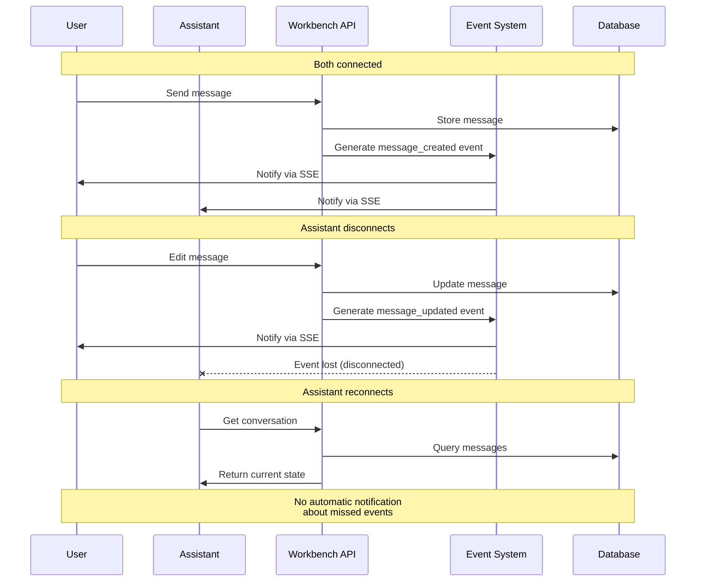

# Semantic Workbench State Management

This document provides an overview of the state management facilities available in the Semantic Workbench ecosystem that can be leveraged by assistants.

## Architectural Overview

## State Storage Locations

## Conversation-level State Management

### Message Metadata

- **Key Mechanism**: Each message can include arbitrary metadata as JSON
- **Storage**: Persisted in the database with the message
- **Special Fields**:
  - `attribution`: Source information displayed after the sender
  - `href`: Makes message a hyperlink
  - `debug`: Debug information accessible through UI inspection
  - `footer_items`: Additional information displayed in the message footer
  - `tool_calls`: Structured representation of tool invocations
  - `tool_result`: Results from tool executions
- **Usage**: Primary method for assistants to store structured data
- **Limitations**: Cannot be used to transfer large amounts of data (practical limit around 100KB)

### Files/Attachments

- **Model**: Files are represented as `File` and `FileVersion` entities in the database
- **Storage**: Files are stored in a filesystem-based storage system managed by the Workbench service
- **Versioning**:
  - Built-in version tracking for files with the same name
  - All files with the same name in a conversation are treated as versions of the same file
  - No way for users to explicitly designate a file with the same name as a new file rather than a new version
- **Access**:
  - Files are visible in the conversation UI for users
  - Files can be attached to messages via the `filenames` property
  - Files can be uploaded, downloaded, and deleted through the UI
- **Permissions**: Files inherit conversation permissions
- **Limitations**:
  - No direct UI for viewing or managing different versions of a file
  - No way for users to specify storage at the assistant level versus conversation level

### Conversation Sharing

- **Usage**: Enables controlled access to conversation content
- **Details**: See SHARING.md for comprehensive details on the sharing mechanism

### Events System

- **Purpose**: Propagates changes to all conversation participants
- **Model**: `ConversationEvent` defines various event types
- **Types**: Message created/deleted, participant changes, etc.
- **Delivery**: Events delivered through Server-Sent Events (SSE)
- **Storage**: Events are not stored persistently - they are transient objects
- **Connection Requirements**: Recipients must be actively connected to receive events
- **Durability**: No event replay mechanism - events missed during disconnection are lost permanently
- **Limitations**: Cannot be relied upon for critical state synchronization due to potential message loss

## Assistant-level State Management

### Assistant State API

- **Type**: Server-side state managed by the Workbench service
- **Model**: Assistants maintain state via `StateResponseModel` in the database
- **Structure**: Structured data represented as JSON schema
- **UI Integration**: UI schema maintained for display formatting in Workbench UI
- **Description**: State descriptions provide user-facing information
- **Persistence**: State persisted in the central SQL database (PostgreSQL/SQLite)
- **Access**: Accessible via REST API endpoints in the Workbench service
- **Visibility**: Can be exposed to users through UI integrations

### Assistant Storage Directory

- **Type**: Local filesystem storage specific to each assistant instance
- **Purpose**: Private storage for assistant-specific data
- **Location**: Typically `.data/assistants/[assistant-id]` directory
- **Implementation**: Created and managed by `storage.py` in semantic-workbench-assistant
- **Content**: Pydantic models serialized to JSON files via `write_model` function
- **Visibility**: Not exposed to users through the UI
- **Usage**: Appropriate for:
  - Private cross-conversation data
  - Assistant-specific configuration
  - Cached or derived data
  - Data that doesn't need UI visibility

### Configuration

- **Storage**: Assistant configuration stored in metadata
- **Scope**: Configuration specific to each assistant instance
- **Access**: Available through assistant service APIs

## Cross-conversation Communication

### Cross-Conversation Access

- Allows assistants to interact with multiple conversations simultaneously
- Requires proper permissions and active participant records
- Managed through the conversation sharing system
- See SHARING.md for comprehensive details on:
  - Permission models and enforcement
  - User vs. assistant access patterns
  - Conversation sharing mechanisms
  - Principal and participant relationships

### File Transfer

- **Mechanism**: Files must be explicitly copied between conversations
- **Process**:
  1. Read file content from source conversation
  2. Create new file with same name in target conversation
  3. This creates a completely separate file, not linked to the original
- **Versioning**: Version history doesn't transfer between conversations

### Participant Model

- **Types**: User participants and assistant participants
- **Status**: Online/offline status tracking
- **Permissions**: Read/write access controls
- **Events**: Participant join/leave events

## File Storage Architecture

### Storage System

- **Physical Storage**: Files stored in filesystem managed by Workbench service
- **Reference System**: Messages and conversations reference files by name
- **Uniqueness**: Files are uniquely identified by the combination of conversation ID and filename
- **UI Integration**: Only conversation-level files are shown in the UI

### File Versioning

- **Automatic Versioning**: When a file with the same name is uploaded to a conversation, it's treated as a new version
- **Version Control**: The system maintains version numbers and history
- **Access Control**: API allows requesting specific versions or defaulting to latest
- **Conflict Management**: No built-in conflict resolution for simultaneous updates

### File Naming

- **Namespace**: Filenames must be unique within a conversation
- **Constraints**: Database enforces uniqueness via constraints
- **Workaround**: To have logically different files with the same name, users must use different filenames (e.g., "report-v2.pdf")

## Data Export/Import

### Serialization

- Both conversations and assistants support export/import
- Data can be transferred between instances while maintaining relationships
- Export includes messages, files, and metadata

### Persistence

- Database uses SQLModel with async SQLAlchemy
- Supports both SQLite and PostgreSQL databases

## Access Patterns

### Direct API Calls

- Assistants can make authenticated API calls to the Workbench service
- API endpoints available for conversation, message, and file operations

### Message Commands

- Assistants can respond to commands embedded in messages
- Command responses can include structured data in metadata

### Event Subscriptions

- Assistants can subscribe to conversation events
- Real-time notifications of changes to conversations
- Requires maintaining active connections to receive events
- No guarantee of delivery - events during disconnections are lost
- Cannot be used as a reliable state synchronization mechanism

## Best Practices

### State Persistence

- Use message metadata for small conversation-specific state (<100KB)
- Use assistant state for cross-conversation persistence that needs UI integration
- Use files for larger structured data or binary content that users should see
- Use assistant storage directory for private cross-conversation data

### Sharing Information

- Use conversation sharing for explicit permission grants
- Leverage the API for controlled cross-conversation access
- Use message metadata for lightweight information transfer
- For file sharing between conversations, implement explicit copy mechanisms

### Avoiding State Conflicts

- Establish clear ownership of data to prevent conflicting updates
- Use versioning for tracking changes over time
- Implement conflict detection and resolution for collaborative scenarios
- Use timestamps to determine the most recent updates

