# GC Learnings

## Overview

This doc is intended to capture our team learnings with using Guided Conversation. Learnings include best use cases, concerns, hacks, favorites aspects, and different re-design ideas to improve our use of GC and any future version of it.

## Dev Experience Notes

1. Artifact accessibility - When using GC as a component conversation of a larger conversation, it would be helpful to have a way to set an artifact before starting up GC. Currently, GC takes in a schema and produces the original artifact. A current hack is to add information via context, rules, or conversation. Another approach is to start the GC in order to create the artifact, and then call call it again after manipulating the artifact.

   > UPDATE: Second approach works

2. Startup status - Within a larger conversation scope, a single gc (w/ config) may be called multiple times. But without the correct context, that gc may think its starting a new conversation, when its not. Currently a "Hello!" is emitted from GC every time it starts, even though it's in the middle of a large conversation context. A startup-status templated field in the artifact could help address this.

   > UPDATE: Added this field, but issue still exists. Appears GC internally is basing its reasoning off a competing status check of user messages being absent/present. Need to investigate further.

3. Completion status - More information is needed when GC decides a conversation is over. Right now its a bool in the result at the end. Using the artifact may be a better approach in general -- this can allows customization. Some completion fields of interest are the status (a 'why' the conversation ended: user-completed, user-exit, etc.), a next-function call (to support branching in the code based on user decision), and final user message. (Currently a final message from GC appears to be hardcoded.) These could also be templated fields in the artifact, which could help the dev avoid re-creating prompts that can introduce bugs. (Currently the rules, context, and conversation flow are free form. It may benefit to tighten up certain aspects of these fields to be more structured.)

   > NOTE: It is possible the prompt instructions for setting a conversation status to "complete" will not coincide with GC setting its result "conversation_is_over". It is likely best to depend on one or the other, and not depend on both to be true at the same time.

## Observations

- 11/8/24: GC conversation plan function was called 21 times before final update plan was called. Appeared as an endless loop to the user. Possibility an endless loop could actually occur? Need to investigate further.

## GC and SK calls to OpenAI API

### Generate Plan

#### Callstack

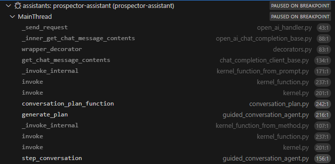

#### Breakpoints and Details

##### Guided Conversation

Here, Guided Conversation will make two OpenAI calls via Semantic Kernel:

1. `self.kernel_function_generate_plan`
2. `self.kernel_function_execute_plan`
3. (Later it makes a call to `self.kernel_function_final_update`.)
   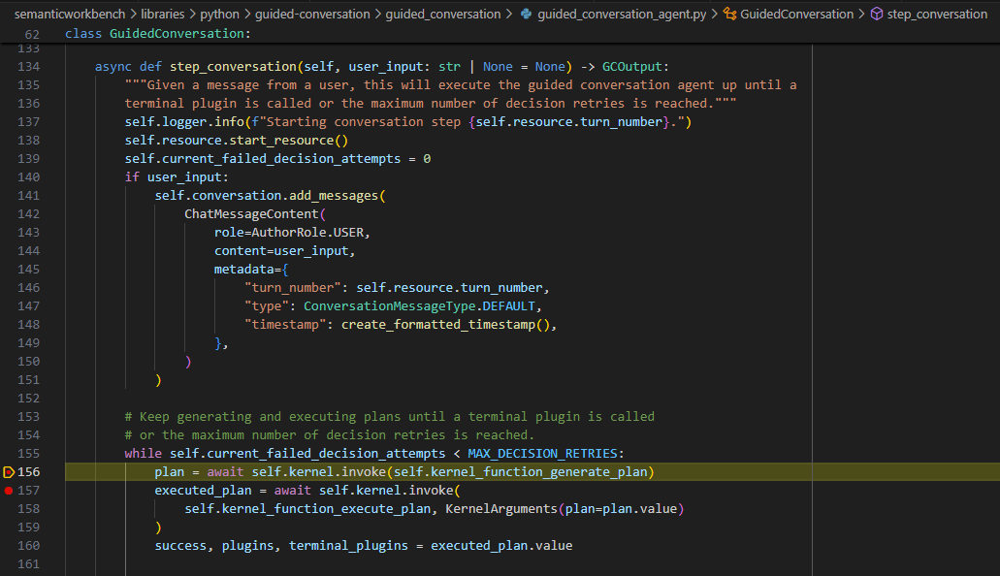

These actually call the following Guided Conversation functions:
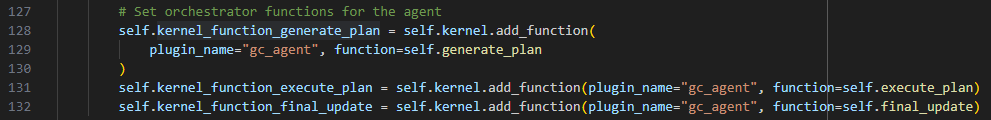

GC generate_plan calls GC conversation_plan_function, which takes as arguments a bunch of the GC internal pre-set values.
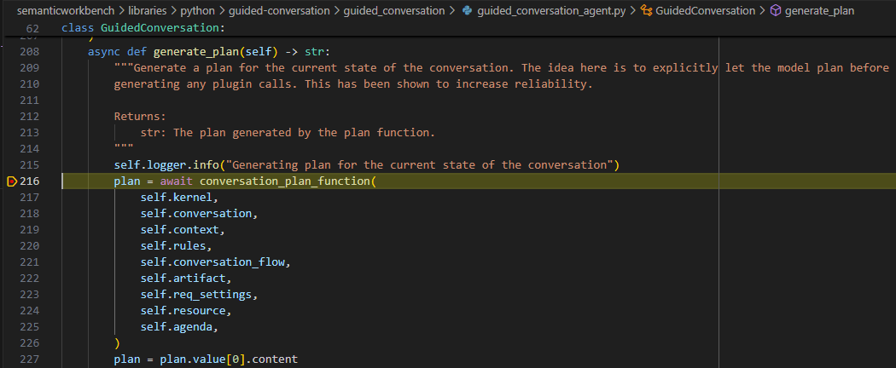

GC conversation_plan_function creates a semantic `kernel_function`, and uses as the prompt a "prompt template". This template provides the basis for the system prompt, which will be filled in via the arguments passed in. This template is in the same file as a string.

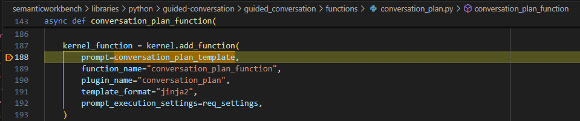

It also pulls in resource constraint info via get_resource_instructions. Set a break point in this function if interested in `self.resource_constraint` usage. Then it sets some variables to later make adjustments to the prompt for this information:

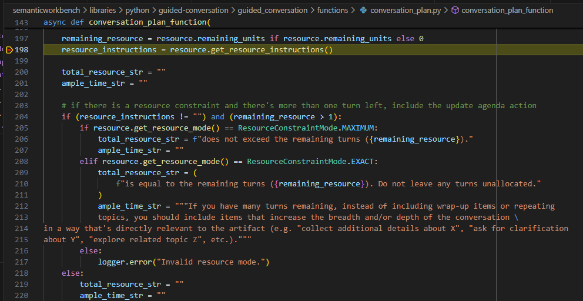

It then sets termination instructions, which have some other preset strings.

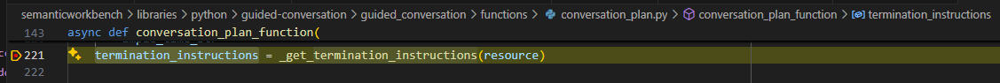

It then passes in these and a bunch of other args to a KernelArguments constructor. Some of these are existing variables, other call more functions (e.g. get_agenda_for_prompt). Set break points at any of these you are interested in.

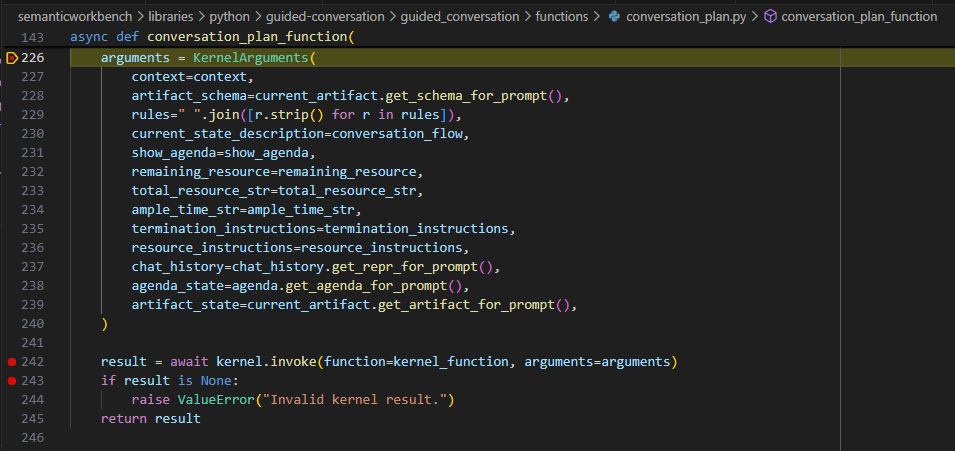

Ultimately it calls the `kernel_function` with these `arguments` via SK.

##### Semantic Kernel

Within SK, an `_invoke_internal` function is called which renders the prompt and also extracts a chat_history. These are good items to look further into to see how they are created. (Not shown.)

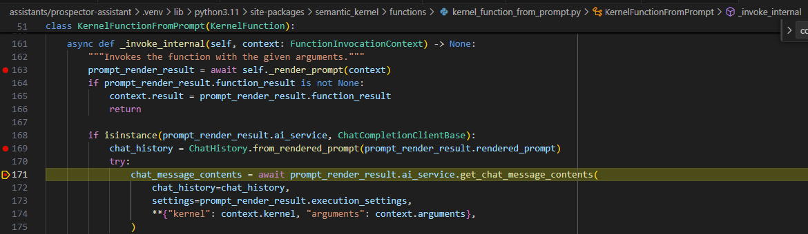

The call to `prompt_render_result.ai_service.get_chat_message_contents()` (see above) will call another `_inner_get_chat_message_contents()`:

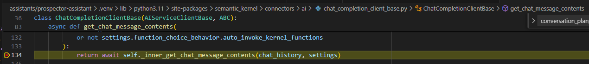

This function does more prep work for the OpenAI call, setting up the messages before calling `_send_request`.

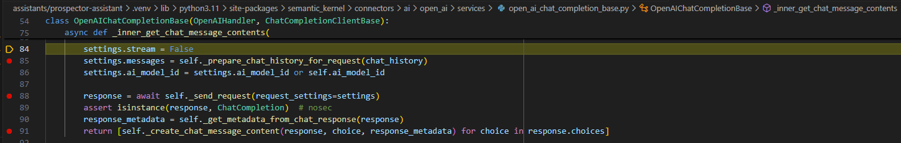

Ultimately, the OpenAI API call is made in `_send_request`:

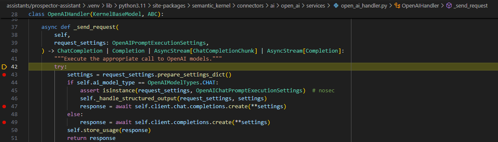

And the response is sent off to the `_create_chat_message_content()` function to update metadata and return an SK ChatMessageContent object.

This ultimately bubbles back up (changing some forms) to the `generate_plan()` call in GC, where it extracts content and adds the message to its own conversation. Finally it returns this content.

This returned plan has a value which is passed into the next GC function call (execute_plan). (See earlier images.)

### Execute Plan

This call initially takes a slightly different route at the GC layer, but at SK layer, its all the same:

#### Callstack

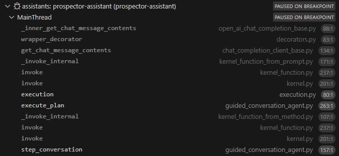
