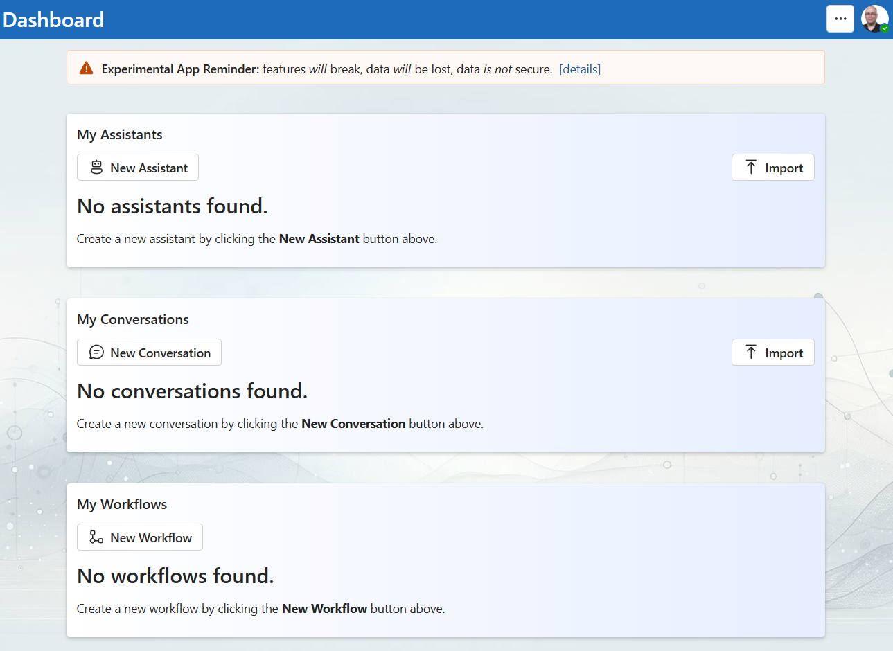
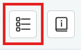
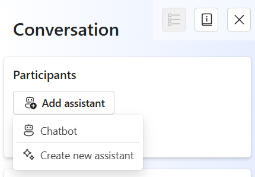
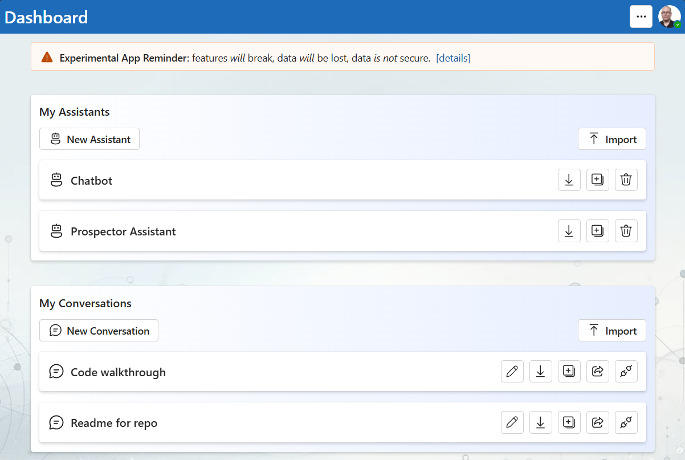

# Semantic Workbench

The Semantic Workbench is a versatile and powerful platform designed to help developers and non-developers alike create, configure, and interact with AI assistants. Its intuitive interface and extensive configuration options make it an ideal choice for prototyping intelligent assistants, managing their interactions, and analyzing the results efficiently. Key features of the Semantic Workbench include multi-user collaboration, flexible file handling, content safety mechanisms, and robust debugging tools. These features ensure responsible AI usage and provide users with invaluable insights into the performance and behavior of their assistants.

## Accessing the Semantic Workbench

To get started with the Semantic Workbench, open your browser and navigate to the login page. Click on the `Sign in` button and authenticate using your Microsoft or organizational account.

_Sign-In page of the Semantic Workbench_

Once logged in, you will be greeted with the main dashboard. This dashboard features a list of your assistants and conversations, providing a centralized location for managing all your interactions within the workbench.

_Dashboard overview in the Semantic Workbench_

### Initial Setup

The first time you access the Semantic Workbench, you will encounter a terms and conditions page that requires you to accept the terms of use. This is followed by a splash screen reminding you of the experimental nature of the workbench, to not use it with sensitive data, and that it may change frequently.

_License agreement page on first use_

_Experimental splash screen on first use_

## Getting Started

When you first log into the Semantic Workbench, follow these steps to get started:

1. **Create an Assistant**: On the dashboard, click the `New Assistant` button. Select **Prospector Assistant** (if available), provide a name, and click `Save`.

   

2. **Start a Conversation**: On the dashboard, click the `New Conversation` button. Provide a title for the conversation and click `Save`.

3. **Add the Assistant**: In the conversation window, click the conversation canvas icon and add your assistant to the conversation from the conversation canvas. Now you can converse with your assistant using the message box at the bottom of the conversation window.

   

   

Expected: You get a response from your assistant!

Note that the workbench provides capabilities that not all examples use, for example providing attachments.

## General Workbench Usage

The Semantic Workbench interface dashboard includes sections for your assistants and active conversations.

Select any of your assistants to access and update the assistant's configuration. Select an existing conversation or create a new one to start interacting with your assistants.

# Assistant Instances

Creating and configuring assistants in the Semantic Workbench allows you to utilize different AI functionalities tailored to specific needs. Note that you can create multiple instances of a single assistant service, each with its own configuration.

## Creating a New Assistant

Creating a new assistant in the Semantic Workbench is straightforward. Begin by clicking on the `New Assistant` button on the dashboard. You will be presented with the available assistant services to choose from. Select the one that best suits your needs. You can accept the default name or choose your own then click `Save` to create the instance.

## Configuring Assistants

Once your assistant is created, you can configure it to match your specific requirements. Click on your assistant from the dashboard to open the configuration panel. Here, you can update settings such as instruction prompts, guardrails, and other configurations. Specific configuration options may vary across assistants, but these are common parameters.

_Assistant Configuration Page_

A warning will appear at the top of the panel if anything is invalid.

**Instruction Prompt**: Define what your assistant should do. This is the primary directive that determines the assistant's initial behavior.

**Guardrails**: Set boundaries to ensure responsible AI usage, such as content moderation, response length, and interaction limits.

**Welcome Message**: What your assistant says when it is added to a conversation.

**Configuration Options for LLM Services**: Specify the endpoint and select the model for the language model service your assistant will use.

**API Keys**: Ensure you set your API keys for any external services the assistant will interact with. These keys can be configured directly in the assistant configuration panel.

**Azure Managed Identities**: If you are using managed identities with Azure, ensure that `az login` has been run in your environment before starting the assistant. This step allows the assistant to authenticate using Azure's identity management.

**Using .env Files**: Settings for endpoints and API keys can also be configured in `.env` files. Examples provided in each developer example include these files which simplify the configuration process.

# Conversations

Conversations in the Semantic Workbench are central to interacting with your assistants. Your past conversations can be easily accessed either from the dashboard or within the configuration screen of any assistants that participated. This makes it simple to continue from where you left off or to review previous interactions.

You have the ability to invite additional people to either observe or participate in your conversations with assistants. This collaborative feature is essential for team projects and sharing insights. Additionally, you can create a link to copy your conversation. When someone follows this link, it will copy your assistant, the conversation, and all associated data, effectively sharing an already prepared context to help others get started quickly.

## Creating a New Conversation

To start a new conversation with your assistant, click on its instance and then click `New Conversation`. Provide a title for the conversation and click `Save`.

## Basics of Conversations

**Accessing Past Conversations**: Your past conversations are listed on the dashboard and within the configuration screen of any assistant that took part in the conversation. This makes it simple to revisit and continue your previous interactions.

**Message Box**: The message box is your primary tool for interacting with assistants in the Semantic Workbench. For assistants that support it, like the Prospector Assistant, you can add files by dragging and dropping them directly onto the message box. This feature allows you to easily provide additional context or data for the assistant to process.

You can also paste images directly into the message box. For instance, if you copy a PowerPoint slide and paste it into the message box, it will be sent as an image. This functionality makes it simple to share visual information and documents with your assistant.

As a developer tool the message box also displays the number of tokens your message will use.

## Message Bar

Above every message there are common icons under the name of the participant that sent the message. These are **link**, **information**, **copy**, **delete**, and **rewind**.

### Linking to messages

Use the **link button** to create a link to that message in the conversation. You can can either invite people to participate in the conversation or be restricted to read-only access, depending on your needs.

### Viewing and Inspecting Messages

Click the **information button** on any message to inspect debug details, including system prompts, response evaluations, and content safety checks. This information helps you understand how responses are generated and ensure they meet safety standards.

_Viewing debug information for messages_

### Copy

The **copy button** will copy the message in markdown format.

### Delete

The **delete button** will delete the message from the conversation history.

### Rewind

The rewind feature allows you to revert the conversation to a previous state. Click the **rewind button** on the desired message and choose between reverting the conversation to that point with or without replaying subsequent messages. This feature is particularly useful for correcting the course of a conversation or exploring alternative interactions.

## Sharing and Collaboration

The Semantic Workbench makes it easy to share and collaborate on conversations. In the conversation window, click on the share icon at the top to generate a shareable link of the conversation.

You can choose to invite participants to engage in the conversation or provide them with read-only access. Additionally, you can create a link to copy your conversation. When someone follows this link, it will copy your assistant, the conversation, and all associated data, effectively sharing an already prepared context to help others get started quickly.

### Copying conversations
When you provide someone with a link to copy a conversation it will copy the conversation, all associated data, and an assistant configured the same as the one in the conversation. This copy occurs from when they follow the link. So if you create a copy link, share it, and then continue the conversation and add more documents the following can happen and is by design:
* First person follows the link immediately, they do not get the continued conversation and data you added later.
* Second person follows the link later, they get the additional messages and data you added before they followed the link.

### Duplicating conversation
From the conversation list you can also duplicate them. This is useful for experimenting with taking conversations in different directions, or using one as a common base for further explorations. 

Note that this will also copy the assistant instance the conversation is a part of as there is some state associated between the assistant and the conversation.

### Exporting and importing conversations

You can also export conversations for later use and import them back into the workbench. From the conversation menu, select the export option to save the conversation data to your local device. To import a conversation, use the import option on the dashboard and upload the saved data.

