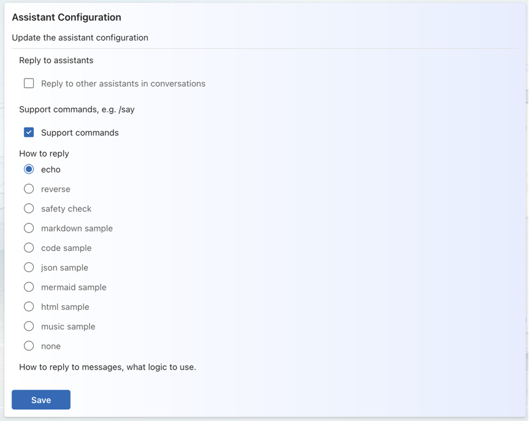
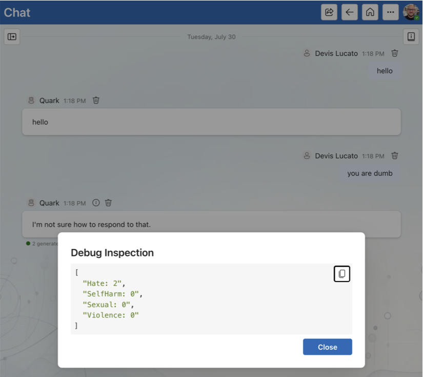
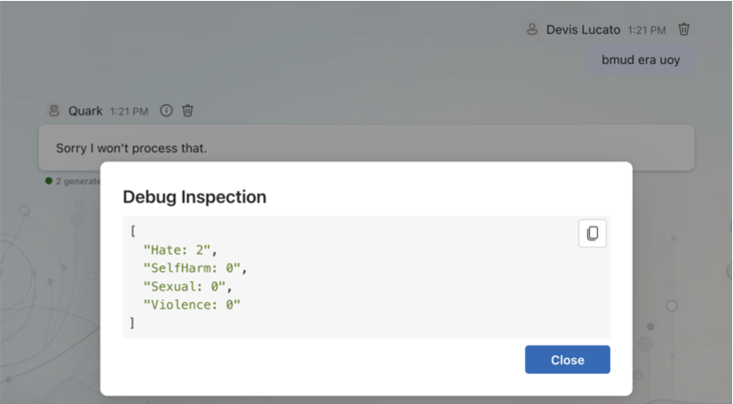
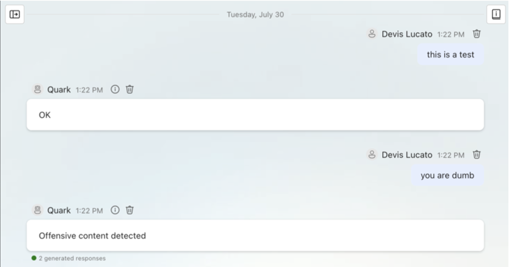
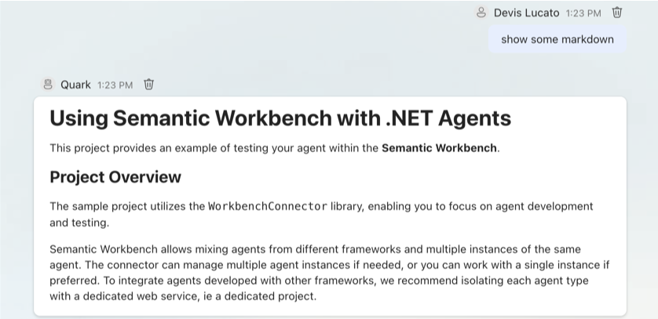
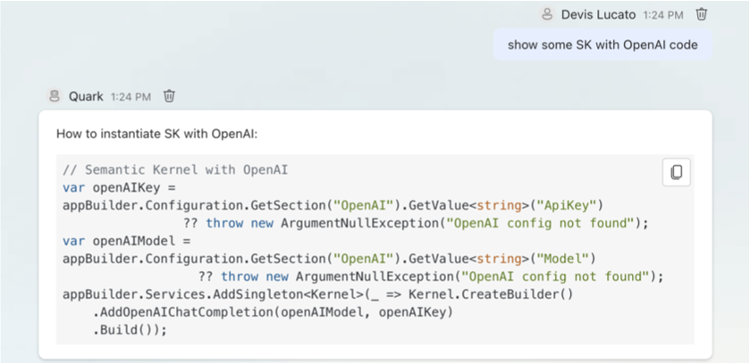

# Example 2 - Content Types, Content Safety, Debugging

This project provides an example of an agent with a configurable behavior, showing also Semantic Workbench support for **multiple content types**, such as Markdown, HTML, Mermaid graphs, JSON, etc.

The agent demonstrates also a simple **integration with [Azure AI Content Safety](https://azure.microsoft.com/products/ai-services/ai-content-safety)**, to test user input and LLM models output.

The example shows also how to leverage Semantic Workbench UI to **inspect agents' result, by including debugging information** readily available in the conversation.

Similarly to example 01, this example is meant to show how to leverage Semantic Workbench.
Look at example 03 for a functional agent integrated with AI LLMs.

## Project Overview

The sample project utilizes the `WorkbenchConnector` library, enabling you to focus on agent development and testing.
The connector provides a base `AgentBase` class for your agents, and takes care of connecting your agent with the
workbench backend service.

Differently from [example 1](../dotnet-example01), this agent has a configurable `behavior` to show different output types.
All the logic starts from `MyAgent.ReceiveMessageAsync()` method as seen in the previous example.

## Agent output types

* **echo**: echoes the user message back, only if the content is considered safe, after checking with Azure AI Content Safety.

* **reverse**: echoes the user message back, reversing the string, only if the content is considered safe, and only if the output is considered safe.

* **safety check**: check if the user message is safe, returning debugging details.

* **markdown sample**: returns a fixed Markdown content example.

* **code sample**: returns a fixed Code content example.

* **json sample**: returns a fixed JSON content example.
* **mermaid sample**: returns a fixed [Mermaid Graph](https://mermaid.js.org/syntax/examples.html) example.

* **html sample**: returns a fixed HTML content example.
* **music sample**: returns a fixed ABC Music example that can be played from the UI.

* **none**: configures the agent not to reply to any message.

