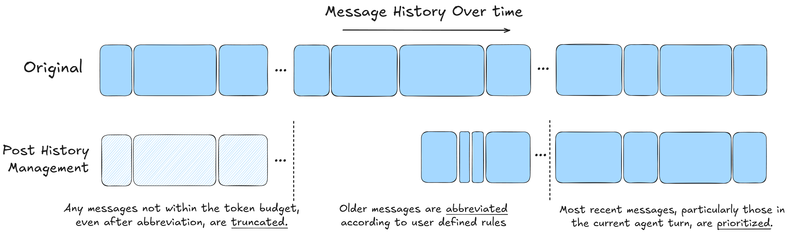
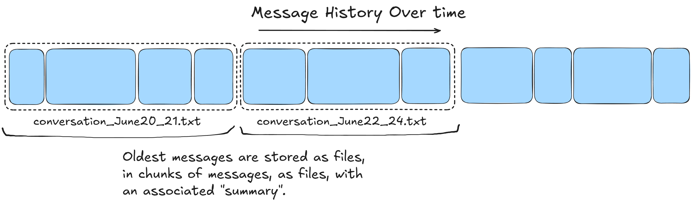
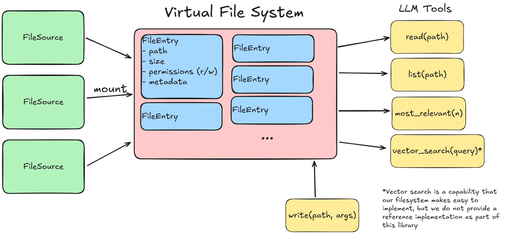

# Chat Context Toolkit

The **Chat Context Toolkit** is a Python library designed to efficiently manage context for most AI agents.

It provides these three core, modular components:
- Message History Management: Applies context engineering techniques to ensure that messages fit within a token budget.
- Archive: A task for archiving and processing chunks of the message history that may no longer fit within a token budget to ensure older data can still be considered.
- Virtual Filesystem: Creates a common abstraction for LLMs to read, edit, and explore files coming from a variety of disparate sources.


## Key Features

### History Management

The primary goal of history management is to ensure that a list of messages is guaranteed to be under a token limit
and to provide a framework for common prompt engineering techniques to optimize how the messages are reduced to fit within a token budget.

In the default case, this algorithm is equivalent to the commonly implemented truncation of oldest messages,
but a user can configure abbreviations which allow for fine-grained control over how message contents can be reduced, rather than eliminated.

For example, the results of "data" tools, such as ones that query external sources like the web or a database,
are usually only important until they are "consumed" by a user asking questions or incorporating the results into something else like a document.
Thus, a common abbreviation for a tool message like this might be: `The content of this tool call result has been removed due to token limits. If you need it, call the tool again.`



### Archiving

Removing messages from history may be removing valuable data required to effectively address a user’s task.
We address this by asynchronously storing and extracting important content from chunks of the conversation into a configurable summary.
The original files could be later retrieved by the model (see the following section on the Virtual Filesystem),
and the summaries could be used as a form of memory system (although we do not prescribe this – it is up to the user of the library to decide what they want to use the summary for).



### Virtual File System

Files are often large, and users usually have many of them that they create, add, or get created as part of working with an agent.
These files might come from different sources, but to the model it is unnecessary, confusing, or detrimental to present them in different ways.
To solve for this the virtual filesystem provides the following:
- A cohesive view of all types of varied data (generated documents, uploaded files, old message histories, etc.) optimized for the model’s understanding.
- Default tools for retrieval and exploration of that data as one cohesive aggregation of files.
- A mechanism for editing files that we define as editable.



---

## Project Structure

### `archive` Module

Handles the archival of message histories into summarized chunks for long-term storage:

- **`_archive.py`**: Core archiving logic with `ArchiveTask` for periodic archiving and `ArchiveReader` for retrieving archived content.
- **`_state.py`**: Manages the archive's persistent state using configurable storage providers.
- **`_types.py`**: Defines archival data structures, protocols, and configurations including `ArchiveContent`, `ArchiveManifest`, `ArchivesState`, and provider protocols.

### `history` Module

Manages in-memory history for active sessions and ensures prioritization within token budgets:

- **`_history.py`**: Core functionality with `apply_budget_to_history_messages` for token-constrained message processing.
- **`_prioritize.py`**: Logic for pairing and prioritizing messages (e.g., tool calls and results).
- **`_budget.py`**: Ensures that token usage remains within the defined budget through abbreviation and truncation.
- **`_decorators.py`**: Utility decorators for performance logging and timing.
- **`_types.py`**: Type definitions specific to history management including protocols and data structures.

### `virtual_filesystem` Module

Provides a virtual file system abstraction for LLM interaction with files from multiple sources:

- **`virtual_filesystem.py`**: Core `VirtualFileSystem` class that manages file source mounts and provides tools for LLM interaction.
- **`types.py`**: Type definitions including `FileSource`, `DirectoryEntry`, `FileEntry`, and `WriteToolDefinition` protocols.
- **`README.md`**: Detailed documentation on the virtual file system concept and implementation.

---

## Installation

### Requirements

- **Python**: 3.11 or higher

### Setup

To use this library, install the necessary dependencies with the **`uv`** dependency manager:

```bash
uv sync --frozen
```

For development with all dependency groups (including examples):

```bash
uv sync --all-extras --all-groups --frozen
```

---

## Usage

### Example 1: Managing Message History with Token Budgets

```python
from chat_context_toolkit.history import (
    apply_budget_to_history_messages,
    NewTurn,
    HistoryMessageProvider,
    TokenCounter
)

# Create a token counter function
def token_counter(messages):
    # Implement your token counting logic
    return sum(len(msg.get("content", "")) for msg in messages)

# Create a message provider function
async def message_provider(after_id=None):
    # Implement your message retrieval logic
    # Return a sequence of HistoryMessageProtocol objects
    return your_messages

# Apply token budget to message history
turn = NewTurn(high_priority_token_count=5000)
messages = await apply_budget_to_history_messages(
    turn=turn,
    token_budget=10000,
    token_counter=token_counter,
    message_provider=message_provider,
)
```

### Example 2: Archiving Messages

```python
from chat_context_toolkit.archive import ArchiveTask, ArchiveTaskConfig

# Initialize archiving task
archive_task = ArchiveTask(
    storage_provider=your_storage_provider,  # Must implement StorageProvider protocol
    message_provider=your_message_provider,  # Must implement MessageProvider protocol
    token_counter=your_token_counter,        # Must implement TokenCounter protocol
    summarizer=your_summarizer,              # Must implement Summarizer protocol
)

# Start archiving with custom configuration
config = ArchiveTaskConfig(
    message_poll_interval_seconds=300,  # Poll every 5 minutes
    chunk_token_count_threshold=50000   # Archive when chunk exceeds 50k tokens
)
task, trigger_fn = archive_task.start(config=config)

# Optionally trigger archiving manually
trigger_fn()
```

### Example 3: Reading Archived Messages

```python
from chat_context_toolkit.archive import ArchiveReader

# Create archive reader
reader = ArchiveReader(
    message_provider=your_message_provider,
    storage_provider=your_storage_provider,
)

# Get archive state
state = await reader.get_state()
print(f"Most recent archived message: {state.most_recent_archived_message_id}")

# List all archived chunks
async for manifest in reader.list():
    print(f"Archive: {manifest.summary}")
    print(f"Messages: {len(manifest.message_ids)}")
    print(f"Date range: {manifest.timestamp_oldest} to {manifest.timestamp_most_recent}")

# Read specific archive content
content = await reader.read("archive_filename.json")
if content:
    print(f"Found {len(content.messages)} messages in archive")
```

### Example 4: Virtual File System

```python
from chat_context_toolkit.virtual_filesystem import VirtualFileSystem
from openai import OpenAI

# Create and configure virtual file system
vfs = VirtualFileSystem()
vfs.mount("/docs", your_file_source)  # Must implement FileSource protocol

# Get tools for OpenAI chat completion
tools = list(vfs.tools.values())

# Use with OpenAI chat completion
client = OpenAI()
messages = [
    {"role": "system", "content": "You have access to files through the virtual file system. Use the ls and view tools to explore and read files."},
    {"role": "user", "content": "What files are available in /docs?"}
]

response = client.chat.completions.create(
    model="gpt-4",
    messages=messages,
    tools=tools
)

# Execute tool calls from the response
if response.choices[0].message.tool_calls:
    for tool_call in response.choices[0].message.tool_calls:
        result = await vfs.execute_tool(tool_call)
        print(f"Tool {tool_call.function.name} result: {result}")
```

---

## Development Setup

1. Install the project dependencies:

   ```bash
   make install
   ```

2. Run tests:
   ```bash
   make test
   ```
