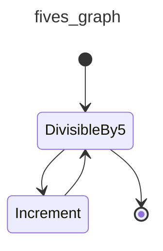
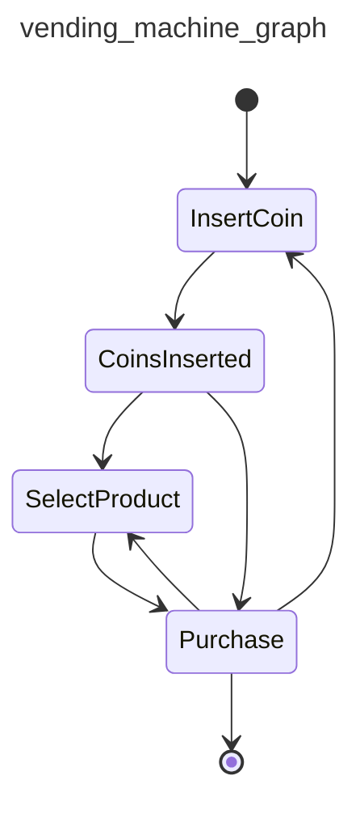
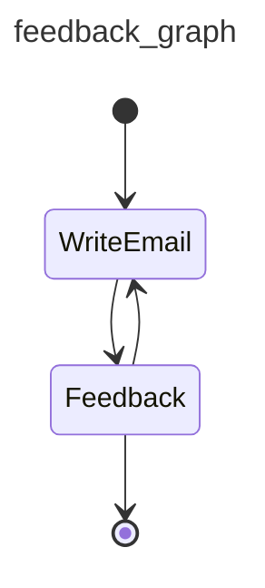
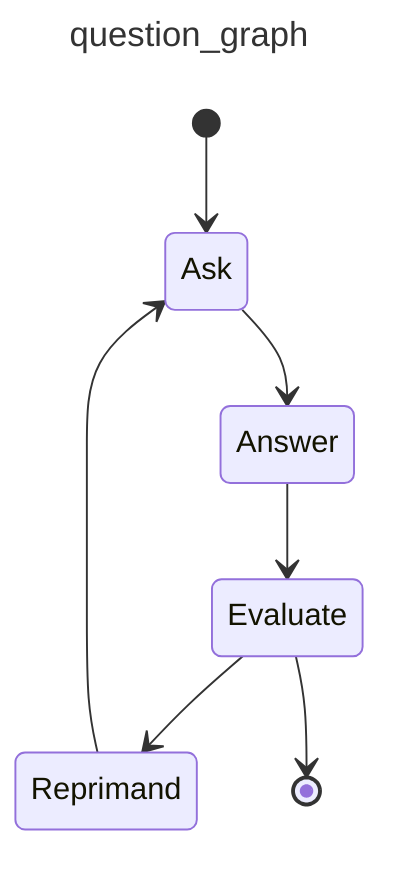
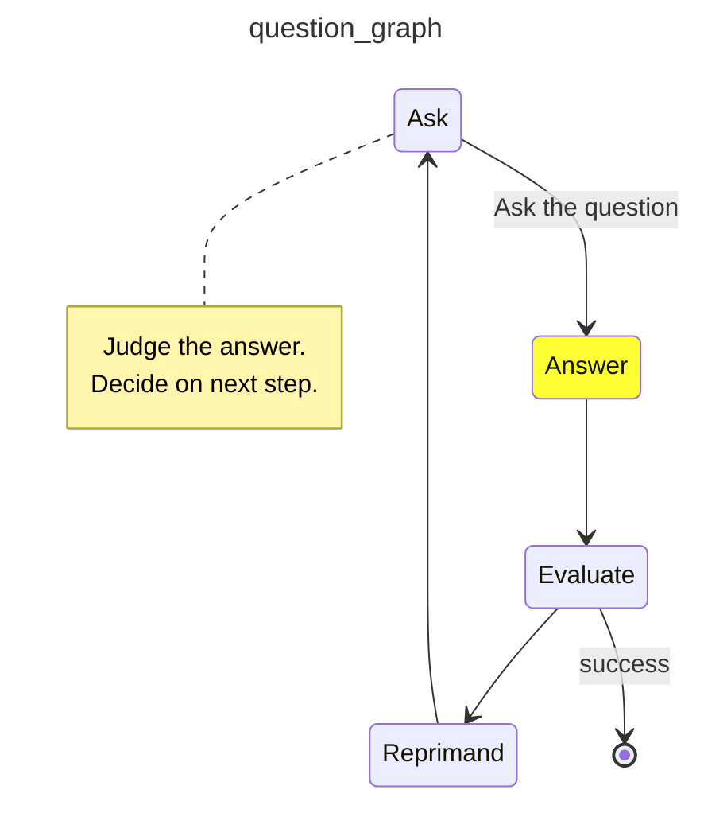
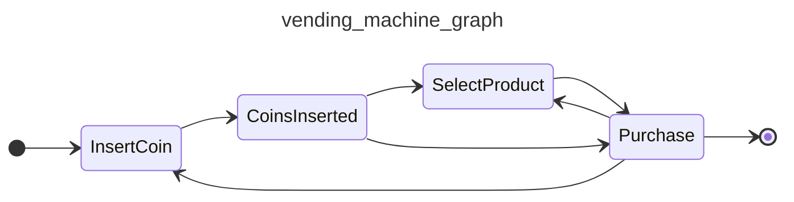
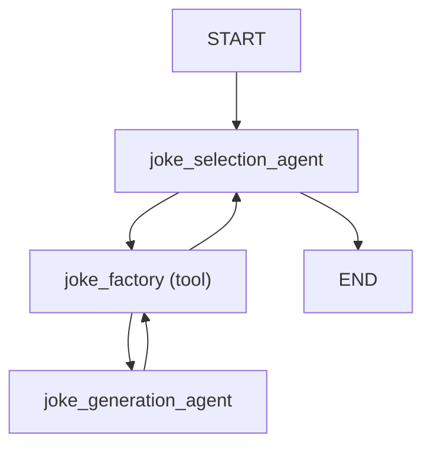
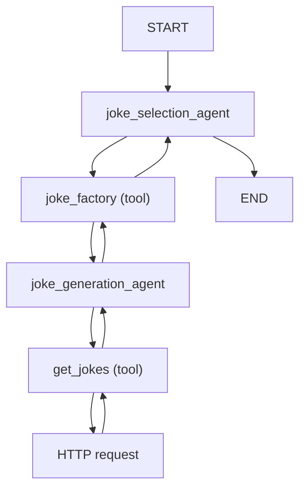
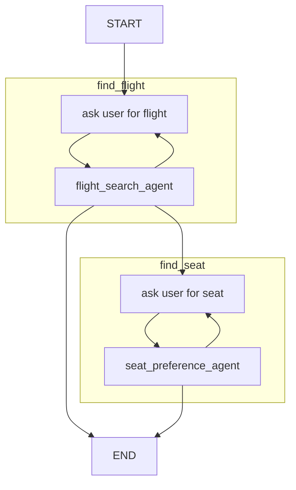
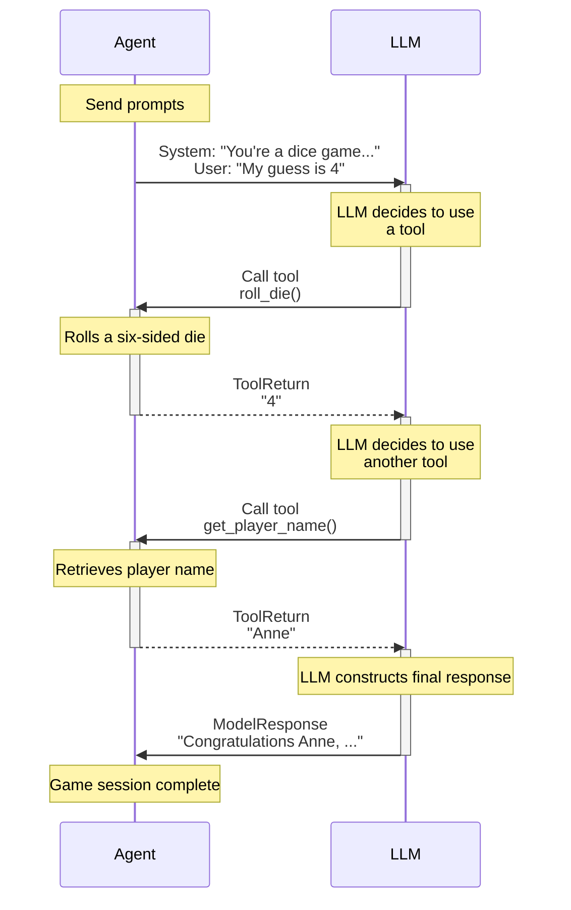

PydanticAI Documentation:

# Introduction {.hide}

--8<-- "docs/.partials/index-header.html"

PydanticAI is a Python Agent Framework designed to make it less painful to
build production grade applications with Generative AI.

FastAPI revolutionized web development by offering an innovative and ergonomic design, built on the foundation of [Pydantic](https://docs.pydantic.dev).

Similarly, virtually every agent framework and LLM library in Python uses Pydantic, yet when we began to use LLMs in [Pydantic Logfire](https://pydantic.dev/logfire), we couldn't find anything that gave us the same feeling.

We built PydanticAI with one simple aim: to bring that FastAPI feeling to GenAI app development.

## Why use PydanticAI

* __Built by the Pydantic Team__:
Built by the team behind [Pydantic](https://docs.pydantic.dev/latest/) (the validation layer of the OpenAI SDK, the Anthropic SDK, LangChain, LlamaIndex, AutoGPT, Transformers, CrewAI, Instructor and many more).

* __Model-agnostic__:
Supports OpenAI, Anthropic, Gemini, Deepseek, Ollama, Groq, Cohere, and Mistral, and there is a simple interface to implement support for [other models](models.md).

* __Pydantic Logfire Integration__:
Seamlessly [integrates](logfire.md) with [Pydantic Logfire](https://pydantic.dev/logfire) for real-time debugging, performance monitoring, and behavior tracking of your LLM-powered applications.

* __Type-safe__:
Designed to make [type checking](agents.md#static-type-checking) as powerful and informative as possible for you.

* __Python-centric Design__:
Leverages Python's familiar control flow and agent composition to build your AI-driven projects, making it easy to apply standard Python best practices you'd use in any other (non-AI) project.

* __Structured Responses__:
Harnesses the power of [Pydantic](https://docs.pydantic.dev/latest/) to [validate and structure](results.md#structured-result-validation) model outputs, ensuring responses are consistent across runs.

* __Dependency Injection System__:
Offers an optional [dependency injection](dependencies.md) system to provide data and services to your agent's [system prompts](agents.md#system-prompts), [tools](tools.md) and [result validators](results.md#result-validators-functions).
This is useful for testing and eval-driven iterative development.

* __Streamed Responses__:
Provides the ability to [stream](results.md#streamed-results) LLM outputs continuously, with immediate validation, ensuring rapid and accurate results.

* __Graph Support__:
[Pydantic Graph](graph.md) provides a powerful way to define graphs using typing hints, this is useful in complex applications where standard control flow can degrade to spaghetti code.

!!! example "In Beta"
    PydanticAI is in early beta, the API is still subject to change and there's a lot more to do.
    [Feedback](https://github.com/pydantic/pydantic-ai/issues) is very welcome!

## Hello World Example

Here's a minimal example of PydanticAI:

```python {title="hello_world.py"}
from pydantic_ai import Agent

agent = Agent(  # (1)!
    'google-gla:gemini-1.5-flash',
    system_prompt='Be concise, reply with one sentence.',  # (2)!
)

result = agent.run_sync('Where does "hello world" come from?')  # (3)!
print(result.data)
"""
The first known use of "hello, world" was in a 1974 textbook about the C programming language.
"""
```

1. We configure the agent to use [Gemini 1.5's Flash](api/models/gemini.md) model, but you can also set the model when running the agent.
2. Register a static [system prompt](agents.md#system-prompts) using a keyword argument to the agent.
3. [Run the agent](agents.md#running-agents) synchronously, conducting a conversation with the LLM.

_(This example is complete, it can be run "as is")_

The exchange should be very short: PydanticAI will send the system prompt and the user query to the LLM, the model will return a text response.

Not very interesting yet, but we can easily add "tools", dynamic system prompts, and structured responses to build more powerful agents.

## Tools & Dependency Injection Example

Here is a concise example using PydanticAI to build a support agent for a bank:

```python {title="bank_support.py"}
from dataclasses import dataclass

from pydantic import BaseModel, Field
from pydantic_ai import Agent, RunContext

from bank_database import DatabaseConn


@dataclass
class SupportDependencies:  # (3)!
    customer_id: int
    db: DatabaseConn  # (12)!


class SupportResult(BaseModel):  # (13)!
    support_advice: str = Field(description='Advice returned to the customer')
    block_card: bool = Field(description="Whether to block the customer's card")
    risk: int = Field(description='Risk level of query', ge=0, le=10)


support_agent = Agent(  # (1)!
    'openai:gpt-4o',  # (2)!
    deps_type=SupportDependencies,
    result_type=SupportResult,  # (9)!
    system_prompt=(  # (4)!
        'You are a support agent in our bank, give the '
        'customer support and judge the risk level of their query.'
    ),
)


@support_agent.system_prompt  # (5)!
async def add_customer_name(ctx: RunContext[SupportDependencies]) -> str:
    customer_name = await ctx.deps.db.customer_name(id=ctx.deps.customer_id)
    return f"The customer's name is {customer_name!r}"


@support_agent.tool  # (6)!
async def customer_balance(
    ctx: RunContext[SupportDependencies], include_pending: bool
) -> float:
    """Returns the customer's current account balance."""  # (7)!
    return await ctx.deps.db.customer_balance(
        id=ctx.deps.customer_id,
        include_pending=include_pending,
    )


...  # (11)!


async def main():
    deps = SupportDependencies(customer_id=123, db=DatabaseConn())
    result = await support_agent.run('What is my balance?', deps=deps)  # (8)!
    print(result.data)  # (10)!
    """
    support_advice='Hello John, your current account balance, including pending transactions, is $123.45.' block_card=False risk=1
    """

    result = await support_agent.run('I just lost my card!', deps=deps)
    print(result.data)
    """
    support_advice="I'm sorry to hear that, John. We are temporarily blocking your card to prevent unauthorized transactions." block_card=True risk=8
    """
```

1. This [agent](agents.md) will act as first-tier support in a bank. Agents are generic in the type of dependencies they accept and the type of result they return. In this case, the support agent has type `#!python Agent[SupportDependencies, SupportResult]`.
2. Here we configure the agent to use [OpenAI's GPT-4o model](api/models/openai.md), you can also set the model when running the agent.
3. The `SupportDependencies` dataclass is used to pass data, connections, and logic into the model that will be needed when running [system prompt](agents.md#system-prompts) and [tool](tools.md) functions. PydanticAI's system of dependency injection provides a [type-safe](agents.md#static-type-checking) way to customise the behavior of your agents, and can be especially useful when running [unit tests](testing-evals.md) and evals.
4. Static [system prompts](agents.md#system-prompts) can be registered with the [`system_prompt` keyword argument][pydantic_ai.Agent.__init__] to the agent.
5. Dynamic [system prompts](agents.md#system-prompts) can be registered with the [`@agent.system_prompt`][pydantic_ai.Agent.system_prompt] decorator, and can make use of dependency injection. Dependencies are carried via the [`RunContext`][pydantic_ai.tools.RunContext] argument, which is parameterized with the `deps_type` from above. If the type annotation here is wrong, static type checkers will catch it.
6. [`tool`](tools.md) let you register functions which the LLM may call while responding to a user. Again, dependencies are carried via [`RunContext`][pydantic_ai.tools.RunContext], any other arguments become the tool schema passed to the LLM. Pydantic is used to validate these arguments, and errors are passed back to the LLM so it can retry.
7. The docstring of a tool is also passed to the LLM as the description of the tool. Parameter descriptions are [extracted](tools.md#function-tools-and-schema) from the docstring and added to the parameter schema sent to the LLM.
8. [Run the agent](agents.md#running-agents) asynchronously, conducting a conversation with the LLM until a final response is reached. Even in this fairly simple case, the agent will exchange multiple messages with the LLM as tools are called to retrieve a result.
9. The response from the agent will, be guaranteed to be a `SupportResult`, if validation fails [reflection](agents.md#reflection-and-self-correction) will mean the agent is prompted to try again.
10. The result will be validated with Pydantic to guarantee it is a `SupportResult`, since the agent is generic, it'll also be typed as a `SupportResult` to aid with static type checking.
11. In a real use case, you'd add more tools and a longer system prompt to the agent to extend the context it's equipped with and support it can provide.
12. This is a simple sketch of a database connection, used to keep the example short and readable. In reality, you'd be connecting to an external database (e.g. PostgreSQL) to get information about customers.
13. This [Pydantic](https://docs.pydantic.dev) model is used to constrain the structured data returned by the agent. From this simple definition, Pydantic builds the JSON Schema that tells the LLM how to return the data, and performs validation to guarantee the data is correct at the end of the run.

!!! tip "Complete `bank_support.py` example"
    The code included here is incomplete for the sake of brevity (the definition of `DatabaseConn` is missing); you can find the complete `bank_support.py` example [here](examples/bank-support.md).

## Instrumentation with Pydantic Logfire

To understand the flow of the above runs, we can watch the agent in action using Pydantic Logfire.

To do this, we need to set up logfire, and add the following to our code:

```python {title="bank_support_with_logfire.py" hl_lines="4-6" test="skip" lint="skip"}
...
from bank_database import DatabaseConn

import logfire
logfire.configure()  # (1)!
logfire.instrument_asyncpg()  # (2)!
...
```

1. Configure logfire, this will fail if project is not set up.
2. In our demo, `DatabaseConn` uses [`asyncpg`]() to connect to a PostgreSQL database, so [`logfire.instrument_asyncpg()`](https://magicstack.github.io/asyncpg/current/) is used to log the database queries.

That's enough to get the following view of your agent in action:

{{ video('9078b98c4f75d01f912a0368bbbdb97a', 25, 55) }}

See [Monitoring and Performance](logfire.md) to learn more.

## Next Steps

To try PydanticAI yourself, follow the instructions [in the examples](examples/index.md).

Read the [docs](agents.md) to learn more about building applications with PydanticAI.

Read the [API Reference](api/agent.md) to understand PydanticAI's interface.

## Introduction

Agents are PydanticAI's primary interface for interacting with LLMs.

In some use cases a single Agent will control an entire application or component,
but multiple agents can also interact to embody more complex workflows.

The [`Agent`][pydantic_ai.Agent] class has full API documentation, but conceptually you can think of an agent as a container for:

| **Component**                                   | **Description**                                                                                          |
|-------------------------------------------------|----------------------------------------------------------------------------------------------------------|
| [System prompt(s)](#system-prompts)             | A set of instructions for the LLM written by the developer.                                              |
| [Function tool(s)](tools.md)                    | Functions that the LLM may call to get information while generating a response.                          |
| [Structured result type](results.md)            | The structured datatype the LLM must return at the end of a run, if specified.                           |
| [Dependency type constraint](dependencies.md)   | System prompt functions, tools, and result validators may all use dependencies when they're run.         |
| [LLM model](api/models/base.md)                 | Optional default LLM model associated with the agent. Can also be specified when running the agent.      |
| [Model Settings](#additional-configuration)     | Optional default model settings to help fine tune requests. Can also be specified when running the agent.|

In typing terms, agents are generic in their dependency and result types, e.g., an agent which required dependencies of type `#!python Foobar` and returned results of type `#!python list[str]` would have type `Agent[Foobar, list[str]]`. In practice, you shouldn't need to care about this, it should just mean your IDE can tell you when you have the right type, and if you choose to use [static type checking](#static-type-checking) it should work well with PydanticAI.

Here's a toy example of an agent that simulates a roulette wheel:

```python {title="roulette_wheel.py"}
from pydantic_ai import Agent, RunContext

roulette_agent = Agent(  # (1)!
    'openai:gpt-4o',
    deps_type=int,
    result_type=bool,
    system_prompt=(
        'Use the `roulette_wheel` function to see if the '
        'customer has won based on the number they provide.'
    ),
)


@roulette_agent.tool
async def roulette_wheel(ctx: RunContext[int], square: int) -> str:  # (2)!
    """check if the square is a winner"""
    return 'winner' if square == ctx.deps else 'loser'


# Run the agent
success_number = 18  # (3)!
result = roulette_agent.run_sync('Put my money on square eighteen', deps=success_number)
print(result.data)  # (4)!
#> True

result = roulette_agent.run_sync('I bet five is the winner', deps=success_number)
print(result.data)
#> False
```

1. Create an agent, which expects an integer dependency and returns a boolean result. This agent will have type `#!python Agent[int, bool]`.
2. Define a tool that checks if the square is a winner. Here [`RunContext`][pydantic_ai.tools.RunContext] is parameterized with the dependency type `int`; if you got the dependency type wrong you'd get a typing error.
3. In reality, you might want to use a random number here e.g. `random.randint(0, 36)`.
4. `result.data` will be a boolean indicating if the square is a winner. Pydantic performs the result validation, it'll be typed as a `bool` since its type is derived from the `result_type` generic parameter of the agent.


!!! tip "Agents are designed for reuse, like FastAPI Apps"
    Agents are intended to be instantiated once (frequently as module globals) and reused throughout your application, similar to a small [FastAPI][fastapi.FastAPI] app or an [APIRouter][fastapi.APIRouter].

## Running Agents

There are three ways to run an agent:

1. [`agent.run()`][pydantic_ai.Agent.run] — a coroutine which returns a [`RunResult`][pydantic_ai.result.RunResult] containing a completed response
2. [`agent.run_sync()`][pydantic_ai.Agent.run_sync] — a plain, synchronous function which returns a [`RunResult`][pydantic_ai.result.RunResult] containing a completed response (internally, this just calls `loop.run_until_complete(self.run())`)
3. [`agent.run_stream()`][pydantic_ai.Agent.run_stream] — a coroutine which returns a [`StreamedRunResult`][pydantic_ai.result.StreamedRunResult], which contains methods to stream a response as an async iterable

Here's a simple example demonstrating all three:

```python {title="run_agent.py"}
from pydantic_ai import Agent

agent = Agent('openai:gpt-4o')

result_sync = agent.run_sync('What is the capital of Italy?')
print(result_sync.data)
#> Rome


async def main():
    result = await agent.run('What is the capital of France?')
    print(result.data)
    #> Paris

    async with agent.run_stream('What is the capital of the UK?') as response:
        print(await response.get_data())
        #> London
```
_(This example is complete, it can be run "as is" — you'll need to add `asyncio.run(main())` to run `main`)_

You can also pass messages from previous runs to continue a conversation or provide context, as described in [Messages and Chat History](message-history.md).


### Additional Configuration

#### Usage Limits

PydanticAI offers a [`UsageLimits`][pydantic_ai.usage.UsageLimits] structure to help you limit your
usage (tokens and/or requests) on model runs.

You can apply these settings by passing the `usage_limits` argument to the `run{_sync,_stream}` functions.

Consider the following example, where we limit the number of response tokens:

```py
from pydantic_ai import Agent
from pydantic_ai.exceptions import UsageLimitExceeded
from pydantic_ai.usage import UsageLimits

agent = Agent('anthropic:claude-3-5-sonnet-latest')

result_sync = agent.run_sync(
    'What is the capital of Italy? Answer with just the city.',
    usage_limits=UsageLimits(response_tokens_limit=10),
)
print(result_sync.data)
#> Rome
print(result_sync.usage())
"""
Usage(requests=1, request_tokens=62, response_tokens=1, total_tokens=63, details=None)
"""

try:
    result_sync = agent.run_sync(
        'What is the capital of Italy? Answer with a paragraph.',
        usage_limits=UsageLimits(response_tokens_limit=10),
    )
except UsageLimitExceeded as e:
    print(e)
    #> Exceeded the response_tokens_limit of 10 (response_tokens=32)
```

Restricting the number of requests can be useful in preventing infinite loops or excessive tool calling:

```py
from typing_extensions import TypedDict

from pydantic_ai import Agent, ModelRetry
from pydantic_ai.exceptions import UsageLimitExceeded
from pydantic_ai.usage import UsageLimits


class NeverResultType(TypedDict):
    """
    Never ever coerce data to this type.
    """

    never_use_this: str


agent = Agent(
    'anthropic:claude-3-5-sonnet-latest',
    retries=3,
    result_type=NeverResultType,
    system_prompt='Any time you get a response, call the `infinite_retry_tool` to produce another response.',
)


@agent.tool_plain(retries=5)  # (1)!
def infinite_retry_tool() -> int:
    raise ModelRetry('Please try again.')


try:
    result_sync = agent.run_sync(
        'Begin infinite retry loop!', usage_limits=UsageLimits(request_limit=3)  # (2)!
    )
except UsageLimitExceeded as e:
    print(e)
    #> The next request would exceed the request_limit of 3
```

1. This tool has the ability to retry 5 times before erroring, simulating a tool that might get stuck in a loop.
2. This run will error after 3 requests, preventing the infinite tool calling.

!!! note
    This is especially relevant if you're registered a lot of tools, `request_limit` can be used to prevent the model from choosing to make too many of these calls.

#### Model (Run) Settings

PydanticAI offers a [`settings.ModelSettings`][pydantic_ai.settings.ModelSettings] structure to help you fine tune your requests.
This structure allows you to configure common parameters that influence the model's behavior, such as `temperature`, `max_tokens`,
`timeout`, and more.

There are two ways to apply these settings:
1. Passing to `run{_sync,_stream}` functions via the `model_settings` argument. This allows for fine-tuning on a per-request basis.
2. Setting during [`Agent`][pydantic_ai.agent.Agent] initialization via the `model_settings` argument. These settings will be applied by default to all subsequent run calls using said agent. However, `model_settings` provided during a specific run call will override the agent's default settings.

For example, if you'd like to set the `temperature` setting to `0.0` to ensure less random behavior,
you can do the following:

```py
from pydantic_ai import Agent

agent = Agent('openai:gpt-4o')

result_sync = agent.run_sync(
    'What is the capital of Italy?', model_settings={'temperature': 0.0}
)
print(result_sync.data)
#> Rome
```

### Model specific settings

If you wish to further customize model behavior, you can use a subclass of [`ModelSettings`][pydantic_ai.settings.ModelSettings], like [`GeminiModelSettings`][pydantic_ai.models.gemini.GeminiModelSettings], associated with your model of choice.

For example:

```py
from pydantic_ai import Agent, UnexpectedModelBehavior
from pydantic_ai.models.gemini import GeminiModelSettings

agent = Agent('google-gla:gemini-1.5-flash')

try:
    result = agent.run_sync(
        'Write a list of 5 very rude things that I might say to the universe after stubbing my toe in the dark:',
        model_settings=GeminiModelSettings(
            temperature=0.0,  # general model settings can also be specified
            gemini_safety_settings=[
                {
                    'category': 'HARM_CATEGORY_HARASSMENT',
                    'threshold': 'BLOCK_LOW_AND_ABOVE',
                },
                {
                    'category': 'HARM_CATEGORY_HATE_SPEECH',
                    'threshold': 'BLOCK_LOW_AND_ABOVE',
                },
            ],
        ),
    )
except UnexpectedModelBehavior as e:
    print(e)  # (1)!
    """
    Safety settings triggered, body:
    <safety settings details>
    """
```

1. This error is raised because the safety thresholds were exceeded.
Generally, `result` would contain a normal `ModelResponse`.

## Runs vs. Conversations

An agent **run** might represent an entire conversation — there's no limit to how many messages can be exchanged in a single run. However, a **conversation** might also be composed of multiple runs, especially if you need to maintain state between separate interactions or API calls.

Here's an example of a conversation comprised of multiple runs:

```python {title="conversation_example.py" hl_lines="13"}
from pydantic_ai import Agent

agent = Agent('openai:gpt-4o')

# First run
result1 = agent.run_sync('Who was Albert Einstein?')
print(result1.data)
#> Albert Einstein was a German-born theoretical physicist.

# Second run, passing previous messages
result2 = agent.run_sync(
    'What was his most famous equation?',
    message_history=result1.new_messages(),  # (1)!
)
print(result2.data)
#> Albert Einstein's most famous equation is (E = mc^2).
```

1. Continue the conversation; without `message_history` the model would not know who "his" was referring to.

_(This example is complete, it can be run "as is")_

## Type safe by design {#static-type-checking}

PydanticAI is designed to work well with static type checkers, like mypy and pyright.

!!! tip "Typing is (somewhat) optional"
    PydanticAI is designed to make type checking as useful as possible for you if you choose to use it, but you don't have to use types everywhere all the time.

    That said, because PydanticAI uses Pydantic, and Pydantic uses type hints as the definition for schema and validation, some types (specifically type hints on parameters to tools, and the `result_type` arguments to [`Agent`][pydantic_ai.Agent]) are used at runtime.

    We (the library developers) have messed up if type hints are confusing you more than helping you, if you find this, please create an [issue](https://github.com/pydantic/pydantic-ai/issues) explaining what's annoying you!

In particular, agents are generic in both the type of their dependencies and the type of results they return, so you can use the type hints to ensure you're using the right types.

Consider the following script with type mistakes:

```python {title="type_mistakes.py" hl_lines="18 28"}
from dataclasses import dataclass

from pydantic_ai import Agent, RunContext


@dataclass
class User:
    name: str


agent = Agent(
    'test',
    deps_type=User,  # (1)!
    result_type=bool,
)


@agent.system_prompt
def add_user_name(ctx: RunContext[str]) -> str:  # (2)!
    return f"The user's name is {ctx.deps}."


def foobar(x: bytes) -> None:
    pass


result = agent.run_sync('Does their name start with "A"?', deps=User('Anne'))
foobar(result.data)  # (3)!
```

1. The agent is defined as expecting an instance of `User` as `deps`.
2. But here `add_user_name` is defined as taking a `str` as the dependency, not a `User`.
3. Since the agent is defined as returning a `bool`, this will raise a type error since `foobar` expects `bytes`.

Running `mypy` on this will give the following output:

```bash
➤ uv run mypy type_mistakes.py
type_mistakes.py:18: error: Argument 1 to "system_prompt" of "Agent" has incompatible type "Callable[[RunContext[str]], str]"; expected "Callable[[RunContext[User]], str]"  [arg-type]
type_mistakes.py:28: error: Argument 1 to "foobar" has incompatible type "bool"; expected "bytes"  [arg-type]
Found 2 errors in 1 file (checked 1 source file)
```

Running `pyright` would identify the same issues.

## System Prompts

System prompts might seem simple at first glance since they're just strings (or sequences of strings that are concatenated), but crafting the right system prompt is key to getting the model to behave as you want.

Generally, system prompts fall into two categories:

1. **Static system prompts**: These are known when writing the code and can be defined via the `system_prompt` parameter of the [`Agent` constructor][pydantic_ai.Agent.__init__].
2. **Dynamic system prompts**: These depend in some way on context that isn't known until runtime, and should be defined via functions decorated with [`@agent.system_prompt`][pydantic_ai.Agent.system_prompt].

You can add both to a single agent; they're appended in the order they're defined at runtime.

Here's an example using both types of system prompts:

```python {title="system_prompts.py"}
from datetime import date

from pydantic_ai import Agent, RunContext

agent = Agent(
    'openai:gpt-4o',
    deps_type=str,  # (1)!
    system_prompt="Use the customer's name while replying to them.",  # (2)!
)


@agent.system_prompt  # (3)!
def add_the_users_name(ctx: RunContext[str]) -> str:
    return f"The user's name is {ctx.deps}."


@agent.system_prompt
def add_the_date() -> str:  # (4)!
    return f'The date is {date.today()}.'


result = agent.run_sync('What is the date?', deps='Frank')
print(result.data)
#> Hello Frank, the date today is 2032-01-02.
```

1. The agent expects a string dependency.
2. Static system prompt defined at agent creation time.
3. Dynamic system prompt defined via a decorator with [`RunContext`][pydantic_ai.tools.RunContext], this is called just after `run_sync`, not when the agent is created, so can benefit from runtime information like the dependencies used on that run.
4. Another dynamic system prompt, system prompts don't have to have the `RunContext` parameter.

_(This example is complete, it can be run "as is")_

## Reflection and self-correction

Validation errors from both function tool parameter validation and [structured result validation](results.md#structured-result-validation) can be passed back to the model with a request to retry.

You can also raise [`ModelRetry`][pydantic_ai.exceptions.ModelRetry] from within a [tool](tools.md) or [result validator function](results.md#result-validators-functions) to tell the model it should retry generating a response.

- The default retry count is **1** but can be altered for the [entire agent][pydantic_ai.Agent.__init__], a [specific tool][pydantic_ai.Agent.tool], or a [result validator][pydantic_ai.Agent.__init__].
- You can access the current retry count from within a tool or result validator via [`ctx.retry`][pydantic_ai.tools.RunContext].

Here's an example:

```python {title="tool_retry.py"}
from pydantic import BaseModel

from pydantic_ai import Agent, RunContext, ModelRetry

from fake_database import DatabaseConn


class ChatResult(BaseModel):
    user_id: int
    message: str


agent = Agent(
    'openai:gpt-4o',
    deps_type=DatabaseConn,
    result_type=ChatResult,
)


@agent.tool(retries=2)
def get_user_by_name(ctx: RunContext[DatabaseConn], name: str) -> int:
    """Get a user's ID from their full name."""
    print(name)
    #> John
    #> John Doe
    user_id = ctx.deps.users.get(name=name)
    if user_id is None:
        raise ModelRetry(
            f'No user found with name {name!r}, remember to provide their full name'
        )
    return user_id


result = agent.run_sync(
    'Send a message to John Doe asking for coffee next week', deps=DatabaseConn()
)
print(result.data)
"""
user_id=123 message='Hello John, would you be free for coffee sometime next week? Let me know what works for you!'
"""
```

## Model errors

If models behave unexpectedly (e.g., the retry limit is exceeded, or their API returns `503`), agent runs will raise [`UnexpectedModelBehavior`][pydantic_ai.exceptions.UnexpectedModelBehavior].

In these cases, [`capture_run_messages`][pydantic_ai.capture_run_messages] can be used to access the messages exchanged during the run to help diagnose the issue.

```python
from pydantic_ai import Agent, ModelRetry, UnexpectedModelBehavior, capture_run_messages

agent = Agent('openai:gpt-4o')


@agent.tool_plain
def calc_volume(size: int) -> int:  # (1)!
    if size == 42:
        return size**3
    else:
        raise ModelRetry('Please try again.')


with capture_run_messages() as messages:  # (2)!
    try:
        result = agent.run_sync('Please get me the volume of a box with size 6.')
    except UnexpectedModelBehavior as e:
        print('An error occurred:', e)
        #> An error occurred: Tool exceeded max retries count of 1
        print('cause:', repr(e.__cause__))
        #> cause: ModelRetry('Please try again.')
        print('messages:', messages)
        """
        messages:
        [
            ModelRequest(
                parts=[
                    UserPromptPart(
                        content='Please get me the volume of a box with size 6.',
                        timestamp=datetime.datetime(...),
                        part_kind='user-prompt',
                    )
                ],
                kind='request',
            ),
            ModelResponse(
                parts=[
                    ToolCallPart(
                        tool_name='calc_volume',
                        args={'size': 6},
                        tool_call_id=None,
                        part_kind='tool-call',
                    )
                ],
                model_name='function:model_logic',
                timestamp=datetime.datetime(...),
                kind='response',
            ),
            ModelRequest(
                parts=[
                    RetryPromptPart(
                        content='Please try again.',
                        tool_name='calc_volume',
                        tool_call_id=None,
                        timestamp=datetime.datetime(...),
                        part_kind='retry-prompt',
                    )
                ],
                kind='request',
            ),
            ModelResponse(
                parts=[
                    ToolCallPart(
                        tool_name='calc_volume',
                        args={'size': 6},
                        tool_call_id=None,
                        part_kind='tool-call',
                    )
                ],
                model_name='function:model_logic',
                timestamp=datetime.datetime(...),
                kind='response',
            ),
        ]
        """
    else:
        print(result.data)
```

1. Define a tool that will raise `ModelRetry` repeatedly in this case.
2. [`capture_run_messages`][pydantic_ai.capture_run_messages] is used to capture the messages exchanged during the run.

_(This example is complete, it can be run "as is")_

!!! note
    If you call [`run`][pydantic_ai.Agent.run], [`run_sync`][pydantic_ai.Agent.run_sync], or [`run_stream`][pydantic_ai.Agent.run_stream] more than once within a single `capture_run_messages` context, `messages` will represent the messages exchanged during the first call only.

# Dependencies

PydanticAI uses a dependency injection system to provide data and services to your agent's [system prompts](agents.md#system-prompts), [tools](tools.md) and [result validators](results.md#result-validators-functions).

Matching PydanticAI's design philosophy, our dependency system tries to use existing best practice in Python development rather than inventing esoteric "magic", this should make dependencies type-safe, understandable easier to test and ultimately easier to deploy in production.

## Defining Dependencies

Dependencies can be any python type. While in simple cases you might be able to pass a single object as a dependency (e.g. an HTTP connection), [dataclasses][] are generally a convenient container when your dependencies included multiple objects.

Here's an example of defining an agent that requires dependencies.

(**Note:** dependencies aren't actually used in this example, see [Accessing Dependencies](#accessing-dependencies) below)

```python {title="unused_dependencies.py"}
from dataclasses import dataclass

import httpx

from pydantic_ai import Agent


@dataclass
class MyDeps:  # (1)!
    api_key: str
    http_client: httpx.AsyncClient


agent = Agent(
    'openai:gpt-4o',
    deps_type=MyDeps,  # (2)!
)


async def main():
    async with httpx.AsyncClient() as client:
        deps = MyDeps('foobar', client)
        result = await agent.run(
            'Tell me a joke.',
            deps=deps,  # (3)!
        )
        print(result.data)
        #> Did you hear about the toothpaste scandal? They called it Colgate.
```

1. Define a dataclass to hold dependencies.
2. Pass the dataclass type to the `deps_type` argument of the [`Agent` constructor][pydantic_ai.Agent.__init__]. **Note**: we're passing the type here, NOT an instance, this parameter is not actually used at runtime, it's here so we can get full type checking of the agent.
3. When running the agent, pass an instance of the dataclass to the `deps` parameter.

_(This example is complete, it can be run "as is" — you'll need to add `asyncio.run(main())` to run `main`)_

## Accessing Dependencies

Dependencies are accessed through the [`RunContext`][pydantic_ai.tools.RunContext] type, this should be the first parameter of system prompt functions etc.


```python {title="system_prompt_dependencies.py" hl_lines="20-27"}
from dataclasses import dataclass

import httpx

from pydantic_ai import Agent, RunContext


@dataclass
class MyDeps:
    api_key: str
    http_client: httpx.AsyncClient


agent = Agent(
    'openai:gpt-4o',
    deps_type=MyDeps,
)


@agent.system_prompt  # (1)!
async def get_system_prompt(ctx: RunContext[MyDeps]) -> str:  # (2)!
    response = await ctx.deps.http_client.get(  # (3)!
        'https://example.com',
        headers={'Authorization': f'Bearer {ctx.deps.api_key}'},  # (4)!
    )
    response.raise_for_status()
    return f'Prompt: {response.text}'


async def main():
    async with httpx.AsyncClient() as client:
        deps = MyDeps('foobar', client)
        result = await agent.run('Tell me a joke.', deps=deps)
        print(result.data)
        #> Did you hear about the toothpaste scandal? They called it Colgate.
```

1. [`RunContext`][pydantic_ai.tools.RunContext] may optionally be passed to a [`system_prompt`][pydantic_ai.Agent.system_prompt] function as the only argument.
2. [`RunContext`][pydantic_ai.tools.RunContext] is parameterized with the type of the dependencies, if this type is incorrect, static type checkers will raise an error.
3. Access dependencies through the [`.deps`][pydantic_ai.tools.RunContext.deps] attribute.
4. Access dependencies through the [`.deps`][pydantic_ai.tools.RunContext.deps] attribute.

_(This example is complete, it can be run "as is" — you'll need to add `asyncio.run(main())` to run `main`)_

### Asynchronous vs. Synchronous dependencies

[System prompt functions](agents.md#system-prompts), [function tools](tools.md) and [result validators](results.md#result-validators-functions) are all run in the async context of an agent run.

If these functions are not coroutines (e.g. `async def`) they are called with
[`run_in_executor`][asyncio.loop.run_in_executor] in a thread pool, it's therefore marginally preferable
to use `async` methods where dependencies perform IO, although synchronous dependencies should work fine too.

!!! note "`run` vs. `run_sync` and Asynchronous vs. Synchronous dependencies"
    Whether you use synchronous or asynchronous dependencies, is completely independent of whether you use `run` or `run_sync` — `run_sync` is just a wrapper around `run` and agents are always run in an async context.

Here's the same example as above, but with a synchronous dependency:

```python {title="sync_dependencies.py"}
from dataclasses import dataclass

import httpx

from pydantic_ai import Agent, RunContext


@dataclass
class MyDeps:
    api_key: str
    http_client: httpx.Client  # (1)!


agent = Agent(
    'openai:gpt-4o',
    deps_type=MyDeps,
)


@agent.system_prompt
def get_system_prompt(ctx: RunContext[MyDeps]) -> str:  # (2)!
    response = ctx.deps.http_client.get(
        'https://example.com', headers={'Authorization': f'Bearer {ctx.deps.api_key}'}
    )
    response.raise_for_status()
    return f'Prompt: {response.text}'


async def main():
    deps = MyDeps('foobar', httpx.Client())
    result = await agent.run(
        'Tell me a joke.',
        deps=deps,
    )
    print(result.data)
    #> Did you hear about the toothpaste scandal? They called it Colgate.
```

1. Here we use a synchronous `httpx.Client` instead of an asynchronous `httpx.AsyncClient`.
2. To match the synchronous dependency, the system prompt function is now a plain function, not a coroutine.

_(This example is complete, it can be run "as is" — you'll need to add `asyncio.run(main())` to run `main`)_

## Full Example

As well as system prompts, dependencies can be used in [tools](tools.md) and [result validators](results.md#result-validators-functions).

```python {title="full_example.py" hl_lines="27-35 38-48"}
from dataclasses import dataclass

import httpx

from pydantic_ai import Agent, ModelRetry, RunContext


@dataclass
class MyDeps:
    api_key: str
    http_client: httpx.AsyncClient


agent = Agent(
    'openai:gpt-4o',
    deps_type=MyDeps,
)


@agent.system_prompt
async def get_system_prompt(ctx: RunContext[MyDeps]) -> str:
    response = await ctx.deps.http_client.get('https://example.com')
    response.raise_for_status()
    return f'Prompt: {response.text}'


@agent.tool  # (1)!
async def get_joke_material(ctx: RunContext[MyDeps], subject: str) -> str:
    response = await ctx.deps.http_client.get(
        'https://example.com#jokes',
        params={'subject': subject},
        headers={'Authorization': f'Bearer {ctx.deps.api_key}'},
    )
    response.raise_for_status()
    return response.text


@agent.result_validator  # (2)!
async def validate_result(ctx: RunContext[MyDeps], final_response: str) -> str:
    response = await ctx.deps.http_client.post(
        'https://example.com#validate',
        headers={'Authorization': f'Bearer {ctx.deps.api_key}'},
        params={'query': final_response},
    )
    if response.status_code == 400:
        raise ModelRetry(f'invalid response: {response.text}')
    response.raise_for_status()
    return final_response


async def main():
    async with httpx.AsyncClient() as client:
        deps = MyDeps('foobar', client)
        result = await agent.run('Tell me a joke.', deps=deps)
        print(result.data)
        #> Did you hear about the toothpaste scandal? They called it Colgate.
```

1. To pass `RunContext` to a tool, use the [`tool`][pydantic_ai.Agent.tool] decorator.
2. `RunContext` may optionally be passed to a [`result_validator`][pydantic_ai.Agent.result_validator] function as the first argument.

_(This example is complete, it can be run "as is" — you'll need to add `asyncio.run(main())` to run `main`)_

## Overriding Dependencies

When testing agents, it's useful to be able to customise dependencies.

While this can sometimes be done by calling the agent directly within unit tests, we can also override dependencies
while calling application code which in turn calls the agent.

This is done via the [`override`][pydantic_ai.Agent.override] method on the agent.

```python {title="joke_app.py"}
from dataclasses import dataclass

import httpx

from pydantic_ai import Agent, RunContext


@dataclass
class MyDeps:
    api_key: str
    http_client: httpx.AsyncClient

    async def system_prompt_factory(self) -> str:  # (1)!
        response = await self.http_client.get('https://example.com')
        response.raise_for_status()
        return f'Prompt: {response.text}'


joke_agent = Agent('openai:gpt-4o', deps_type=MyDeps)


@joke_agent.system_prompt
async def get_system_prompt(ctx: RunContext[MyDeps]) -> str:
    return await ctx.deps.system_prompt_factory()  # (2)!


async def application_code(prompt: str) -> str:  # (3)!
    ...
    ...
    # now deep within application code we call our agent
    async with httpx.AsyncClient() as client:
        app_deps = MyDeps('foobar', client)
        result = await joke_agent.run(prompt, deps=app_deps)  # (4)!
    return result.data
```

1. Define a method on the dependency to make the system prompt easier to customise.
2. Call the system prompt factory from within the system prompt function.
3. Application code that calls the agent, in a real application this might be an API endpoint.
4. Call the agent from within the application code, in a real application this call might be deep within a call stack. Note `app_deps` here will NOT be used when deps are overridden.

_(This example is complete, it can be run "as is")_

```python {title="test_joke_app.py" hl_lines="10-12" call_name="test_application_code"}
from joke_app import MyDeps, application_code, joke_agent


class TestMyDeps(MyDeps):  # (1)!
    async def system_prompt_factory(self) -> str:
        return 'test prompt'


async def test_application_code():
    test_deps = TestMyDeps('test_key', None)  # (2)!
    with joke_agent.override(deps=test_deps):  # (3)!
        joke = await application_code('Tell me a joke.')  # (4)!
    assert joke.startswith('Did you hear about the toothpaste scandal?')
```

1. Define a subclass of `MyDeps` in tests to customise the system prompt factory.
2. Create an instance of the test dependency, we don't need to pass an `http_client` here as it's not used.
3. Override the dependencies of the agent for the duration of the `with` block, `test_deps` will be used when the agent is run.
4. Now we can safely call our application code, the agent will use the overridden dependencies.

## Examples

The following examples demonstrate how to use dependencies in PydanticAI:

- [Weather Agent](examples/weather-agent.md)
- [SQL Generation](examples/sql-gen.md)
- [RAG](examples/rag.md)

# Graphs

!!! danger "Don't use a nail gun unless you need a nail gun"
    If PydanticAI [agents](agents.md) are a hammer, and [multi-agent workflows](multi-agent-applications.md) are a sledgehammer, then graphs are a nail gun:

    * sure, nail guns look cooler than hammers
    * but nail guns take a lot more setup than hammers
    * and nail guns don't make you a better builder, they make you a builder with a nail gun
    * Lastly, (and at the risk of torturing this metaphor), if you're a fan of medieval tools like mallets and untyped Python, you probably won't like nail guns or our approach to graphs. (But then again, if you're not a fan of type hints in Python, you've probably already bounced off PydanticAI to use one of the toy agent frameworks — good luck, and feel free to borrow my sledgehammer when you realize you need it)

    In short, graphs are a powerful tool, but they're not the right tool for every job. Please consider other [multi-agent approaches](multi-agent-applications.md) before proceeding.

    If you're not confident a graph-based approach is a good idea, it might be unnecessary.

Graphs and finite state machines (FSMs) are a powerful abstraction to model, execute, control and visualize complex workflows.

Alongside PydanticAI, we've developed `pydantic-graph` — an async graph and state machine library for Python where nodes and edges are defined using type hints.

While this library is developed as part of PydanticAI; it has no dependency on `pydantic-ai` and can be considered as a pure  graph-based state machine library. You may find it useful whether or not you're using PydanticAI or even building with GenAI.

`pydantic-graph` is designed for advanced users and makes heavy use of Python generics and types hints. It is not designed to be as beginner-friendly as PydanticAI.

!!! note "Very Early beta"
    Graph support was [introduced](https://github.com/pydantic/pydantic-ai/pull/528) in v0.0.19 and is in very earlier beta. The API is subject to change. The documentation is incomplete. The implementation is incomplete.

## Installation

`pydantic-graph` is a required dependency of `pydantic-ai`, and an optional dependency of `pydantic-ai-slim`, see [installation instructions](install.md#slim-install) for more information. You can also install it directly:

```bash
pip/uv-add pydantic-graph
```

## Graph Types

`pydantic-graph` made up of a few key components:

### GraphRunContext

[`GraphRunContext`][pydantic_graph.nodes.GraphRunContext] — The context for the graph run, similar to PydanticAI's [`RunContext`][pydantic_ai.tools.RunContext]. This holds the state of the graph and dependencies and is passed to nodes when they're run.

`GraphRunContext` is generic in the state type of the graph it's used in, [`StateT`][pydantic_graph.state.StateT].

### End

[`End`][pydantic_graph.nodes.End] — return value to indicate the graph run should end.

`End` is generic in the graph return type of the graph it's used in, [`RunEndT`][pydantic_graph.nodes.RunEndT].

### Nodes

Subclasses of [`BaseNode`][pydantic_graph.nodes.BaseNode] define nodes for execution in the graph.

Nodes, which are generally [`dataclass`es][dataclasses.dataclass], generally consist of:

* fields containing any parameters required/optional when calling the node
* the business logic to execute the node, in the [`run`][pydantic_graph.nodes.BaseNode.run] method
* return annotations of the [`run`][pydantic_graph.nodes.BaseNode.run] method, which are read by `pydantic-graph` to determine the outgoing edges of the node

Nodes are generic in:

* **state**, which must have the same type as the state of graphs they're included in, [`StateT`][pydantic_graph.state.StateT] has a default of `None`, so if you're not using state you can omit this generic parameter, see [stateful graphs](#stateful-graphs) for more information
* **deps**, which must have the same type as the deps of the graph they're included in, [`DepsT`][pydantic_graph.nodes.DepsT] has a default of `None`, so if you're not using deps you can omit this generic parameter, see [dependency injection](#dependency-injection) for more information
* **graph return type** — this only applies if the node returns [`End`][pydantic_graph.nodes.End]. [`RunEndT`][pydantic_graph.nodes.RunEndT] has a default of [Never][typing.Never] so this generic parameter can be omitted if the node doesn't return `End`, but must be included if it does.

Here's an example of a start or intermediate node in a graph — it can't end the run as it doesn't return [`End`][pydantic_graph.nodes.End]:

```py {title="intermediate_node.py" noqa="F821" test="skip"}
from dataclasses import dataclass

from pydantic_graph import BaseNode, GraphRunContext


@dataclass
class MyNode(BaseNode[MyState]):  # (1)!
    foo: int  # (2)!

    async def run(
        self,
        ctx: GraphRunContext[MyState],  # (3)!
    ) -> AnotherNode:  # (4)!
        ...
        return AnotherNode()
```

1. State in this example is `MyState` (not shown), hence `BaseNode` is parameterized with `MyState`. This node can't end the run, so the `RunEndT` generic parameter is omitted and defaults to `Never`.
2. `MyNode` is a dataclass and has a single field `foo`, an `int`.
3. The `run` method takes a `GraphRunContext` parameter, again parameterized with state `MyState`.
4. The return type of the `run` method is `AnotherNode` (not shown), this is used to determine the outgoing edges of the node.

We could extend `MyNode` to optionally end the run if `foo` is divisible by 5:

```py {title="intermediate_or_end_node.py" hl_lines="7 13 15" noqa="F821" test="skip"}
from dataclasses import dataclass

from pydantic_graph import BaseNode, End, GraphRunContext


@dataclass
class MyNode(BaseNode[MyState, None, int]):  # (1)!
    foo: int

    async def run(
        self,
        ctx: GraphRunContext[MyState],
    ) -> AnotherNode | End[int]:  # (2)!
        if self.foo % 5 == 0:
            return End(self.foo)
        else:
            return AnotherNode()
```

1. We parameterize the node with the return type (`int` in this case) as well as state. Because generic parameters are positional-only, we have to include `None` as the second parameter representing deps.
2. The return type of the `run` method is now a union of `AnotherNode` and `End[int]`, this allows the node to end the run if `foo` is divisible by 5.

### Graph

[`Graph`][pydantic_graph.graph.Graph] — this is the execution graph itself, made up of a set of [node classes](#nodes) (i.e., `BaseNode` subclasses).

`Graph` is generic in:

* **state** the state type of the graph, [`StateT`][pydantic_graph.state.StateT]
* **deps** the deps type of the graph, [`DepsT`][pydantic_graph.nodes.DepsT]
* **graph return type** the return type of the graph run, [`RunEndT`][pydantic_graph.nodes.RunEndT]

Here's an example of a simple graph:

```py {title="graph_example.py" py="3.10"}
from __future__ import annotations

from dataclasses import dataclass

from pydantic_graph import BaseNode, End, Graph, GraphRunContext


@dataclass
class DivisibleBy5(BaseNode[None, None, int]):  # (1)!
    foo: int

    async def run(
        self,
        ctx: GraphRunContext,
    ) -> Increment | End[int]:
        if self.foo % 5 == 0:
            return End(self.foo)
        else:
            return Increment(self.foo)


@dataclass
class Increment(BaseNode):  # (2)!
    foo: int

    async def run(self, ctx: GraphRunContext) -> DivisibleBy5:
        return DivisibleBy5(self.foo + 1)


fives_graph = Graph(nodes=[DivisibleBy5, Increment])  # (3)!
result, history = fives_graph.run_sync(DivisibleBy5(4))  # (4)!
print(result)
#> 5
# the full history is quite verbose (see below), so we'll just print the summary
print([item.data_snapshot() for item in history])
#> [DivisibleBy5(foo=4), Increment(foo=4), DivisibleBy5(foo=5), End(data=5)]
```

1. The `DivisibleBy5` node is parameterized with `None` for the state param and `None` for the deps param as this graph doesn't use state or deps, and `int` as it can end the run.
2. The `Increment` node doesn't return `End`, so the `RunEndT` generic parameter is omitted, state can also be omitted as the graph doesn't use state.
3. The graph is created with a sequence of nodes.
4. The graph is run synchronously with [`run_sync`][pydantic_graph.graph.Graph.run_sync] the initial state `None` and the start node `DivisibleBy5(4)` are passed as arguments.

_(This example is complete, it can be run "as is" with Python 3.10+)_

A [mermaid diagram](#mermaid-diagrams) for this graph can be generated with the following code:

```py {title="graph_example_diagram.py" py="3.10"}
from graph_example import DivisibleBy5, fives_graph

fives_graph.mermaid_code(start_node=DivisibleBy5)
```



In order to visualize a graph within a `jupyter-notebook`, `IPython.display` needs to be used:

```python {title="jupyter_display_mermaid.py"  test="skip"}
from graph_example import DivisibleBy5, fives_graph
from IPython.display import Image, display

display(Image(fives_graph.mermaid_image(start_node=DivisibleBy5)))
```

## Stateful Graphs

The "state" concept in `pydantic-graph` provides an optional way to access and mutate an object (often a `dataclass` or Pydantic model) as nodes run in a graph. If you think of Graphs as a production line, then your state is the engine being passed along the line and built up by each node as the graph is run.

In the future, we intend to extend `pydantic-graph` to provide state persistence with the state recorded after each node is run, see [#695](https://github.com/pydantic/pydantic-ai/issues/695).

Here's an example of a graph which represents a vending machine where the user may insert coins and select a product to purchase.

```python {title="vending_machine.py" py="3.10"}
from __future__ import annotations

from dataclasses import dataclass

from rich.prompt import Prompt

from pydantic_graph import BaseNode, End, Graph, GraphRunContext


@dataclass
class MachineState:  # (1)!
    user_balance: float = 0.0
    product: str | None = None


@dataclass
class InsertCoin(BaseNode[MachineState]):  # (3)!
    async def run(self, ctx: GraphRunContext[MachineState]) -> CoinsInserted:  # (16)!
        return CoinsInserted(float(Prompt.ask('Insert coins')))  # (4)!


@dataclass
class CoinsInserted(BaseNode[MachineState]):
    amount: float  # (5)!

    async def run(
        self, ctx: GraphRunContext[MachineState]
    ) -> SelectProduct | Purchase:  # (17)!
        ctx.state.user_balance += self.amount  # (6)!
        if ctx.state.product is not None:  # (7)!
            return Purchase(ctx.state.product)
        else:
            return SelectProduct()


@dataclass
class SelectProduct(BaseNode[MachineState]):
    async def run(self, ctx: GraphRunContext[MachineState]) -> Purchase:
        return Purchase(Prompt.ask('Select product'))


PRODUCT_PRICES = {  # (2)!
    'water': 1.25,
    'soda': 1.50,
    'crisps': 1.75,
    'chocolate': 2.00,
}


@dataclass
class Purchase(BaseNode[MachineState, None, None]):  # (18)!
    product: str

    async def run(
        self, ctx: GraphRunContext[MachineState]
    ) -> End | InsertCoin | SelectProduct:
        if price := PRODUCT_PRICES.get(self.product):  # (8)!
            ctx.state.product = self.product  # (9)!
            if ctx.state.user_balance >= price:  # (10)!
                ctx.state.user_balance -= price
                return End(None)
            else:
                diff = price - ctx.state.user_balance
                print(f'Not enough money for {self.product}, need {diff:0.2f} more')
                #> Not enough money for crisps, need 0.75 more
                return InsertCoin()  # (11)!
        else:
            print(f'No such product: {self.product}, try again')
            return SelectProduct()  # (12)!


vending_machine_graph = Graph(  # (13)!
    nodes=[InsertCoin, CoinsInserted, SelectProduct, Purchase]
)


async def main():
    state = MachineState()  # (14)!
    await vending_machine_graph.run(InsertCoin(), state=state)  # (15)!
    print(f'purchase successful item={state.product} change={state.user_balance:0.2f}')
    #> purchase successful item=crisps change=0.25
```

1. The state of the vending machine is defined as a dataclass with the user's balance and the product they've selected, if any.
2. A dictionary of products mapped to prices.
3. The `InsertCoin` node, [`BaseNode`][pydantic_graph.nodes.BaseNode] is parameterized with `MachineState` as that's the state used in this graph.
4. The `InsertCoin` node prompts the user to insert coins. We keep things simple by just entering a monetary amount as a float. Before you start thinking this is a toy too since it's using [rich's `Prompt.ask`][rich.prompt.PromptBase.ask] within nodes, see [below](#custom-control-flow) for how control flow can be managed when nodes require external input.
5. The `CoinsInserted` node; again this is a [`dataclass`][dataclasses.dataclass], in this case with one field `amount`, thus nodes calling `CoinsInserted` must provide an amount.
6. Update the user's balance with the amount inserted.
7. If the user has already selected a product, go to `Purchase`, otherwise go to `SelectProduct`.
8. In the `Purchase` node, look up the price of the product if the user entered a valid product.
9. If the user did enter a valid product, set the product in the state so we don't revisit `SelectProduct`.
10. If the balance is enough to purchase the product, adjust the balance to reflect the purchase and return [`End`][pydantic_graph.nodes.End] to end the graph. We're not using the run return type, so we call `End` with `None`.
11. If the balance is insufficient, to go `InsertCoin` to prompt the user to insert more coins.
12. If the product is invalid, go to `SelectProduct` to prompt the user to select a product again.
13. The graph is created by passing a list of nodes to [`Graph`][pydantic_graph.graph.Graph]. Order of nodes is not important, but will alter how [diagrams](#mermaid-diagrams) are displayed.
14. Initialize the state. This will be passed to the graph run and mutated as the graph runs.
15. Run the graph with the initial state. Since the graph can be run from any node, we must pass the start node — in this case, `InsertCoin`. [`Graph.run`][pydantic_graph.graph.Graph.run] returns a tuple of the return value (`None`) in this case, and the [history][pydantic_graph.state.HistoryStep] of the graph run.
16. The return type of the node's [`run`][pydantic_graph.nodes.BaseNode.run] method is important as it is used to determine the outgoing edges of the node. This information in turn is used to render [mermaid diagrams](#mermaid-diagrams) and is enforced at runtime to detect misbehavior as soon as possible.
17. The return type of `CoinsInserted`'s [`run`][pydantic_graph.nodes.BaseNode.run] method is a union, meaning multiple outgoing edges are possible.
18. Unlike other nodes, `Purchase` can end the run, so the [`RunEndT`][pydantic_graph.nodes.RunEndT] generic parameter must be set. In this case it's `None` since the graph run return type is `None`.

_(This example is complete, it can be run "as is" with Python 3.10+ — you'll need to add `asyncio.run(main())` to run `main`)_

A [mermaid diagram](#mermaid-diagrams) for this graph can be generated with the following code:

```py {title="vending_machine_diagram.py" py="3.10"}
from vending_machine import InsertCoin, vending_machine_graph

vending_machine_graph.mermaid_code(start_node=InsertCoin)
```

The diagram generated by the above code is:



See [below](#mermaid-diagrams) for more information on generating diagrams.

## GenAI Example

So far we haven't shown an example of a Graph that actually uses PydanticAI or GenAI at all.

In this example, one agent generates a welcome email to a user and the other agent provides feedback on the email.

This graph has a very simple structure:




```python {title="genai_email_feedback.py" py="3.10"}
from __future__ import annotations as _annotations

from dataclasses import dataclass, field

from pydantic import BaseModel, EmailStr

from pydantic_ai import Agent
from pydantic_ai.format_as_xml import format_as_xml
from pydantic_ai.messages import ModelMessage
from pydantic_graph import BaseNode, End, Graph, GraphRunContext


@dataclass
class User:
    name: str
    email: EmailStr
    interests: list[str]


@dataclass
class Email:
    subject: str
    body: str


@dataclass
class State:
    user: User
    write_agent_messages: list[ModelMessage] = field(default_factory=list)


email_writer_agent = Agent(
    'google-vertex:gemini-1.5-pro',
    result_type=Email,
    system_prompt='Write a welcome email to our tech blog.',
)


@dataclass
class WriteEmail(BaseNode[State]):
    email_feedback: str | None = None

    async def run(self, ctx: GraphRunContext[State]) -> Feedback:
        if self.email_feedback:
            prompt = (
                f'Rewrite the email for the user:\n'
                f'{format_as_xml(ctx.state.user)}\n'
                f'Feedback: {self.email_feedback}'
            )
        else:
            prompt = (
                f'Write a welcome email for the user:\n'
                f'{format_as_xml(ctx.state.user)}'
            )

        result = await email_writer_agent.run(
            prompt,
            message_history=ctx.state.write_agent_messages,
        )
        ctx.state.write_agent_messages += result.all_messages()
        return Feedback(result.data)


class EmailRequiresWrite(BaseModel):
    feedback: str


class EmailOk(BaseModel):
    pass


feedback_agent = Agent[None, EmailRequiresWrite | EmailOk](
    'openai:gpt-4o',
    result_type=EmailRequiresWrite | EmailOk,  # type: ignore
    system_prompt=(
        'Review the email and provide feedback, email must reference the users specific interests.'
    ),
)


@dataclass
class Feedback(BaseNode[State, None, Email]):
    email: Email

    async def run(
        self,
        ctx: GraphRunContext[State],
    ) -> WriteEmail | End[Email]:
        prompt = format_as_xml({'user': ctx.state.user, 'email': self.email})
        result = await feedback_agent.run(prompt)
        if isinstance(result.data, EmailRequiresWrite):
            return WriteEmail(email_feedback=result.data.feedback)
        else:
            return End(self.email)


async def main():
    user = User(
        name='John Doe',
        email='john.joe@example.com',
        interests=['Haskel', 'Lisp', 'Fortran'],
    )
    state = State(user)
    feedback_graph = Graph(nodes=(WriteEmail, Feedback))
    email, _ = await feedback_graph.run(WriteEmail(), state=state)
    print(email)
    """
    Email(
        subject='Welcome to our tech blog!',
        body='Hello John, Welcome to our tech blog! ...',
    )
    """
```

_(This example is complete, it can be run "as is" with Python 3.10+ — you'll need to add `asyncio.run(main())` to run `main`)_

## Custom Control Flow

In many real-world applications, Graphs cannot run uninterrupted from start to finish — they might require external input, or run over an extended period of time such that a single process cannot execute the entire graph run from start to finish without interruption.

In these scenarios the [`next`][pydantic_graph.graph.Graph.next] method can be used to run the graph one node at a time.

In this example, an AI asks the user a question, the user provides an answer, the AI evaluates the answer and ends if the user got it right or asks another question if they got it wrong.

??? example "`ai_q_and_a_graph.py` — `question_graph` definition"
    ```python {title="ai_q_and_a_graph.py" noqa="I001" py="3.10"}
    from __future__ import annotations as _annotations

    from dataclasses import dataclass, field

    from pydantic_graph import BaseNode, End, Graph, GraphRunContext

    from pydantic_ai import Agent
    from pydantic_ai.format_as_xml import format_as_xml
    from pydantic_ai.messages import ModelMessage

    ask_agent = Agent('openai:gpt-4o', result_type=str)


    @dataclass
    class QuestionState:
        question: str | None = None
        ask_agent_messages: list[ModelMessage] = field(default_factory=list)
        evaluate_agent_messages: list[ModelMessage] = field(default_factory=list)


    @dataclass
    class Ask(BaseNode[QuestionState]):
        async def run(self, ctx: GraphRunContext[QuestionState]) -> Answer:
            result = await ask_agent.run(
                'Ask a simple question with a single correct answer.',
                message_history=ctx.state.ask_agent_messages,
            )
            ctx.state.ask_agent_messages += result.all_messages()
            ctx.state.question = result.data
            return Answer(result.data)


    @dataclass
    class Answer(BaseNode[QuestionState]):
        question: str
        answer: str | None = None

        async def run(self, ctx: GraphRunContext[QuestionState]) -> Evaluate:
            assert self.answer is not None
            return Evaluate(self.answer)


    @dataclass
    class EvaluationResult:
        correct: bool
        comment: str


    evaluate_agent = Agent(
        'openai:gpt-4o',
        result_type=EvaluationResult,
        system_prompt='Given a question and answer, evaluate if the answer is correct.',
    )


    @dataclass
    class Evaluate(BaseNode[QuestionState]):
        answer: str

        async def run(
            self,
            ctx: GraphRunContext[QuestionState],
        ) -> End[str] | Reprimand:
            assert ctx.state.question is not None
            result = await evaluate_agent.run(
                format_as_xml({'question': ctx.state.question, 'answer': self.answer}),
                message_history=ctx.state.evaluate_agent_messages,
            )
            ctx.state.evaluate_agent_messages += result.all_messages()
            if result.data.correct:
                return End(result.data.comment)
            else:
                return Reprimand(result.data.comment)


    @dataclass
    class Reprimand(BaseNode[QuestionState]):
        comment: str

        async def run(self, ctx: GraphRunContext[QuestionState]) -> Ask:
            print(f'Comment: {self.comment}')
            ctx.state.question = None
            return Ask()


    question_graph = Graph(nodes=(Ask, Answer, Evaluate, Reprimand))
    ```

    _(This example is complete, it can be run "as is" with Python 3.10+)_


```python {title="ai_q_and_a_run.py" noqa="I001" py="3.10"}
from rich.prompt import Prompt

from pydantic_graph import End, HistoryStep

from ai_q_and_a_graph import Ask, question_graph, QuestionState, Answer


async def main():
    state = QuestionState()  # (1)!
    node = Ask()  # (2)!
    history: list[HistoryStep[QuestionState]] = []  # (3)!
    while True:
        node = await question_graph.next(node, history, state=state)  # (4)!
        if isinstance(node, Answer):
            node.answer = Prompt.ask(node.question)  # (5)!
        elif isinstance(node, End):  # (6)!
            print(f'Correct answer! {node.data}')
            #> Correct answer! Well done, 1 + 1 = 2
            print([e.data_snapshot() for e in history])
            """
            [
                Ask(),
                Answer(question='What is the capital of France?', answer='Vichy'),
                Evaluate(answer='Vichy'),
                Reprimand(comment='Vichy is no longer the capital of France.'),
                Ask(),
                Answer(question='what is 1 + 1?', answer='2'),
                Evaluate(answer='2'),
            ]
            """
            return
        # otherwise just continue
```

1. Create the state object which will be mutated by [`next`][pydantic_graph.graph.Graph.next].
2. The start node is `Ask` but will be updated by [`next`][pydantic_graph.graph.Graph.next] as the graph runs.
3. The history of the graph run is stored in a list of [`HistoryStep`][pydantic_graph.state.HistoryStep] objects. Again [`next`][pydantic_graph.graph.Graph.next] will update this list in place.
4. [Run][pydantic_graph.graph.Graph.next] the graph one node at a time, updating the state, current node and history as the graph runs.
5. If the current node is an `Answer` node, prompt the user for an answer.
6. Since we're using [`next`][pydantic_graph.graph.Graph.next] we have to manually check for an [`End`][pydantic_graph.nodes.End] and exit the loop if we get one.

_(This example is complete, it can be run "as is" with Python 3.10+ — you'll need to add `asyncio.run(main())` to run `main`)_

A [mermaid diagram](#mermaid-diagrams) for this graph can be generated with the following code:

```py {title="ai_q_and_a_diagram.py" py="3.10"}
from ai_q_and_a_graph import Ask, question_graph

question_graph.mermaid_code(start_node=Ask)
```



You maybe have noticed that although this examples transfers control flow out of the graph run, we're still using [rich's `Prompt.ask`][rich.prompt.PromptBase.ask] to get user input, with the process hanging while we wait for the user to enter a response. For an example of genuine out-of-process control flow, see the [question graph example](examples/question-graph.md).

## Dependency Injection

As with PydanticAI, `pydantic-graph` supports dependency injection via a generic parameter on [`Graph`][pydantic_graph.graph.Graph] and [`BaseNode`][pydantic_graph.nodes.BaseNode], and the [`GraphRunContext.deps`][pydantic_graph.nodes.GraphRunContext.deps] fields.

As an example of dependency injection, let's modify the `DivisibleBy5` example [above](#graph) to use a [`ProcessPoolExecutor`][concurrent.futures.ProcessPoolExecutor] to run the compute load in a separate process (this is a contrived example, `ProcessPoolExecutor` wouldn't actually improve performance in this example):

```py {title="deps_example.py" py="3.10" test="skip" hl_lines="4 10-12 35-37 48-49"}
from __future__ import annotations

import asyncio
from concurrent.futures import ProcessPoolExecutor
from dataclasses import dataclass

from pydantic_graph import BaseNode, End, Graph, GraphRunContext


@dataclass
class GraphDeps:
    executor: ProcessPoolExecutor


@dataclass
class DivisibleBy5(BaseNode[None, None, int]):
    foo: int

    async def run(
        self,
        ctx: GraphRunContext,
    ) -> Increment | End[int]:
        if self.foo % 5 == 0:
            return End(self.foo)
        else:
            return Increment(self.foo)


@dataclass
class Increment(BaseNode):
    foo: int

    async def run(self, ctx: GraphRunContext) -> DivisibleBy5:
        loop = asyncio.get_running_loop()
        compute_result = await loop.run_in_executor(
            ctx.deps.executor,
            self.compute,
        )
        return DivisibleBy5(compute_result)

    def compute(self) -> int:
        return self.foo + 1


fives_graph = Graph(nodes=[DivisibleBy5, Increment])


async def main():
    with ProcessPoolExecutor() as executor:
        deps = GraphDeps(executor)
        result, history = await fives_graph.run(DivisibleBy5(3), deps=deps)
    print(result)
    #> 5
    # the full history is quite verbose (see below), so we'll just print the summary
    print([item.data_snapshot() for item in history])
    """
    [
        DivisibleBy5(foo=3),
        Increment(foo=3),
        DivisibleBy5(foo=4),
        Increment(foo=4),
        DivisibleBy5(foo=5),
        End(data=5),
    ]
    """
```

_(This example is complete, it can be run "as is" with Python 3.10+ — you'll need to add `asyncio.run(main())` to run `main`)_

## Mermaid Diagrams

Pydantic Graph can generate [mermaid](https://mermaid.js.org/) [`stateDiagram-v2`](https://mermaid.js.org/syntax/stateDiagram.html) diagrams for graphs, as shown above.

These diagrams can be generated with:

* [`Graph.mermaid_code`][pydantic_graph.graph.Graph.mermaid_code] to generate the mermaid code for a graph
* [`Graph.mermaid_image`][pydantic_graph.graph.Graph.mermaid_image] to generate an image of the graph using [mermaid.ink](https://mermaid.ink/)
* [`Graph.mermaid_save`][pydantic_graph.graph.Graph.mermaid_save] to generate an image of the graph using [mermaid.ink](https://mermaid.ink/) and save it to a file

Beyond the diagrams shown above, you can also customize mermaid diagrams with the following options:

* [`Edge`][pydantic_graph.nodes.Edge] allows you to apply a label to an edge
* [`BaseNode.docstring_notes`][pydantic_graph.nodes.BaseNode.docstring_notes] and [`BaseNode.get_note`][pydantic_graph.nodes.BaseNode.get_note] allows you to add notes to nodes
* The [`highlighted_nodes`][pydantic_graph.graph.Graph.mermaid_code] parameter allows you to highlight specific node(s) in the diagram

Putting that together, we can edit the last [`ai_q_and_a_graph.py`](#custom-control-flow) example to:

* add labels to some edges
* add a note to the `Ask` node
* highlight the `Answer` node
* save the diagram as a `PNG` image to file

```python {title="ai_q_and_a_graph_extra.py" test="skip" lint="skip" hl_lines="2 4 10-11 14 26 31"}
...
from typing import Annotated

from pydantic_graph import BaseNode, End, Graph, GraphRunContext, Edge

...

@dataclass
class Ask(BaseNode[QuestionState]):
    """Generate question using GPT-4o."""
    docstring_notes = True
    async def run(
        self, ctx: GraphRunContext[QuestionState]
    ) -> Annotated[Answer, Edge(label='Ask the question')]:
        ...

...

@dataclass
class Evaluate(BaseNode[QuestionState]):
    answer: str

    async def run(
            self,
            ctx: GraphRunContext[QuestionState],
    ) -> Annotated[End[str], Edge(label='success')] | Reprimand:
        ...

...

question_graph.mermaid_save('image.png', highlighted_nodes=[Answer])
```

_(This example is not complete and cannot be run directly)_

Would generate and image that looks like this:



### Setting Direction of the State Diagram

You can specify the direction of the state diagram using one of the following values:

- `'TB'`: Top to bottom, the diagram flows vertically from top to bottom.
- `'LR'`: Left to right, the diagram flows horizontally from left to right.
- `'RL'`: Right to left, the diagram flows horizontally from right to left.
- `'BT'`: Bottom to top, the diagram flows vertically from bottom to top.

Here is an example of how to do this using 'Left to Right' (LR) instead of the default 'Top to Bottom' (TB)
```py {title="vending_machine_diagram.py" py="3.10"}
from vending_machine import InsertCoin, vending_machine_graph

vending_machine_graph.mermaid_code(start_node=InsertCoin, direction='LR')
```



# Messages and chat history

PydanticAI provides access to messages exchanged during an agent run. These messages can be used both to continue a coherent conversation, and to understand how an agent performed.

### Accessing Messages from Results

After running an agent, you can access the messages exchanged during that run from the `result` object.

Both [`RunResult`][pydantic_ai.result.RunResult]
(returned by [`Agent.run`][pydantic_ai.Agent.run], [`Agent.run_sync`][pydantic_ai.Agent.run_sync])
and [`StreamedRunResult`][pydantic_ai.result.StreamedRunResult] (returned by [`Agent.run_stream`][pydantic_ai.Agent.run_stream]) have the following methods:

* [`all_messages()`][pydantic_ai.result.RunResult.all_messages]: returns all messages, including messages from prior runs. There's also a variant that returns JSON bytes, [`all_messages_json()`][pydantic_ai.result.RunResult.all_messages_json].
* [`new_messages()`][pydantic_ai.result.RunResult.new_messages]: returns only the messages from the current run. There's also a variant that returns JSON bytes, [`new_messages_json()`][pydantic_ai.result.RunResult.new_messages_json].

!!! info "StreamedRunResult and complete messages"
    On [`StreamedRunResult`][pydantic_ai.result.StreamedRunResult], the messages returned from these methods will only include the final result message once the stream has finished.

    E.g. you've awaited one of the following coroutines:

    * [`StreamedRunResult.stream()`][pydantic_ai.result.StreamedRunResult.stream]
    * [`StreamedRunResult.stream_text()`][pydantic_ai.result.StreamedRunResult.stream_text]
    * [`StreamedRunResult.stream_structured()`][pydantic_ai.result.StreamedRunResult.stream_structured]
    * [`StreamedRunResult.get_data()`][pydantic_ai.result.StreamedRunResult.get_data]

    **Note:** The final result message will NOT be added to result messages if you use [`.stream_text(delta=True)`][pydantic_ai.result.StreamedRunResult.stream_text] since in this case the result content is never built as one string.

Example of accessing methods on a [`RunResult`][pydantic_ai.result.RunResult] :

```python {title="run_result_messages.py" hl_lines="10 28"}
from pydantic_ai import Agent

agent = Agent('openai:gpt-4o', system_prompt='Be a helpful assistant.')

result = agent.run_sync('Tell me a joke.')
print(result.data)
#> Did you hear about the toothpaste scandal? They called it Colgate.

# all messages from the run
print(result.all_messages())
"""
[
    ModelRequest(
        parts=[
            SystemPromptPart(
                content='Be a helpful assistant.',
                dynamic_ref=None,
                part_kind='system-prompt',
            ),
            UserPromptPart(
                content='Tell me a joke.',
                timestamp=datetime.datetime(...),
                part_kind='user-prompt',
            ),
        ],
        kind='request',
    ),
    ModelResponse(
        parts=[
            TextPart(
                content='Did you hear about the toothpaste scandal? They called it Colgate.',
                part_kind='text',
            )
        ],
        model_name='function:model_logic',
        timestamp=datetime.datetime(...),
        kind='response',
    ),
]
"""
```
_(This example is complete, it can be run "as is")_

Example of accessing methods on a [`StreamedRunResult`][pydantic_ai.result.StreamedRunResult] :

```python {title="streamed_run_result_messages.py" hl_lines="9 31"}
from pydantic_ai import Agent

agent = Agent('openai:gpt-4o', system_prompt='Be a helpful assistant.')


async def main():
    async with agent.run_stream('Tell me a joke.') as result:
        # incomplete messages before the stream finishes
        print(result.all_messages())
        """
        [
            ModelRequest(
                parts=[
                    SystemPromptPart(
                        content='Be a helpful assistant.',
                        dynamic_ref=None,
                        part_kind='system-prompt',
                    ),
                    UserPromptPart(
                        content='Tell me a joke.',
                        timestamp=datetime.datetime(...),
                        part_kind='user-prompt',
                    ),
                ],
                kind='request',
            )
        ]
        """

        async for text in result.stream_text():
            print(text)
            #> Did you hear
            #> Did you hear about the toothpaste
            #> Did you hear about the toothpaste scandal? They called
            #> Did you hear about the toothpaste scandal? They called it Colgate.

        # complete messages once the stream finishes
        print(result.all_messages())
        """
        [
            ModelRequest(
                parts=[
                    SystemPromptPart(
                        content='Be a helpful assistant.',
                        dynamic_ref=None,
                        part_kind='system-prompt',
                    ),
                    UserPromptPart(
                        content='Tell me a joke.',
                        timestamp=datetime.datetime(...),
                        part_kind='user-prompt',
                    ),
                ],
                kind='request',
            ),
            ModelResponse(
                parts=[
                    TextPart(
                        content='Did you hear about the toothpaste scandal? They called it Colgate.',
                        part_kind='text',
                    )
                ],
                model_name='function:stream_model_logic',
                timestamp=datetime.datetime(...),
                kind='response',
            ),
        ]
        """
```
_(This example is complete, it can be run "as is" — you'll need to add `asyncio.run(main())` to run `main`)_

### Using Messages as Input for Further Agent Runs

The primary use of message histories in PydanticAI is to maintain context across multiple agent runs.

To use existing messages in a run, pass them to the `message_history` parameter of
[`Agent.run`][pydantic_ai.Agent.run], [`Agent.run_sync`][pydantic_ai.Agent.run_sync] or
[`Agent.run_stream`][pydantic_ai.Agent.run_stream].

If `message_history` is set and not empty, a new system prompt is not generated — we assume the existing message history includes a system prompt.

```python {title="Reusing messages in a conversation" hl_lines="9 13"}
from pydantic_ai import Agent

agent = Agent('openai:gpt-4o', system_prompt='Be a helpful assistant.')

result1 = agent.run_sync('Tell me a joke.')
print(result1.data)
#> Did you hear about the toothpaste scandal? They called it Colgate.

result2 = agent.run_sync('Explain?', message_history=result1.new_messages())
print(result2.data)
#> This is an excellent joke invented by Samuel Colvin, it needs no explanation.

print(result2.all_messages())
"""
[
    ModelRequest(
        parts=[
            SystemPromptPart(
                content='Be a helpful assistant.',
                dynamic_ref=None,
                part_kind='system-prompt',
            ),
            UserPromptPart(
                content='Tell me a joke.',
                timestamp=datetime.datetime(...),
                part_kind='user-prompt',
            ),
        ],
        kind='request',
    ),
    ModelResponse(
        parts=[
            TextPart(
                content='Did you hear about the toothpaste scandal? They called it Colgate.',
                part_kind='text',
            )
        ],
        model_name='function:model_logic',
        timestamp=datetime.datetime(...),
        kind='response',
    ),
    ModelRequest(
        parts=[
            UserPromptPart(
                content='Explain?',
                timestamp=datetime.datetime(...),
                part_kind='user-prompt',
            )
        ],
        kind='request',
    ),
    ModelResponse(
        parts=[
            TextPart(
                content='This is an excellent joke invented by Samuel Colvin, it needs no explanation.',
                part_kind='text',
            )
        ],
        model_name='function:model_logic',
        timestamp=datetime.datetime(...),
        kind='response',
    ),
]
"""
```
_(This example is complete, it can be run "as is")_

## Other ways of using messages

Since messages are defined by simple dataclasses, you can manually create and manipulate, e.g. for testing.

The message format is independent of the model used, so you can use messages in different agents, or the same agent with different models.

In the example below, we reuse the message from the first agent run, which uses the `openai:gpt-4o` model, in a second agent run using the `google-gla:gemini-1.5-pro` model.

```python {title="Reusing messages with a different model" hl_lines="11"}
from pydantic_ai import Agent

agent = Agent('openai:gpt-4o', system_prompt='Be a helpful assistant.')

result1 = agent.run_sync('Tell me a joke.')
print(result1.data)
#> Did you hear about the toothpaste scandal? They called it Colgate.

result2 = agent.run_sync(
    'Explain?',
    model='google-gla:gemini-1.5-pro',
    message_history=result1.new_messages(),
)
print(result2.data)
#> This is an excellent joke invented by Samuel Colvin, it needs no explanation.

print(result2.all_messages())
"""
[
    ModelRequest(
        parts=[
            SystemPromptPart(
                content='Be a helpful assistant.',
                dynamic_ref=None,
                part_kind='system-prompt',
            ),
            UserPromptPart(
                content='Tell me a joke.',
                timestamp=datetime.datetime(...),
                part_kind='user-prompt',
            ),
        ],
        kind='request',
    ),
    ModelResponse(
        parts=[
            TextPart(
                content='Did you hear about the toothpaste scandal? They called it Colgate.',
                part_kind='text',
            )
        ],
        model_name='function:model_logic',
        timestamp=datetime.datetime(...),
        kind='response',
    ),
    ModelRequest(
        parts=[
            UserPromptPart(
                content='Explain?',
                timestamp=datetime.datetime(...),
                part_kind='user-prompt',
            )
        ],
        kind='request',
    ),
    ModelResponse(
        parts=[
            TextPart(
                content='This is an excellent joke invented by Samuel Colvin, it needs no explanation.',
                part_kind='text',
            )
        ],
        model_name='function:model_logic',
        timestamp=datetime.datetime(...),
        kind='response',
    ),
]
"""
```

## Examples

For a more complete example of using messages in conversations, see the [chat app](examples/chat-app.md) example.

PydanticAI is Model-agnostic and has built in support for the following model providers:

* [OpenAI](#openai)
* [Anthropic](#anthropic)
* Gemini via two different APIs: [Generative Language API](#gemini) and [VertexAI API](#gemini-via-vertexai)
* [Ollama](#ollama)
* [Deepseek](#deepseek)
* [Groq](#groq)
* [Mistral](#mistral)
* [Cohere](#cohere)

See [OpenAI-compatible models](#openai-compatible-models) for more examples on how to use models such as [OpenRouter](#openrouter), and [Grok (xAI)](#grok-xai) that support the OpenAI SDK.

You can also [add support for other models](#implementing-custom-models).

PydanticAI also comes with [`TestModel`](api/models/test.md) and [`FunctionModel`](api/models/function.md) for testing and development.

To use each model provider, you need to configure your local environment and make sure you have the right packages installed.

## OpenAI

### Install

To use OpenAI models, you need to either install [`pydantic-ai`](install.md), or install [`pydantic-ai-slim`](install.md#slim-install) with the `openai` optional group:

```bash
pip/uv-add 'pydantic-ai-slim[openai]'
```

### Configuration

To use [`OpenAIModel`][pydantic_ai.models.openai.OpenAIModel] through their main API, go to [platform.openai.com](https://platform.openai.com/) and follow your nose until you find the place to generate an API key.

### Environment variable

Once you have the API key, you can set it as an environment variable:

```bash
export OPENAI_API_KEY='your-api-key'
```

You can then use [`OpenAIModel`][pydantic_ai.models.openai.OpenAIModel] by name:

```python {title="openai_model_by_name.py"}
from pydantic_ai import Agent

agent = Agent('openai:gpt-4o')
...
```

Or initialise the model directly with just the model name:

```python {title="openai_model_init.py"}
from pydantic_ai import Agent
from pydantic_ai.models.openai import OpenAIModel

model = OpenAIModel('gpt-4o')
agent = Agent(model)
...
```

### `api_key` argument

If you don't want to or can't set the environment variable, you can pass it at runtime via the [`api_key` argument][pydantic_ai.models.openai.OpenAIModel.__init__]:

```python {title="openai_model_api_key.py"}
from pydantic_ai import Agent
from pydantic_ai.models.openai import OpenAIModel

model = OpenAIModel('gpt-4o', api_key='your-api-key')
agent = Agent(model)
...
```

### Custom OpenAI Client

`OpenAIModel` also accepts a custom `AsyncOpenAI` client via the [`openai_client` parameter][pydantic_ai.models.openai.OpenAIModel.__init__],
so you can customise the `organization`, `project`, `base_url` etc. as defined in the [OpenAI API docs](https://platform.openai.com/docs/api-reference).

You could also use the [`AsyncAzureOpenAI`](https://learn.microsoft.com/en-us/azure/ai-services/openai/how-to/switching-endpoints) client to use the Azure OpenAI API.

```python {title="openai_azure.py"}
from openai import AsyncAzureOpenAI

from pydantic_ai import Agent
from pydantic_ai.models.openai import OpenAIModel

client = AsyncAzureOpenAI(
    azure_endpoint='...',
    api_version='2024-07-01-preview',
    api_key='your-api-key',
)

model = OpenAIModel('gpt-4o', openai_client=client)
agent = Agent(model)
...
```

## Anthropic

### Install

To use [`AnthropicModel`][pydantic_ai.models.anthropic.AnthropicModel] models, you need to either install [`pydantic-ai`](install.md), or install [`pydantic-ai-slim`](install.md#slim-install) with the `anthropic` optional group:

```bash
pip/uv-add 'pydantic-ai-slim[anthropic]'
```

### Configuration

To use [Anthropic](https://anthropic.com) through their API, go to [console.anthropic.com/settings/keys](https://console.anthropic.com/settings/keys) to generate an API key.

[`AnthropicModelName`][pydantic_ai.models.anthropic.AnthropicModelName] contains a list of available Anthropic models.

### Environment variable

Once you have the API key, you can set it as an environment variable:

```bash
export ANTHROPIC_API_KEY='your-api-key'
```

You can then use [`AnthropicModel`][pydantic_ai.models.anthropic.AnthropicModel] by name:

```py title="anthropic_model_by_name.py"
from pydantic_ai import Agent

agent = Agent('anthropic:claude-3-5-sonnet-latest')
...
```

Or initialise the model directly with just the model name:

```py title="anthropic_model_init.py"
from pydantic_ai import Agent
from pydantic_ai.models.anthropic import AnthropicModel

model = AnthropicModel('claude-3-5-sonnet-latest')
agent = Agent(model)
...
```

### `api_key` argument

If you don't want to or can't set the environment variable, you can pass it at runtime via the [`api_key` argument][pydantic_ai.models.anthropic.AnthropicModel.__init__]:

```py title="anthropic_model_api_key.py"
from pydantic_ai import Agent
from pydantic_ai.models.anthropic import AnthropicModel

model = AnthropicModel('claude-3-5-sonnet-latest', api_key='your-api-key')
agent = Agent(model)
...
```

## Gemini

!!! warning "For prototyping only"
    Google themselves refer to this API as the "hobby" API, I've received 503 responses from it a number of times.
    The API is easy to use and useful for prototyping and simple demos, but I would not rely on it in production.

    If you want to run Gemini models in production, you should use the [VertexAI API](#gemini-via-vertexai) described below.

### Install

To use [`GeminiModel`][pydantic_ai.models.gemini.GeminiModel] models, you just need to install [`pydantic-ai`](install.md) or [`pydantic-ai-slim`](install.md#slim-install), no extra dependencies are required.

### Configuration

[`GeminiModel`][pydantic_ai.models.gemini.GeminiModel] let's you use the Google's Gemini models through their [Generative Language API](https://ai.google.dev/api/all-methods), `generativelanguage.googleapis.com`.

[`GeminiModelName`][pydantic_ai.models.gemini.GeminiModelName] contains a list of available Gemini models that can be used through this interface.

To use `GeminiModel`, go to [aistudio.google.com](https://aistudio.google.com/) and follow your nose until you find the place to generate an API key.

### Environment variable

Once you have the API key, you can set it as an environment variable:

```bash
export GEMINI_API_KEY=your-api-key
```

You can then use [`GeminiModel`][pydantic_ai.models.gemini.GeminiModel] by name:

```python {title="gemini_model_by_name.py"}
from pydantic_ai import Agent

agent = Agent('google-gla:gemini-1.5-flash')
...
```

!!! note
    The `google-gla` provider prefix represents the [Google **G**enerative **L**anguage **A**PI](https://ai.google.dev/api/all-methods) for `GeminiModel`s.
    `google-vertex` is used with [Vertex AI](https://cloud.google.com/vertex-ai/generative-ai/docs/learn/models) for `VertexAIModel`s.

Or initialise the model directly with just the model name:

```python {title="gemini_model_init.py"}
from pydantic_ai import Agent
from pydantic_ai.models.gemini import GeminiModel

model = GeminiModel('gemini-1.5-flash')
agent = Agent(model)
...
```

### `api_key` argument

If you don't want to or can't set the environment variable, you can pass it at runtime via the [`api_key` argument][pydantic_ai.models.gemini.GeminiModel.__init__]:

```python {title="gemini_model_api_key.py"}
from pydantic_ai import Agent
from pydantic_ai.models.gemini import GeminiModel

model = GeminiModel('gemini-1.5-flash', api_key='your-api-key')
agent = Agent(model)
...
```

## Gemini via VertexAI

To run Google's Gemini models in production, you should use [`VertexAIModel`][pydantic_ai.models.vertexai.VertexAIModel] which uses the `*-aiplatform.googleapis.com` API.

[`GeminiModelName`][pydantic_ai.models.gemini.GeminiModelName] contains a list of available Gemini models that can be used through this interface.

### Install

To use [`VertexAIModel`][pydantic_ai.models.vertexai.VertexAIModel], you need to either install [`pydantic-ai`](install.md), or install [`pydantic-ai-slim`](install.md#slim-install) with the `vertexai` optional group:

```bash
pip/uv-add 'pydantic-ai-slim[vertexai]'
```

### Configuration

This interface has a number of advantages over `generativelanguage.googleapis.com` documented above:

1. The VertexAI API is more reliably and marginally lower latency in our experience.
2. You can
   [purchase provisioned throughput](https://cloud.google.com/vertex-ai/generative-ai/docs/provisioned-throughput#purchase-provisioned-throughput)
   with VertexAI to guarantee capacity.
3. If you're running PydanticAI inside GCP, you don't need to set up authentication, it should "just work".
4. You can decide which region to use, which might be important from a regulatory perspective,
   and might improve latency.

The big disadvantage is that for local development you may need to create and configure a "service account", which I've found extremely painful to get right in the past.

Whichever way you authenticate, you'll need to have VertexAI enabled in your GCP account.

### Application default credentials

Luckily if you're running PydanticAI inside GCP, or you have the [`gcloud` CLI](https://cloud.google.com/sdk/gcloud) installed and configured, you should be able to use `VertexAIModel` without any additional setup.

To use `VertexAIModel`, with [application default credentials](https://cloud.google.com/docs/authentication/application-default-credentials) configured (e.g. with `gcloud`), you can simply use:

```python {title="vertexai_application_default_credentials.py"}
from pydantic_ai import Agent
from pydantic_ai.models.vertexai import VertexAIModel

model = VertexAIModel('gemini-1.5-flash')
agent = Agent(model)
...
```

Internally this uses [`google.auth.default()`](https://google-auth.readthedocs.io/en/master/reference/google.auth.html) from the `google-auth` package to obtain credentials.

!!! note "Won't fail until `agent.run()`"

    Because `google.auth.default()` requires network requests and can be slow, it's not run until you call `agent.run()`. Meaning any configuration or permissions error will only be raised when you try to use the model. To initialize the model for this check to be run, call [`await model.ainit()`][pydantic_ai.models.vertexai.VertexAIModel.ainit].

You may also need to pass the [`project_id` argument to `VertexAIModel`][pydantic_ai.models.vertexai.VertexAIModel.__init__] if application default credentials don't set a project, if you pass `project_id` and it conflicts with the project set by application default credentials, an error is raised.

### Service account

If instead of application default credentials, you want to authenticate with a service account, you'll need to create a service account, add it to your GCP project (note: AFAIK this step is necessary even if you created the service account within the project), give that service account the "Vertex AI Service Agent" role, and download the service account JSON file.

Once you have the JSON file, you can use it thus:

```python {title="vertexai_service_account.py"}
from pydantic_ai import Agent
from pydantic_ai.models.vertexai import VertexAIModel

model = VertexAIModel(
    'gemini-1.5-flash',
    service_account_file='path/to/service-account.json',
)
agent = Agent(model)
...
```

### Customising region

Whichever way you authenticate, you can specify which region requests will be sent to via the [`region` argument][pydantic_ai.models.vertexai.VertexAIModel.__init__].

Using a region close to your application can improve latency and might be important from a regulatory perspective.

```python {title="vertexai_region.py"}
from pydantic_ai import Agent
from pydantic_ai.models.vertexai import VertexAIModel

model = VertexAIModel('gemini-1.5-flash', region='asia-east1')
agent = Agent(model)
...
```

[`VertexAiRegion`][pydantic_ai.models.vertexai.VertexAiRegion] contains a list of available regions.

## Groq

### Install

To use [`GroqModel`][pydantic_ai.models.groq.GroqModel], you need to either install [`pydantic-ai`](install.md), or install [`pydantic-ai-slim`](install.md#slim-install) with the `groq` optional group:

```bash
pip/uv-add 'pydantic-ai-slim[groq]'
```

### Configuration

To use [Groq](https://groq.com/) through their API, go to [console.groq.com/keys](https://console.groq.com/keys) and follow your nose until you find the place to generate an API key.

[`GroqModelName`][pydantic_ai.models.groq.GroqModelName] contains a list of available Groq models.

### Environment variable

Once you have the API key, you can set it as an environment variable:

```bash
export GROQ_API_KEY='your-api-key'
```

You can then use [`GroqModel`][pydantic_ai.models.groq.GroqModel] by name:

```python {title="groq_model_by_name.py"}
from pydantic_ai import Agent

agent = Agent('groq:llama-3.3-70b-versatile')
...
```

Or initialise the model directly with just the model name:

```python {title="groq_model_init.py"}
from pydantic_ai import Agent
from pydantic_ai.models.groq import GroqModel

model = GroqModel('llama-3.3-70b-versatile')
agent = Agent(model)
...
```

### `api_key` argument

If you don't want to or can't set the environment variable, you can pass it at runtime via the [`api_key` argument][pydantic_ai.models.groq.GroqModel.__init__]:

```python {title="groq_model_api_key.py"}
from pydantic_ai import Agent
from pydantic_ai.models.groq import GroqModel

model = GroqModel('llama-3.3-70b-versatile', api_key='your-api-key')
agent = Agent(model)
...
```

## Mistral

### Install

To use [`MistralModel`][pydantic_ai.models.mistral.MistralModel], you need to either install [`pydantic-ai`](install.md), or install [`pydantic-ai-slim`](install.md#slim-install) with the `mistral` optional group:

```bash
pip/uv-add 'pydantic-ai-slim[mistral]'
```

### Configuration

To use [Mistral](https://mistral.ai) through their API, go to [console.mistral.ai/api-keys/](https://console.mistral.ai/api-keys/) and follow your nose until you find the place to generate an API key.

[`MistralModelName`][pydantic_ai.models.mistral.MistralModelName] contains a list of the most popular Mistral models.

### Environment variable

Once you have the API key, you can set it as an environment variable:

```bash
export MISTRAL_API_KEY='your-api-key'
```

You can then use [`MistralModel`][pydantic_ai.models.mistral.MistralModel] by name:

```python {title="mistral_model_by_name.py"}
from pydantic_ai import Agent

agent = Agent('mistral:mistral-large-latest')
...
```

Or initialise the model directly with just the model name:

```python {title="mistral_model_init.py"}
from pydantic_ai import Agent
from pydantic_ai.models.mistral import MistralModel

model = MistralModel('mistral-small-latest')
agent = Agent(model)
...
```

### `api_key` argument

If you don't want to or can't set the environment variable, you can pass it at runtime via the [`api_key` argument][pydantic_ai.models.mistral.MistralModel.__init__]:

```python {title="mistral_model_api_key.py"}
from pydantic_ai import Agent
from pydantic_ai.models.mistral import MistralModel

model = MistralModel('mistral-small-latest', api_key='your-api-key')
agent = Agent(model)
...
```

## Cohere

### Install

To use [`CohereModel`][pydantic_ai.models.cohere.CohereModel], you need to either install [`pydantic-ai`](install.md), or install [`pydantic-ai-slim`](install.md#slim-install) with the `cohere` optional group:

```bash
pip/uv-add 'pydantic-ai-slim[cohere]'
```

### Configuration

To use [Cohere](https://cohere.com/) through their API, go to [dashboard.cohere.com/api-keys](https://dashboard.cohere.com/api-keys) and follow your nose until you find the place to generate an API key.

[`CohereModelName`][pydantic_ai.models.cohere.CohereModelName] contains a list of the most popular Cohere models.

### Environment variable

Once you have the API key, you can set it as an environment variable:

```bash
export CO_API_KEY='your-api-key'
```

You can then use [`CohereModel`][pydantic_ai.models.cohere.CohereModel] by name:

```python {title="cohere_model_by_name.py"}
from pydantic_ai import Agent

agent = Agent('cohere:command')
...
```

Or initialise the model directly with just the model name:

```python {title="cohere_model_init.py"}
from pydantic_ai import Agent
from pydantic_ai.models.cohere import CohereModel

model = CohereModel('command', api_key='your-api-key')
agent = Agent(model)
...
```

### `api_key` argument

If you don't want to or can't set the environment variable, you can pass it at runtime via the [`api_key` argument][pydantic_ai.models.cohere.CohereModel.__init__]:

```python {title="cohere_model_api_key.py"}
from pydantic_ai import Agent
from pydantic_ai.models.cohere import CohereModel

model = CohereModel('command', api_key='your-api-key')
agent = Agent(model)
...
```

## OpenAI-compatible Models

Many of the models are compatible with OpenAI API, and thus can be used with [`OpenAIModel`][pydantic_ai.models.openai.OpenAIModel] in PydanticAI.
Before getting started, check the [OpenAI](#openai) section for installation and configuration instructions.

To use another OpenAI-compatible API, you can make use of the [`base_url`][pydantic_ai.models.openai.OpenAIModel.__init__] and [`api_key`][pydantic_ai.models.openai.OpenAIModel.__init__] arguments:

```python {title="openai_model_base_url.py" hl_lines="5-6"}
from pydantic_ai.models.openai import OpenAIModel

model = OpenAIModel(
    'model_name',
    base_url='https://<openai-compatible-api-endpoint>.com',
    api_key='your-api-key',
)
...
```

### Ollama

To use [Ollama](https://ollama.com/), you must first download the Ollama client, and then download a model using the [Ollama model library](https://ollama.com/library).

You must also ensure the Ollama server is running when trying to make requests to it. For more information, please see the [Ollama documentation](https://github.com/ollama/ollama/tree/main/docs).

#### Example local usage

With `ollama` installed, you can run the server with the model you want to use:

```bash {title="terminal-run-ollama"}
ollama run llama3.2
```
(this will pull the `llama3.2` model if you don't already have it downloaded)

Then run your code, here's a minimal example:

```python {title="ollama_example.py"}
from pydantic import BaseModel

from pydantic_ai import Agent
from pydantic_ai.models.openai import OpenAIModel


class CityLocation(BaseModel):
    city: str
    country: str


ollama_model = OpenAIModel(model_name='llama3.2', base_url='http://localhost:11434/v1')
agent = Agent(ollama_model, result_type=CityLocation)

result = agent.run_sync('Where were the olympics held in 2012?')
print(result.data)
#> city='London' country='United Kingdom'
print(result.usage())
"""
Usage(requests=1, request_tokens=57, response_tokens=8, total_tokens=65, details=None)
"""
```

#### Example using a remote server

```python {title="ollama_example_with_remote_server.py"}
from pydantic import BaseModel

from pydantic_ai import Agent
from pydantic_ai.models.openai import OpenAIModel

ollama_model = OpenAIModel(
    model_name='qwen2.5-coder:7b',  # (1)!
    base_url='http://192.168.1.74:11434/v1',  # (2)!
)


class CityLocation(BaseModel):
    city: str
    country: str


agent = Agent(model=ollama_model, result_type=CityLocation)

result = agent.run_sync('Where were the olympics held in 2012?')
print(result.data)
#> city='London' country='United Kingdom'
print(result.usage())
"""
Usage(requests=1, request_tokens=57, response_tokens=8, total_tokens=65, details=None)
"""
```

1. The name of the model running on the remote server
2. The url of the remote server

### OpenRouter

To use [OpenRouter](https://openrouter.ai), first create an API key at [openrouter.ai/keys](https://openrouter.ai/keys).

Once you have the API key, you can pass it to [`OpenAIModel`][pydantic_ai.models.openai.OpenAIModel] as the `api_key` argument:

```python {title="openrouter_model_init.py"}
from pydantic_ai import Agent
from pydantic_ai.models.openai import OpenAIModel

model = OpenAIModel(
    'anthropic/claude-3.5-sonnet',
    base_url='https://openrouter.ai/api/v1',
    api_key='your-openrouter-api-key',
)
agent = Agent(model)
...
```

### Grok (xAI)

Go to [xAI API Console](https://console.x.ai/) and create an API key.
Once you have the API key, follow the [xAI API Documentation](https://docs.x.ai/docs/overview), and set the `base_url` and `api_key` arguments appropriately:

```python {title="grok_model_init.py"}
from pydantic_ai import Agent
from pydantic_ai.models.openai import OpenAIModel

model = OpenAIModel(
    'grok-2-1212',
    base_url='https://api.x.ai/v1',
    api_key='your-xai-api-key',
)
agent = Agent(model)
...
```

### DeepSeek

Go to [DeepSeek API Platform](https://platform.deepseek.com/api_keys) and create an API key.
Once you have the API key, follow the [DeepSeek API Documentation](https://platform.deepseek.com/docs/api/overview), and set the `base_url` and `api_key` arguments appropriately:

```python {title="deepseek_model_init.py"}
from pydantic_ai import Agent
from pydantic_ai.models.openai import OpenAIModel

model = OpenAIModel(
    'deepseek-chat',
    base_url='https://api.deepseek.com',
    api_key='your-deepseek-api-key',
)
agent = Agent(model)
...
```

## Implementing Custom Models

To implement support for models not already supported, you will need to subclass the [`Model`][pydantic_ai.models.Model] abstract base class.

For streaming, you'll also need to implement the following abstract base class:

* [`StreamedResponse`][pydantic_ai.models.StreamedResponse]

The best place to start is to review the source code for existing implementations, e.g. [`OpenAIModel`](https://github.com/pydantic/pydantic-ai/blob/main/pydantic_ai_slim/pydantic_ai/models/openai.py).

For details on when we'll accept contributions adding new models to PydanticAI, see the [contributing guidelines](contributing.md#new-model-rules).

# Multi-agent Applications

There are roughly four levels of complexity when building applications with PydanticAI:

1. Single agent workflows — what most of the `pydantic_ai` documentation covers
2. [Agent delegation](#agent-delegation) — agents using another agent via tools
3. [Programmatic agent hand-off](#programmatic-agent-hand-off) — one agent runs, then application code calls another agent
4. [Graph based control flow](graph.md) — for the most complex cases, a graph-based state machine can be used to control the execution of multiple agents

Of course, you can combine multiple strategies in a single application.

## Agent delegation

"Agent delegation" refers to the scenario where an agent delegates work to another agent, then takes back control when the delegate agent (the agent called from within a tool) finishes.

Since agents are stateless and designed to be global, you do not need to include the agent itself in agent [dependencies](dependencies.md).

You'll generally want to pass [`ctx.usage`][pydantic_ai.RunContext.usage] to the [`usage`][pydantic_ai.Agent.run] keyword argument of the delegate agent run so usage within that run counts towards the total usage of the parent agent run.

!!! note "Multiple models"
    Agent delegation doesn't need to use the same model for each agent. If you choose to use different models within a run, calculating the monetary cost from the final [`result.usage()`][pydantic_ai.result.RunResult.usage] of the run will not be possible, but you can still use [`UsageLimits`][pydantic_ai.usage.UsageLimits] to avoid unexpected costs.

```python {title="agent_delegation_simple.py"}
from pydantic_ai import Agent, RunContext
from pydantic_ai.usage import UsageLimits

joke_selection_agent = Agent(  # (1)!
    'openai:gpt-4o',
    system_prompt=(
        'Use the `joke_factory` to generate some jokes, then choose the best. '
        'You must return just a single joke.'
    ),
)
joke_generation_agent = Agent(  # (2)!
    'google-gla:gemini-1.5-flash', result_type=list[str]
)


@joke_selection_agent.tool
async def joke_factory(ctx: RunContext[None], count: int) -> list[str]:
    r = await joke_generation_agent.run(  # (3)!
        f'Please generate {count} jokes.',
        usage=ctx.usage,  # (4)!
    )
    return r.data  # (5)!


result = joke_selection_agent.run_sync(
    'Tell me a joke.',
    usage_limits=UsageLimits(request_limit=5, total_tokens_limit=300),
)
print(result.data)
#> Did you hear about the toothpaste scandal? They called it Colgate.
print(result.usage())
"""
Usage(
    requests=3, request_tokens=204, response_tokens=24, total_tokens=228, details=None
)
"""
```

1. The "parent" or controlling agent.
2. The "delegate" agent, which is called from within a tool of the parent agent.
3. Call the delegate agent from within a tool of the parent agent.
4. Pass the usage from the parent agent to the delegate agent so the final [`result.usage()`][pydantic_ai.result.RunResult.usage] includes the usage from both agents.
5. Since the function returns `#!python list[str]`, and the `result_type` of `joke_generation_agent` is also `#!python list[str]`, we can simply return `#!python r.data` from the tool.

_(This example is complete, it can be run "as is")_

The control flow for this example is pretty simple and can be summarised as follows:



### Agent delegation and dependencies

Generally the delegate agent needs to either have the same [dependencies](dependencies.md) as the calling agent, or dependencies which are a subset of the calling agent's dependencies.

!!! info "Initializing dependencies"
    We say "generally" above since there's nothing to stop you initializing dependencies within a tool call and therefore using interdependencies in a delegate agent that are not available on the parent, this should often be avoided since it can be significantly slower than reusing connections etc. from the parent agent.

```python {title="agent_delegation_deps.py"}
from dataclasses import dataclass

import httpx

from pydantic_ai import Agent, RunContext


@dataclass
class ClientAndKey:  # (1)!
    http_client: httpx.AsyncClient
    api_key: str


joke_selection_agent = Agent(
    'openai:gpt-4o',
    deps_type=ClientAndKey,  # (2)!
    system_prompt=(
        'Use the `joke_factory` tool to generate some jokes on the given subject, '
        'then choose the best. You must return just a single joke.'
    ),
)
joke_generation_agent = Agent(
    'gemini-1.5-flash',
    deps_type=ClientAndKey,  # (4)!
    result_type=list[str],
    system_prompt=(
        'Use the "get_jokes" tool to get some jokes on the given subject, '
        'then extract each joke into a list.'
    ),
)


@joke_selection_agent.tool
async def joke_factory(ctx: RunContext[ClientAndKey], count: int) -> list[str]:
    r = await joke_generation_agent.run(
        f'Please generate {count} jokes.',
        deps=ctx.deps,  # (3)!
        usage=ctx.usage,
    )
    return r.data


@joke_generation_agent.tool  # (5)!
async def get_jokes(ctx: RunContext[ClientAndKey], count: int) -> str:
    response = await ctx.deps.http_client.get(
        'https://example.com',
        params={'count': count},
        headers={'Authorization': f'Bearer {ctx.deps.api_key}'},
    )
    response.raise_for_status()
    return response.text


async def main():
    async with httpx.AsyncClient() as client:
        deps = ClientAndKey(client, 'foobar')
        result = await joke_selection_agent.run('Tell me a joke.', deps=deps)
        print(result.data)
        #> Did you hear about the toothpaste scandal? They called it Colgate.
        print(result.usage())  # (6)!
        """
        Usage(
            requests=4,
            request_tokens=309,
            response_tokens=32,
            total_tokens=341,
            details=None,
        )
        """
```

1. Define a dataclass to hold the client and API key dependencies.
2. Set the `deps_type` of the calling agent — `joke_selection_agent` here.
3. Pass the dependencies to the delegate agent's run method within the tool call.
4. Also set the `deps_type` of the delegate agent — `joke_generation_agent` here.
5. Define a tool on the delegate agent that uses the dependencies to make an HTTP request.
6. Usage now includes 4 requests — 2 from the calling agent and 2 from the delegate agent.

_(This example is complete, it can be run "as is" — you'll need to add `asyncio.run(main())` to run `main`)_

This example shows how even a fairly simple agent delegation can lead to a complex control flow:



## Programmatic agent hand-off

"Programmatic agent hand-off" refers to the scenario where multiple agents are called in succession, with application code and/or a human in the loop responsible for deciding which agent to call next.

Here agents don't need to use the same deps.

Here we show two agents used in succession, the first to find a flight and the second to extract the user's seat preference.

```python {title="programmatic_handoff.py"}
from typing import Literal, Union

from pydantic import BaseModel, Field
from rich.prompt import Prompt

from pydantic_ai import Agent, RunContext
from pydantic_ai.messages import ModelMessage
from pydantic_ai.usage import Usage, UsageLimits


class FlightDetails(BaseModel):
    flight_number: str


class Failed(BaseModel):
    """Unable to find a satisfactory choice."""


flight_search_agent = Agent[None, Union[FlightDetails, Failed]](  # (1)!
    'openai:gpt-4o',
    result_type=Union[FlightDetails, Failed],  # type: ignore
    system_prompt=(
        'Use the "flight_search" tool to find a flight '
        'from the given origin to the given destination.'
    ),
)


@flight_search_agent.tool  # (2)!
async def flight_search(
    ctx: RunContext[None], origin: str, destination: str
) -> Union[FlightDetails, None]:
    # in reality, this would call a flight search API or
    # use a browser to scrape a flight search website
    return FlightDetails(flight_number='AK456')


usage_limits = UsageLimits(request_limit=15)  # (3)!


async def find_flight(usage: Usage) -> Union[FlightDetails, None]:  # (4)!
    message_history: Union[list[ModelMessage], None] = None
    for _ in range(3):
        prompt = Prompt.ask(
            'Where would you like to fly from and to?',
        )
        result = await flight_search_agent.run(
            prompt,
            message_history=message_history,
            usage=usage,
            usage_limits=usage_limits,
        )
        if isinstance(result.data, FlightDetails):
            return result.data
        else:
            message_history = result.all_messages(
                result_tool_return_content='Please try again.'
            )


class SeatPreference(BaseModel):
    row: int = Field(ge=1, le=30)
    seat: Literal['A', 'B', 'C', 'D', 'E', 'F']


# This agent is responsible for extracting the user's seat selection
seat_preference_agent = Agent[None, Union[SeatPreference, Failed]](  # (5)!
    'openai:gpt-4o',
    result_type=Union[SeatPreference, Failed],  # type: ignore
    system_prompt=(
        "Extract the user's seat preference. "
        'Seats A and F are window seats. '
        'Row 1 is the front row and has extra leg room. '
        'Rows 14, and 20 also have extra leg room. '
    ),
)


async def find_seat(usage: Usage) -> SeatPreference:  # (6)!
    message_history: Union[list[ModelMessage], None] = None
    while True:
        answer = Prompt.ask('What seat would you like?')

        result = await seat_preference_agent.run(
            answer,
            message_history=message_history,
            usage=usage,
            usage_limits=usage_limits,
        )
        if isinstance(result.data, SeatPreference):
            return result.data
        else:
            print('Could not understand seat preference. Please try again.')
            message_history = result.all_messages()


async def main():  # (7)!
    usage: Usage = Usage()

    opt_flight_details = await find_flight(usage)
    if opt_flight_details is not None:
        print(f'Flight found: {opt_flight_details.flight_number}')
        #> Flight found: AK456
        seat_preference = await find_seat(usage)
        print(f'Seat preference: {seat_preference}')
        #> Seat preference: row=1 seat='A'
```

1. Define the first agent, which finds a flight. We use an explicit type annotation until [PEP-747](https://peps.python.org/pep-0747/) lands, see [structured results](results.md#structured-result-validation). We use a union as the result type so the model can communicate if it's unable to find a satisfactory choice; internally, each member of the union will be registered as a separate tool.
2. Define a tool on the agent to find a flight. In this simple case we could dispense with the tool and just define the agent to return structured data, then search for a flight, but in more complex scenarios the tool would be necessary.
3. Define usage limits for the entire app.
4. Define a function to find a flight, which asks the user for their preferences and then calls the agent to find a flight.
5. As with `flight_search_agent` above, we use an explicit type annotation to define the agent.
6. Define a function to find the user's seat preference, which asks the user for their seat preference and then calls the agent to extract the seat preference.
7. Now that we've put our logic for running each agent into separate functions, our main app becomes very simple.

_(This example is complete, it can be run "as is" — you'll need to add `asyncio.run(main())` to run `main`)_

The control flow for this example can be summarised as follows:



## Pydantic Graphs

See the [graph](graph.md) documentation on when and how to use graphs.

## Examples

The following examples demonstrate how to use dependencies in PydanticAI:

- [Flight booking](examples/flight-booking.md)

Results are the final values returned from [running an agent](agents.md#running-agents).
The result values are wrapped in [`RunResult`][pydantic_ai.result.RunResult] and [`StreamedRunResult`][pydantic_ai.result.StreamedRunResult] so you can access other data like [usage][pydantic_ai.usage.Usage] of the run and [message history](message-history.md#accessing-messages-from-results)

Both `RunResult` and `StreamedRunResult` are generic in the data they wrap, so typing information about the data returned by the agent is preserved.

```python {title="olympics.py"}
from pydantic import BaseModel

from pydantic_ai import Agent


class CityLocation(BaseModel):
    city: str
    country: str


agent = Agent('google-gla:gemini-1.5-flash', result_type=CityLocation)
result = agent.run_sync('Where were the olympics held in 2012?')
print(result.data)
#> city='London' country='United Kingdom'
print(result.usage())
"""
Usage(requests=1, request_tokens=57, response_tokens=8, total_tokens=65, details=None)
"""
```

_(This example is complete, it can be run "as is")_

Runs end when either a plain text response is received or the model calls a tool associated with one of the structured result types. We will add limits to make sure a run doesn't go on indefinitely, see [#70](https://github.com/pydantic/pydantic-ai/issues/70).

## Result data {#structured-result-validation}

When the result type is `str`, or a union including `str`, plain text responses are enabled on the model, and the raw text response from the model is used as the response data.

If the result type is a union with multiple members (after remove `str` from the members), each member is registered as a separate tool with the model in order to reduce the complexity of the tool schemas and maximise the chances a model will respond correctly.

If the result type schema is not of type `"object"`, the result type is wrapped in a single element object, so the schema of all tools registered with the model are object schemas.

Structured results (like tools) use Pydantic to build the JSON schema used for the tool, and to validate the data returned by the model.

!!! note "Bring on PEP-747"
    Until [PEP-747](https://peps.python.org/pep-0747/) "Annotating Type Forms" lands, unions are not valid as `type`s in Python.

    When creating the agent we need to `# type: ignore` the `result_type` argument, and add a type hint to tell type checkers about the type of the agent.

Here's an example of returning either text or a structured value

```python {title="box_or_error.py"}
from typing import Union

from pydantic import BaseModel

from pydantic_ai import Agent


class Box(BaseModel):
    width: int
    height: int
    depth: int
    units: str


agent: Agent[None, Union[Box, str]] = Agent(
    'openai:gpt-4o-mini',
    result_type=Union[Box, str],  # type: ignore
    system_prompt=(
        "Extract me the dimensions of a box, "
        "if you can't extract all data, ask the user to try again."
    ),
)

result = agent.run_sync('The box is 10x20x30')
print(result.data)
#> Please provide the units for the dimensions (e.g., cm, in, m).

result = agent.run_sync('The box is 10x20x30 cm')
print(result.data)
#> width=10 height=20 depth=30 units='cm'
```

_(This example is complete, it can be run "as is")_

Here's an example of using a union return type which registered multiple tools, and wraps non-object schemas in an object:

```python {title="colors_or_sizes.py"}
from typing import Union

from pydantic_ai import Agent

agent: Agent[None, Union[list[str], list[int]]] = Agent(
    'openai:gpt-4o-mini',
    result_type=Union[list[str], list[int]],  # type: ignore
    system_prompt='Extract either colors or sizes from the shapes provided.',
)

result = agent.run_sync('red square, blue circle, green triangle')
print(result.data)
#> ['red', 'blue', 'green']

result = agent.run_sync('square size 10, circle size 20, triangle size 30')
print(result.data)
#> [10, 20, 30]
```

_(This example is complete, it can be run "as is")_

### Result validators functions

Some validation is inconvenient or impossible to do in Pydantic validators, in particular when the validation requires IO and is asynchronous. PydanticAI provides a way to add validation functions via the [`agent.result_validator`][pydantic_ai.Agent.result_validator] decorator.

Here's a simplified variant of the [SQL Generation example](examples/sql-gen.md):

```python {title="sql_gen.py"}
from typing import Union

from fake_database import DatabaseConn, QueryError
from pydantic import BaseModel

from pydantic_ai import Agent, RunContext, ModelRetry


class Success(BaseModel):
    sql_query: str


class InvalidRequest(BaseModel):
    error_message: str


Response = Union[Success, InvalidRequest]
agent: Agent[DatabaseConn, Response] = Agent(
    'google-gla:gemini-1.5-flash',
    result_type=Response,  # type: ignore
    deps_type=DatabaseConn,
    system_prompt='Generate PostgreSQL flavored SQL queries based on user input.',
)


@agent.result_validator
async def validate_result(ctx: RunContext[DatabaseConn], result: Response) -> Response:
    if isinstance(result, InvalidRequest):
        return result
    try:
        await ctx.deps.execute(f'EXPLAIN {result.sql_query}')
    except QueryError as e:
        raise ModelRetry(f'Invalid query: {e}') from e
    else:
        return result


result = agent.run_sync(
    'get me users who were last active yesterday.', deps=DatabaseConn()
)
print(result.data)
#> sql_query='SELECT * FROM users WHERE last_active::date = today() - interval 1 day'
```

_(This example is complete, it can be run "as is")_

## Streamed Results

There two main challenges with streamed results:

1. Validating structured responses before they're complete, this is achieved by "partial validation" which was recently added to Pydantic in [pydantic/pydantic#10748](https://github.com/pydantic/pydantic/pull/10748).
2. When receiving a response, we don't know if it's the final response without starting to stream it and peeking at the content. PydanticAI streams just enough of the response to sniff out if it's a tool call or a result, then streams the whole thing and calls tools, or returns the stream as a [`StreamedRunResult`][pydantic_ai.result.StreamedRunResult].

### Streaming Text

Example of streamed text result:

```python {title="streamed_hello_world.py" line_length="120"}
from pydantic_ai import Agent

agent = Agent('google-gla:gemini-1.5-flash')  # (1)!


async def main():
    async with agent.run_stream('Where does "hello world" come from?') as result:  # (2)!
        async for message in result.stream_text():  # (3)!
            print(message)
            #> The first known
            #> The first known use of "hello,
            #> The first known use of "hello, world" was in
            #> The first known use of "hello, world" was in a 1974 textbook
            #> The first known use of "hello, world" was in a 1974 textbook about the C
            #> The first known use of "hello, world" was in a 1974 textbook about the C programming language.
```

1. Streaming works with the standard [`Agent`][pydantic_ai.Agent] class, and doesn't require any special setup, just a model that supports streaming (currently all models support streaming).
2. The [`Agent.run_stream()`][pydantic_ai.Agent.run_stream] method is used to start a streamed run, this method returns a context manager so the connection can be closed when the stream completes.
3. Each item yield by [`StreamedRunResult.stream_text()`][pydantic_ai.result.StreamedRunResult.stream_text] is the complete text response, extended as new data is received.

_(This example is complete, it can be run "as is" — you'll need to add `asyncio.run(main())` to run `main`)_

We can also stream text as deltas rather than the entire text in each item:

```python {title="streamed_delta_hello_world.py"}
from pydantic_ai import Agent

agent = Agent('google-gla:gemini-1.5-flash')


async def main():
    async with agent.run_stream('Where does "hello world" come from?') as result:
        async for message in result.stream_text(delta=True):  # (1)!
            print(message)
            #> The first known
            #> use of "hello,
            #> world" was in
            #> a 1974 textbook
            #> about the C
            #> programming language.
```

1. [`stream_text`][pydantic_ai.result.StreamedRunResult.stream_text] will error if the response is not text

_(This example is complete, it can be run "as is" — you'll need to add `asyncio.run(main())` to run `main`)_

!!! warning "Result message not included in `messages`"
    The final result message will **NOT** be added to result messages if you use `.stream_text(delta=True)`,
    see [Messages and chat history](message-history.md) for more information.

### Streaming Structured Responses

Not all types are supported with partial validation in Pydantic, see [pydantic/pydantic#10748](https://github.com/pydantic/pydantic/pull/10748), generally for model-like structures it's currently best to use `TypeDict`.

Here's an example of streaming a use profile as it's built:

```python {title="streamed_user_profile.py" line_length="120"}
from datetime import date

from typing_extensions import TypedDict

from pydantic_ai import Agent


class UserProfile(TypedDict, total=False):
    name: str
    dob: date
    bio: str


agent = Agent(
    'openai:gpt-4o',
    result_type=UserProfile,
    system_prompt='Extract a user profile from the input',
)


async def main():
    user_input = 'My name is Ben, I was born on January 28th 1990, I like the chain the dog and the pyramid.'
    async with agent.run_stream(user_input) as result:
        async for profile in result.stream():
            print(profile)
            #> {'name': 'Ben'}
            #> {'name': 'Ben'}
            #> {'name': 'Ben', 'dob': date(1990, 1, 28), 'bio': 'Likes'}
            #> {'name': 'Ben', 'dob': date(1990, 1, 28), 'bio': 'Likes the chain the '}
            #> {'name': 'Ben', 'dob': date(1990, 1, 28), 'bio': 'Likes the chain the dog and the pyr'}
            #> {'name': 'Ben', 'dob': date(1990, 1, 28), 'bio': 'Likes the chain the dog and the pyramid'}
            #> {'name': 'Ben', 'dob': date(1990, 1, 28), 'bio': 'Likes the chain the dog and the pyramid'}
```

_(This example is complete, it can be run "as is" — you'll need to add `asyncio.run(main())` to run `main`)_

If you want fine-grained control of validation, particularly catching validation errors, you can use the following pattern:

```python {title="streamed_user_profile.py" line_length="120"}
from datetime import date

from pydantic import ValidationError
from typing_extensions import TypedDict

from pydantic_ai import Agent


class UserProfile(TypedDict, total=False):
    name: str
    dob: date
    bio: str


agent = Agent('openai:gpt-4o', result_type=UserProfile)


async def main():
    user_input = 'My name is Ben, I was born on January 28th 1990, I like the chain the dog and the pyramid.'
    async with agent.run_stream(user_input) as result:
        async for message, last in result.stream_structured(debounce_by=0.01):  # (1)!
            try:
                profile = await result.validate_structured_result(  # (2)!
                    message,
                    allow_partial=not last,
                )
            except ValidationError:
                continue
            print(profile)
            #> {'name': 'Ben'}
            #> {'name': 'Ben'}
            #> {'name': 'Ben', 'dob': date(1990, 1, 28), 'bio': 'Likes'}
            #> {'name': 'Ben', 'dob': date(1990, 1, 28), 'bio': 'Likes the chain the '}
            #> {'name': 'Ben', 'dob': date(1990, 1, 28), 'bio': 'Likes the chain the dog and the pyr'}
            #> {'name': 'Ben', 'dob': date(1990, 1, 28), 'bio': 'Likes the chain the dog and the pyramid'}
            #> {'name': 'Ben', 'dob': date(1990, 1, 28), 'bio': 'Likes the chain the dog and the pyramid'}
```

1. [`stream_structured`][pydantic_ai.result.StreamedRunResult.stream_structured] streams the data as [`ModelResponse`][pydantic_ai.messages.ModelResponse] objects, thus iteration can't fail with a `ValidationError`.
2. [`validate_structured_result`][pydantic_ai.result.StreamedRunResult.validate_structured_result] validates the data, `allow_partial=True` enables pydantic's [`experimental_allow_partial` flag on `TypeAdapter`][pydantic.type_adapter.TypeAdapter.validate_json].

_(This example is complete, it can be run "as is" — you'll need to add `asyncio.run(main())` to run `main`)_

## Examples

The following examples demonstrate how to use streamed responses in PydanticAI:

- [Stream markdown](examples/stream-markdown.md)
- [Stream Whales](examples/stream-whales.md)

# Function Tools

Function tools provide a mechanism for models to retrieve extra information to help them generate a response.

They're useful when it is impractical or impossible to put all the context an agent might need into the system prompt, or when you want to make agents' behavior more deterministic or reliable by deferring some of the logic required to generate a response to another (not necessarily AI-powered) tool.

!!! info "Function tools vs. RAG"
    Function tools are basically the "R" of RAG (Retrieval-Augmented Generation) — they augment what the model can do by letting it request extra information.

    The main semantic difference between PydanticAI Tools and RAG is RAG is synonymous with vector search, while PydanticAI tools are more general-purpose. (Note: we may add support for vector search functionality in the future, particularly an API for generating embeddings. See [#58](https://github.com/pydantic/pydantic-ai/issues/58))

There are a number of ways to register tools with an agent:

* via the [`@agent.tool`][pydantic_ai.Agent.tool] decorator — for tools that need access to the agent [context][pydantic_ai.tools.RunContext]
* via the [`@agent.tool_plain`][pydantic_ai.Agent.tool_plain] decorator — for tools that do not need access to the agent [context][pydantic_ai.tools.RunContext]
* via the [`tools`][pydantic_ai.Agent.__init__] keyword argument to `Agent` which can take either plain functions, or instances of [`Tool`][pydantic_ai.tools.Tool]

`@agent.tool` is considered the default decorator since in the majority of cases tools will need access to the agent context.

Here's an example using both:

```python {title="dice_game.py"}
import random

from pydantic_ai import Agent, RunContext

agent = Agent(
    'google-gla:gemini-1.5-flash',  # (1)!
    deps_type=str,  # (2)!
    system_prompt=(
        "You're a dice game, you should roll the die and see if the number "
        "you get back matches the user's guess. If so, tell them they're a winner. "
        "Use the player's name in the response."
    ),
)


@agent.tool_plain  # (3)!
def roll_die() -> str:
    """Roll a six-sided die and return the result."""
    return str(random.randint(1, 6))


@agent.tool  # (4)!
def get_player_name(ctx: RunContext[str]) -> str:
    """Get the player's name."""
    return ctx.deps


dice_result = agent.run_sync('My guess is 4', deps='Anne')  # (5)!
print(dice_result.data)
#> Congratulations Anne, you guessed correctly! You're a winner!
```

1. This is a pretty simple task, so we can use the fast and cheap Gemini flash model.
2. We pass the user's name as the dependency, to keep things simple we use just the name as a string as the dependency.
3. This tool doesn't need any context, it just returns a random number. You could probably use a dynamic system prompt in this case.
4. This tool needs the player's name, so it uses `RunContext` to access dependencies which are just the player's name in this case.
5. Run the agent, passing the player's name as the dependency.

_(This example is complete, it can be run "as is")_

Let's print the messages from that game to see what happened:

```python {title="dice_game_messages.py"}
from dice_game import dice_result

print(dice_result.all_messages())
"""
[
    ModelRequest(
        parts=[
            SystemPromptPart(
                content="You're a dice game, you should roll the die and see if the number you get back matches the user's guess. If so, tell them they're a winner. Use the player's name in the response.",
                dynamic_ref=None,
                part_kind='system-prompt',
            ),
            UserPromptPart(
                content='My guess is 4',
                timestamp=datetime.datetime(...),
                part_kind='user-prompt',
            ),
        ],
        kind='request',
    ),
    ModelResponse(
        parts=[
            ToolCallPart(
                tool_name='roll_die', args={}, tool_call_id=None, part_kind='tool-call'
            )
        ],
        model_name='function:model_logic',
        timestamp=datetime.datetime(...),
        kind='response',
    ),
    ModelRequest(
        parts=[
            ToolReturnPart(
                tool_name='roll_die',
                content='4',
                tool_call_id=None,
                timestamp=datetime.datetime(...),
                part_kind='tool-return',
            )
        ],
        kind='request',
    ),
    ModelResponse(
        parts=[
            ToolCallPart(
                tool_name='get_player_name',
                args={},
                tool_call_id=None,
                part_kind='tool-call',
            )
        ],
        model_name='function:model_logic',
        timestamp=datetime.datetime(...),
        kind='response',
    ),
    ModelRequest(
        parts=[
            ToolReturnPart(
                tool_name='get_player_name',
                content='Anne',
                tool_call_id=None,
                timestamp=datetime.datetime(...),
                part_kind='tool-return',
            )
        ],
        kind='request',
    ),
    ModelResponse(
        parts=[
            TextPart(
                content="Congratulations Anne, you guessed correctly! You're a winner!",
                part_kind='text',
            )
        ],
        model_name='function:model_logic',
        timestamp=datetime.datetime(...),
        kind='response',
    ),
]
"""
```

We can represent this with a diagram:



## Registering Function Tools via kwarg

As well as using the decorators, we can register tools via the `tools` argument to the [`Agent` constructor][pydantic_ai.Agent.__init__]. This is useful when you want to reuse tools, and can also give more fine-grained control over the tools.

```python {title="dice_game_tool_kwarg.py"}
import random

from pydantic_ai import Agent, RunContext, Tool


def roll_die() -> str:
    """Roll a six-sided die and return the result."""
    return str(random.randint(1, 6))


def get_player_name(ctx: RunContext[str]) -> str:
    """Get the player's name."""
    return ctx.deps


agent_a = Agent(
    'google-gla:gemini-1.5-flash',
    deps_type=str,
    tools=[roll_die, get_player_name],  # (1)!
)
agent_b = Agent(
    'google-gla:gemini-1.5-flash',
    deps_type=str,
    tools=[  # (2)!
        Tool(roll_die, takes_ctx=False),
        Tool(get_player_name, takes_ctx=True),
    ],
)
dice_result = agent_b.run_sync('My guess is 4', deps='Anne')
print(dice_result.data)
#> Congratulations Anne, you guessed correctly! You're a winner!
```

1. The simplest way to register tools via the `Agent` constructor is to pass a list of functions, the function signature is inspected to determine if the tool takes [`RunContext`][pydantic_ai.tools.RunContext].
2. `agent_a` and `agent_b` are identical — but we can use [`Tool`][pydantic_ai.tools.Tool] to reuse tool definitions and give more fine-grained control over how tools are defined, e.g. setting their name or description, or using a custom [`prepare`](#tool-prepare) method.

_(This example is complete, it can be run "as is")_

## Function Tools vs. Structured Results

As the name suggests, function tools use the model's "tools" or "functions" API to let the model know what is available to call. Tools or functions are also used to define the schema(s) for structured responses, thus a model might have access to many tools, some of which call function tools while others end the run and return a result.

## Function tools and schema

Function parameters are extracted from the function signature, and all parameters except `RunContext` are used to build the schema for that tool call.

Even better, PydanticAI extracts the docstring from functions and (thanks to [griffe](https://mkdocstrings.github.io/griffe/)) extracts parameter descriptions from the docstring and adds them to the schema.

[Griffe supports](https://mkdocstrings.github.io/griffe/reference/docstrings/#docstrings) extracting parameter descriptions from `google`, `numpy`, and `sphinx` style docstrings. PydanticAI will infer the format to use based on the docstring, but you can explicitly set it using [`docstring_format`][pydantic_ai.tools.DocstringFormat]. You can also enforce parameter requirements by setting `require_parameter_descriptions=True`. This will raise a [`UserError`][pydantic_ai.exceptions.UserError] if a parameter description is missing.

To demonstrate a tool's schema, here we use [`FunctionModel`][pydantic_ai.models.function.FunctionModel] to print the schema a model would receive:

```python {title="tool_schema.py"}
from pydantic_ai import Agent
from pydantic_ai.messages import ModelMessage, ModelResponse, TextPart
from pydantic_ai.models.function import AgentInfo, FunctionModel

agent = Agent()


@agent.tool_plain(docstring_format='google', require_parameter_descriptions=True)
def foobar(a: int, b: str, c: dict[str, list[float]]) -> str:
    """Get me foobar.

    Args:
        a: apple pie
        b: banana cake
        c: carrot smoothie
    """
    return f'{a} {b} {c}'


def print_schema(messages: list[ModelMessage], info: AgentInfo) -> ModelResponse:
    tool = info.function_tools[0]
    print(tool.description)
    #> Get me foobar.
    print(tool.parameters_json_schema)
    """
    {
        'properties': {
            'a': {'description': 'apple pie', 'title': 'A', 'type': 'integer'},
            'b': {'description': 'banana cake', 'title': 'B', 'type': 'string'},
            'c': {
                'additionalProperties': {'items': {'type': 'number'}, 'type': 'array'},
                'description': 'carrot smoothie',
                'title': 'C',
                'type': 'object',
            },
        },
        'required': ['a', 'b', 'c'],
        'type': 'object',
        'additionalProperties': False,
    }
    """
    return ModelResponse(parts=[TextPart('foobar')])


agent.run_sync('hello', model=FunctionModel(print_schema))
```

_(This example is complete, it can be run "as is")_

The return type of tool can be anything which Pydantic can serialize to JSON as some models (e.g. Gemini) support semi-structured return values, some expect text (OpenAI) but seem to be just as good at extracting meaning from the data. If a Python object is returned and the model expects a string, the value will be serialized to JSON.

If a tool has a single parameter that can be represented as an object in JSON schema (e.g. dataclass, TypedDict, pydantic model), the schema for the tool is simplified to be just that object.

Here's an example where we use [`TestModel.last_model_request_parameters`][pydantic_ai.models.test.TestModel.last_model_request_parameters] to inspect the tool schema that would be passed to the model.

```python {title="single_parameter_tool.py"}
from pydantic import BaseModel

from pydantic_ai import Agent
from pydantic_ai.models.test import TestModel

agent = Agent()


class Foobar(BaseModel):
    """This is a Foobar"""

    x: int
    y: str
    z: float = 3.14


@agent.tool_plain
def foobar(f: Foobar) -> str:
    return str(f)


test_model = TestModel()
result = agent.run_sync('hello', model=test_model)
print(result.data)
#> {"foobar":"x=0 y='a' z=3.14"}
print(test_model.last_model_request_parameters.function_tools)
"""
[
    ToolDefinition(
        name='foobar',
        description='This is a Foobar',
        parameters_json_schema={
            'properties': {
                'x': {'title': 'X', 'type': 'integer'},
                'y': {'title': 'Y', 'type': 'string'},
                'z': {'default': 3.14, 'title': 'Z', 'type': 'number'},
            },
            'required': ['x', 'y'],
            'title': 'Foobar',
            'type': 'object',
        },
        outer_typed_dict_key=None,
    )
]
"""
```

_(This example is complete, it can be run "as is")_

## Dynamic Function tools {#tool-prepare}

Tools can optionally be defined with another function: `prepare`, which is called at each step of a run to
customize the definition of the tool passed to the model, or omit the tool completely from that step.

A `prepare` method can be registered via the `prepare` kwarg to any of the tool registration mechanisms:

* [`@agent.tool`][pydantic_ai.Agent.tool] decorator
* [`@agent.tool_plain`][pydantic_ai.Agent.tool_plain] decorator
* [`Tool`][pydantic_ai.tools.Tool] dataclass

The `prepare` method, should be of type [`ToolPrepareFunc`][pydantic_ai.tools.ToolPrepareFunc], a function which takes [`RunContext`][pydantic_ai.tools.RunContext] and a pre-built [`ToolDefinition`][pydantic_ai.tools.ToolDefinition], and should either return that `ToolDefinition` with or without modifying it, return a new `ToolDefinition`, or return `None` to indicate this tools should not be registered for that step.

Here's a simple `prepare` method that only includes the tool if the value of the dependency is `42`.

As with the previous example, we use [`TestModel`][pydantic_ai.models.test.TestModel] to demonstrate the behavior without calling a real model.

```python {title="tool_only_if_42.py"}
from typing import Union

from pydantic_ai import Agent, RunContext
from pydantic_ai.tools import ToolDefinition

agent = Agent('test')


async def only_if_42(
    ctx: RunContext[int], tool_def: ToolDefinition
) -> Union[ToolDefinition, None]:
    if ctx.deps == 42:
        return tool_def


@agent.tool(prepare=only_if_42)
def hitchhiker(ctx: RunContext[int], answer: str) -> str:
    return f'{ctx.deps} {answer}'


result = agent.run_sync('testing...', deps=41)
print(result.data)
#> success (no tool calls)
result = agent.run_sync('testing...', deps=42)
print(result.data)
#> {"hitchhiker":"42 a"}
```

_(This example is complete, it can be run "as is")_

Here's a more complex example where we change the description of the `name` parameter to based on the value of `deps`

For the sake of variation, we create this tool using the [`Tool`][pydantic_ai.tools.Tool] dataclass.

```python {title="customize_name.py"}
from __future__ import annotations

from typing import Literal

from pydantic_ai import Agent, RunContext
from pydantic_ai.models.test import TestModel
from pydantic_ai.tools import Tool, ToolDefinition


def greet(name: str) -> str:
    return f'hello {name}'


async def prepare_greet(
    ctx: RunContext[Literal['human', 'machine']], tool_def: ToolDefinition
) -> ToolDefinition | None:
    d = f'Name of the {ctx.deps} to greet.'
    tool_def.parameters_json_schema['properties']['name']['description'] = d
    return tool_def


greet_tool = Tool(greet, prepare=prepare_greet)
test_model = TestModel()
agent = Agent(test_model, tools=[greet_tool], deps_type=Literal['human', 'machine'])

result = agent.run_sync('testing...', deps='human')
print(result.data)
#> {"greet":"hello a"}
print(test_model.last_model_request_parameters.function_tools)
"""
[
    ToolDefinition(
        name='greet',
        description='',
        parameters_json_schema={
            'properties': {
                'name': {
                    'title': 'Name',
                    'type': 'string',
                    'description': 'Name of the human to greet.',
                }
            },
            'required': ['name'],
            'type': 'object',
            'additionalProperties': False,
        },
        outer_typed_dict_key=None,
    )
]
"""
```

_(This example is complete, it can be run "as is")_